第 2 至 9 章详细介绍了深度神经网络在监督学习中的应用流程。然而，这部分内容仅涉及了具有单一路径从输入到输出的全连接网络。第 10 至 13 章则转向介绍更为专业化的网络构件，这些构件特征为更稀疏的连接、权重共享以及并行的处理途径。本章着重讲述了卷积层，它主要被用于图像数据的处理。

图像的三个特性指出了专门模型架构的必要性。首先，图像是高维的，一个用于分类任务的典型图像含有 224×224 RGB 值（即，150,528 个输入维度）。在全连接网络中，隐藏层的规模通常超过输入大小，因此，即便是对浅层网络而言，权重的总数也将超过 150,528 的平方，达到 220 亿之多。这在所需的训练数据量、内存和计算量方面带来了显著的实际挑战。

其次，图像中相邻像素在统计学上是相关联的。但全连接网络无法识别“相邻”概念，对所有输入间的关系处理得同等无差。如果训练集和测试集图像的像素被以同样的方式随机置换，网络依旧能够被训练，且几乎不会有任何实际的区别。第三，图像对几何变换的解释是稳定的。比如，若我们将一幅树的图像向左平移几个像素，它仍然是一幅树的图像。然而，这样的平移会改变网络接收的每一个输入。因此，全连接模型必须在每个位置单独学习代表树的像素模式，这无疑是效率低下的。

卷积层通过使用全图共享的参数，独立处理每一个局部图像区域。相比全连接层，卷积层使用更少的参数，能够利用相邻像素之间的空间关系，并且无需在每个位置重新学习像素的含义。一个主要由卷积层构成的网络称为卷积神经网络（CNN）。
## 10.1 不变性与等变性
在之前的讨论中，我们提到图像的某些属性（比如树木的纹理）在经历变换后仍保持不变。本节将进一步明确这一概念，采用更加精确的数学表达。对于图像 $x$ 的变换 $t[x]$，如果函数 $f[x]$ 满足以下条件：
$$
f[t[x]] = f[x] \tag{10.1}
$$
即函数 $f[x]$ 的输出与变换 $t[x]$ 无关，则称这个函数对该变换具有不变性。图像分类网络应该对图像的几何变换（如图 10.1a-b 所示）具有不变性，也就是说，即便图像经过平移、旋转、翻转或变形，网络 $f[x]$ 也能识别出图像中包含的对象相同。

若函数 $f[x]$ 对图像 $x$ 在变换 $t[x]$ 下满足：
$$
f[t[x]] = t[f[x]]. \tag{10.2}
$$

这意味着，如果函数 $f[x]$ 的输出在变换 $t[x]$ 下以输入相同的方式发生变化，则称 $f[x]$ 对该变换具有等变性。针对每个像素的图像分割任务的网络对变换应当是等变的（如图 10.1c-f 所示）；换句话说，如果图像被平移、旋转或翻转，网络 $f[x]$ 应返回一个经过相同变换处理的分割结果。

`图 10.1 平移不变性和等变性。a-b) 在图像分类任务中，不论图片如何水平移动，都应将其分类为“山脉”。这意味着，我们期望网络预测对平移操作保持不变。c,e) 语义分割旨在为每个像素分配标签。d,f) 当输入图像发生平移时，我们期望输出（彩色覆盖层）以相同方式进行平移。换言之，输出应对平移保持等变性。图 c-f) 源自 Bousselham 等人 (2021) 的改编。`

## 10.2 适用于一维输入的卷积网络
卷积网络构建于一系列对平移显示等变性的卷积层之上。这些网络还通常融入池化机制，以引入对平移的部分不变性。为了便于说明，我们先从较易于理解的一维（1D）数据的卷积网络讲起。在第 10.3 节中，我们将讨论应用于图像数据的二维（2D）卷积。

### 10.2.1 一维卷积操作
卷积层利用卷积操作为基础，形成网络的一部分。在一维情况下，卷积把输入向量 $x$ 转换成输出向量 $z$，其中每个输出 $z_i$ 都是周围输入的加权和。这些加权和在所有位置上使用相同的权重，这组权重被称作卷积核或滤波器。定义输入被组合的区域大小为核大小。对于核大小为三的情况，我们得到：

$$
z_i = \omega_1 x_{i-1} + \omega_2 x_i + \omega_3 x_{i+1}, \tag{10.3}
$$
这里的 $\omega = [\omega_1, \omega_2, \omega_3]^T$ 就是所谓的卷积核（参见图 10.2）。值得注意的是，卷积操作对平移保持等变性。即如果输入 $x$ 发生平移，对应的输出 $z$ 也会以同样的方式进行平移。

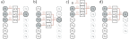

`图 10.2 一维卷积，核大小为三。每个输出值 zi 是其最近三个输入值 xi-1、xi 和 xi+1 的加权和，权重为 ω = [ω1, ω2, ω3]。a) 输出 z2 的计算公式为 z2 = ω1x1 + ω2x2 + ω3x3。b) 输出 z3 的计算公式为 z3 = ω1x2 + ω2x3 + ω3x4。c) 在 z1 位置，卷积核超出了第一个输入 x1，可以通过零填充解决，即假定输入之外的值为零。最终输出也采用相同处理。d) 另一种方法是仅在卷积核完全位于输入范围内时计算输出（称为“有效”卷积），此时输出大小将小于输入。`

>严格而言，这其实是一种互相关操作而非真正的卷积，因为在真正的卷积中，权重相对于输入会进行翻转（即 $x_{i-1}$ 与 $x_{i+1}$ 的位置会互换）。尽管如此，这种（技术上不正确的）定义已成为机器学习领域的常规约定。
### 10.2.2 填充
方程 10.3 说明，通过对输入的前、当前和后位置进行加权求和，可以计算出每个输出。这引发了一个问题：对于序列的第一个和最后一个输出（分别缺少前一个和后一个输入）该如何处理？

解决此问题有两种典型方法。第一种是在输入序列的两端添加新值，之后按常规操作进行。零填充是指在输入的有效范围外假定其值为零（见图 10.2c）。其他方法包括视输入为周期性的或在边缘处进行反射处理。第二种方法是舍弃在输入范围之外的核覆盖区域的输出，这种方法的优点是不会在输入的边缘引入额外信息，但缺点是输出的尺寸会有所减小。

### 10.2.3 步长、核大小与扩张
在前面的示例中，每个输出是由最近的三个输入加权求和得到的。但实际上，这只是卷积操作大家族中的一种，通过步长、核大小和扩张率的不同进行区分。当我们在每个位置都计算输出时，这称为步长为一。但是，我们也可以将核按大于一的步长进行移动。例如，步长为二时，输出的数量大约减半（见图 10.3a–b）。

可以通过增加核大小来覆盖更大的区域（见图 10.3c）。但核大小通常保持为奇数，以便可以围绕当前位置居中。核大小的增加意味着需要更多的权重，这就引入了扩张或空洞卷积的概念，在这种卷积中，核的值之间插入了零。例如，我们可以将一个五元素的核通过将第二和第四个元素设为零，转换成三元素的扩张核。这样，我们仍然能够覆盖更大的输入区域，但仅需三个权重（见图 10.3d）。我们在权重之间插入的零的数量决定了扩张率。

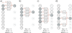

`图 10.3 步长、核大小和扩张。a) 当步长为二时，我们每隔一个位置对卷积核进行评估，因此第一个输出 z1 是基于以 x1 为中心的加权和计算得出的，b) 第二个输出 z2 则是基于以 x3 为中心的加权和得出的，依此类推。c) 可以改变卷积核的大小。使用五的核大小时，我们会计算最近五个输入的加权和。d) 在扩张（或“带孔”）卷积中，我们在权重向量中间隔插入零，这样可以使用较少的权重覆盖更大的区域。`

### 10.2.4 卷积层
卷积层计算输出的过程涉及将输入与卷积核进行卷积，加入偏置项 $\beta$，然后将每个结果通过激活函数 $a[•]$。在核大小、步长和扩张率均为一的条件下，第 $i$ 个隐藏单元 $h_i$ 的计算公式为：

$$
\begin{align}
h_i &= a \left[ \beta + \omega_1 x_{i-1} + \omega_2 x_i + \omega_3 x_{i+1} \right] \\
&= a \left[ \beta + \sum_{j=1}^{3} \omega_j x_{i+j-2} \right],
\end{align} \tag{10.4}
$$
这里，偏置 $\beta$ 与核权重 $\omega_1, \omega_2, \omega_3$ 均为可训练参数。通过零填充，我们对于超出有效范围的输入 $x$ 视作零处理。这实际上是全连接层的一种特例，全连接层对第 $i$ 个隐藏单元的计算方式为：

$$
h_i = a \left[ \beta_i + \sum_{j=1}^{D} \omega_{ij} x_j \right]. \tag{10.5}
$$

对于 $D$ 个输入 $x$ 和 $D$ 个隐藏单元 $h$，全连接层将需要 $D^2$ 个权重 $\omega_{\cdot \cdot}$ 和 $D$ 个偏置 $\beta_{\cdot}$。相比之下，卷积层仅需三个权重和一个偏置。通过将大多数权重设置为零并约束其他权重保持一致，全连接层也能够实现与卷积层相同的计算效果（参见图 10.4）。

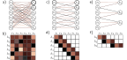

`图 10.4 全连接层与卷积层的对比。a) 全连接层为每个输入 x 到每个隐藏单元 h 设置了一个权重（彩色箭头表示）和每个隐藏单元的偏置（未显示）。b) 因此，相应的权重矩阵 Ω 包含了将六个输入与六个隐藏单元联系起来的 36 个权重。c) 三核大小的卷积层通过相同的加权和（加上偏置，未显示）来计算每个隐藏单元，加权和基于三个邻近的输入值（箭头表示）。d) 权重矩阵是全连接矩阵的一个特例，许多权重为零，其他的则重复（相同颜色表示相同的值，白色表示零权重）。e) 一个核大小为三且步长为二的卷积层在每隔一个位置计算一个加权和。f) 这也是一个全连接网络的特殊情况，但具有不同的稀疏权重结构。`

### 10.2.5 Channels
单个卷积操作虽然可以提取信息，但同时也会导致信息的部分丢失，因为它通过对相邻输入的平均以及 ReLU 激活函数的非负限制进行处理。为了弥补这一缺陷，常常并行计算多个卷积，每个卷积生成一组新的隐藏变量，形成一个独特的特征图或通道。

如图 10.5a-b 所示，使用两个核大小为三，并采用零填充的卷积核进行说明。第一个卷积核通过计算最近三个像素点的加权和，并加上一个偏置后，通过激活函数生成了 $h_1$ 至 $h_6$ 的隐藏单元，形成了第一个特征通道。第二个卷积核则计算一组不同的加权和，并通过另一个偏置和激活函数，生成了 $h_7$ 至 $h_{12}$ 的隐藏单元，这形成了第二个特征通道。

通常，输入层和隐藏层都包含多个通道，如图 10.5c 所展示。如果输入层具有 $C_i$ 个通道，并且采用了大小为 $K$ 的卷积核，那么每个输出通道的隐藏单元就是通过对所有 $C_i$ 个通道及 $K$ 个核位置进行加权求和计算的，这一过程使用了权重矩阵 $\Omega \in \mathbb{R}^{C_i \times K}$ 和一个偏置完成。因此，如果下一层包含 $C_o$ 个通道，那么我们需要 $\Omega \in \mathbb{R}^{C_i \times C_o \times K}$ 的权重和 $\beta \in \mathbb{R}^{C_o}$ 的偏置。

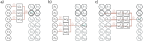

`图 10.5 通道。通常，对输入 x 应用多个卷积操作，并将结果存储在不同的通道中。a) 通过卷积操作生成的隐藏单元 h1 到 h6 构成了第一个通道。b) 应用第二次卷积操作生成的隐藏单元 h7 到 h12 构成了第二个通道。这些通道被存储在一个二维数组 H1 中，该数组包含第一隐藏层中的所有隐藏单元。c) 如果我们增加另一个卷积层，那么现在每个输入位置都有两个通道。此时，一维卷积通过在三个最近的位置上对两个输入通道进行加权和计算，以生成每个新的输出通道。`

### 10.2.6 卷积网络与感受野
如第 4 章所述，深度网络包括多个全连接层的序列。与此相似，卷积网络则是由多个卷积层序列构成的。在这种网络中，每个隐藏单元的接受字段指的是对应该单元有贡献的原始输入区域。在每个卷积层核大小为三的卷积网络中，第一层的隐藏单元通过对三个最接近的输入进行加权求和来计算，因此它们的接受字段大小为三。而第二层的单元则对第一层中最接近的三个位置进行加权求和，而这些位置本身又是基于三个输入的加权求和。因此，第二层的隐藏单元的接受字段大小扩展到了五。这样，随着层次的增加，每个单元的接受字段也相应扩大，使得整个输入范围内的信息得以逐步整合（见图 10.6）。

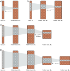

`图 10.6 使用三宽核的网络感受野。a) 一个维度为十一的输入进入一个有三个通道且卷积核大小为三的隐藏层。在第一隐藏层 H1 中，三个特定隐藏单元的预激活分别是其最近三个输入的不同加权和，因此 H1 的感受野大小为三。b) 在 H2 层，四个特定隐藏单元的预激活各取自 H1 层的三个通道，在三个最近位置的加权和。H1 层的每个隐藏单元都是基于最近三个输入位置的加权。因此，H2 层的隐藏单元具有五的感受野大小。c) 第三层的隐藏单元（核大小为三，步长为二）把感受野大小增加到七。d) 加入第四层后，第三位置的隐藏单元的感受野能覆盖全部输入。`
### 10.2.7 示例：MNIST-1D
我们现在对 MNIST-1D 数据应用了一个卷积网络（参见图 8.1）。输入 x 为一个 40 维向量，而输出 f 是一个 10 维向量，经 softmax 层转换为类概率。我们采用了一个包含三个隐藏层的网络（参见图 10.7）。第一隐藏层 H1 的十五个通道采用核大小为 3、步长为 2 和“valid”填充计算得到，产生了十九个空间位置。第二和第三隐藏层 H2 和 H3 的计算方式相同。此时，网络的表示具有四个空间位置和十五个通道。这些值被重塑为一个 60 维向量，通过一个全连接层映射到十个输出激活上。

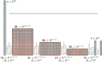

`图 10.7 用于分类 MNIST-1D 数据的卷积网络（参见图 8.1）。MNIST-1D 输入的维度为 Di = 40。第一卷积层包含十五个通道，核大小为三，步长为二，仅保留“有效”位置，形成了一个具有十九个位置和十五个通道的表示。随后的两个卷积层配置相同，逐步缩小表示的尺寸。最终，全连接层接收第三隐藏层的全部六十个隐藏单元，输出十个激活值，这些激活值通过 softmax 层转化为十个类别的概率。`

该网络在一个含 4,000 个样本的数据集上，采用无动量的 SGD、0.01 的学习率和 100 的批量大小，训练了 100,000 步。我们将其与一个具有相同层数和隐藏单元数（即三个隐藏层，分别具有 285、135 和 60 个隐藏单元）的全连接网络进行了比较。卷积网络有 2,050 个参数，全连接网络有 59,065 个参数。根据图 10.4 的逻辑，卷积网络是全连接网络的一个特殊情况。后者具有足够的灵活性以精确复制前者。图 10.8 显示，两种模型都完美地适配了训练数据。然而，卷积网络的测试误差远低于全连接网络。

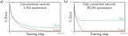

`图 10.8 MNIST-1D 结果。a) 图 10.7 的卷积网络最终完美拟合训练数据，测试误差约为 17%。b) 一个具有相同隐藏层数量和每层隐藏单元数量的全连接网络虽然学习速度更快，但泛化性较差，测试误差约为 40%。后者模型理论上可以复现卷积模型的性能，但实际未能达到。卷积结构通过限制映射方式，使其能够类似地处理每个位置，从而提高了性能。`

这种差异可能不仅仅是参数数量的问题；我们知道，过参数化通常有助于提升性能（参见第 8.4.1 节）。卷积架构之所以表现更好，很可能是因为其具有更优的归纳偏差（即，更好地在训练数据间进行插值），这是因为我们在架构中加入了一些先验知识；我们让网络以统一的方式处理输入中的每个位置。考虑到数据是通过对模板进行随机位移（包括其他操作）生成的，这种处理方式十分合理。

与全连接网络必须学习每个数字模板在每个位置的外观不同，卷积网络通过位置间的信息共享，从而更精确地识别各个类别。也可以这样理解，训练卷积网络时，我们在探索一个较小的、所有可能合理的输入/输出映射家族。另一方面，卷积结构相当于一个正则化器，它对全连接网络可能描述的大多数解决方案施加了无限大的惩罚。
## 10.3 适用于二维输入的卷积网络
前文讨论了针对一维数据的卷积网络应用，这类网络适用于金融时间序列、音频和文本处理。然而，卷积网络更常见的应用是在二维图像数据上。此时，卷积核变为二维结构。一个 3x3 的卷积核 $\Omega \in \mathbb{R}^{3x3}$ 对二维输入中的元素 $x_{ij}$ 进行计算，生成一个隐藏单元层 $h_{ij}$：

$$
h_{ij} = a \left[ \beta + \sum_{m=1}^{3} \sum_{n=1}^{3} \omega_{mn} x_{i+m-2,j+n-2} \right], \tag{10.6}
$$

这里 $\omega_{mn}$ 代表卷积核的各个元素，实质上是对一个 3x3 区域的输入进行加权求和。卷积核在二维输入上进行横向和纵向的平移操作（参见图 10.9），以在每个位置产生输出。

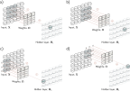

`图 10.9 二维卷积层。每个输出 hij 是 3×3 最近输入的加权和，再加上偏置，并通过激活函数处理。a) 这里，输出 h23（突出显示的输出）是从 x12 到 x34（突出显示的输入）九个位置的加权和。b) 不同的输出通过在图像网格的两个维度上平移核来计算。c-d) 使用零填充时，图像边缘以外的位置被视为零。`

通常情况下，输入为 RGB 图像，该图像被处理为一个带有三个通道的二维信号（参见图 10.10）。此时，一个 3x3 的卷积核拥有 3x3x3 权重，分别应用于每个 3x3 位置上的三个输入通道，生成一个高度和宽度与输入图像相同的二维输出（假设使用零填充）。为了产生多个输出通道，我们通过采用不同的卷积核权重重复此过程，并将结果合并成一个三维张量。若卷积核尺寸为 $K \times K$，且输入通道数为 $C_i$，则每个输出通道是 $C_i \times K \times K$ 个量的加权和加一个偏置。因此，计算 $C_o$ 个输出通道需要 $C_i \times C_o \times K \times K$ 个权重和 $C_o$ 个偏置。

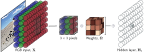

`图 10.10 对图像应用的二维卷积。图像被处理为一个具有红色、绿色和蓝色三个通道的二维输入。使用 3×3 核时，第一隐藏层的每个预激活是通过点对点乘以 3×3×3 核权重与同一位置的 3×3 RGB 图像块，然后求和并加上偏置来计算的。为了计算隐藏层的所有预激活，我们在图像的水平和垂直方向上滑动核。输出是一层二维的隐藏单元。为了创建多个输出通道，我们将使用多个核重复此过程，生成第一隐藏层 H1 的三维张量隐藏单元。`

## 10.4 下采样与上采样

图 10.7 中的网络通过采用步长为 2 的卷积操作在每层缩减表示尺寸，以此增大感受野。现在我们来探讨用于减小二维输入尺寸的下采样方法，以及用于尺寸放大的上采样技术，后者在输出为图像时尤其有用。此外，我们还将讨论如何在网络层间改变通道数，这在网络的两个分支合并时特别重要（详见第 11 章）。
### 10.4.1 下采样
缩减二维数据的表示有三种主流方法，常见的情况是同时将两个维度都缩小一半。首先，我们可以选择每隔一个位置进行采样。当步长设置为 2 时，此方法会与卷积操作同时生效（参见图 10.11a）。

第二种方法，最大池化选取 2×2 区域内的最大值（参见图 10.11b），这样可以某种程度上对平移变化保持不变；即使输入图像移动了一个像素，许多最大值仍然保持不变。最后一种，平均池化则是取区域内值的平均。这些方法都是独立对每个通道进行下采样的，因此输出的宽度和高度减半，但通道数不变。

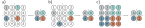

`图 10.11 缩减表示尺寸的方法（下采样）。a) 子采样。原来的 4×4 表示（左侧）通过保留每隔一个输入缩减到 2×2 尺寸（右侧）。左侧的颜色标示了对右侧输出有贡献的输入。这实际上与步长为二的核操作相同，只不过中间过程的值没有被计算出来。b) 最大池化。每个输出由对应 2×2 区块中的最大值组成。c) 平均池化。每个输出是 2×2 区块内值的平均值。`

### 10.4.2 上采样
提升网络层分辨率最简单的方法是将每个空间位置的所有通道内容复制四次（参见图 10.12a）。第二种方法是最大反池化，适用于之前通过最大池化进行下采样的场景，我们将值还原到其原始位置（参见图 10.12b）。第三种方法通过双线性插值在已有样本点之间插值填充缺失值（参见图 10.12c）。

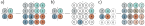

`图 10.12 增大表示尺寸的方法（上采样）。a) 扩大 2D 层尺寸最简单的方式是将每个输入复制四次。b) 在我们先前使用过最大池化操作的网络（参考图 10.11b）中，我们可以将值重新分配回它们原本的位置（即最大值所在的位置），这称为最大反池化。c) 另一个选项是输入值之间的双线性插值。`

第四种方法可视为步长为 2 的下采样的逆过程。在该方法中，输出是输入的一半，并且对于 3x3 的核，每个输出是三个最近输入的加权和（参见图 10.13a）。而在转置卷积中，这一过程被反转（参见图 10.13c），输出数量是输入的两倍，且每个输入对三个输出有贡献。观察这种上采样机制相关的权重矩阵（参见图 10.13d），我们发现它实际上是下采样机制权重矩阵的转置（参见图 10.13b）。

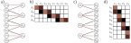

`图 10.13 一维转置卷积。a) 采用三的核大小、两的步长和零填充进行下采样。每个输出是三个输入的加权和（箭头标示权重）。b) 这可以通过一个权重矩阵表示（相同颜色表示共享的权重）。c) 在转置卷积中，每个输入对输出层贡献三个值，输出层的输出是输入的两倍。d) 相关的权重矩阵是面板（b）中那个的转置。`

### 10.4.3 改变通道数
有时候，我们需要在两个隐藏层之间改变通道数，而不进一步进行空间池化。这通常是为了能够将该层的数据与另一并行处理的数据结合起来（详见第 11 章）。为此，我们采用核尺寸为 1 的卷积操作。输出层的每个元素通过对同一位置的所有通道进行加权求和来计算（参见图 10.14）。通过不同的权重重复此过程，我们可以生成所需数量的输出通道。相关的卷积权重尺寸为 $1 \times 1 \times C_i \times C_o$，因此称为 $1 \times 1$ 卷积。结合偏置和激活函数后，这等同于在每个位置的通道上执行全连接网络。

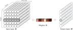

`图 10.14 1×1 卷积。为了改变通道数而不进行空间池化，我们使用 1×1 的核。每个输出通道通过在相同位置对所有通道进行加权求和、加偏置并通过激活函数来计算。通过不同的权重和偏置重复此操作以创建多个输出通道。`
## 10.5 应用
本章的结尾介绍了三个计算机视觉应用。首先是图像分类的卷积网络，目标是将图像分类到预定的一组类别中。接着是物体检测，旨在识别图像中的多个物体并为每个物体绘制边界框。最后，我们探讨了一个早期的语义分割系统，其目标是根据物体的存在为每个像素分配标签。

### 10.5.1 图像分类
深度学习在计算机视觉领域的开创性工作大多专注于使用 ImageNet 数据集的图像分类（参见图 10.15）。该数据集含有 128万余张训练图像，5万张验证图像以及10万张测试图像，每张图像均被标记为1000个可能类别中的一个。

`图 10.15 ImageNet 分类示例图像。模型的目标是将输入图像分配到 1000 个类别之一。这一任务因图像在不同属性（列）上的广泛变化而具有挑战性。这包括刚性（猴子 < 独木舟）、图像中的实例数量（蜥蜴 < 草莓）、杂乱度（指南针 < 钢鼓）、大小（蜡烛 < 蜘蛛网）、纹理（螺丝刀 < 豹）、颜色的独特性（马克杯 < 红酒）以及形状的独特性（海岬 < 钟）。改编自 Russakovsky 等人 (2015)。`

大多数方法需要将输入图像调整到统一尺寸；通常，网络的输入是一个 224×224 的 RGB 图像，输出则是1000个类别的概率分布。这项任务颇具挑战，类别繁多且变化巨大（参见图 10.15）。2011年，深度网络应用之前，最先进的方法在将正确类别排在前五位的测试图像分类中的错误率约为 25%。五年后，最佳深度学习模型的表现已超越人类。

2012年，AlexNet 成为第一个在此任务上表现出色的卷积网络。它由八个隐藏层组成，使用了 ReLU 激活函数，其中前五层为卷积层，其余为全连接层（参见图 10.16）。网络首先使用 11×11 的核和四步的步长对输入进行下采样，形成 96 个通道。接着通过最大池化层进一步下采样，并应用 5×5 的核形成 256 个通道。再经过三层 3×3 核大小的卷积层，最终形成一个含 256 个通道的 13×13 表示。一个最终的最大池化层得到一个含 256 个通道的 6×6 表示，该表示被调整为 9216 长度的向量，并通过包含 4096、4096 和 1000 个隐藏单元的三个全连接层。最后一层通过 softmax 函数输出1000个类别的概率分布。整个网络包含约 6000 万个参数，大部分位于全连接层。

`图 10.16 AlexNet（Krizhevsky 等人，2012）。该网络把一张 224×224 的彩色图像转换为代表类别概率的 1000 维向量。网络首先通过 11×11 的卷积核和 4 步长进行卷积，产生 96 个通道。接着使用最大池化操作降低分辨率，并应用一个 5×5 的卷积层。之后是另一个最大池化层，随后应用了三个 3×3 的卷积层。最后一个最大池化操作之后，结果被向量化，并通过三层全连接（FC）层，最终通过 softmax 层。`

通过空间变换和输入强度的调整，数据集的大小被扩增了 2048 倍。测试时，图像的五个不同裁剪和镜像版本被输入网络，其预测结果被平均处理。该系统通过 SGD 学习，动量系数为 0.9，批大小为 128。在全连接层使用了 Dropout，并采用了 L2 正则化（权重衰减）。该系统达到了 16.4% 的前五名错误率和 38.1% 的最佳选择错误率。当时，这在被认为远超当代方法能力的任务上实现了巨大的性能飞跃，揭示了深度学习的巨大潜力，开启了现代 AI 研究的新纪元。

针对 ImageNet 任务的分类，VGG 网络实现了更佳的性能，前五名错误率为 6.8%，最佳选择错误率为 23.7%。这个网络由交替的卷积层和最大池化层组成，表示的空间尺寸逐渐减小，而通道数增加，之后连接三个全连接层（参见图 10.17）。VGG 网络的训练同样采用了数据增强、权重衰减和 Dropout。

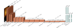

`图 10.17 VGG 网络（Simonyan & Zisserman，2014），与 AlexNet（参见图 10.16）按相同比例展示。这个网络由一系列卷积层和最大池化操作组成，表示的空间尺度逐渐减小，而通道数逐渐增加。最后一次卷积操作之后的隐藏层被调整为一维向量，然后是三个全连接层。网络输出 1000 个激活值，对应于类别标签，经 softmax 函数处理生成类别概率。`

尽管训练策略有一些微小的差异，但 AlexNet 和 VGG 之间最重要的变化是网络的深度。后者使用了 19 个隐藏层和 1.44 亿个参数。图 10.16 和 10.17 中的网络以相同的比例展示以便于比较。几年来，随着网络深度的增加，这项任务上的性能持续改进，这证明了深度在神经网络中的重要性。

### 10.5.2 对象检测
对象检测的目标是识别并定位图像内多个物体。早期基于卷积网络的方法之一是“一次性看全”（YOLO）。YOLO 网络输入一张 448×448 的 RGB 图像，经过 24 层卷积处理，通过最大池化减小尺寸、增加通道数，类似 VGG 网络的做法。最终卷积层尺寸为 7×7，含 1024 通道，后被转换为向量，通过全连接层映射为 4096 个值。再有一个全连接层将表示映射到输出。

输出值在一个 7×7 网格的每个位置编码了存在的类别（图 10.18a–b）。每个位置的输出还确定了一定数量的边界框。每个框由五个参数定义：中心的 x 和 y 坐标、框的高度和宽度，以及预测的置信度（图 10.18c）。置信度评估了预测与实际边界框的重叠程度。系统通过动量、权重衰减、dropout 和数据增强等方法训练，并采用迁移学习策略：先在 ImageNet 分类任务上训练网络，再针对物体检测进行微调。

网络操作后，利用启发式过程去除低置信度的矩形，并抑制重复的预测边界框，只保留最可信的一个。

`图 10.18 YOLO 对象检测。a) 输入图像调整为 448×448 大小，并划分为 7×7 的规则网格。b) 系统预测每个网格单元最可能的类别。c) 同时预测每个单元两个边界框及其置信度（线的粗细代表置信度）。d) 在推理时，保留最可能的边界框，同一对象的低置信度框被抑制。改编自 Redmon 等人（2016）。`

### 10.5.3 语义分割
语义分割旨在为每个像素分配标签，标签根据像素所属的对象决定，如果像素在训练数据库中无对应对象，则不分配标签。一个早期的语义分割网络如图 10.19 所示。输入为 224×224 RGB 图像，输出为 224×224×21 的数组，每个位置包含 21 个可能类别的概率。

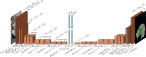
`图 10.19 Noh 等人（2015）的语义分割网络。输入是一张 224×224 的图像，通过 VGG 网络的一个版本处理，并最终通过一个全连接层转换为 4096 大小的表示，包含整个图像的信息。然后，这个表示通过另一个全连接层转换为 7×7 大小，并通过上采样和反卷积（不含上采样的转置卷积）在 VGG 网络的镜像结构中处理。输出是一个 224×224×21 的表示，为每个位置的 21 个类别提供输出概率。`

网络的前部是 VGG 的简化版（图 10.17），有 13 而非 16 层卷积层，表示尺寸缩小至 14×14。此后是一次最大池化，再通过两个全连接层映射为两个 4096 大小的 1D 表示，这些层汇总了整个图像的信息。

此时，架构与 VGG 不同。另一个全连接层将表示恢复为 7×7 空间位置和 512 通道。接着是一系列最大反池化层和反卷积层，执行 2D 转置卷积但不进行上采样。最终，通过 1×1 卷积产生 21 个代表可能类别的通道，并在每个空间位置执行 softmax 操作，将激活映射为类概率。网络的下采样部分称为编码器，上采样部分称为解码器，因此此类网络有时被称为编解码网络或沙漏网络，因其形状而得名。

最终分割通过一种启发式方法生成，该方法贪婪搜索最具代表性的类别并推断其区域，既考虑概率也促进连通性。接着，将下一个最具代表性的类别添加至剩余未标记像素中。此过程持续，直至无更多明确证据（图 10.20）。

`图 10.20 语义分割结果。最终结果通过从 21 个概率图中贪婪选择最佳类别，并使用启发式方法基于概率及其空间邻近性创建一个合理的二值图来生成。如果有充分证据，会添加随后的类别，并组合它们的分割图。改编自 Noh 等人（2015）。`
## 10.6 总结
在卷积层，每个隐藏单元的计算基于对邻近输入的加权求和、加偏置以及应用激活函数。由于每个空间位置的权重和偏置保持不变，因此相比全连接网络，卷积网络的参数量大大减少，且不随输入图像的大小而增加。为保证信息完整，采用不同的权重和偏置重复此操作，在每个空间位置生成多通道。

典型卷积网络结构包括卷积层与二倍因子降采样层的交替，随网络深入，空间维度通常以二的倍数减小，通道数以二的倍数增加。网络末端通常包含一个或多个全连接层，整合整个输入的信息以产出期望输出。若输出为图像，一个对称的“解码器”则将其上采样至原始尺寸。

卷积层的平移等变性引入了有效的归纳偏好，这在图像相关任务中相对全连接网络能够提升性能。我们探讨了图像分类、物体检测和语义分割网络，发现随着网络加深，图像分类性能提升。然而，后续实验表明，无限加深网络深度并不总是有益的；超过某个深度后，网络训练变得困难。这促成了残差连接的提出，将在下一章详细讨论。
## Notes
Dumoulin 和 Visin (2016) 展开了对卷积数学的全面概述，对本章的简要介绍进行了扩充。

卷积网络的早期发展由 Fukushima 和 Miyake (1982)、LeCun 等 (1989a) 以及 LeCun 等 (1989b) 推动。其初步应用领域包括手写识别（LeCun 等，1989a；Martin，1993）、面部识别（Lawrence 等，1997）、音素识别（Waibel 等，1989）、口语词识别（Bottou 等，1990）和签名验证（Bromley 等，1993）。然而，LeCun 等 (1998) 通过构建用于分类 28×28 灰度手写数字图像的 LeNet 系统，使卷积网络广为人知。LeNet 可视为现代网络的雏形，采用了多个卷积层后接全连接层，使用 sigmoid 激活函数而非 ReLU，并采用平均池化而不是最大池化。AlexNet（Krizhevsky 等，2012）通常被视为现代深度卷积网络的起点。

ImageNet 挑战赛：Deng 等 (2009) 编制的 ImageNet 数据库及其关联的分类挑战赛，在 AlexNet 之后的几年里推动了深度学习的发展。此挑战赛的显著获胜者包括网络中网络架构（Lin 等，2014），它在每个位置的所有通道上交替使用卷积和全连接层（即 1×1 卷积）。Zeiler & Fergus (2014) 和 Simonyan & Zisserman (2014) 训练了与 AlexNet 基本相似的更大更深的架构。Szegedy 等 (2017) 开发的 GoogLeNet 引入了 inception 块，通过并行使用不同尺寸的滤波器并重新组合，有效地让系统自主学习滤波器尺寸。

随着网络深度的增加，性能持续提升。但训练更深网络的难度也随之增大，除非引入新的修改措施，如残差连接和归一化层，后者将在下章详细介绍。ImageNet 挑战赛的进展在 Russakovsky 等 (2015) 中进行了总结。Rawat 和 Wang (2017) 对使用卷积网络进行图像分类进行了更广泛的调研。图像分类网络随时间进步的情况在图 10.21 中进行了可视化展示。

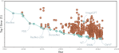
`图 10.21 ImageNet 性能。每个圆圈代表一个不同的已发布模型。蓝色圆圈代表当时的最先进模型。本书讨论的模型也被突出显示。AlexNet 和 VGG 网络在其时代是杰出的，但现在已不是最先进的。ResNet-200 和 DenseNet 将在第 11 章讨论。ImageGPT、ViT、SWIN 和 DaViT 将在第 12 章讨论。改编自 https://paperswithcode.com/sota/image-classification-on-imagenet。`

卷积层的类型：Atrous 或扩张卷积由 Chen 等 (2018c) 和 Yu & Koltun (2015) 引入。转置卷积由 Long 等 (2015) 引入。Odena 等 (2016) 指出它们可能导致棋盘效应，应谨慎使用。Lin 等 (2014) 是早期使用 1×1 滤波器进行卷积的例子。

标准卷积层的许多变种旨在减少参数的数量。包括深度或通道分离卷积（Howard 等，2017；Tran 等，2018），在此方式中，不同的滤波器分别作用于每个通道，生成一组新通道。分组卷积（Xie 等，2017）则是每个卷积核仅作用于通道的一个子集，以减少参数。AlexNet 出于计算原因采用了分组卷积，整个网络无法在单个 GPU 上运行。分离卷积视每个核作为 1D 向量的外积，并对每个通道使用 C + K + K 参数。局部卷积（Liu 等，2018a）用于修补缺失像素，并考虑输入的部分遮挡。门控卷积（Yu 等，2019；Chang 等，2019b）从上一层学习掩码。Hu 等 (2018b) 提出的 squeeze-and-excitation 网络利用跨所有空间位置汇总的信息来调整通道权重。

下采样和上采样：平均池化至少可追溯到 LeCun 等 (1989a)，最大池化则始于 Zhou & Chellappa (1988)。Scherer 等 (2010) 比较了这些方法，认为最大池化更为优越。最大反池化技术由 Zeiler 等 (2011) 和 Zeiler & Fergus (2014) 引入。最大池化可以视为对待池化的隐藏单元应用 $L_{\infty}$ 范数。Zhang (2019) 引入的 *最大模糊池化* 在下采样前应用低通滤波，以防止混叠效应，证明了这种方法能够改善输入平移的泛化能力，同时防御对抗性攻击。（见第 20.4.6 节）。

Shi等人 (2016) 提出了*PixelShuffle*技术，该技术通过使用步长为1/s的卷积滤波器来实现1D信号的s倍放大。在这个过程中，只有那些精确对齐的权重被用来生成输出，而那些位于中间位置的权重则被舍弃。这一方法通过将内核的通道数乘以s来实施，其中第$s^{th}$个输出位置仅由第$s^{th}$个通道子集决定。这种方法也可以简易地扩展至2D卷积，此时需要$s^2$个通道。

在1D和3D数据上的卷积：虽然卷积网络主要用于图像处理，但它们也被应用于处理1D数据，涵盖了语音识别（Abdel-Hamid等人，2012）、句子分类（Zhang等人，2015；Conneau等人，2017）、心电图分类（Kiranyaz等人，2015）和轴承故障诊断（Eren等人，2019）等应用领域。Kiranyaz等人 (2021) 对1D卷积网络进行了综述。此外，卷积网络也被扩展应用于3D数据，包括视频（Ji等人，2012；Saha等人，2016；Tran等人，2015）和体积测量（Wu等人，2015b；Maturana & Scherer，2015）。

不变性与等变性：卷积层之所以受到关注，部分原因是它们对平移操作大致呈现等变性；而最大池化层引入的动机部分是为了对小范围平移具有不变性。Zhang (2019) 研究了卷积网络在这些属性上的真实表现，并提出了一种显著提升这些属性的最大模糊池化改进方法。目前，研究界对于让网络对其他类型的变换（如反射、旋转和缩放）具有等变性或不变性表现出了浓厚的兴趣。Sifre & Mallat (2013) 基于小波构建了一个系统，该系统在图像块中同时引入了平移和旋转不变性，并将其应用于纹理分类。Kanazawa等人 (2014) 开发了局部尺度不变的卷积神经网络。Cohen & Welling (2016) 利用群论构建了群卷积神经网络 (group CNNs)，这些网络对更广泛的变换族群，包括反射和旋转，呈现等变性。Esteves等人 (2018) 提出了极坐标变换网络，这些网络对平移不变，对旋转和缩放等变。Worrall等人 (2017) 开发了谐波网络，这是首个对连续旋转等变的群卷积神经网络。

初始化与正则化：卷积网络通常采用Xavier初始化（Glorot & Bengio, 2010）或He初始化（He等人，2015），如第7.5节所述。然而，ConvolutionOrthogonal初始化器（Xiao等人，2018a）专为卷积网络设计。利用这种初始化，可以训练多达10,000层的网络，而无需依赖残差连接。

Dropout技术在全连接网络中效果显著，但在卷积层中的效果较弱（Park & Kwak, 2016）。这可能是因为图像中相邻像素高度相关，导致即便某个隐藏单元被丢弃，相邻位置仍能传递相同的信息。这促成了空间dropout和cutout技术的发展。在空间dropout技术中（Tompson等人，2015），不是丢弃单个像素，而是整个特征图。这样就避免了相邻像素信息重复的问题。同样，DeVries & Taylor (2017b) 提出了cutout技术，在训练时遮盖输入图像的一块正方形区域。Wu & Gu (2015) 为dropout层的最大池化引入了一种新方法，该方法基于组成元素的概率分布进行采样，而不是总是选择最大值。

自适应内核：Inception模块（Szegedy等人，2017）并行使用不同尺寸的卷积滤波器，从而为网络提供了一种粗略机制，以学习适当的滤波器尺寸。其他研究探讨了在训练过程中学习卷积尺度（例如，Pintea等人，2021；Romero等人，2021）或下采样层步长（Riad等人，2022）。

在某些系统中，根据数据自适应改变内核尺寸。这有时发生在引导卷积的上下文中，其中一个输入用于辅助另一个输入的计算。例如，RGB图像可能用于帮助上采样低分辨率深度图。Jia等人 (2016) 直接预测了滤波器权重，利用不同的网络分支。Xiong等人 (2020b) 自适应改变内核尺寸。Su等人 (2019a) 通过从另一模态学习的函数来调节固定内核的权重。Dai等人 (2017) 学习权重偏移，以便它们可以非规则地应用。

对象检测和语义分割：对象检测方法可分为基于提案和无提案两种方案。在基于提案的方案中，处理分为两个阶段：卷积网络先处理整个图像，提出可能包含对象的区域；然后，这些提议区域被调整大小，另一个网络对其进行分析，以确定是否存在对象及其种类。这种方法的早期示例是R-CNN（Girshick等人，2014），后续通过端到端训练（Girshick, 2015）和减少区域提案成本（Ren等人，2015）进行了扩展。后续关于特征金字塔网络的研究通过结合不同尺度的特征来提高了性能和速度（Lin等人，2017b）。相反，无提案方案在单次处理中完成所有任务。YOLO（Redmon等人，2016）是无提案方案最著名的示例，编写本文时的最新版本是YOLOv7（Wang等人，2022a）。关于对象检测的最新综述可在Zou等人 (2023) 中找到。

Noh等人 (2015) 开发的语义分割网络在第10.5.3节中有描述。许多后续方法是U-Net（Ronneberger等人，2015）的变体，后者在第11.5.3节中介绍。关于语义分割的最新综述可在Minaee等人 (2021) 和Ulku & Akagündüz (2022) 中找到。

可视化卷积网络：卷积网络的巨大成功促使研究人员尝试以多种方式可视化它们从图像中提取的信息（参见Qin等人，2018的回顾）。Erhan等人 (2009) 通过从包含噪声的图像出发，优化输入以使隐藏单元最活跃，使用梯度上升法可视化激活隐藏单元的最佳刺激。Zeiler & Fergus (2014) 训练了一个网络来重构输入，然后除了他们感兴趣的那个以外，将所有隐藏单元置零；重构结果提供了有关驱动隐藏单元的信息。Mahendran & Vedaldi (2015) 可视化了网络的一个完整层。他们的网络反转技术旨在找到导致该层活动的图像，同时包含了鼓励图像与自然图像具有相似统计特性的先验知识。

最后，Bau等人 (2017) 引入了网络解剖法。在这种方法中，一系列具有已知像素标签的图像，涵盖颜色、纹理和对象类型，通过网络传递，然后测量隐藏单元与每个属性的相关性。这种方法的优点是它仅使用网络的前向传播，不需进行优化。这些方法确实提供了一些关于网络如何处理图像的初步见解。例如，Bau等人 (2017) 发现，较早的层更多地与纹理和颜色相关，而较后的层与对象类型更为相关。然而，公平地说，目前还不可能完全理解包含数百万参数的网络的处理机制。
## Problems  
问题 10.1∗ 证明公式 10.3 中的操作对平移具有等变性。

问题 10.2 公式 10.3 定义了一种核尺寸为 3、步长为 1 且膨胀系数为 1 的一维卷积。请基于图 10.3a–b，写出核尺寸为 3 但步长为 2 的一维卷积的等效公式。

问题 10.3 根据图 10.3d，写出核尺寸为 3 且膨胀系数为 2 的一维膨胀卷积的公式。

问题 10.4 写出一个核尺寸为 7、膨胀系数为 3 且步长为 3 的一维卷积公式。

问题 10.5 按照图 10.4d 的样式，为下列卷积绘制权重矩阵：(i) 图 10.3a–b 中的跨步卷积；(ii) 图 10.3c 中的核尺寸为 5 的卷积；(iii) 图 10.3d 中的膨胀卷积。

问题 10.6∗ 按照图 10.4d 的样式，绘制一个 6×12 的权重矩阵，表示输入 x1, ..., x6 与输出 h1, ..., h12 在图 10.5a–b 描述的多通道卷积之间的关系。问题 10.7∗ 按照图 10.4d 的样式，绘制一个 12×6 的权重矩阵，表示输入 h1, ..., h12 与输出 h′1,...,h′6 在图 10.5c 中的多通道卷积之间的关系。

问题 10.8 考虑一个输入有三个通道的一维卷积网络。第一隐藏层使用三个核尺寸并有四个通道。第二隐藏层使用五个核尺寸并有十个通道。询问：这两个卷积层分别需要多少偏置和权重？

问题 10.9 一个网络包含三个一维卷积层，每层使用核尺寸为 3、步长为 1 且膨胀系数为 1 的零填充卷积。第三层隐藏单元的感受野大小是多少？

问题 10.10 一个网络包含三个一维卷积层，每层使用核尺寸为 7、步长为 1 且膨胀系数为 1 的零填充卷积。第三层隐藏单元的感受野大小是多少？

问题 10.11 考虑一个一维输入 x 的卷积网络。第一隐藏层 H1 通过核尺寸为 5、步长为 2 且膨胀系数为 1 的卷积计算得到。第二隐藏层 H2 通过核尺寸为 3、步长为 1 且膨胀系数为 1 的卷积计算得到。第三隐藏层 H3 通过核尺寸为 5、步长为 1 且膨胀系数为 2 的卷积计算得到。每个隐藏层的感受野大小分别是多少？

问题 10.12 在图 10.7 描述的一维卷积网络，通过使用 0.01 的学习率和 100 的批量大小，在包含 4000 个样本的训练集上训练了 100000 步。这个网络训练了多少个周期？

问题 10.13 按照图 10.4d 的样式绘制一个权重矩阵，展示图 10.9 中的 24 个输入与 24 个输出之间的关系。

问题 10.14 考虑一个核尺寸为 5×5，接收 3 个输入通道并输出 10 个输出通道的二维卷积层。有多少卷积权重和偏置？

问题 10.15 按照图 10.4d 的样式绘制一个权重矩阵，采样一维输入中的每两个变量之一（即图 10.11a 的一维对应物）。展示核尺寸和步长均为 2 的一维卷积的权重矩阵等效于组合核尺寸为 1 的一维卷积和此采样矩阵的矩阵。

问题 10.16∗ 考虑 AlexNet 网络（图 10.16）。每个卷积层和全连接层使用了多少参数？总共使用了多少参数？

问题 10.17 在 AlexNet（图 10.16）的前三层中，每层的感受野大小是多少？

问题 10.18 在 VGG 架构（图 10.17）中，每个卷积层和全连接层分别有多少权重和偏置？

问题 10.19∗ 考虑通过一个 3×3 卷积层相连的两个隐藏层，大小分别为 224×224，通道数分别为 C1 和 C2。描述如何使用 He 初始化方法来初始化权重。