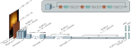

上一章节阐述了随着卷积网络从八层（AlexNet）增加到十八层（VGG）而带来的图像分类性能的显著提升。这一发现激发了对更深层网络的探索。然而，随着层数的继续增加，网络性能反而开始下降。

本章将介绍残差块的概念。在残差网络中，每一层不是直接对输入进行转换，而是计算一个加性的变更，即残差，以此修改当前的数据表示。这种设计使得我们能够训练更深的网络，但同时也会在初始化阶段造成激活值的指数级增加。为了解决这一问题，残差块采用了批量归一化技术，在每一层对激活值进行重新中心化和缩放处理。

引入批量归一化的残差块使得训练深层网络成为可能，并且这样的网络在多种任务上都实现了性能的提升。本章还将介绍如何将残差块组合应用于图像分类、医学图像分割和人体姿态估计等问题的架构设计。
## 11.1 顺序处理
到目前为止，我们接触到的所有网络都采用顺序处理数据的方式；即每一层处理完数据后，就将其结果传递给下一层（见图 11.1）。比如说，一个三层网络的定义可以是这样的：

$$
\begin{align}
h_1 = f_1[x, \phi_1] \\
h_2 = f_2[h_1, \phi_2] \\
h_3 = f_3[h_2, \phi_3] \\
y = f_4[h_3, \phi_4]
\end{align} \tag{11.1}
$$

这里的 $h_1, h_2,$ 和 $h_3$ 代表中间的隐藏层，$x$ 为网络的输入，$y$ 为输出，而函数 $f_k[\cdot, \phi_k]$ 负责执行相应的处理流程。

`图 11.1 顺序处理。标准神经网络把每一层的输出直接传递到下一层。`

在标准的神经网络中，每一层都由线性变换和随后的激活函数构成，其中参数 $\phi_k$ 包含了线性变换的权重和偏差。对于卷积网络而言，每一层则由一系列的卷积操作和激活函数构成，其参数则涵盖了卷积核和偏差。

考虑到数据处理的顺序性，我们也可以将该网络视为一系列嵌套函数的形式来理解：

$$
y = f_4 \left[ f_3 \left[ f_2 \left[ f_1[x, \phi_1], \phi_2 \right], \phi_3 \right], \phi_4 \right]. \tag{11.2}
$$
### 11.1.1 顺序处理方式的限制
理论上，我们能够向网络中添加任意数量的层。正如前一章所示，为卷积网络增添更多层确实能提升性能；例如，拥有十八层的 VGG 网络（参见图 10.17）就超过了八层的 AlexNet（参见图 10.16）的表现。然而，当继续增加层次时，图像分类的性能又一次出现下降（参见图 11.2）。这一现象颇为意外，因为一般而言，增加模型的容量会提升其性能（参见图 8.10）。更值得注意的是，这种性能下降不仅在训练集上出现，也在测试集上观察到，这表明问题在于训练更深网络的难度，而非这些深层网络的泛化能力。

`图 11.2 增加卷积层导致性能下降。a) 在 CIFAR-10 数据集(Krizhevsky & Hinton, 2009)的测试集上，一个 20 层的卷积网络在图像分类任务中胜过了一个 56 层的神经网络。b) 对于训练集同样如此，这暗示了问题主要在于训练原始网络，而非泛化到新数据上的失败。根据 He 等人 (2016a) 的研究改编。`

对于这一现象，我们还没有完全理解其原因。一种推测是，初始化时，如果我们改变早期网络层中的参数，损失梯度会发生不可预测的变化。通过适当初始化权重（参考第7.5节），这些参数相对于损失的梯度应当是合理的，避免了梯度爆炸或消失的问题。然而，导数是基于参数的无限小变化，而优化算法实际上使用有限的步长。任何合理的步长选择都可能跳到一个完全不同、与原点梯度无关的位置上；损失表面更像是布满了无数微小山峰的广阔山脉，而不是一个易于下降的光滑结构。因此，优化算法无法像在梯度变化较慢时那样取得进展。

通过观察单输入单输出网络中的梯度，可以支持这种假设。对浅层网络而言，随着输入的变化，输出相对于输入的梯度变化得很慢（参见图 11.3a）。但对于深层网络，输入的微小改变就能导致一个截然不同的梯度（参见图 11.3b）。这一现象通过梯度的自相关函数得到了展示（参见图 11.3c）。在浅层网络中，相邻的梯度是相关的，但在深层网络中，这种相关性很快降至零，这就是所谓的“碎片化梯度”现象。

`图 11.3 碎裂梯度。a) 假设一个浅层网络，有 200 个隐藏单元，采用 Glorot 初始化（去除二倍因子的 He 初始化）对权重和偏置进行初始化。随着输入 x 的变化，标量网络输出 y 对输入 x 的梯度 ∂y/∂x 变化较慢。b) 对于一个深度网络，包含 24 层和每层 200 个隐藏单元，这个梯度变化得非常快且不可预测。c) 梯度的自相关函数表明，在深层网络中，相邻的梯度变得不相关（自相关接近零）。这种碎裂梯度现象或许可以解释为什么深度网络难以训练。梯度下降算法依赖于相对平滑的损失表面，因此更新前后的梯度应当是相关的。根据 Balduzzi 等人 (2017) 的研究改编。`

碎片化梯度的出现，可能是因为随着网络加深，早期网络层的变动以越来越复杂的方式影响输出。网络的第一层 $f_1$ 对输出 $y$ 的导数如下11.1所示：

$$
\frac{\partial y}{\partial f_1} = \frac{\partial f_4}{\partial f_3} \frac{\partial f_3}{\partial f_2} \frac{\partial f_2}{\partial f_1}. \tag{11.3}
$$

当改变决定 $f_1$ 的参数时，这一系列的导数都可能发生变化，因为 $f_2, f_3,$ 和 $f_4$ 层是基于 $f_1$ 计算的。因此，每个训练样例更新的梯度可能完全不同，导致损失函数的行为变得异常。（在公式 11.3 和 11.6 中，我们用符号 f_k 来指代函数 f_k[•] 的输出。）
## 11.2 残差连接与残差块
残差连接或跳过连接是一种特殊的网络架构，它允许每一层的输入直接加到其输出上（见图 11.4a）。按照前文提到的原理，残差网络的结构可以定义如下：

$$
\begin{align}
h_1 = x + f_1[x, \phi_1] \\
h_2 = h_1 + f_2[h_1, \phi_2] \\
h_3 = h_2 + f_3[h_2, \phi_3] \\
y = h_3 + f_4[h_3, \phi_4],
\end{align} \tag{11.4}
$$

这里，每一行的右侧第一项即代表了残差连接。每个函数 $f_k$ 负责学习到当前数据表示的加性修改。因此，这些函数的输出尺寸必须与其输入一致。这种输入与经过处理的输出的加和被称作一个残差块或残差层。

`图 11.4 残差连接。a) 对于每个函数 fk[x, φk]，其输出与输入相加，通过一个称为残差或跳跃连接的并行计算路径传递。因此，该函数计算的是对表示的加性变化。b) 当我们展开网络方程时，发现输出实际上是输入加上四个小型网络（分别用白色、橙色、灰色和青色表示，对应于方程 11.5 中的项）的总和；这可以被视为是一个网络集群。此外，青色网络的输出本身是另一集群中变换 f4[•,φ4] 的结果，依此类推。我们还可以把这个网络看作是通过计算图的 16 条不同路径的组合。一个典型的例子是，无论是在面板 (a) 还是 (b)，从输入 x 到输出 y 的虚线路径都是相同的。`

通过替换中间变量 $h_k$ 的表达式，我们可以将整个过程表述为一个单一的函数：

$$
y = x + f_1[x] + f_2[x + f_1[x]] + f_3[x + f_1[x] + f_2[x + f_1[x]]] + f_4[x + f_1[x] + f_2[x + f_1[x]] + f_3[x + f_1[x] + f_2[x + f_1[x]]]], \tag{11.5}
$$

这里我们为了表述的清晰，省略了参数 $\phi$。可以把这个方程看作是对网络的“展开”（见图 11.4b）。可以发现，最终的网络输出实际上是输入加上四个小型网络的和，这些小型网络对应于方程的每一行；换句话说，残差连接将原网络转化成了这些小网络的集合，它们的输出相加得到最终结果。

另一种理解残差网络的方式是，它创造了从输入到输出的十六条不同长度的路径。例如，第一个函数 $f_1[x]$ 出现在这十六条路径中的八条路径上，包括作为直接的加性项（即，路径长度为一）。相似地，对于公式 11.3 的导数是：

$$
\frac{\partial y}{\partial f_1} = 1 + \frac{\partial f_2}{\partial f_1} + \left( \frac{\partial f_3}{\partial f_1} \frac{\partial f_2}{\partial f_1} \right) + \left( \frac{\partial f_4}{\partial f_1} \frac{\partial f_2}{\partial f_1} \frac{\partial f_3}{\partial f_1} \frac{\partial f_2}{\partial f_1} \right), \tag{11.6}
$$

其中每条路径都对应一个项。右手边的恒等项说明了第一层 $f_1[x, \phi_1]$ 中参数 $\phi_1$ 的改变如何直接影响到网络输出 $y$ 的变化。它们也通过不同长度的其他导数链间接影响输出。通常，通过较短路径的梯度会更为稳定。因为恒等项和各种短链导数都会对每层的导数贡献，含有残差连接的网络在面对碎片化梯度时表现得更好。

### 11.2.1 残差块中的操作顺序
到目前为止，我们提到加性函数 f[x] 可以是任何类型的网络层，比如全连接层或卷积层。这种说法技术上没有问题，但需要注意的是，这些函数中的操作顺序至关重要。它们必须嵌入一个如 ReLU 这样的非线性激活函数，否则整个网络就会退化成一个线性模型。但在典型的网络层中（如图 11.5a 所示），ReLU 函数通常位于最末端，因此输出会被限制为非负值。如果遵循这种设计，那么每个残差块只能使输入值增大。

因此，常见的做法是调整操作的顺序，先进行激活函数操作，再进行线性变换（如图 11.5b 所示）。有时候，在一个残差块内部可能包含多个处理层（如图 11.5c 所示），但这些通常以一个线性变换结束。值得一提的是，如果以 ReLU 操作开始这些块，而初始网络输入为负值，那么这些块将不执行任何操作，因为 ReLU 会将所有信号截断为零。因此，通常网络会以一个线性变换开始，而不是一个残差块，正如图 11.5b 中所示。

`图 11.5 残差块的运算顺序。a) 通常线性变换或卷积之后接 ReLU 非线性运算，这样的顺序使得每个残差块只能增加非负数值。b) 若采用反向顺序，则可以增加正数或负数。但如果初始输入全为负值，那么在网络开始时就必须加入一个线性变换。c) 实际应用中，一个残差块包含多个网络层是很普遍的情况。`

### 11.2.2 采用残差连接的更深网络
引入残差连接可以大致加倍实际能够训练的网络深度，直到出现性能下降。然而，我们希望能进一步加深网络层次。要理解为什么残差连接不能让我们随意增加网络深度，我们需要考虑到在前向传播过程中激活值的方差如何变化，以及在反向传播过程中梯度大小如何变化。

## 11.3 残差网络的梯度爆炸问题
在之前7.5的讨论中，我们了解到正确初始化网络参数至关重要。如果初始化不当，那么在反向传播过程的前向传播阶段，网络内部值的幅度可能会指数级地增加或减少。同理，在网络的反向传播过程中，梯度也可能随着网络层的增加而爆炸或消失。

因此，我们通过初始化网络参数来确保各层间激活值的预期方差（在前向传播中）和梯度的预期方差（在反向传播中）保持不变。通过使用 He 初始化（参见第 7.5 节），我们可以实现这一目标，对于 ReLU 激活函数，He 初始化方法是将偏置 $\beta$ 设置为零，并选择均值为零且方差为 $2/D_h$ 的正态分布权重 $\Omega$，其中 $D_h$ 代表前一层的隐藏单元数目。

但当我们考虑残差网络时，由于存在直接贡献到网络输出的路径（参见方程 11.5 和图 11.4b），我们不必担心网络深度导致的中间值或梯度消失问题。然而，即使在残差块内部使用了 He 初始化，随着网络层次的加深，在前向传播过程中的值依然会指数级增加。

这是因为我们将残差块的处理结果加回到输入上。每个分支都带有一定的（不相关的）变异性。因此，当我们将它们重新结合时，总体方差就会增加。尽管使用 ReLU 激活和 He 初始化时，每个块的处理不会改变预期的方差，但与输入结合时方差会翻倍（如图 11.6a 所示），并且随着残差块的增加而指数级增长。这限制了网络能增加的深度，以防在前向传播中超出浮点数的精度范围。反向传播过程中梯度的论证也是相似的。

因此，即便采用了 He 初始化，残差网络仍面临前向传播不稳定和梯度爆炸的问题。一个可能的解决方案是使用 He 初始化，然后通过将每个残差块的合并输出乘以 $1/\sqrt{2}$ 来补偿翻倍效应（如图 11.6b 所示）。不过，更常见的做法是应用批量归一化来解决这一问题。

`图 11.6 残差网络的方差变化。a) He 初始化保证了经过一个线性加 ReLU 层的 fk 之后，预期的方差保持不变。不过，在残差网络中，每个块的输入都会加回到输出中，导致每层的方差翻倍（灰色数字表示方差）并且以指数方式增加。b) 一种解决方法是在每个残差块之间通过因子 1/√2 对信号进行重新缩放。c) 另一种方法是在残差块的起始使用批量归一化（BN），并将关联的偏移 δ 初始化为零，缩放因子 γ 初始化为一。这确保了每层输入的方差为一，结合 He 初始化，输出的方差也将为一。现在，方差随残差块数量线性增长。一个副作用是，初始化时，后面层的网络主要由残差连接支配，因此几乎等同于执行恒等变换。`

## 11.4 批量归一化
批量归一化（BatchNorm）通过调整和缩放每个激活值 h，使其在批次 B 中的均值和方差转变为训练期间学习到的值。首先，计算出激活值的经验均值 $m_h$ 和标准偏差 $s_h$：
$$
\begin{align}
m_h = \frac{1}{|B|} \sum_{i \in B} h_i \\
s_h = \sqrt{\frac{1}{|B|} \sum_{i \in B} (h_i - m_h)^2}
\end{align} \tag{11.7}
$$

这里，所有的数值均为标量。接着，利用这些统计数据将批次中的激活值标准化，使其均值为零，方差为一：

$$
\hat{h}_i \leftarrow \frac{h_i - m_h}{s_h + \epsilon} \quad \forall i \in B \tag{11.8}
$$

其中，$\epsilon$ 是一个很小的数值，用来避免在所有批次成员的 $h_i$ 值相同时 $s_h = 0$ 导致的除零错误。

最终，通过 $\gamma$ 缩放并加上 $\delta$ 来调整归一化变量：

$$
\hat{h}_i \leftarrow \gamma\hat{h}_i + \delta \quad \forall i \in B \tag{11.9}
$$
经过这一过程，激活值在批次所有成员中的平均值变为 $\delta$，标准偏差变为 $\gamma$。这两个参数均在训练过程中学习得到。

批量归一化分别对每个隐藏单元进行独立应用。在一个具有 K 层、每层含 D 个隐藏单元的标准神经网络中，会有 KD 个学习到的偏移量 $\delta$ 和 KD 个学习到的缩放因子 $\gamma$。在卷积网络中，归一化的统计量是在批次和空间位置两个维度上计算的。若网络由 K 层组成，每层包含 C 个通道，则会有 KC 个偏移量和 KC 个缩放因子。在测试阶段，由于缺乏可以用来收集统计数据的批次，解决方案是在整个训练数据集上计算 $m_h$ 和 $s_h$ 的统计量（而非仅在一个批次中），并在最终网络中将其固定。

### 11.4.1 批量归一化的代价与好处
批量归一化（BatchNorm）让网络对每个激活函数贡献的权重和偏置的缩放不敏感；当这些参数翻倍时，激活值也会翻倍，估计的标准偏差 \(s_h\) 同样翻倍，公式中的归一化操作会对这些变化进行调整。这一过程在每个隐藏单元中独立进行。因此，存在许多不同的权重和偏置组合，它们能产生相同的效果。批量归一化还在每个隐藏单元引入了两个参数，\(\gamma\) 和 \(\delta\)，从而稍微增加了模型的大小。这既在权重参数中引入了冗余，也添加了额外的参数来补偿这种冗余，虽然这看起来效率不高，但批量归一化也带来了几个明显的好处。

**稳定的前向传播**：通过将偏移量 \(\delta\) 初始化为零，缩放因子 \(\gamma\) 初始化为一，我们可以确保每个输出激活值具有单位方差。在传统网络中，这保证了在初始化时前向传播的方差是稳定的。在残差网络中，尽管我们在每层向输入添加新的变异源，导致方差必须增加，但它会随着每个残差块线性增加；第 \(k\) 层为现有的方差 \(k\) 增加一个单位的方差（图 11.6c）。

初始化时，这意味着后续层对总变异的贡献小于前面的层。实际上，由于后续层接近于执行恒等运算，训练初期网络相对较浅。随着训练的深入，网络可以在后续层增加缩放因子 \(\gamma\)，从而控制自身的有效深度。

**更高的学习率**：经验研究和理论均表明，批量归一化让损失表面及其梯度变得更加平滑（即，减少了梯度碎片化现象），这意味着由于表面变得更可预测，我们能够使用更高的学习率。正如第9.2节所述，更高的学习率能够提升测试性能。

**正则化**：正如第9章所示，向训练过程中引入噪声能够提升泛化能力。批量归一化通过依赖批量统计的归一化引入了噪声。对于给定的训练样本，其激活值根据批次中其他成员的不同而进行归一化，因此在每次训练迭代中都会略有不同。

## 11.5 常用残差架构
深度学习流程现在标配残差连接。本节将介绍一些融合了残差连接的知名架构。

### 11.5.1 ResNet（残差网络）
残差块最初用于图像分类的卷积网络，由此诞生的网络被称为残差网络（ResNets）。在ResNets中，每个残差块都包含一次批量归一化操作、一个ReLU激活函数以及一个卷积层。之后再重复相同的操作序列，最终将结果加回到输入（图11.7a）。实践证明，这种操作顺序非常适合图像分类任务。

对于极深的网络，参数数量可能过大。瓶颈残差块通过三个卷积来更高效地使用参数。首先是一个1×1卷积核减少通道数，接着是一个常规3×3卷积核，最后再通过另一个1×1卷积核将通道数恢复（图11.7b）。这样一来，可以使用更少的参数在3×3的像素区域内整合信息。

`图 11.7 ResNet块。a) ResNet 架构中的标准块包括一个批量归一化操作，接着是一个激活函数和一个 3×3 卷积层，这个过程会重复一次。b) 瓶颈 ResNet 块虽然仍然处理 3×3 的区域，但使用的参数更少。它由三步卷积构成：首先，一个 1×1 卷积减少通道数；其次，一个 3×3 卷积作用于这个缩小了的表示；最后，另一个 1×1 卷积将通道数增加，以便将结果加回到输入中。`

ResNet-200模型（图11.8）含有200层，用于在ImageNet数据库上进行图像分类（图10.15）。这个架构与AlexNet和VGG类似，但采用的是瓶颈残差块而非普通卷积层。与AlexNet和VGG相似，这些层周期性地交替减少空间分辨率并同时增加通道数。这里，分辨率通过步长为二的卷积进行下采样来降低。通道数的增加要么通过向表示添加零，要么通过额外的1×1卷积实现。网络的起始是一个7×7卷积层，随后是下采样操作。最终，一个全连接层将输出映射到一个长度为1000的向量上。这一向量通过softmax层生成类别概率。

ResNet-200模型取得了4.8%的前五错误率和20.1%的正确分类错误率，与AlexNet（16.4%，38.1%）和VGG（6.8%，23.7%）相比表现突出，成为最早超越人类表现（前五猜中有5.1%）的网络之一。然而，该模型诞生于2016年，已不是最先进的。截至撰写时，最佳模型在此任务上的错误率为9.0%（见图10.21）。当前所有顶尖的图像分类模型都基于Transformer技术（见第12章）。

`图 11.8 ResNet-200模型。首先应用一个步长为2的标准 7×7 卷积层，接着是一个 MaxPool 操作。然后是一系列瓶颈残差块（括号内数字表示第一个 1×1 卷积后的通道数），伴随周期性的下采样和通道数的增加。网络最终通过在所有空间位置进行平均池化，以及一个映射到预 softmax 激活的全连接层来结束。`

### 11.5.2 DenseNet（密集网络）
残差块从前一层接收输出，通过若干网络层进行修改后，再将其加回到原始输入。另一种方法是将修改后的信号和原始信号进行连接。这样会增加表示的大小（在卷积网络中表现为通道数增加），但可以通过随后的线性变换（卷积网络中的1×1卷积）将其映射回原始大小。这允许模型以加法、加权和或更复杂的方式组合这些表示。

DenseNet架构通过连接操作，让每层的输入包括所有前面层的输出（图11.9）。这些输出经过处理生成新的表示，然后这个新的表示又会与之前的表示进行连接，并传递给下一层。这种连接方式保证了早期层对输出的直接贡献，因此使得损失表面的行为更为合理。

`图 11.9 DenseNet。这个架构通过残差连接把早期层级的输出与后期层级进行合并。举例来说，一个三通道的输入图像经过处理后变成一个32通道的表示。然后，这个输入图像会和之前的表示合并，形成总共35通道的表示。这个合并后的表示再次被处理，生成另一个32通道的表示，并将前面所有的表示合并至此，最终形成了67通道的表示，如此循环往复。`

实际应用中，由于通道数（以及相应的参数数）逐渐增大，这种方法只能在少数层中维持。在应用下一个3×3卷积之前，使用1×1卷积减少通道数可以缓解这一问题。在卷积网络中，输入会定期下采样。由于表示大小不同，跨下采样连接变得不切实际，因此在这一点上连接链会中断，一个较小的表示开始新的连接链。此外，下采样时还可以应用另一个瓶颈1×1卷积，以进一步控制表示大小。

与ResNet模型相比，这个网络在图像分类任务上表现出竞争力（见图10.21），实际上在相似的参数数量下，它的表现可能更佳。这可能是因为它能更灵活地重用早期层的处理。

### 11.5.3 U-Net 和沙漏型网络
第10.5.3节介绍了一个具备编码器-解码器或沙漏结构的语义分割网络。该网络通过重复下采样图像，扩大感受野并整合图像全域信息。随后，解码器将图像上采样至原始尺寸。最终输出为每个像素点可能的对象类别的概率分布。该架构的一个局限是，网络中间的低分辨率表示需要“记住”高分辨率细节以确保最终结果的准确性。若残差连接能将编码器的表示传递给解码器的对应部分，则无需“记忆”这些细节。

U-Net（图11.10）采用编码器-解码器架构，早期的表示被连接到后期的表示中。最初的实现采用了“有效”卷积，导致每应用一次3×3卷积层，空间尺寸便减少两个像素。这导致上采样版本比编码器中的对应部分小，因此在连接前需进行裁剪。后续实现采用零填充，避免了裁剪的需要。值得注意的是，U-Net完全基于卷积，训练后可应用于任意尺寸的图像。

`图 11.10 分割 HeLa 细胞的 U-Net。U-Net 采用了编解码器架构，其中表示先是通过下采样（橙色块表示）减少细节，再通过上采样（蓝色块表示）恢复细节。编码部分使用标准的卷积操作，而解码部分则采用转置卷积。残差连接将编码器中每个规模的最后一层输出与解码器中相同规模的第一层输入相连（通过橙色箭头表示）。原版 U-Net 采用了边界明确的卷积方式，使得即便不进行下采样，每层的尺寸也会略微减小。因此，在将编码器的输出附加到解码器之前需要对其进行裁剪（以虚线方框表示）。根据 Ronneberger 等人 (2015) 改编。`

U-Net设计用于医学图像的分割（图11.11），但也广泛应用于计算机图形和视觉领域。沙漏网络与之相似，但在跳过连接中加入了更多卷积层，并将结果加入解码器中而非简单连接。一系列这样的模型构成了堆叠沙漏网络，它在处理图像的局部与全局信息间交替。这类网络被用于姿态估计（图11.12），系统通过预测每个关节的“热图”，并将热图上的最大值定位为估计的位置。

`图 11.11 在 3D 中使用 U-Net 进行分割。a) 三个切片穿过通过扫描电子显微镜获取的小鼠大脑皮层的 3D 体积图。b) 一个 U-Net 被用来判断体素是处于神经纤维内部还是外部，通过不同的颜色标出连接的区域。c) 为了得到更好的结果，训练了一个由五个 U-Net 组成的集成模型，只有当所有五个网络一致判断时，体素才被认定为细胞的一部分。根据 Falk 等人 (2019) 改编。`

`图 11.12 用于姿态估计的堆叠沙漏网络。a) 网络的输入是包含一个人的图像，输出是为每个关节生成的一系列热图。这个过程被定义为一个回归问题，目标是生成突出真实关节位置的小区域的热图。估算的热图峰值被用来确定每个关节的最终位置。b) 架构包括最初的卷积和残差层，随后是一系列沙漏形状的块。c) 每个沙漏块都包含了一个与 U-Net 相似的编解码网络，不同之处在于卷积采用零填充，残差链接中加入了额外的处理，并且这些处理后的表示被加入而非连接。每个蓝色的长方体块实际上是一个瓶颈残差块（参见图 11.7b）。根据 Newell 等人 (2016) 的研究改编。`

## 11.6 残差连接网络性能优异的原因是什么？
残差网络使得训练极深网络成为可能；ResNet架构可以扩展到1000层，仍能有效训练。图像分类性能的提升最初被认为是由于网络深度的增加，但两个观点对此提出了质疑。

首先，参数数量相近时，较浅但更宽的残差网络有时能超过更深但更窄的网络。换言之，通过减少层次而增加每层的通道数，有时能够获得更优的性能。其次，证据显示，在解开的网络中，训练过程中的梯度并不能有效地通过极长的路径传播（图11.4b）。实质上，非常深的网络可能更像是多个浅层网络的组合。

当前的看法是，残差连接不仅为自身增添了价值，也使得训练更深的网络成为可能。这一观点由一个事实支持：残差网络在最小值周围的损失表面，相较于去除跳跃连接的同一网络，倾向于更平滑、更可预测（图11.13）。这或许使得学习一个具有良好泛化能力的优秀解决方案变得更易于实现。

`图 11.13 神经网络损失表面的可视化。每张图展示了 SGD 在 CIFAR-10 数据集上的图像分类任务中找到的最小值周围参数空间内两个随机方向上的损失表面。为了便于比较，这些方向进行了规范化处理。a) 一个有 56 层的残差网络。b) 同一网络但去除了跳过连接的结果显示，加入跳过连接后的表面更为平滑。这样不仅促进了学习过程，还使得网络性能对参数中的轻微错误更加鲁棒，从而可能更好地泛化。根据 Li 等人 (2018b) 的研究改编。`

`图 11.14 不同的归一化策略。BatchNorm 分别对每个通道进行修改，但基于整个批次和空间位置收集的统计信息以相同的方式调整批次中的每个样本。Ghost BatchNorm 通过只使用批次的一部分来计算这些统计数据，使得结果更具变异性。LayerNorm 对每个批次成员分别计算统计数据，这些数据是基于通道和空间位置收集的。它为每个通道保留一个单独的学习缩放因子。GroupNorm 在每组通道内进行归一化，并为每个通道保留独立的缩放和偏移参数。InstanceNorm 单独对每个通道进行归一化，仅根据空间位置来计算统计数据。根据 Wu & He (2018) 的研究改编。`

## 11.7 总结
不断增加网络深度会导致图像分类的训练与测试性能降低。这可能是由于在网络早期阶段，参数相对更新步长的损失梯度变化快速且难以预测。残差连接的策略是将处理后的输出加回到输入。现在，每一层都直接及间接地对输出做出贡献，使得不必强制要求梯度通过众多层次传播，从而使损失表面变得更为平滑。

残差网络虽然避免了梯度消失问题，但却引入了前向传播过程中激活值方差指数增加的问题，以及相应的梯度爆炸问题。通常情况下，这通过添加批量归一化来解决，它对批次的经验均值和方差进行调整，然后利用学到的参数进行移位和缩放。如果这些参数初始化得当，即可训练极深的网络。残差连接和批量归一化都被证明能使损失表面更加平滑，从而允许采用更大的学习率。此外，批次统计的变异为模型增加了一种正则化手段。

残差块已经被整合进卷积网络中，使得可以训练更深的网络并相应提升图像分类性能。残差网络的变体包括DenseNet架构，它通过连接所有之前层的输出来作为当前层的输入，并且U-Net，它将残差连接整合到编码器-解码器模型中。

## Notes
残差连接由He等人于2016年引入，他们构建了一个152层的网络，是VGG的八倍大小（图10.17），并在ImageNet分类任务上取得了当时的最佳性能。每个残差块包括一个卷积层、批量归一化、ReLU激活函数、第二个卷积层和第二次批量归一化。在这个块加回主表示后，应用了第二个ReLU函数。这种架构被命名为ResNet v1。He等人（2016b）探索了残差架构的不同变体，包括沿跳跃连接应用处理和两个分支重组后应用处理的方式。他们最终得出结论认为这两种方式都不是必需的，从而形成了图11.7所示的架构，有时被称为预激活残差块，是ResNet v2的核心。他们训练了一个200层的网络，在ImageNet分类任务上取得了进一步改进（见图11.8）。自那以后，出现了新的正则化、优化和数据增强方法，Wightman等人（2021）利用这些方法为ResNet架构展示了一个更现代的训练流程。

残差连接为何有益：残差网络确实允许训练更深的网络。这可能与训练初期减少碎裂梯度（Balduzzi等人，2017）和图11.13所示（Li等人，2018b）的最小值附近损失表面更平滑有关。仅残差连接（即无批量归一化）大约将网络的可训练深度增加了两倍（Sankararaman等人，2020）。有了批量归一化，可以训练非常深的网络，但深度对性能的关键性还不明确。Zagoruyko和Komodakis（2016）展示了仅有16层的宽残差网络在图像分类上超过了当时所有的残差网络。Orhan和Pitkow（2017）提出残差连接改善学习的不同解释，即消除了奇点（损失表面上Hessian退化的地方）。

相关架构：残差连接是高速网络（Srivastava等人，2015）的特例，后者也将计算分成两个分支并加性重组。高速网络采用依赖数据本身的门控函数加权两个分支的输入，而残差网络则直接将数据沿两个分支传递。Xie等人（2017）引入了ResNeXt架构，在多个并行卷积分支周围放置残差连接。

残差网络作为集成：Veit等人（2016）将残差网络描述为较短网络的集成，并展示了“解开的网络”解释（图11.4b）。他们通过证明在训练过的网络中删除层（即路径的子集）只对性能产生轻微影响来支持这一解释。相比之下，在像VGG这样的纯序列网络中移除一层会导致灾难性的后果。他们还研究了不同长度路径上的梯度大小，并发现在较长路径中梯度消失。在一个由54个块组成的残差网络中，训练期间几乎所有的梯度更新都来自于长度为5到17个块的路径，尽管这些路径只占总路径的0.45%。看来，增加更多的块实际上是增加了更多的并行较短路径，而不是创造一个真正更深的网络。

残差网络的正则化：在没有批量归一化的普通网络和残差网络中，L2正则化权重有着根本不同的效果。在前者中，它促进层的输出成为一个由偏置确定的常数函数。在后者中，它促使残差块计算出一个恒等函数加上由偏置确定的常数。

针对残差架构，开发了几种专用的正则化方法。ResDrop (Yamada et al., 2016)、随机深度 (Huang et al., 2016) 和 RandomDrop (Yamada et al., 2019) 通过在训练过程中随机舍弃残差块来对残差网络进行正则化。特别是在 RandomDrop 中，决定舍弃块的概率由一个伯努利随机变量决定，该变量的参数会在训练过程中线性递减。在测试阶段，这些残差块将根据其预期概率重新加入网络。这些方法本质上是 Dropout 的变体，其特点是在一个块内同时丢弃所有隐藏单元。从残差网络的多路径视角（图 11.4b）看，这些方法在每个训练步骤中实质上去除了某些路径。Wu 等人（2018b）提出了 BlockDrop，该方法通过分析现有网络，在运行时确定哪些残差块应被使用，以提高推断过程的效率。

针对残差块内含多路径的网络，也开发了其他正则化方法。Shake-shake（Gastaldi, 2017a,b）在前向传播和反向传播过程中随机调整各路径的权重。在前向传播过程中，这相当于生成随机数据；而在反向传播中，则像是向训练过程中注入了另一种噪声。ShakeDrop（Yamada et al., 2019）利用一个伯努利变量来决定在训练的每一步中，每个块是应用 Shake-Shake 效果还是表现得像标准的残差单元。

**批量归一化**：批量归一化最初由 Ioffe & Szegedy（2015）在残差网络之外的背景中引入。他们的实验证明，批量归一化能够支持更高的学习速率，加快收敛速度，并使得 sigmoid 激活函数更加实用（由于控制了输出分布，样本较少落入 sigmoid 函数的饱和区域）。Balduzzi 等人（2017）研究了在深度网络中使用 ReLU 函数时，后续层隐藏单元的激活情况。他们发现，在初始化时，很多隐藏单元不管输入如何都处于始终激活或始终不激活的状态，而批量归一化显著减少了这种现象。

尽管批量归一化有助于网络中信号的稳定前向传播，Yang 等人（2019）指出，在没有跳跃连接的 ReLU 网络中，它会引起梯度爆炸现象，其中每一层都会使梯度的幅度约增加 1.21 倍。这一发现被 Luther（2020）总结。考虑到残差网络可以视为不同长度路径的组合（图 11.4），这种效应也存在于残差网络中。不过，假设在网络的前向传递中消除的 2K 倍增加的益处超过了在反向传递中使梯度增加 1.21K 倍的弊端，因此，总体而言，批量归一化使训练过程更加稳定。

**批量标准化的变体**：已提出几种批量标准化（BatchNorm）的变体（图 11.14）。BatchNorm 基于整个批次的统计数据，分别对每个通道进行标准化。GhostNorm（鬼批量标准化，Hoffer et al., 2017）仅使用批次的一部分来计算标准化统计，由此引入的统计波动增大，从而在大批次情况下提高了正则化效果（图 11.14b）。

在批次大小极小或批内波动极大的情况下（如自然语言处理中常见），BatchNorm 的统计可能不再可靠。Ioffe (2017) 提出批重标准化，通过维护批统计的滑动平均，并调整任何批次的标准化使其更具代表性。另一难题是，批量标准化不适用于循环神经网络（处理序列的网络，其中先前的输出作为额外输入反馈进网络，详见图 12.19）。此时，必须记录序列每步的统计数据，而对于比训练序列长的测试序列如何处理则是一个未解之谜。第三个挑战是，批量标准化需要访问整个批次的数据，这在分布式训练中可能不易实现。

LayerNorm（层标准化，Ba et al., 2016）通过对每个样本单独标准化来避免使用批次统计，使用跨通道和空间位置收集的统计数据（图 11.14c）。但是，每个通道依然有独立的学习比例 γ 和偏移 δ。GroupNorm（组标准化，Wu & He, 2018）与LayerNorm 类似，但是它将通道分成若干组，分别计算每组内部的统计数据（图 11.14d）。同样，每个通道都有独立的比例和偏移参数。InstanceNorm（实例标准化，Ulyanov et al., 2016）进一步将每个通道单独标准化，只依据空间位置的统计数据（图 11.14e）。Salimans & Kingma (2016) 探讨了标准化网络权重而非激活值的方法，尽管这种方法的实证成功较少。Teye et al. (2018) 提出的蒙特卡洛批量标准化能够为神经网络预测的不确定性提供有意义的估计。最近，Lubana et al. (2021) 对不同标准化方案的性质进行了比较研究。

**批量标准化的优势**：批量标准化能够在残差网络中控制初始梯度（图 11.6c）。然而，批量标准化改善性能的具体机制仍有待深入理解。Ioffe 和 Szegedy（2015）初衷是减轻内部协变量偏移所导致的问题，这种偏移指的是在反向传播期间更新前置层所引起的层输入分布的变化。但Santurkar等人（2018）通过实验人为引入协变量偏移，发现无论是否使用批量标准化，网络的表现均相似，从而对这种观点提出了质疑。

基于此，他们寻求了批量标准化改善性能的其他解释。实证研究显示，在 VGG 网络中加入批量标准化可减少在梯度方向上移动时损失及其梯度的波动。换言之，损失曲面变得更平滑，变化速度更慢，这使得可以采用更高的学习率。他们还为这些现象提供了理论证明，并表明对于任何参数初始化，使用批量标准化的网络到最近最优解的距离都更短。Bjorck等人（2018）也认为，批量标准化优化了损失曲面的特性，允许使用更高的学习率。

批量标准化改善性能的其他原因包括降低了学习率调整的重要性（Ioffe & Szegedy, 2015；Arora等人，2018）。事实上，Li 和 Arora（2019）展示了在批量标准化的情况下，可以使用指数级增长的学习率策略。这主要是因为批量标准化使网络对权重矩阵的尺度变得不敏感（参见Huszár, 2019的直观可视化解释）。

Hoffer等人（2017）发现，批量标准化因批次随机组合产生的统计波动而具有正则化作用。他们提出了使用“幽灵批次大小”（_ghost batch size_），即从批次的一个子集中计算均值和标准差统计数据。如此，即使使用大批次也能保持小批次大小中额外噪声的正则化效果。Luo等人（2018）研究了批量标准化的正则化效应。

**批量标准化的替代方法**：虽然 BatchNorm 得到了广泛应用，但它并非深度残差网络训练的唯一选择；还有其他方法可以让损失曲面更易于处理。Balduzzi 等人（2017）建议通过 $\sqrt{1/2}$ 对输出进行重缩放（见图 11.6b），这样做虽可以避免梯度爆炸，但无法解决梯度破碎问题。

有研究探讨了在残差块的输出加回输入前进行重缩放。例如，De 和 Smith（2020）提出了 SkipInit，采用一个可学习的标量乘数放置在每个残差分支的末端。若该乘数初始值设为小于 $\sqrt{1/K}$（$K$ 为残差块数量），则效果更佳，他们推荐将其初始值设置为零。Hayou 等人（2021）提出的 Stable ResNet 通过常数 $\lambda_k$ 重缩放第 $k$ 个残差块的输出（加入主分支前）。他们证明了在网络宽度趋于无限大时，第一层权重的梯度范数的期望值至少为 $\lambda_k$ 平方和。通过将 $\lambda_k$ 设置为 $\sqrt{1/K}$（$K$ 为残差块数），证明了可以训练高达1000个块的网络。

Zhang 等人（2019a）提出的 FixUp 通过 He 正则化初始化每层，但每个残差块的最后一层线性/卷积层设置为零。如此一来，初始的前向传播是稳定的（因每个残差块不产生输出），且反向传播中梯度不会爆炸。他们还对分支进行了重缩放，确保了不论残差块数量如何，参数的总预期变动幅度保持不变。这些方法虽然支持深度残差网络的训练，但通常未能达到使用 BatchNorm 时的测试性能，主因是它们未能从噪声批次统计引入的正则化中受益。De 和 Smith（2020）通过引入 dropout 来引起正则化，以缩小这一性能差距。

**DenseNet 与 U-Net**：DenseNet 由 Huang 等人（2017b）首次提出，U-Net 由 Ronneberger 等人（2015）开发，而叠层沙漏网络则是由 Newell 等人（2016）引入。在这些架构中，U-Net 获得了最广泛的应用。Çiçek 等人（2016）提出了 3D U-Net，Milletari 等人（2016）引入了 V-Net，两者均将 U-Net 扩展到了3D数据处理。Zhou 等人（2018）结合了 DenseNet 和 U-Net 的理念，在架构中加入了图像的降采样与重采样，同时反复利用中间表示。U-Net 通常应用于医学图像分割（参见 Siddique 等人，2021 的综述），但也已被应用于深度估计、语义分割、图像修复、全色锐化和图像到图像转换等领域。U-Net 在扩散模型（第18章）中也扮演了关键角色。
## Problems  
问题 11.1 根据方程 11.4 所定义的网络结构，推导出方程 11.5。

问题 11.2 对图 11.4a 描述的含有四个残差块的网络进行解构，可以发现存在一条长度为零的路径、四条长度为一的路径、六条长度为二的路径、四条长度为三的路径和一条长度为四的路径。若网络包含（i）三个残差块及（ii）五个残差块，各长度路径的数量分别是多少？请推导出对于 K 个残差块时，各长度路径数量的通用规则。

问题 11.3 证明方程 11.5 描述的网络对其第一层 f1[x] 的导数可以通过方程 11.6 表达。

问题 11.4* 阐明为何图 11.6a 中残差块的两个分支的值是不相关的，并证明不相关变量之和的方差等于它们各自方差的和。

**问题 11.5** 在给定一组标量值 $\{z_i\}_{i=1}^I$ 的情况下，批量归一化操作的前向传递步骤如下（参见图 11.15）：
$$
\begin{align}
f_1 = \mathbb{E}[z_i] \\
f_{2i} = z_i - f_1 \\
f_{3i} = \frac{f_{2i}^2}{I} \\
f_4 = \mathbb{E}[f_{3i}] \\
f_5 = \sqrt{f_4 + \epsilon} \\
f_6 = \frac{1}{f_5} \\
f_{7i} = f_{2i} \times f_6 \\
z'_i = f_{7i} \times \gamma + \delta,
\end{align} \tag{11.10}
$$

其中，$z_i$ 的平均值 $\mathbb{E}[z_i]$ 计算为 $\frac{1}{I} \sum_{i} z_i$。请编写 Python 代码完成这一前向传递过程。接着，推导并实现批量归一化的反向传递算法。反向传递过程涉及从计算图的输出开始，逐步向输入反推，计算出每个步骤的导数，从而得到批中每个元素的 $\frac{\partial z'_i}{\partial z_i}$。根据这一过程，编写 Python 代码实现反向传递。

问题 11.6 设想一个由一个输入层、一个输出层和十个隐藏层组成的全连接神经网络，每个隐藏层都包含二十个神经元。计算这个网络的参数总数。如果在每个线性层与 ReLU 激活函数之间增加一个批量归一化步骤，参数总数将如何变化？

问题 11.7* 假设对图 11.7a 描述的卷积网络层的权重应用 L2 正则化，但不对后续的批量归一化层的缩放参数施加正则化。预计在训练过程中会出现什么情况？

问题 11.8 考虑一个卷积残差块，其结构为先进行批量归一化，然后是 ReLU 激活，最后是一个 3×3 卷积层。若输入和输出层的通道数均为 512，求构建此块需要的参数数量。进一步考虑一个瓶颈设计的残差块，它由三个批量归一化/ReLU/卷积序列组成：第一个序列通过 1×1 卷积将通道数从 512 减少至 128，第二个序列使用 3×3 卷积保持通道数不变，第三个序列通过 1×1 卷积将通道数从 128 增加至 512（参见图 11.7b）。构建此块需要多少参数？

问题 11.9 U-Net 网络完全基于卷积操作，理论上能处理任何尺寸的图像。为什么在训练时，我们不使用大小不一的图像集合呢？
