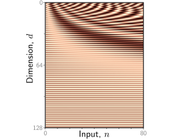
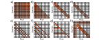

第10章引入了专门用于处理规则网格数据的卷积网络。这类网络非常适合处理图像，因为图像含有极其庞大的输入变量数目，这使得全连接网络不再适用。卷积网络通过参数共享机制，保证了图像中每一处的局部区域都以类似的方式被处理。

本章将要介绍的是 Transformer。它们最初是为了解决自然语言处理（NLP）的问题而设计的，这类问题的网络输入是一连串表示词汇或词汇碎片的高维嵌入向量。语言数据集在某种程度上与图像数据相似，它们的输入变量数量可能极大，并且不同位置的统计特性也类似；因此，在文本中的不同位置重复学习同一个词汇（如“dog”）的含义并不合理。然而，与图像不同的是，语言数据集面临的一个挑战是文本序列长度的不一致性，且没有一个简便的方法来统一调整其大小。

## 12.1 文本数据处理
为了引出 Transformer 的设计动机，让我们考虑以下场景：

```
因为一家餐馆仅提供素食，所以拒绝了我要求的火腿三明治，最终只给了我两片面包。不过，他们的环境氛围与食物和服务一样出色。
```

我们的目标是构建一个能够把这段文本转换为适合后续任务处理的表示形式的网络。例如，这样的网络可以用来判断这篇评论是正面的还是负面的，或者回答如“这家餐馆是否提供牛排？”这样的问题。

首先，我们注意到编码后的输入大小可能远超预期。以这段简短的文本为例，37个词每个都可能被表示为一个1024维的嵌入向量，因此即便是这么短的文本，编码后的输入长度也达到了37×1024=37888。对于更长的文本，其词数可能达到数百甚至数千，这使得使用全连接网络变得不现实。

其次，NLP问题的一个核心特点是每个输入（一个或多个句子）的长度各不相同，这让直接应用全连接网络变得困难。这一观察表明，网络应当采用参数共享策略，类似于卷积网络在图像的不同位置共享参数，以此处理不同位置的词汇。

第三，语言存在歧义性，单从句法无法明确区分“它”是指“餐馆”还是“火腿三明治”。为了理解文本，词汇间需要建立联系，“它”需要与“餐馆”相关联。按照 Transformer 的设计，前者需要对后者“给予注意力”。这意味着单词之间必须存在联系，而这些联系的强度取决于单词本身。此外，这些联系需要能够覆盖文本中较大的跨度，例如，最后一句的“他们”也是指代餐馆。

## 12.2 点积自注意力
上一节阐述了处理文本模型需要：(i) 采用参数共享策略以处理不同长度的长文本输入，以及 (ii) 建立基于单词本身的词表示间的联系。通过采用 *点积自注意力机制*，Transformer 成功实现了这两种特性。

标准的神经网络层 $f[x]$ 接收一个维度为 $D \times 1$ 的输入 $x$，并对其执行一次线性变换后应用一个激活函数，如 ReLU，即：

$$
f[x] = ReLU[\beta + \Omega x], \tag{12.1}
$$

这里的 $\beta$ 代表偏置项，$\Omega$ 代表权重矩阵。

自注意力模块 $sa[\cdot]$ 处理 $N$ 个维度为 $D \times 1$ 的输入 $x_1, \ldots, x_N$，并输出 $N$ 个同样大小的向量。在自然语言处理中，每个输入都对应一个词或词的一部分。首先，每个输入都会计算出一组对应的 *值*：

$$
v_m = \beta_v + \Omega_vx_m, \tag{12.2}
$$

这里 $\beta_v \in \mathbb{R}^D$ 和 $\Omega_v \in \mathbb{R}^{D \times D}$ 分别代表了偏置项和权重矩阵。

接下来，第 $n^{th}$ 个输出 $sa_n[x_1, \ldots, x_N]$ 通过对所有值 $v_1, \ldots, v_N$ 进行加权求和得到：

$$
sa_n[x_1, \ldots, x_N] = \sum_{m=1}^N \alpha[x_m, x_n]v_m. \tag{12.3}
$$

这里的标量权重 $\alpha[x_m, x_n]$ 表示第 $n^{th}$ 个输出对输入 $x_m$ 的 *注意力程度*。这 $N$ 个权重 $\alpha_{p, x_n}$ 都是非负的，且总和为一。因此，自注意力机制可以视为是将不同比例的值 *分配* 到每个输出中（如图 12.1 所示）。

下文将进一步探讨点积自注意力机制的细节，首先是值的计算及其加权方式（方程 12.3），随后是注意力权重 $\alpha[x_m, x_n]$ 的计算方法。


`图 12.1 自注意力机制如何实现路由。自注意力机制处理 $N$ 个输入 $x_1, ..., x_N \in \mathbb{R}^D$（此处 $N = 3$，$D = 4$），并分别计算出 $N$ 个值向量。第 $n$ 个输出 $sa_n[x_1, ... x_N]$（简称 $sa_{n, [x]}$）是通过对这 $N$ 个值向量进行加权求和得到的，其中每个权重都是正值并且总和为1。a) 对于输出 $sa_{1, [x]}$，是通过将第一个值向量乘以 $0.1$，第二个值向量乘以 $0.3$，第三个值向量乘以 $0.6$ 来计算得出。b) 输出 $sa_{2, [x]}$ 的计算方式相同，但此时的权重分别为 $0.5, 0.2$ 和 $0.3$。c) 输出 $sa_{3, [x]}$ 的权重又是不同的。因此，每个输出可以视为是对 $N$ 个值进行了不同的路由处理。`

### 12.2.1 值的计算与加权
方程 12.2 揭示了对每个输入 $x_n \in \mathbb{R}^D$ 应用相同的权重 $\Omega_v \in \mathbb{R}^{D \times D}$ 和偏置 $\beta_v \in \mathbb{R}^D$。由于这种运算与序列的长度 $N$ 呈线性关系，相比于一个将所有 $DN$ 输入与所有 $DN$ 输出相关联的全连接网络，它需要更少的参数。可以将这一计算过程视作一个执行了参数共享的稀疏矩阵运算（见图 12.2b）。

注意力权重 $\alpha[x_m, x_n]$ 融合了来自不同输入的信息。这个权重系统是稀疏的，因为不管输入的大小如何，每一对输入 $(x_m, x_n)$ 只对应一个权重（见图 12.2c）。这意味着，虽然注意力权重的总数与序列长度 $N$ 的平方成正比，但它不受每个输入的长度 $D$ 的影响。


`图 12.2 针对三个维度为 $D = 4$ 的输入 $x_n$ 的自注意力。a) 每个输入 $x_n$ 都独立地通过相同的权重 $\Omega$（相同的颜色代表相同的权重）和偏置 $\beta$（未展示）进行操作，以形成值 $\beta + \Omega x_n$。每个输出都是这些值的线性组合，共享的注意力权重 $a[x_m, x_n]$ 确定了第 $m$ 个值对第 $n$ 个输出的影响。b) 矩阵展示了输入与值之间的线性转换 $\Omega$ 的块稀疏性。c) 另一个矩阵展示了连接值与输出的注意力权重的稀疏性。`

### 12.2.2 注意力权重的计算
在前一节中，我们看到了输出是通过两个连续的线性变换产生的；对于每个输入 $x_m$，独立计算得到的值向量 $\beta_v + \Omega_vx_m$ 随后被注意力权重 $\alpha[x_m, x_n]$ 线性整合。然而，自注意力的整个计算过程实际上是 *非线性* 的。很快我们就会发现，注意力权重本身实际上是输入的非线性函数。这是一个 *超网络* 的范例，即一个网络分支计算另一分支的权重。

为了计算注意力，我们对输入进行了另外两次线性变换：

$$
\begin{align}
q_n = \beta_q + \Omega_qx_n \\
k_m = \beta_k + \Omega_kx_m, \tag{12.4}
\end{align}
$$

这里 $\{q_n\}$ 和 $\{k_m\}$ 分别代表 *查询* 和 *键*。随后，我们计算查询与键之间的点积，并通过 softmax 函数处理这些结果：

$$
\begin{align}
a[x_m, x_n] &= \text{softmax}_{m} [k_.^T q_n] \\
&= \frac{\exp[k_m^T q_n]}{\sum_{m'=1}^N \exp[k_{m'}^T q_n]},
\end{align} \tag{12.5}
$$

因此，对于每个 $x_n$，这些值都是正数且和为一（见图 12.3）。这种方法因其明显的原因而被称为 *点积自注意力*。


`图 12.3 计算注意力权重。a) 对每个输入 $x_n$ 计算查询向量 $q_n = \beta_q + \Omega_qx_n$ 和键向量 $k_n = \beta_k + \Omega_kx_n$。b) 每个查询向量与三个键向量的点积经过 softmax 函数处理，得到非负的、和为一的注意力权重。c) 这些注意力权重通过图 12.2c 所示的稀疏矩阵来指导值向量（见图 12.1）的路由。`


“查询”和“键”的术语源于信息检索领域，这里的含义是：点积操作测量输入之间的相似度，因此权重 $a[x_0, x_n]$ 取决于第 $n^{th}$ 查询与所有键的相对相似度。softmax 函数确保了键向量之间的“竞争”，以决定它们对最终结果的贡献度。查询和键的维度必须一致。不过，这与值的维度可以不同，值的维度通常与输入的尺寸相同，保证了表示的尺寸不发生变化。

### 12.2.3 自注意力机制概述
第 $n^{th}$ 个输出是对所有输入应用了相同线性变换 $v$ 的加权总和，其中 $v = \beta_v + \Omega_vx$，而这些注意力权重均为正值且总和为一。权重的计算基于输入 $x_n$ 与其他输入间相似度的度量。尽管没有使用激活函数，但是这个过程因点积和 softmax 操作而呈现非线性特性。

这种机制满足了初始设定的需求。首先，存在一组共享的参数集 $\Phi = \{\beta_v,\Omega_v,\beta_q,\Omega_q,\beta_k,\Omega_k\}$，它不依赖于输入的数量 N，使得网络能够处理不同长度的序列。其次，输入（单词）间存在相互连接，且这些连接的强度是基于注意力权重直接反映了输入本身的特性。

### 12.2.4 矩阵表示法
如果将 $N$ 个输入 $x_n$ 视为构成了一个 $D \times N$ 矩阵 $X$ 的列，则可以将上述过程更简洁地表述。值、查询和键的计算可以表示为：

$$
\begin{align}
V[X] = \beta_v 1^T + \Omega_v X \\
Q[X] = \beta_q 1^T + \Omega_q X \\
K[X] = \beta_k 1^T + \Omega_k X
\end{align} \tag{12.6}
$$

这里，1 代表一个所有元素为1的 $N \times 1$ 向量。自注意力的计算过程则为：

$$
Sa[X] = V[X] \cdot \text{Softmax} \big( K[X]^T Q[X] \big), \tag{12.7}
$$
其中 Softmax[•] 函数对矩阵的每一列独立执行 softmax 操作（见图 12.4）。通过这种方式，我们特意强调了值、查询和键是如何基于输入 X 计算出一种基于输入的三重乘积。但是，从这一点开始，我们将不再显式表示这种依赖性，简化为：
$$
Sa[X] = V · Softmax[K^T Q]. \tag{12.8}
$$


`图 12.4 自注意力的矩阵表示法。如果将 N 个输入向量 $xn$ 存放在 D×N 矩阵 X 的列中，则可以高效地实施自注意力。输入 X 分别被查询矩阵 Q、键矩阵 K 和值矩阵 V 所处理。随后，通过矩阵乘法计算点积，并对结果矩阵的每列应用 softmax 操作以计算注意力权重。最后，这些值根据注意力权重进行后乘，生成与输入尺寸相同的输出。`

## 12.3 点乘自注意力的扩展
在上一节里，我们讨论了自注意力。本节将介绍三种实际应用中常用的扩展技术。

### 12.3.1 位置编码
细心的读者可能已经发现，自注意力机制忽略了一个重要信息：计算过程与输入 $x_n$ 的顺序无关。更精确地说，它是对输入排列的不变性。然而，对于句子中的单词而言，顺序是极其重要的。例如，句子“The woman ate the raccoon”与“The raccoon ate the woman”意义截然不同。纳入位置信息有两种主要方法。

**绝对位置编码：** 为了编码位置信息，一个矩阵 $\Pi$ 被加入到输入 $X$ 中（见图 12.5）。$\Pi$ 的每一列都唯一标示了输入序列中的绝对位置。这个矩阵可以是预设的，也可以通过学习得到。它可以加在网络的输入层，或者是每一层网络中。有时候，它被用于计算查询和键时加到 $X$ 中，但不用于值的计算。

**相对位置编码：** 自注意力机制的输入可能是整个句子、多个句子或仅是句子的一部分，这时候单词的绝对位置不如两个输入之间的相对位置重要。尽管如果系统知道两个位置的绝对值可以推导出相对位置，相对位置编码却能直接编码这种信息。注意力矩阵的每个元素都对应于查询位置 a 与键位置 b 之间的特定偏移量。对于每个偏移量，相对位置编码学习一个参数 $π_{a,b}$，通过添加、乘以这些值，或以其他方式调整注意力矩阵来使用这些参数。



`图 12.5 位置编码。自注意力架构对输入的排列顺序不敏感。为了使处于不同位置的输入能够被区分处理，可以在数据矩阵中加入位置编码矩阵 $\Pi$。因为每一列都是独一无二的，从而可以识别不同的位置。这里的位置编码采用了预定义的程序化的正弦模式（必要时可扩展到更多的 $N$ 值）。但在其他场景中，位置编码是通过学习得到的。`

### 12.3.2 缩放点积自注意力
注意力计算中的点积可能会产生较大的数值，导致 softmax 函数的参数进入一个区域，其中最大的数值几乎占据主导地位。这使得对 softmax 函数输入的微小变化几乎不影响输出（即，梯度非常小），从而增加了模型训练的难度。为避免此问题，通过查询和键的维度 $D_q$（即 $\Omega_q$ 和 $\Omega_k$ 的行数，这两者必须相同）的平方根来对点积进行缩放：

$$
Sa[X] = V \cdot \text{Softmax} \left( \frac{K^T Q}{\sqrt{D_q}} \right). \tag{12.9}
$$

这种方法被称为缩放点积自注意力。

### 12.3.3 多头自注意力
通常会并行使用多个自注意力机制，这种方式称为 *多头自注意力*。此时会计算出 $H$ 组不同的值、键和查询：

$$
\begin{align}
V_h = \beta_{vh}1^T + \Omega_{vh}X \\
Q_h = \beta_{qh}1^T + \Omega_{qh}X \\
K_h = \beta_{kh}1^T + \Omega_{kh}X.
\end{align} \tag{12.10}
$$

对于第 $h$ 个自注意力机制或称之为 *头*，其表示为：

$$
Sa_h[X] = V_h \cdot \text{Softmax} \left( \frac{K_h^T Q_h}{\sqrt{D_q}} \right), \tag{12.11}
$$

这里每个头都有一套不同的参数 $\{\beta_{vh},\Omega_{vh}\}$, $\{\beta_{qh},\Omega_{qh}\}$, 和 $\{\beta_{kh},\Omega_{kh}\}$。通常情况下，如果输入 $x_m$ 的维度是 $D$，且有 $H$ 个头，那么值、查询和键的尺寸都会是 $D/H$，这样做可以实现高效的执行。这些自注意力机制的输出会先进行纵向拼接，随后通过另一个线性变换 $\Omega_c$ 进行合并（见图 12.6）：

$$
MhSa[X] = \Omega_c \left[ Sa_1[X]^T, Sa_2[X]^T, \ldots, Sa_H[X]^T \right]^T . \tag{12.12}
$$

多头机制被认为是自注意力机制良好工作的关键。人们推测，这种机制能够让自注意力网络对不良的初始值设定更加鲁棒。


`图 12.6 多头自注意力。自注意力通过多个独立的“头”并行进行，每个头拥有自己的查询、键和值。示例中展示了两个头，分别用青色和橙色框标出。它们的输出先是垂直堆叠，随后通过另一线性变换 $\Omega_c$ 进行重组。`

## 12.4 Transformer 层
自注意力仅是更大的 Transformer 层结构中的一环。它由一个多头自注意力单元组成（使得各个词语的表示能够互相影响），接着是一个对每个词分别进行处理的全连接网络 mlp[x•]。这两个部分都采用了残差网络的设计（即，它们的输出会被加到输入上）。此外，通常在自注意力和全连接网络后都会加入层归一化（LayerNorm）操作。这与批归一化（BatchNorm）相似，但它是基于单个输入序列中所有 token 的统计数据来进行归一化的（见第11.4节和图11.14）。完整层的操作流程如下（见图12.7）：
$$
\begin{align}
X \leftarrow X + MhSa[X] \\
X \leftarrow \text{LayerNorm}[X] \\
x_n \leftarrow x_n + \text{mlp}[x_n] \\
X \leftarrow \text{LayerNorm}[X], \\
\quad \forall n \in \{1,...,N\}
\end{align} \tag{12.13}
$$

这里，列向量 $x_n$ 是从整个数据矩阵 X 中分别提取出来的。在实际的网络中，数据会依次穿过多个这样的 Transformer 层。


`图 12.7 Transformer层。输入是一个包含每个输入 Token 的 D 维词嵌入的 D × N 矩阵，输出也是同等大小的矩阵。Transformer 层包含了一系列操作步骤：首先是多头注意力模块，让词嵌入间互相影响，形成了残差块处理，即输入加回到输出中。其次，执行了层归一化（LayerNorm）操作。再接下来是第二个残差层，此处相同的全连接神经网络分别作用于每个词表示（列）。最终，再次应用层归一化。`

## 12.5 面向自然语言处理的 Transformers

前一节介绍了 Transformer 层。本节将探讨它在自然语言处理（NLP）任务中的应用。典型的 NLP 流程起始于一个分词器，它负责将文本切分为词或词片段。随后，每个 token 被映射到一个学习得到的嵌入向量中。这些嵌入向量接着通过一系列的 Transformer 层进行处理。接下来，我们将依次讨论这些阶段。

### 12.5.1 分词
文本处理流程始于分词，它将文本拆分成较小的构成单元（token），这些单元来自于一个可能的 token 词汇表。虽然我们之前暗示这些 token 代表词，但这里存在几个挑战：
- 难免会有一些词（比如，专有名词）不在词汇表中。
- 如何处理标点符号是个问题，但这很关键。例如，如果句子以问号结束，我们必须能够编码这一信息。
- 词汇表需要为具有不同后缀的同一词的不同形式（例如，walk, walks, walked, walking）提供不同的 token，并且需要有方法表明这些变体之间的关联。

一个解决方案是采用字母和标点符号作为词汇表的元素，但这会导致将文本拆分成非常小的片段，后续的网络则需要重新学习这些片段之间的关系。

实践中，人们采取了一个折中方案，介于字母和完整词之间，最终的词汇表既包括常见的词也包括可以组合成较大、较少见词的词片段。通过使用子词分词器，如字节对编码（图 12.8），基于它们出现的频率贪婪地合并常见的子字符串，来计算词汇表。


`图 12.8 子词Token化。a) 选自一首童谣的文本段落。最初的 Token 是字符和空格（用下划线表示），它们的出现频率展示在表格中。b) 每轮迭代，子词 Token 化器寻找并合并出现频率最高的相邻 Token 对（此例中为 se），新建一个 Token 同时减少原有 Token s 和 e 的计数。c) 第二轮迭代中，算法合并了 e 和空格字符 _。注意，被合并的第一个 Token 的末字符不能是空格，以避免跨单词合并。d) 经过 22 轮迭代，Token 化为字母、单词片段和常见单词的混合体。e) 持续这一过程，Token 最终能够代表完整单词。f) 随时间推移，随着字母和单词片段的不断增加再合并，Token 数量先是增加后减少。在实际应用中，会处理极大量的单词，并在达到预设的词汇量大小时停止算法。标点和大写字母也被视为独立字符。`

### 12.5.2 嵌入
词汇表 $V$ 中的每个 token 都映射到一个唯一的*词嵌入*中，整个词汇表的嵌入向量存储在矩阵 $\Omega_e \in \mathbb{R}^{D \times |V|}$ 中。为此，首先将 $N$ 个输入 token 编码进矩阵 $T \in \mathbb{R}^{|V| \times N}$ 中，其中第 $n$ 列对应第 $n$ 个 token，是一个 $|V| \times 1$ 的*独热编码*（即，除了对应于该 token 的条目为一之外，其他所有条目都为零的向量）。输入嵌入通过计算 $X = \Omega_e T$ 获得，$\Omega_e$ 像任何其他网络参数一样进行学习（图 12.9）。典型的嵌入大小 $D$ 为 1024，总词汇量 $|V|$ 为 30,000，因此即使在主网络处理之前，$\Omega_e$ 中就已经有了大量的参数需要学习。


`图 12.9 输入嵌入矩阵 X ∈ RD×N 包含 N 个长度为 D 的嵌入，通过乘以一个包含整个词汇的嵌入 $\Omega_e$ 和一个列中含有对应单词或子词索引的 one-hot 向量矩阵来创建。词汇矩阵 $\Omega_e$ 作为模型的参数之一，并随其他参数一同学习。需要注意的是，矩阵 X 中单词 an 的两个嵌入是相同的。`

### 12.5.3 Transformer 模型
最终，代表文本的嵌入矩阵 X 被传递通过一系列 K 个 Transformer 层，形成了所谓的 Transformer 模型。Transformer 模型分为三种类型：编码器将文本嵌入转化为能够支持多种任务的表示；解码器预测接下来的 token 以继续输入文本；编码器-解码器用于序列到序列的任务，如将一串文本转换成另一串（例如，机器翻译）。这些不同的模型变体将分别在第 12.6 至 12.8 节中进行描述。


## 12.6 Encoder 模型案例: BERT
BERT 是一种编码器模型，采用 30,000 个 token 的词汇表。输入 token 转换为 1024 维的词向量后，经过 24 层 Transformer 处理。每层含有 16 个自注意力机制的头部，每个头部的查询、键和值的维度均为 64（即，$\Omega_{vh}, \Omega_{qh}, \Omega_{kh}$ 矩阵的尺寸是 1024 x 64）。全连接层的隐藏层维度为 4096。总参数量约为 3.4 亿。在 BERT 推出时，这一规模被认为很大，但如今相比最先进模型显得小多了。

像 BERT 这样的编码器模型运用了*迁移学习*。在预训练阶段，通过大规模文本语料的*自我监督*学习，训练 Transformer 架构的参数，目的是使模型掌握语言的统计特性。在*微调阶段*，模型通过较少量的监督学习数据进行调整，以解决特定的任务。

### 12.6.1 预训练
预训练阶段，网络通过自我监督训练，利用大量数据进行学习而无需人工标记。BERT 的自监督任务是从大量网络文本中预测缺失的词语（图 12.10）。训练时，最大输入长度限制为 512 个 token，批量大小设置为 256，整个系统训练一百万步，相当于 33 亿词语料库的大约 50 轮迭代。

预测缺失词的任务促使网络学习语法知识，例如，形容词“红色”通常出现在“房子”或“车”等名词前，而不是动词如“喊叫”前。这也使模型能够学习到一些关于世界的基本常识，如经训练后，模型会更倾向于将句子中的缺失词填充为“火车”而非“花生”。然而，这类模型的“理解”能力是有限的。


`图 12.10 类似BERT的编码器预训练。输入 Token（及一个表示序列开始的特殊 \<cls\> Token）被转换成单词嵌入。这里，嵌入以行的形式表示，因此标记为“单词嵌入”的盒子是 X^T。这些嵌入通过一系列的 Transformer 层进行处理（橙色连线表示在这些层中，每个 Token 都会关注其他所有 Token），以生成一组输出嵌入。一小部分输入 Token 被随机替换为通用的 \<mask\> Token。预训练的目标是根据输出嵌入预测缺失的单词。因此，输出嵌入经过 softmax 函数处理，并使用多类分类损失。这种方法的优势在于它利用了左右上下文来预测缺失单词，但缺点是数据利用率不高；例如，处理七个 Token 只为损失函数增加两项内容。`

### 12.6.2 微调

微调阶段，模型参数被调整以适应特定任务。在 Transformer 网络上添加了额外的层，以将输出向量转换为期望的输出格式。例如：

**文本分类**：在 BERT 中，预训练期间在每个字符串的开头添加了一个称为分类或 \<cls\> token 的特殊标记。对于情感分析等文本分类任务（判断文本情绪为正面或负面），与 \<cls\> token 关联的向量被映射成一个数值，并通过一个逻辑sigmoid函数处理（图 12.11a），这对应于标准的二分类交叉熵损失。

**词分类**：命名实体识别旨在将每个词分类为一个实体类型（如人名、地点、机构或非实体）。为此，每个输入向量 $x_n$ 映射到一个 E × 1 的向量，E 项分别对应 E 种实体类型。通过 softmax 函数处理后，为每个类别生成概率，进而计算多类别交叉熵损失（图 12.11b）。

**文本跨度预测**：在 SQuAD 1.1 问答任务中，问题与包含答案的维基百科段落合并后进行分词处理。BERT 用于预测包含答案的段落文本跨度。每个 token 映射到两个数字，分别表示其为文本跨度起始和结束位置的可能性。通过两个 softmax 函数处理后，可以通过组合开始和结束的概率来评估任何文本跨度作为答案的可能性。


`图 12.11 预训练后的细化调整。在预训练完成后，编码器会利用手动标注的数据进行细化调整，以应对特定的任务。通常，会向编码器添加线性变换层或多层感知机（MLP）来生成需要的输出。a) 文本分类任务示例。在这个情绪分类任务中，使用 \<cls\> token 的嵌入来预测评论是否为正面。b) 单词分类任务示例。在这个命名实体识别任务中，用每个单词的嵌入来判断该词是属于人名、地名、组织名还是非实体。`

## 12.7 Decoder 模型案例: GPT3
本节将对 GPT3 这一解码器模型进行高层次的描述。其基本架构与编码器模型极其相似，包括了一系列操作于学习得到的词嵌入上的 Transformer 层。然而，其目标不同。编码器的目的是构建能够被细微调整用于解决更多具体 NLP 任务的文本表示。相对地，解码器的唯一目的是生成序列中的下一 Token。通过将扩展序列重新输入模型，解码器能够生成连贯的文本段落。

### 12.7.1 语言模型
GPT3 构建了一种自回归语言模型。以句子 “It takes great courage to let yourself appear weak” 为例，假设以完整单词作为 Token，该句子的概率可以表示如下：
$$
\begin{align}
&\Pr(\text{It takes great courage to let yourself appear weak}) =\\
& \Pr(\text{It}) \times \Pr(\text{takes|It}) \times \Pr(\text{great|It takes}) \times \Pr(\text{courage|It takes great}) \times \\
&\Pr(\text{to|It takes great courage}) \times \Pr(\text{let|It takes great courage to}) \times  \\
& \Pr(\text{yourself|It takes great courage to let}) \times \\
& \Pr(\text{appear|It takes great courage to let yourself}) \times \\
& \Pr(\text{weak|It takes great courage to let yourself appear}).
\end{align} \tag{12.14}
$$

更正式地说，自回归模型将 $N$ 个观测 Token 的联合概率 $\Pr(t_1, t_2, \ldots, t_N)$ 分解为自回归序列：
$$
\Pr(t_1, t_2, \ldots, t_N) = \Pr(t_1) \prod_{n=2}^{N} \Pr(t_n|t_1, \ldots, t_{n-1}). \tag{12.15}
$$
这种自回归公式展示了最大化 Token 的对数概率与下一 Token 预测任务之间的直接联系。

### 12.7.2 遮掩自注意力
训练解码器时，我们致力于最大化输入文本在自回归模型下的对数概率。理想情况下，我们希望一次性传入整个句子并计算所有对数概率及其梯度。但这样做存在一个问题：若传入整个句子，计算对数 \[Pr(great|It takes)\] 时，既能访问到答案“great”，也能访问到右侧上下文“courage to let yourself appear weak”，这可能导致系统通过作弊而非学习来预测下一个词，从而无法正确训练。

幸运的是，在 Transformer 网络的自注意力层中，Token 之间的相互作用可以解决这个问题。通过确保对答案和右侧上下文的注意力得分为零，可以避免这个问题。这通过在自注意力计算中将相应的点积设为负无穷大后通过 softmax 函数前实现，称为遮掩自注意力。其效果是让图 12.1 中所有向上倾斜的箭头的权重变为零。

解码器网络的整体操作如下：输入文本被分割为 Token，并转换为嵌入表示。这些嵌入随后被输入 Transformer 网络。不同于以前，Transformer 层现在采用遮掩自注意力，使得它们只能关注当前及之前的 Token。每个输出嵌入代表一个部分句子，其目标是预测序列中的下一 Token。因此，经过 Transformer 层处理后，一个线性层将每个词嵌入映射至词汇表的大小，随后通过 softmax 函数将这些值转换为概率。在训练期间，我们旨在通过标准多类交叉熵损失（图 12.12）最大化真实序列中每个位置的下一 Token 的对数概率之和。


`图 12.12 训练 GPT3 类解码器网络。Token 通过映射转换为词嵌入，序列开始处加上特殊的 \<start\> token。这些嵌入通过一系列使用掩蔽自注意力的 Transformer 层进行传递。在这种设置下，句子中的每个位置只能关注到它自己的嵌入和序列中之前的 Token（橙色连线表示）。每个位置的目标是预测序列中下一真实 Token 的概率。即在第一个位置，预测 Token It 的概率；第二个位置，预测 Token takes 的概率；依此类推。掩蔽自注意力确保了系统不能通过查看后续输入进行作弊。自回归任务有效地利用了数据，因为每个词都对损失函数有贡献，但它仅考虑了每个词的左侧上下文。`

### 12.7.3 利用解码器生成文本
自回归语言模型是本书讨论的第一个生成模型示例。它定义了文本序列上的概率模型，可以用来生成新的、看起来合理的文本样本。生成文本时，我们从一段输入文本（可能仅为一个特殊的 \<start\> 标记，表示序列的开始）开始，并将其输入网络，然后网络输出可能的后续 Token 的概率分布。接下来，我们可以选择概率最高的 Token 或从此概率分布中采样。新扩展的序列被再次输入解码器网络，该网络输出下一个 Token 的概率分布。通过重复此过程，我们可以生成大量文本。得益于遮掩自注意力的机制，早期的计算可以在生成后续 Token 时被重用，使得计算过程十分高效。

在实际应用中，有多种策略可以让生成的文本更加连贯。例如，束搜索算法会跟踪多个可能的句子完成选项，以寻找整体上最可能的完成方式（这并不一定通过每步贪心地选择最可能的下一个词来实现）。Top-k 抽样从最可能的 top-K 选项中随机抽取下一个词，避免了系统偶然从低概率 Token 的长尾选择，从而防止进入不必要的语言死胡同。

### 12.7.4 GPT-3 与少样本学习
像 GPT3 这类大型语言模型采用了这些理念，并在巨大的规模上进行了应用。在 GPT3 中，序列长度达到了 2048 个 Token，总批次大小为 3200 万 Token。模型包含 96 层 Transformer（其中一些层实现了稀疏版本的注意力机制），每层处理的词嵌入大小为 12288。自注意力层拥有 96 个头，值、查询和键的维度均为 128。它利用了 3000 亿个 Token 进行训练，总计含有 1750 亿个参数。

下面是一个 GPT3 模型文本完成的例子，模型接收的文本以斜体显示，而生成的文本以加粗显示：

*Understanding Deep Learning is a new textbook from MIT Press by Simon Prince that*’**s designed to offer an accessible, broad introduction to the field. Deep learning is a branch of machine learning that is concerned with algorithms that learn from data that is unstructured or unlabeled. The book is divided into four sections:**

1. **Introduction to deep learning** 
2. **Deep learning architecture**
3. **Deep learning algorithms**
4. **Applications of deep learning**

**The first section offers an introduction to deep learning, including its history and origins. The second section covers deep learning architecture, discussing various types of neural net- works and their applications. The third section dives into deep learning algorithms, including supervised and unsupervised learning, reinforcement learning, and more. The fourth section applies deep learning to various domains, such as computer vision, natural language processing, and robotics.**


这一延续是可行的，尽管只是部分准确。

这种规模的学习模型一个令人惊奇的特性是，它们能够在不进行特定任务的微调的情况下执行许多任务。如果我们提供几个正确的问题/答案对之后再提出一个问题，它们通常能够通过完成序列来正确回答最后一个问题。纠正英语语法就是一个例子。

```
Poor English input: I eated the purple berries.  
Good English output: I ate the purple berries.  
Poor English input: Thank you for picking me as your designer. I’d appreciate it.  
Good English output: Thank you for choosing me as your designer. I appreciate it.  
Poor English input: The mentioned changes have done. or I did the alteration that you requested. or I changed things you wanted and did the modifications.  
Good English output: The requested changes have been made. or I made the alteration that you requested. or I changed things you wanted and made the modifications.  
Poor English input: I’d be more than happy to work with you in another project.  
Good English output: I’d be more than happy to work with you on another project.

(result from Brown et al., 2020)
```

在这个例子中，提供给 GPT3 的橙色文本包含了一系列成对的示例作为上下文，随后系统便生成了青色的正确答案。这一现象适用于多种场合，如根据自然语言描述生成代码片段、进行算术运算、实现语言间的翻译以及回答文本段落相关的问题。因此，人们认为庞大的语言模型具备少样本学习的能力；它们能够依据寥寥几个示例学习完成新的任务。然而，在实践中，这些模型的表现却是不稳定的，而且它们是如何基于已学习的示例进行推理拓展，而非仅仅进行插值或者直接复制，这一点还不够明确。

## 12.8 编码器-解码器模型案例：机器翻译
语言转换是典型的序列到序列的任务，涉及到一个编码器（encoder）（用于计算源句子的有效表示）和一个解码器（decoder）（用于生成目标语言的句子）。这一过程可通过编码器-解码器模型来完成。

以英语翻译到法语为例，编码器首先接收英文句子，并通过一系列的Transformer层进行处理，为每个Token生成一个输出表示。训练过程中，解码器接收法语的正确翻译，并通过使用掩蔽自注意力（masked self-attention）的Transformer层序列处理，以预测每个位置的下一个词。同时，解码器层还会关注编码器的输出。这样，每个法语输出词的生成都依赖于先前的输出词和源英文句子（见图 12.13）。这一机制通过在解码器中调整Transformer层实现，原先的设计包括一个掩蔽自注意力层，随后是一个针对每个嵌入分别应用的神经网络（见图 12.12）。在这两个部分之间新增了一个自注意力层，使得解码器的嵌入能够关注编码器的嵌入，采用的是一种特殊的自注意力形式，称为编码器-解码器注意力或交叉注意力，其查询（queries）基于解码器的嵌入，而键（keys）和值（values）则来源于编码器的嵌入（见图 12.14）。


`图 12.13 编码器-解码器架构。两个句子输入系统，目标是将第一个句子翻译成第二个。a) 第一个句子通过标准编码器进行处理。b) 第二个句子通过解码器处理，该解码器不仅使用掩蔽自注意力，还通过交叉注意力关注编码器的输出嵌入（橙色矩形表示）。损失函数与解码器模型相同，目标是最大化输出序列中下一个词的概率。`


`图 12.14 交叉注意力。计算流程与标准自注意力一致，但查询是基于解码器嵌入 $X_{dec}$ 计算的，键和值则来自编码器嵌入 $X_{enc}$。在翻译场景中，编码器包含源语言信息，解码器则含有目标语言的统计信息。`
## 12.9 面向长序列的 Transformers
在Transformer编码器模型中，每个Token都会与序列中的其他Token进行相互作用，导致其计算复杂度随着序列长度的增长而平方级增加。而在解码器模型中，每个Token仅与前面出现的Token进行交互，虽然交互数量大致减少了一半，但复杂度的增长依旧是平方级的。这种交互关系可以通过交互矩阵来形象展示（见图 12.15a–b）。

由于计算量的平方级增长，这限制了能够处理的序列长度。为了应对更长序列，开发了许多扩展Transformer的方法。其中一种方法是通过剪枝自注意力机制或等效地稀疏化交互矩阵来减少计算量（见图 12.15c-h）。比如，通过将注意力机制限制在一个卷积结构内，使得每个Token只与其邻近的几个Token有交互。通过多层的作用，即便是距离较远的Token也能相互影响，因为感受野随着层数的增加而扩大。类似于图像处理中的卷积，卷积核的大小和扩张率可以有所变化。

采用纯卷积的方法需要多层网络才能处理大范围的信息整合。一种加快信息整合的方法是让某些特定的Token（可能是每句话的开头）能够关注序列中的所有其他Token（对于编码器模型）或所有前面的Token（对于解码器模型）。另一个思路是设计一些全局Token，它们不代表任何具体的单词，而是用来与序列中所有其他Token以及它们自身建立长距离的连接，如同\<cls\> Token的角色。



`图 12.15 自注意力的交互矩阵。a) 在编码器中，每个 Token 与其他所有 Token 相互作用，计算量随 Token 数量二次方增长。b) 在解码器中，每个 Token 仅与前面的 Token 交互，复杂度依然是二次方。c) 使用卷积结构可以降低编码器中的复杂度。d) 解码器的卷积结构。e–f) 解码器使用二次和三次膨胀率的卷积结构。g) 另一种策略是让选定的 Token 与所有其他 Token（在编码器中）或之前的所有 Token（在解码器中，如图所示）进行交互。h) 或者，可以引入全局 Token（左两列和上两行），它们与所有 Token 以及彼此相互作用。`
## 12.10 面向图像的 Transformers
Transformer 最初是针对文本数据而开发的，它们在这一领域取得的巨大成功促使人们开始尝试将其应用于图像数据。虽然这一尝试初看不太乐观——一方面，图像的像素数量远超过句子中的单词数量，使得自注意力机制的二次方计算复杂度成为实践中的瓶颈；另一方面，卷积神经网络因能自然处理图像的二维结构且对空间平移表现出等变性，从而显示出良好的先验偏好。然而，Transformer网络需要通过学习来掌握这种处理能力。

尽管存在上述挑战，基于Transformer的图像网络如今已在图像分类等任务中超越了卷积神经网络的性能。这一成就部分得益于这些网络可以构建的庞大规模以及用于预训练的大量数据。本节将介绍针对图像设计的Transformer模型。

### 12.10.1 ImageGPT
ImageGPT作为一个Transformer解码器，构建了一种图像像素的自回归模型，能够根据部分图像预测下一个像素的值。由于Transformer网络的计算复杂度较高，最大的模型（含68亿参数）处理的图像尺寸仅限于64×64。此外，为了降低计算负担，需要将原始的24位RGB颜色空间简化为9位颜色空间，从而使系统每个位置只需处理512种可能的Token。

虽然图像本质上是二维的，ImageGPT却能够在每个像素处学习独特的位置编码，从而识别像素之间以及与上一行相邻像素之间的紧密联系。图 12.16 展示了一些图像生成的示例。

这种解码器内部的表示形式被用来作为图像分类的基础。通过对最终像素嵌入进行平均处理，再通过线性层转换，并利用softmax层生成分类概率。系统首先在大规模的网络图像库上预训练，随后在调整至48×48像素的ImageNet数据库上进行微调，采用的损失函数同时包含了图像分类的交叉熵项和像素预测的生成损失项。尽管利用了大量外部训练数据，该系统在ImageNet上的最佳单一错误率仅为27.4%，虽低于当时的卷积网络架构，但考虑到输入图像的尺寸，其性能仍然显著；然而，它在分类目标对象较小或细长的图像时表现不佳。


`图 12.16 ImageGPT。a) 使用自回归模型 ImageGPT 生成的图像。图像的生成从左上角的像素开始，该像素基于其位置的估计经验分布选择。随后的像素基于前一个像素依次生成，沿着行直到达到图像的右下角。对每个像素，Transformer 解码器按照方程 12.15 生成一个条件分布，并从中抽样。这个过程反复进行，直到生成下一个像素，以此类推。b) 图像补全。在每个示例中，图像的下半部被移除（最顶行），ImageGPT 逐像素补全剩余部分（展示了三种不同的补全效果）。`
### 12.10.2 视觉Transformer (ViT)
视觉Transformer (ViT) 通过将图像分割成16×16的小块来解决图像分辨率的挑战（见图12.17）。每个小块通过一个学习到的线性变换降维，并输入到Transformer网络中。这种模型也采用了标准的一维位置编码。

ViT是一个包含\<cls\>标记的编码模型（参见图12.10-12.11），它通过对来自18,000个类别的303百万标记图像的大数据库进行监督式预训练，与BERT不同。通过最终网络层映射\<cls\>标记，生成的激活值通过softmax函数转换为类别概率。预训练完成后，通过替换最终层以适应特定类别数量的映射并进行微调，以完成最终的分类任务。
在ImageNet基准测试中，ViT实现了11.45%的顶级错误率。然而，它在没有监督预训练的情况下，性能并不如当时最好的卷积网络。只有通过利用大量训练数据，才能超过卷积网络的强大先验偏好。


`图 12.17 视觉 Transformer（ViT）。视觉 Transformer 将图像切分成一个个小块（原始实现中为 16×16 大小）。每个小块通过学习到的线性变换映射成一个小块嵌入。这些小块嵌入输入到 Transformer 编码器网络中，并利用 \<cls\> token 来预测图像的类别概率。`

### 12.10.3 多尺度视觉Transformers
与卷积架构处理图像的单一尺度不同，已有多种Transformer模型被提出，它们在多个尺度上处理图像。这些模型通常从高分辨率小块和少数通道开始，逐渐降低分辨率的同时增加通道数。

多尺度Transformer的一个典型例子是移动窗口或SWin Transformer。这是一个编码器型Transformer，通过将图像分割成小块并将这些小块组织成网格窗口，在这些窗口内独立应用自注意力（见图12.18）。相邻Transformer中的窗口会发生位移，使得特定小块的有效感知范围能够扩展到窗口边界之外。

该架构通过定期将来自不重叠2×2小块的特征合并，并通过线性变换将合并后的特征映射至原始通道数的两倍，从而逐步降低尺度。该架构不采用\<cls\>标记，而是在最后一层对输出特征进行平均，然后通过线性层映射至所需的类别数，并通过softmax函数产生类别概率。据文献记载，这种架构的最高级版本在ImageNet数据库上的顶级错误率为9.89%。

另一个想法是定期整合整个图像的信息。双注意力视觉Transformers (DaViT) 交替使用两种类型的Transformers：一种让图像小块互相关注，采用所有通道进行自注意力计算；另一种则是通道互相关注，采用所有图像小块进行自注意力计算。这种架构在ImageNet上的顶级错误率达到了9.60%，接近于撰稿时的最先进水平。


`图 12.18 移动窗口（SWin）Transformer（Liu et al., 2021c）。a) 原始图像。b) SWin Transformer 将图像分割成窗口网格，每个窗口进一步细分为小块。在每个窗口内，Transformer 网络对小块单独应用自注意力。c) 在交替的层中，窗口位置会发生移动，改变小块间相互作用的组合，让信息能够在整幅图像中传递。d) 经过若干层处理后，2×2的小块表示合并，从而增加有效的小块（和窗口）尺寸。e) 在此新的较低分辨率下，交替层使用移动窗口。f) 最终，分辨率降至只剩一个窗口，此时小块覆盖整个图像。`

## 12.11 总结
本章对自注意力机制及Transformer架构进行了介绍，随后阐述了编码器、解码器及编解码器模型的概念和作用。Transformer主要处理一系列高维嵌入数据，其在每一层的计算复杂度较低，并且大量计算可通过矩阵的形式实现并行处理。每个输入嵌入与其他嵌入相互作用，使得模型能够捕捉文本中的远距离依赖关系。但是，随着序列长度的增加，计算量会以二次方形式上升；一个减少计算复杂度的策略是对交互矩阵进行稀疏处理。

本书首次介绍了使用庞大无标签数据集训练Transformer的无监督学习案例。编码器通过预测缺失Token来学习表示，这种表示可用于其他任务。解码器构建了一个自回归模型，处理输入数据，并成为本书介绍的第一个生成模型示例。这些生成式解码器可以用于生成新的数据实例。

第13章将讨论处理图数据的网络。这些网络与Transformer有所关联，图中的节点在每一层网络中互相关注。而第14章至第18章则重新聚焦于无监督学习和生成模型。

## Notes
**自然语言处理**（Natural Language Processing, NLP）：Transformer 设计初衷是为了处理自然语言处理任务，这是一个覆盖文本分析、分类、生成和处理的广泛领域。具体的任务示例包括词性标注、翻译、文本分类、实体识别（如人名、地点、公司等）、文本摘要、问答、词义消歧及文档聚类。NLP 的初步解决方案是基于规则的方法，这些方法利用了语法的结构和统计特性。关于早期方法的更多信息，可以参考 Manning & Schutze (1999) 和 Jurafsky & Martin (2000) 的研究。


`图 12.19 循环神经网络（RNNs）。单词嵌入依序通过一系列相同的神经网络。每个网络产生两个输出：一个是输出嵌入，另一个（通过橙色箭头）反馈到下一个网络，连同下一个单词嵌入一起。每个输出嵌入既包含单词本身的信息，也包含其在前一句子片段中上下文的信息。理论上，最终输出包含整个句子的信息，可以像 Transformer 编码器模型中的 \<cls\> token 那样用于支持分类任务。然而，RNNs 有时候会随时间“遗忘”更早出现的 Token。`

**递归神经网络**（Recurrent Neural Networks, RNNs）：在 Transformer 出现之前，很多领先的 NLP 应用采用了递归神经网络（简称 RNNs）。"递归"这一术语最早由 Rumelhart 等人在 1985 年提出，但其核心思想最少可追溯至 1969 年的 Minsky & Papert。RNNs 逐一处理输入序列中的元素（在 NLP 中通常指词汇）。每一步，网络同时接收新的输入和基于前一时间点的隐藏状态计算出的信息（即递归连接）。最终输出包含了对整个输入序列的理解，这种表示支持了如分类或翻译等 NLP 任务。RNNs 也被应用于解码场景，其中生成的 token 被作为下一次序列输入的一部分反馈给模型。例如，PixelRNN 通过 RNNs 构建了一个图像的自回归模型。

**从 RNNs 到 Transformers**：RNNs 存在一个问题，即可能会忘记序列前面部分的信息。长短期记忆网络（LSTMs）和门控循环单元（GRUs）是对这一架构更为复杂的版本，它们在一定程度上解决了这个问题。然而，在机器翻译领域，人们发现可以利用 RNN 中的所有中间表示来生成输出句子，并且特定的输出词需要根据与输入词的关系更加关注特定的输入词。这种思考最终导致了将递归结构替换为 Encoder-Decoder Transformer 模型，其中输入 token 之间（自注意力）、输出 token 对先前序列中的 token（遮蔽自注意力）以及输出 token 对输入 token（交叉注意力）的关注构成了核心。Transformer 的算法细节在 Phuong & Hutter（2022）中有所描述，相关研究的综述可见于 Lin 等人（2022）。然而，文献应该谨慎对待，因为许多对 Transformer 的改进并没有在严格的实验控制下展现出有意义的性能提升。

应用领域：基于自注意力机制和/或 Transformer 架构的模型已经被广泛应用于处理文本序列、图像块、蛋白质序列、图形、数据库架构、语音、将数学积分问题转化为翻译问题，以及时间序列分析等领域。尽管如此，它们在构建语言模型方面的显著成就，以及最近在计算机视觉中作为卷积网络的替代方案，才是最值得称道的成功。

**大型语言模型**（Large Language Models）：Vaswani 等人（2017）最初聚焦于翻译任务，但如今，Transformer 更多地用于构建纯编码器或纯解码器模型。其中，BERT（Devlin 等人，2019）和 GPT2/GPT3（Radford 等人，2019；Brown 等人，2020）分别是最为人所知的代表。这些模型通常通过诸如 GLUE（Wang 等人，2019b）、SuperGLUE（Wang 等人，2019a）和 BIG-bench（Srivastava 等人，2022）等基准来测试，这些基准整合了多项 NLP 任务，形成一个衡量语言能力的综合得分。解码器模型尽管未经针对性微调，但在提供少数示例问题和答案后，通过填写下一问题的文本表现良好，这种方法称为少样本学习。

自 GPT3 发布以来，出现了许多性能稳步提升的解码器语言模型，包括 GLaM、Gopher、Chinchilla、Megatron-Turing NLG 和 LaMDa。性能提升主要归因于模型规模的增加、采用稀疏激活模块和更大数据集的利用。截至目前，最新的模型是 PaLM，拥有 5400 亿参数，通过 7800 亿 token 在 6144 个处理器上训练。由于文本的高压缩性，这些模型实际上能够记住整个训练集。尽管存在对大型语言模型超越人类性能的大胆声明，但我们应谨慎对待这些观点。

这些模型储备了丰富的世界知识。例如，它们了解深度学习的关键事实，包括它作为一种机器学习的类型及其相关算法和应用。一些模型甚至被误认为具有自我意识。然而，关于这类模型能够理解的深度存在限制的观点值得深思。

**分词器**（Tokenizers）：Schuster & Nakajima 和 Sennrich 等人分别提出了 WordPiece 和字节对编码（Byte Pair Encoding, BPE）。这两种方法通过基于频率贪心合并相邻的 token 对。例如，BPE 从字符或标点开始作为初始 token，并特别标记空格以防合并跨越空格。随着算法进展，通过递归组合字符，形成子词和完整词 token。单一语法模型选择基于语言模型可能性的最佳合并候选。BPE dropout 通过引入随机性使候选生成更高效。SentencePiece 库包含了这两种方法的版本，直接处理 Unicode 字符，适用于任何语言。将子词分割视为学习和推断中应边缘化的潜在变量。

**解码算法**（Decoding Algorithms）：Transformer 解码器模型计算文本的下一个 token 的概率，然后将其加入到前述文本中，再次运行模型。选择概率分布中 token 的过程称为解码。简单地贪心选择最可能的 token 或随机选择可能导致结果过于平凡或质量下降。一种解决方法是维护固定数量的假设并选择最可能的序列，这称为束搜索。为了探索更多样化的序列，对束搜索进行了改进。Top-K 抽样和核抽样分别从最可能的假设或固定比例的总概率质量中抽样，以解决不合理 token 选择问题。

**注意力机制的类型**（Types of Attention）：缩放点积注意力只是包括加法、乘法、键值以及记忆压缩注意力在内的一系列注意力机制中的一种。有研究尝试构建了不具有二次复杂度的“无注意力”Transformer。多头注意力增加了模型的复杂性和灵活性，但研究表明，训练后可以修剪大部分头部而不影响性能，这表明它们主要防止不良初始化。挤压-激励网络是一种类似注意力的机制，根据全局特征重新加权卷积层的通道。

**自注意力（Self-attention）与其他模型间的关系**：自注意力计算与其他模型紧密相关。首先，它是一个超网络（Hypernetwork）的实例，其特点是利用网络的一部分确定另一部分的权重：注意力矩阵构成了一个稀疏网络层的权重，这个层负责将输入值映射到输出（图 12.3）。合成器（Synthesizer）模型（Tay 等，2021）通过直接用一个神经网络为每一行的注意力矩阵从相对应的输入生成，简化了这个概念。虽然输入Token之间不再直接相互作用来生成注意力权重，这种方法效果仍然出乎意料地好。Wu 等人（2019）提出了一个产生具有卷积结构注意力矩阵的系统，让Token关注它们的邻居。门控多层感知机（Gated Multi-layer Perceptron）（Wu 等，2019）计算出一个矩阵，这个矩阵将值进行点乘操作，从而改变它们而不将它们混合。Transformer也与快速权重记忆系统（Fast Weight Memory Systems）紧密相关，后者是超网络概念的先驱（Schlag 等，2021）。

从路由机制（图 12.1）的角度来看，自注意力还与胶囊网络（Capsule Networks）（Sabour 等，2017）有关。胶囊网络捕捉图像中的层级关系，例如，较低层次的网络可能检测到面部的各个部分（如鼻子、嘴巴），这些部分在更高层的胶囊中被组合（路由），以代表一个面孔。但胶囊网络通过协议来进行路由。与此不同，自注意力中，输入间通过softmax运算竞争，以决定它们对输出的贡献。而在胶囊网络中，是层的输出互相竞争，以获得早期层的输入。将自注意力视为路由网络后，我们可以探讨是否有必要使路由动态化（即根据数据变化）。随机合成器（Random Synthesizer）（Tay 等，2021）彻底移除了注意力矩阵对输入的依赖，改为使用预设的随机值或学习到的值。这种方法在多种任务中都表现得出乎意料地好。

多头自注意力还与图神经网络（第13章会详细讨论）、卷积（Cordonnier 等，2020）、循环神经网络（Choromanski 等，2020）以及在霍普菲尔德网络（Hopfield Networks）中的记忆检索（Ramsauer 等，2021）有着密切联系。想了解更多有关Transformers与其他模型间关系的信息，请参阅Prince（2021a）。

**位置编码**：原始的Transformer论文（Vaswani 等，2017）探索了预设位置编码矩阵Π和学习位置编码Π的方法。将位置编码直接加到数据矩阵X中，而不是将它们串联起来，可能看起来有些不同寻常。但由于数据维度D通常大于Token数量N，位置编码实际上存在于一个子空间中。X中的词向量是通过学习得到的，因此，理论上系统可以将这两个组成部分维持在互相正交的子空间中，并在需要时提取位置编码。Vaswani 等人（2017）选择的是一套具有两大优点的正弦波形编码：（i）通过线性操作可以容易地恢复两个编码间的相对位置，（ii）随着位置间距离的增加，它们的点积通常会减小（更多细节请参见Prince，2021a）。许多系统，例如GPT-3和BERT，采用了学习位置编码的方式。Wang 等人（2020a）分析了这些模型中位置编码的余弦相似性，发现它们通常随着相对距离的增加而减少，尽管也存在周期性变化。

许多后续研究仅仅对注意力矩阵进行了修改，以便在缩放点积自注意力（scaled dot product self-attention）方程中：
$$
Sa[X] = V \cdot Softmax\left( \frac{K^TQ}{\sqrt{D_q}} \right),  \tag{12.6}
$$

仅让查询（Q）和键（K）包含位置信息：

$$
\begin{aligned}
V &= \beta_v 1^T + \Omega_v X \\
Q &= \beta_q 1^T + \Omega_q (X + \Pi) \\
K &= \beta_k 1^T + \Omega_k (X + \Pi).
\end{aligned} \tag{12.7}
$$
这种做法促成了在方程 12.16 的分子中展开二次项并只保留部分项的思路。例如，Ke 等人（2021年）通过只保留内容-内容和位置-位置项，并对每种信息使用不同的投影矩阵 Ω•，来分离或解耦内容和位置信息。

另一个创新是直接注入相对位置信息。这比绝对位置更重要，因为文本批次可以在文档的任意位置开始。Shaw 等人（2018年），Raffel 等人（2020年），和 Huang 等人（2020年）均开发了系统，在这些系统中，每个相对位置偏移都学习了一个单独的项，并通过使用这些相对位置编码以各种方式修改了注意力矩阵。Wei 等人（2019年）研究了基于预定义的正弦嵌入而非学习值的相对位置编码。DeBERTa（He 等人，2021年）结合了这些思路；他们仅保留了从二次扩展中选出的部分项，对它们应用不同的投影矩阵，并使用相对位置编码。其他研究探讨了以更复杂方式编码绝对和相对位置信息的正弦嵌入（Su 等人，2021年）。

Wang 等人（2020年）比较了在BERT中使用不同位置编码的Transformer的性能。他们发现相对位置编码的性能优于绝对位置编码，但使用正弦和学习嵌入之间差异不大。关于位置编码的综述可以参考 Dufter 等人（2021年）的工作。

**扩展Transformer以处理更长序列**：自注意力机制的复杂度随序列长度的增长而呈二次方增长。如摘要或问题回答等任务可能需要长输入，因此这种二次方依赖成为性能的限制。三种方法尝试解决这个问题。第一种是减少注意力矩阵的大小，第二种是使注意力稀疏，第三种是修改注意力机制以提高效率。

为了减小注意力矩阵的大小，Liu 等人（2018年）引入了压缩记忆注意力，通过对键和值应用跨步卷积来减少位置数量，这与卷积网络中的降采样类似。现在，注意力是在相邻位置的加权组合之间应用的，其中权重是通过学习得到的。类似地，Wang 等人（2020年）发现，注意力机制中的量在实践中通常是低秩的，并因此开发了LinFormer，它在计算注意力矩阵之前，将键和值投影到较小的子空间上。

为了使注意力稀疏，Liu 等人（2018年）提出了局部注意力方案，即相邻的token块仅对彼此进行关注，从而创建了一个块对角交互矩阵（见图12.15）。信息无法从一个块传递到另一个块，因此这样的层通常与全注意力层交替使用。同样，GPT-3（Brown 等人，2020年）采用了卷积交互矩阵，并与全注意力交替。Child 等人（2019年）和Beltagy 等人（2020年）尝试了包括不同膨胀率的卷积结构在内的多种交互矩阵，但允许一些查询与每个其他键进行交互。Ainslie 等人（2020年）引入了扩展的Transformer构造（图12.15h），它采用了一组与每个其他token交互的全局嵌入。这种方法仅在编码器版本中实现，或者这些方法隐式地允许系统“向前看”。与相对位置编码结合时，这种方案需要特殊的编码，以实现到这些全局嵌入的映射，以及这些映射之间的映射。BigBird（Ainslie 等人，2020年）结合了全局嵌入和卷积结构，并随机采样可能的连接。其他研究探索了学习注意力矩阵稀疏模式的方法（Roy 等人，2021年；Kitaev 等人，2020年；Tay 等人，2020年）。

最后，已经注意到计算注意力的softmax操作的分子和分母中的项具有形式 exp[kT q]。这可以被视为一个核函数，因此可以表达为点积 g[k]T g[q]，其中 g[•] 是一个非线性变换。这种公式解耦了查询和键，使得注意力计算更高效。不幸的是，为了复制指数项的形式，变换 g[•] 必须将输入映射到无限空间。线性Transformer（Katharopoulos 等人，2020年）认识到这一点，并用不同的相似度度量替换了指数项。Performer（Choromanski 等人，2020年）用有限维方式近似这个无限映射。更多关于将Transformer扩展到更长序列的细节可以在Tay 等人（2023年）和Prince（2021年）的研究中找到。

**训练 Transformer**: 训练 Transformer 是具有挑战性的任务，这需要学习率预热（Goyal 等人，2018年）和 Adam 优化器（Kingma & Ba，2015年）。Xiong 等人（2020年）和 Huang 等人（2020年）的研究显示，如果不采用学习率预热，梯度将消失，而且 Adam 更新的幅度会减小。造成这个问题的有几个相互作用的因素。残差连接可能导致梯度爆炸（见图11.6），但归一化层可以防止这种情况。由于自然语言处理（NLP）的统计数据在不同批次间变化很大，Vaswani 等人（2017年）采用了层归一化（LayerNorm）而非批归一化（BatchNorm），尽管后续研究已针对 Transformer 调整了批归一化（Shen 等人，2020年）。层归一化放置于残差块外部会导致梯度在通过网络回传时减小（Xiong 等人，2020年）。此外，初始化时随着我们在网络中的移动，残差连接和主自注意力机制的相对权重发生变化（见图11.6c）。还有一个额外的复杂性在于查询和键的参数梯度小于值参数的梯度（Liu 等人，2020年），这需要使用 Adam 优化器。这些因素复杂地相互作用，使得训练过程不稳定，因此需要学习率预热。

已经有多种方法尝试稳定训练过程，包括：（i）一种名为TFixup的FixUp变体（Huang 等人，2020年），该方法允许移除层归一化组件；（ii）改变网络中层归一化组件的位置（Liu 等人，2020年）；（iii）重新加权残差分支中的两条路径（Liu 等人，2020年；Bachlechner 等人，2021年）。Xu 等人（2021年）引入了一种名为DTFixup的初始化方案，使 Transformer 能够在较小的数据集上进行训练。详细的讨论可以在 Prince（2021年）的工作中找到。

**在视觉领域的应用**：ImageGPT（Chen 等人，2020年）和视觉 Transformer（Dosovitskiy 等人，2021年）都是早期将 Transformer 架构应用于图像的实例。Transformer 已被用于图像分类（Dosovitskiy 等人，2021年；Touvron 等人，2021年）、对象检测（Carion 等人，2020年；Zhu 等人，2020年；Fang 等人，2021年）、语义分割（Ye 等人，2019年；Xie 等人，2021年；Gu 等人，2022年）、超分辨率（Yang 等人，2020年）、动作识别（Sun 等人，2019年；Girdhar 等人，2019年）、图像生成（Chen 等人，2021年；Nash 等人，2021年）、视觉问答（Su 等人，2019年；Tan & Bansal，2019年）、图像修复（Wan 等人，2021年；Zheng 等人，2021年；Zhao 等人，2020年；Li 等人，2022年）、上色（Kumar 等人，2021年）以及许多其他视觉任务（Khan 等人，2022年；Liu 等人，2023年）。

**Transformer 与卷积网络的结合**：Transformer 已与卷积神经网络结合用于多种任务，包括图像分类（Wu 等人，2020年）、对象检测（Hu 等人，2018年；Carion 等人，2020年）、视频处理（Wang 等人，2018年；Sun 等人，2019年）、无监督对象发现（Locatello 等人，2020年）以及多种文本/视觉任务（Chen 等人，2020年；Lu 等人，2019年；Li 等人，2019年）。尽管 Transformer 在视觉任务中可以超越卷积网络，但通常需要大量的数据才能实现更优性能。它们通常在像 JRT（Sun 等人，2017年）和 LAION（Schuhmann 等人，2021年）这样的庞大数据集上进行预训练。尽管 Transformer 没有卷积网络的归纳偏见，但通过使用海量数据，它可以克服这一劣势。

**从像素到视频**：非局部网络（Wang 等人，2018年）是将自注意力应用于图像数据的早期尝试之一。Transformer 最初应用于局部邻域内的像素（Parmar 等人，2018年；Hu 等人，2019年；Parmar 等人，2019年；Zhao 等人，2020年）。ImageGPT（Chen 等人，2020年）扩展了这一概念，用于模拟小图像中的所有像素。视觉 Transformer（ViT）（Dosovitskiy 等人，2021年）使用非重叠的补丁来分析更大的图像。

自那以后，开发了许多多尺度系统，包括 SWin Transformer（Liu 等人，2021年）、SWinV2（Liu 等人，2022年）、多尺度 Transformer（MViT）（Fan 等人，2021年）和金字塔视觉 Transformer（Wang 等人，2021年）。Crossformer（Wang 等人，2022年）建模了不同空间尺度之间的交互。Ali 等人（2021年）引入了交叉协方差图像 Transformer，其中通道而非空间位置相互关注，使得注意力矩阵的大小不受图像大小的影响。双注意力视觉 Transformer（DaViT）由 Ding 等人（2022年）开发，它在子窗口内的局部空间注意力和通道间的空间全局注意力之间进行交替。Chu 等人（2021年）采用了类似的方法，在子窗口内的局部注意力和通过对空间域进行子采样的全局注意力之间交替。Dong 等人（2022年）将图12.15中的元素交互稀疏化的概念适配到2D图像域。

随后，Transformer 被应用于视频处理（Arnab 等人，2021年；Bertasius 等人，2021年；Liu 等人，2021年；Neimark 等人，2021年；Patrick 等人，2021年）。关于应用于视频的 Transformer 的综述可以在 Selva 等人（2022年）的工作中找到。

**结合图像与文本**：CLIP（Radford 等人，2021年）通过对比性预训练任务，学习了图像及其标题的联合编码器。该系统处理 N 张图像及其标题，并产生一个反映图像与标题之间相容性的矩阵。损失函数旨在让正确的配对得分高，错误的配对得分低。Ramesh 等人（2021年和2022年）训练了一个扩散解码器，用于反转 CLIP 图像编码器，进行基于文本条件的图像生成（参见第18章）。


## Problems
**问题 12.1** 考虑一个自注意力机制，它处理 N 个长度为 D 的输入并产生大小相同的 N 个输出。计算查询（Queries）、键（Keys）和值（Values）时一共使用了多少个权重和偏置？将会有多少个注意力权重 a[•, •]？在一个全连接网络中，如果关联所有 DN 个输入和所有 DN 个输出，将会有多少个权重和偏置？

**问题 12.2** 我们为何希望自注意力机制的输入与输出大小一致？

**问题 12.3**∗ 证明自注意力机制（方程 12.8）对数据 X 的置换 XP 是等变的，这里的 P 是一个置换矩阵。换句话说，证明以下等式成立：
$$
Sa[XP] = Sa[X]P. \tag{12.18}
$$

**问题 12.4** 考虑 softmax 操作：

$$
y_i = softmax_i[z] = \frac{\exp[z_i]}{\sum_{j=1}^{5} \exp[z_j]}, \tag{12.19}
$$

在有五个输入的情况下：$z_1 = -3, z_2 = 1, z_3 = 100, z_4 = 5, z_5 = -1$。计算全部 25 个导数 $\frac{\partial y_i}{\partial z_j}$，对于所有的 $i,j \in \{1,2,3,4,5\}$。你有什么发现？

**问题 12.5** 如果在每个头部中，值、查询和键的维度都是 D/H（这里的 D 是数据的原始维度），这种实现方式的效率为什么更高？

**问题 12.6** BERT 使用了两种预训练任务。第一种任务是预测缺失（遮蔽）的词；第二种任务是判断一对句子在原文中是否相邻。判断这两种任务分别属于生成任务还是对比任务（参见第 9.3.6 节）。为什么选择使用这两种任务？提出两种新的对比任务，用于预训练语言模型。

**问题 12.7** 考虑在已有 N 个 token 的预计算遮蔽自注意力机制中加入一个新的 token。描述加入这个新 token 需要进行的额外计算。

**问题 12.8** 视觉变换器的计算量随着图像块数量的增加而呈二次方增长。设计两种方法，根据图 12.15 所示原则减少计算量。

**问题 12.9** 假设用 16 × 16 的图像块网格表示一幅图像，每个图像块通过一个 512 长度的嵌入向量来表示。比较在 DaViT 变换器中执行注意力操作所需的计算量，（i）在使用所有通道的情况下，图像块之间的注意力；以及（ii）在使用所有图像块的情况下，通道之间的注意力。

**问题 12.10*** 通常，注意力权重计算为：

$$
\alpha(x_m, x_n) = \text{softmax}_m [k_.^T q_n] = \frac{\exp[k_m^T q_n]}{\sum_{m'=1}^N \exp[k_{m'}^T q_n]} \tag{12.20}
$$


考虑将 $\exp \left[ k_m^T q_n \right]$ 替换为点乘 $g[k_m]^T g[q_n]$，其中 $g[\cdot]$ 是非线性变换。展示这种替换如何使得注意力权重的计算更加高效。

