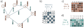

第10章介绍了卷积网络，它擅长处理规则的数据阵列（如图像）。第12章则讲述了 Transformer，它擅长处理长度可变的序列（如文本）。本章将讨论图神经网络。正如其名，这些神经网络架构专门用于处理图结构（即，由边连接的节点集）。

在处理图数据时，面临三大挑战。首先，图的拓扑结构多变，要设计出既有强大表达能力又能适应这种变化的网络十分困难。其次，图的规模可能非常庞大，例如一个社交网络用户连接图可能包含高达十亿个节点。第三，可能只能获取到一个庞大的单体图，这就意味着常规的通过大量数据样本进行训练和使用新数据进行测试的做法并不总适用。

本章将从介绍图数据在现实世界中的应用例子开始。接下来，讲述如何对这些图进行编码，以及如何为图数据定义监督学习问题。本章还将探讨处理图数据所需的算法要求，并自然引出图卷积网络的概念，这是图神经网络的一种特殊类型。
## 13.1 什么是图?
图是一个极其通用的结构，它包含了一系列节点（或称为顶点），这些节点通过边（或链接）相互连接。典型的图结构往往是稀疏的，意味着只有少量可能存在的边实际被使用。

在现实世界中，有许多对象天然就具有图的形态。比如，道路网络可以看作是一个图，节点代表地理位置，而边则表示这些位置之间的道路（见图 13.1a）。化学分子可被视为小型图，其中节点代表原子，边则代表它们之间的化学键（见图 13.1b）。电路则可以被描述为一个图，其节点表示电路的组件和连接点，边则是它们之间的电连接（见图 13.1c）。

`图 13.1 现实世界的图结构示例。例如：a) 道路网络、b) 分子结构、c) 电路布局，它们自然形成了图的结构。`

进一步地，许多数据集也可以通过图的形式来表达，即便它们表面上看不出这种结构。例如：
- 社交网络可视为一个图，其中的节点是人，边表示人与人之间的友谊关系。
- 科学文献网络则是一个节点为论文，边代表论文间引用关系的图。
- 维基百科可以被构想为一个图，其节点是文章，边则是文章间的超链接。
- 计算机程序也可以用图来表示，其中节点是程序中的语法元素（如不同位置的变量），边则代表这些变量参与的计算过程。
- 几何点云可以被建模为图，每个点作为一个节点，通过边与其他近邻点连接。
- 细胞内的蛋白质相互作用同样可以用图来描述，这里的节点是蛋白质，而边则表示蛋白质之间的相互作用。
此外，一个集合（无序列表）也可以被理解为一个图，其中每个元素都是一个节点，与其他所有节点相连接。图像则可以看作是一个具有规则拓扑结构的图，每个像素点作为一个节点，与周围的像素点通过边连接。

### 13.1.1 图的类型
图的分类方法多样。例如，图 13.2a 所示的社交网络就包含了无向边，意味着每对朋友之间的连接是互相的，没有明显的方向性。而图 13.2b 中的引用网络则由有向边构成，每篇论文对其他论文的引用表明了一种单向的关系。

图 13.2c 展示的知识图通过定义实体之间的关系来表达关于这些实体的知识。这是一个有向的异质多图，其中“异质”指的是能够表示多种类型实体（如人、国家、公司）的能力，“多图”则表示任两节点间可以存在多种类型的边。

图 13.2d 中飞机的点集通过连接每个点及其 K 个最近邻来转换为一个几何图，其中每个点在 3D 空间中都有一个确定的位置。图 13.2e 则描述了一个层次结构图，桌子、灯、房间的每一个都通过展示其组成部分相邻性的图来表示。这三个图自身作为节点构成了另一个图，这个图表达了更大模型中的对象拓扑。

尽管深度学习能够处理各种类型的图，本章将重点放在无向图上，如图 13.2a 中所示的社交网络那样。

`图 13.2 图的种类。a) 社交网络是一种无向图，其中人与人之间的连接是对称的。b) 引用网络是一种有向图，一篇出版物引用另一篇，关系是单向的。c) 知识图谱是一种有向的异构多重图，节点代表不同类型的对象（如人、地点、公司），且不同的边可能表示节点间的不同关系。d) 通过在附近的点之间建立连接，点集可以转换成图。每个节点在 3D 空间中都有一个确定的位置，这种图称为几何图（根据 Hu 等人，2022年改编）。e) 左侧的场景可以用一个层次图来表示，房间、桌子和灯的布局都用图来表达。这些图构成了一个更大图中的节点，表示对象间的邻接关系（根据 Fernández-Madrigal & González，2002年改编）。`

## 13.2 图的表示方法
在图的结构之外，每个节点通常还会携带特定的信息。比如，在社交网络里，个人的兴趣可能会被表示为一个固定长度的向量。边上也可能包含信息，如在道路网络中，每条道路的特征（长度、车道数量、事故频率和限速）都可能被标记在边上。节点的信息以节点嵌入的形式存储，而边的信息则存储在边嵌入中。

具体来说，一个图是由 N 个节点和 E 条边构成的集合。我们通过三个矩阵 A、X 和 E 来表示这个图，分别对应图的结构、节点的嵌入和边的嵌入（见图 13.3）。

图的结构通过邻接矩阵 A 来表示，它是一个 N × N 的矩阵，其中若节点 m 和 n 之间有边相连，则矩阵中的 (m, n) 项为 1，否则为 0。对于无向图，这个矩阵是对称的。对大型稀疏图而言，为了节约内存，可将其以连接列表 (m, n) 的形式存储。

第 $n^{th}$ 个节点关联有一个长度为 $D$ 的节点嵌入 $x^{(n)}$。这些节点嵌入串联后，被存储在一个 $D \times N$ 的节点数据矩阵 $X$ 中。同理，第 $e^{th}$ 条边关联有一个长度为 $D_E$ 的边嵌入 $e^{(e)}$，这些边嵌入则被汇总进一个 $D_E \times E$ 的矩阵 $E$ 中。为简化讨论，我们在起初只考虑具有节点嵌入的图，并在第 13.9 节再次讨论边嵌入。

`图 13.3 图的表示方式。a) 一个包含六个节点和七条边的图示例。每个节点都关联一个长度为五的嵌入向量（棕色向量）。每条边都关联一个长度为四的嵌入向量（蓝色向量）。这个图可以通过三个矩阵来表示：b) 邻接矩阵是一个二进制矩阵，如果节点 m 与节点 n 相连，则元素 (m,n) 设为 1。c) 节点数据矩阵 X 包含了串联的节点嵌入。d) 边数据矩阵 E 包含边的嵌入。`

### 13.2.1 邻接矩阵的特性
通过线性代数，我们可以利用邻接矩阵来确定一个节点的所有邻居节点。具体做法是，首先将第 $n^{th}$ 个节点表示为一个独热列向量（这意味着向量中仅第 $n$ 位置为 1，其余为 0）。通过将这个向量与邻接矩阵相乘，我们可以得到第 $n^{th}$ 列，该列标记了所有与第 $n^{th}$ 个节点直接相连的节点（即，直接可达的节点）。

如果重复这个乘法过程（即，再次用邻接矩阵乘以该向量），所得的向量则显示了从节点 $n$ 出发，通过两步可以到达的所有节点的数量（见图 13.4d–f）。

更一般地，如果我们将邻接矩阵自乘至 $L$ 次幂，那么在 $A^L$ 的矩阵中，位置 $(m, n)$ 的值表示从节点 $m$ 到节点 $n$ 有多少种长度为 $L$ 的路径（见图 13.4a–c）。需要注意的是，这里统计的是路径的数量，并不限于不重复访问节点的路径。虽然如此，$A^L$ 仍旧提供了图的连通性质的重要信息：$(m, n)$ 位置的非零值表明，从 $m$ 到 $n$ 的路径长度不会超过 $L$。

`图 13.4 邻接矩阵的属性。a) 图示例。b) 邻接矩阵 A 中的位置 (m, n) 表示从节点 m 到节点 n 的单步路径数量。c) 平方后的邻接矩阵 A2 中的位置 (m, n) 表示从节点 n 到节点 m 的两步路径数量。d) 代表节点六的独热向量，在面板 (a) 中被高亮显示。e) 当此向量左乘 A 时，结果包含了从节点六出发到每个节点的单步路径数量；我们可以通过一步到达节点五、七和八。f) 当此向量左乘 A2 时，结果向量包含了从节点六出发到每个节点的两步路径数量；我们可以在两步内到达节点二、三、四、五和八，并且能通过三种不同的路径（经过节点五、七和八）回到原点。`

### 13.2.2 节点索引的置换
在图中，节点的编号是可以任意调整的；重新排列节点编号会改变节点数据矩阵 $X$ 的列序以及邻接矩阵 $A$ 的行和列序。尽管如此，图的基本结构保持不变（见图 13.5）。这与图像和文本不同，在图像中重新排列像素会产生全新的图像，在文本中重新排列单词会形成不同的句子。

节点编号的这种交换操作可以通过所谓的_置换矩阵_ $P$ 来数学描述。置换矩阵是一种特殊的矩阵，其每行和每列中有且仅有一个元素为 1，其他元素均为 0。当置换矩阵的 $(m, n)$ 位置为 1 时，意味着置换后的编号中 $m$ 会变成 $n$。为了实现索引间的映射，我们采用以下操作：

$$
\begin{align}
X' = XP \\
A' = P^TAP,
\end{align} \tag{13.1}
$$

这里，$P$ 的后乘操作会改变列的顺序，$P^T$ 的前乘操作则改变行的顺序。这意味着，对图进行的任何处理都应当对这种编号的改变保持不变。如果不是这样，处理的结果就会依赖于节点编号的具体选择。

`图 13.5 节点索引的排列变换。a) 示例图，b) 相应的邻接矩阵和 c) 节点嵌入。d) 相同图形的索引顺序被任意改变后的样子。e) 相应的邻接矩阵和 f) 节点矩阵现在发生了变化。因此，任何操作图形的网络层都应对节点的顺序排列保持中立。`

## 13.3 图神经网络、应用任务及损失函数
图神经网络是一种模型，它将节点嵌入 $X$ 和邻接矩阵 $A$ 作为输入，通过一系列 $K$ 层进行传递。在每一层，节点嵌入会被更新，形成中间的“隐藏”表示 $H_k$，直到最终计算出输出嵌入 $H_K$。

在网络的起始阶段，输入节点嵌入 $X$ 的每一列仅含有关于节点自身的信息。而在网络的末端，模型输出 $H_K$ 的每一列则包含了节点及其在图中上下文的信息。这与单词嵌入经过 Transformer 网络后的转变类似：起初代表单词本身，最后则代表单词在句子中的含义。

### 13.3.1 任务与损失函数
我们先把图神经网络模型的详细讨论留到 13.4 节，现在先介绍这些网络处理的问题类型及其相关的损失函数。监督式图问题通常可分为三个类别（参见图 13.6）。

**图级任务**：网络对整个图赋予一个标签或估算一个或多个值，同时利用图的结构和节点嵌入。例如，我们可能想预测某分子在何温度下会液化（回归任务），或判断某分子是否对人类有害（分类任务）。

在图级任务中，输出节点嵌入会被合并（如通过求平均值）并通过线性变换或神经网络映射成一个固定大小的向量。在回归任务中，使用最小二乘法损失来计算结果与实际值之间的差异。对于二元分类，输出通过 Sigmoid 函数处理，差异则通过二元交叉熵损失计算。图属于第一类的概率可以表示为：

$$
Pr(y = 1|X, A) = \text{sig}(\beta_k + \omega_k^T H_K \frac{1}{N}), \tag{13.2}
$$

其中，标量 $\beta_k$ 和 $1 \times D$ 向量 $\omega_k$ 是通过学习得到的参数。通过后乘输出嵌入矩阵 $H_K$ 和一个包含所有元素为 1 的列向量，实现了将所有嵌入相加的效果，随后除以节点数量 $N$ 得到平均值，这一过程称为 _平均池化_（参见图 10.11）。

**节点级任务**：网络对图中每个节点分配一个标签（分类）或一个或多个值（回归），利用图结构和节点嵌入。例如，在一个类似于图 13.2d 的由 3D 点云构建的图中，目标可能是根据节点是属于机翼还是机身来进行分类。损失函数的定义与图级任务相同，不过此时是在每个节点 $n$ 上独立完成的：

$$
Pr(y^{(n)} = 1|X, A) = \text{sig}\left[\beta_K + \omega_k^T h_K^{(n)} \right]. \tag{13.3}
$$

**边预测任务**：网络预测节点 $n$ 与 $m$ 之间是否应存在边。例如，在社交网络的场景中，网络可能预测两人是否相识且相互喜欢，并在是的情况下建议他们建立连接。这是一个二元分类任务，需将两个节点的嵌入映射为一个表示边存在概率的单个数值。一种做法是计算节点嵌入的点积，并通过 Sigmoid 函数处理以得出概率：

$$
Pr(y_{mn} = 1|X, A) = \text{sig}\left[h^{(m)T}h^{(n)} \right]. \tag{13.4}
$$

`图 13.6 图处理的常见任务。在每个案例中，输入都是通过邻接矩阵和节点嵌入表示的图。图神经网络通过将节点嵌入通过系列层进行处理。最终层的节点嵌入包含了关于节点及其图中上下文的信息。a) 图分类，节点嵌入被合并（如通过平均）后映射到一个固定大小向量，再通过 softmax 函数产生类别概率。b) 节点分类，每个节点嵌入分别用作分类基准（青色和橙色表示分配的节点类别）。c) 边预测，相邻边的节点嵌入被合并（如通过点积）来计算一个数字，通过 sigmoid 函数映射产生一个概率表示缺失边是否应存在。`

## 13.4 图卷积网络 (GCN)
图神经网络具有多种类型，这里我们重点介绍 基于空间的卷积图神经网络（Spatial-based Convolutional Graph Neural Networks, 简称 GCNs）。GCNs 之所以被视为卷积网络，是因为它们更新节点时会综合周围节点的信息。这种做法引入了 关系归纳偏置（relational inductive bias），即偏向于优先考虑邻近节点的信息。它们被称为基于空间的，是因为使用了图的原始结构，与此相反，基于频谱的方法（Spectral-based methods）则在傅里叶域进行卷积处理。

GCN 的每一层都是一个带参数 $\Phi$ 的函数 $F[\cdot]$，它接收节点嵌入和邻接矩阵作为输入，并产出新的节点嵌入。因此，网络的表示可以是：

$$
\begin{align}
H_1 = F[X, A, \phi_0] \\
H_2 = F[H_1, A, \phi_1] \\
H_3 = F[H_2, A, \phi_2] \\
\vdots \\
H_K = F[H_{K-1}, A, \phi_{K-1}],
\end{align} \tag{13.5}
$$

其中 $X$ 表示输入，$A$ 代表邻接矩阵，$H_k$ 包含了第 $k$ 层的更新节点嵌入，而 $\phi_k$ 指的是从第 $k$ 层到第 $k+1$ 层的映射参数。

### 13.4.1  等变性与不变性
正如我们先前所指出的，图中的节点索引是随意的，节点索引的任何排列变换都不会改变图本身的结构。因此，任何模型都必须遵守这一性质。这就要求每一层对节点索引的排列变换保持等变性（equivariance）（参见第10.1节）。换言之，如果我们对节点索引进行排列，各阶段的节点嵌入将以同样的方式进行排列。用数学语言表示，如果 $P$ 是一个排列矩阵，那么我们必须满足：

$$
H_{k+1}P = F[H_kP, P^TAP, \phi_k]. \tag{13.6}
$$

对于节点分类和边预测任务，输出同样需要对节点索引的排列保持等变性。然而，对于图级任务，由于最终层聚合了整个图的信息，输出对节点顺序应保持不变性（invariance）。实际上，等式 13.2 中的输出层就实现了这一点：

$$
y = \text{sig}[\beta_K + \omega_k^T H_K \frac{1}{N}] = \text{sig}[\beta_K + \omega_k^T H_KP1/N], \tag{13.7}
$$

适用于任何排列矩阵 $P$（参见问题 13.6）。

这一概念与图像处理领域的情况相呼应，其中图像的分割应对几何变换保持等变性，而图像分类则应保持不变性（参见图 10.1）。虽然卷积和池化层能在一定程度上针对平移实现这些性质，但目前尚无方法可以确切保证对于更广泛的变换实现完全的等变性或不变性。然而，在图处理领域，我们可以定义网络以确保对节点排列的等变性或不变性。
### 13.4.2  参数共享
第10章指出，对图像使用全连接网络（Fully Connected Networks）并不合理，因为这样做要求网络必须在图像的每一个位置独立学习识别对象。作为替代，我们采用卷积层（Convolutional Layers），它能够以统一的方式处理图像中的每个位置。这种做法不仅减少了模型的参数量，还引入了归纳偏置（Inductive Bias），迫使模型均等对待图像的每个部分。

对图中的节点也适用相同的逻辑。理论上，我们可以为每个节点设计一个拥有独立参数的模型。但这会导致网络需要在每个位置独立解释图中的连接含义，并且训练需要大量具有相同拓扑结构的图。相反，我们构建了一种在每个节点处使用相同参数的模型，这样做不仅减少了参数的数量，还能使得在整个图中每个节点处学习到的知识得以共享。

回顾一下，卷积操作（根据方程10.3）是通过从其邻域中获取加权信息的总和来更新变量。这个过程可以理解为每个邻居向目标变量发送信息，然后通过汇总这些信息来进行更新。在处理图像时，邻居是来自当前位置周围固定大小区域内的像素，这使得每个位置的空间关系保持不变。然而，在图这种数据结构中，每个节点可能有不同数目的邻居，且它们之间缺乏一致的空间关系；即不存在一个统一的规则来区分来自节点“上方”与“下方”的信息，因为图中根本就没有明确的“上”和“下”的概念。

### 13.4.3 GCN 层的实例
这番思考促成了简单的 GCN 层设计（参见图 13.7）。在第 $k$ 层的每个节点 $n$，我们通过累加其邻居节点的节点嵌入 $h$ 来聚合信息：

$$
\text{agg}[n, k] = \sum_{m \in \text{ne}[n]} h_k^{(m)}, \tag{13.8}
$$

这里 $\text{ne}[n]$ 返回节点 $n$ 的邻居索引集合。接着，我们对当前节点的嵌入 $h_k^{(n)}$ 以及聚合后的值应用线性变换 $\Omega_k$，加上偏置项 $\beta_k$，并将结果通过非线性激活函数 $a[\cdot]$ 处理，该函数对其向量参数的每一元素独立作用：

$$
h_{k+1}^{(n)} = a \left[ \beta_k + \Omega_k \cdot h_k^{(n)} + \Omega_k \cdot \text{agg}[n, k] \right]. \tag{13.9}
$$

通过观察矩阵与向量后乘所得列的加权和，我们可以更为简洁地描述这一过程。邻接矩阵 $A$ 中第 $n$ 列在邻居对应的位置上为 1，因此，如果我们把节点嵌入组合成 $D \times N$ 矩阵 $H_k$ 并与邻接矩阵 $A$ 后乘，得到的结果的第 $n$ 列就是 $\text{agg}[n, k]$。如此，节点更新公式变为：

$$
\begin{align}
H_{k+1} = a [\beta_{k} 1^T + \Omega_k H_k + \Omega_k H_k A] \\
= a [\beta_{k} 1^T + \Omega_k H_k (A + I)],
\end{align} \tag{13.10}
$$

这里的 1 是一个包含全 1 的 $N \times 1$ 向量。非线性激活函数 $a[\cdot]$ 对其矩阵参数中的每一元素独立应用。

这种层设计满足了我们的设计准则：它对节点索引的排列具有等变性，能够处理任意数量的邻居，通过利用图的结构来提供关系归纳偏置，并在整个图中共享参数。

`图 13.7 简易图 CNN 层。a) 输入图包括结构（体现在邻接矩阵 A 中，未显示）和节点嵌入（存于 X 的列中）。b) 第一隐藏层的每个节点通过 (i) 聚合邻近节点形成单向量，(ii) 应用线性变换 Ω0 到聚合节点上，(iii) 对原节点应用相同线性变换 Ω0，(iv) 这些相加后加上偏置 β0，并最终 (v) 应用非线性激活函数 a[•] 如 ReLU。c) 此过程在后续层重复（但每层用不同参数），直至在网络末端产出最终嵌入。`

## 13.5 案例分析：图形分类
我们现在将这些思想综合起来，描述一个网络，该网络用于判断分子是有毒还是无害。网络的输入包括邻接矩阵 A 和节点嵌入矩阵 X。邻接矩阵 $A \in \mathbb{R}^{N \times N}$ 基于分子的结构。节点嵌入矩阵 $X \in \mathbb{R}^{118 \times N}$ 的每列是一个表示周期表中的118个元素是否出现的一热向量（One-hot Vector）。简单来说，这些向量的长度为118，除了对应元素的位置置为1外，其余各位置均为0。节点嵌入可以通过首个权重矩阵  $\Omega_0 \in \mathbb{R}^{D \times 118}$ 转换成任意维度 D。

网络方程如下：

$$
\begin{align}
H_1 = a[\beta_0 1^T + \Omega_0 X(A + I)] \\
H_2 = a[\beta_1 1^T + \Omega_1 H_1(A + I)] \\
\vdots \\
H_K = a[\beta_{K-1} 1^T + \Omega_{K-1} H_{k-1}(A + I)] \\
f[X, A, \Phi] = \text{sig}[\beta_K + \omega_K H_K 1/N],
\end{align} \tag{13.11}
$$

其中网络输出 $(f[X, A, \Phi]$ 是一个单值，用于决定分子是否有毒（参见方程 13.2）。
### 13.5.1 批量训练方法
给定 $I$ 个训练图 $\{X_i, A_i\}$ 及其相应的标签 $y_i$，我们可以通过使用随机梯度下降（SGD）和二元交叉熵损失（Binary Cross-Entropy Loss）（参见方程 5.19）来学习参数集 $\Phi = \{\beta_k, \Omega_k\}^K_{k=0}$。无论是全连接网络、卷积网络还是 Transformers，它们都利用了现代硬件的并行计算能力，可以同时处理一批训练示例。为此，批次中的元素会被合并成一个更高维度的张量（见第7.4.2节）。

然而，每个图的节点数可能不同。因此，$X_i$ 和 $A_i$ 矩阵的尺寸亦各不相同，无法直接合并成3D张量。

幸运的是，有一个简单的策略能让我们并行处理整批数据。该批次中的图被视作一个单一大图中的离散组成部分。网络随后可以作为单一实例的网络方程来运行。仅在各自的图上执行平均池化操作，从而为每个图生成一个独立的表示，这个表示之后可以被用于损失函数的计算。
## 13.6 归纳式 vs. 转导式模型
到目前为止，本书介绍的所有模型均采用了归纳学习方法：通过一个含有标签数据的训练集来探索输入与输出之间的关联，进而将这种关联应用到新的测试数据上。这可以理解为，我们在学习一个将输入映射到输出的规则，并在其他场合使用这一规则。

而转导学习模型则不同，它同时考虑已标记和未标记的数据。该模型并不生成一个具体的规则，而是直接为未知输出分配标签。这种方法有时被称为半监督学习，其优势在于能够利用未标记数据中的模式来辅助决策。不过，它也存在缺点，即当新增未标记数据时，模型需要重新训练。

这两种问题在处理图数据时尤为常见（见图 13.8）。有时，我们拥有大量已标记的图数据，通过学习这些数据与其标签之间的映射关系。例如，我们可能会有多个分子图，每个图根据分子是否对人类有害进行标记。我们学习这种从图到有害/无害标签的映射规则，并将其应用于新分子。但在某些情况下，我们面对的是一个庞大的单体图，如科学论文引用网络图，其中一些节点按领域（如物理、生物等）进行标记，而我们希望为其他节点也进行标记。在这种情况下，训练数据和测试数据是密切相关的。

图级任务仅出现在有训练和测试数据的归纳学习场景中。不过，无论是在归纳还是转导学习环境下，节点级任务和边预测任务均可能发生。在转导学习中，损失函数旨在最小化模型输出与已知真值之间的差异。通过执行前向传播并对未知真值的情况下获得的结果进行预测，从而计算出新的预测结果。

`图 13.8 归纳与演绎问题。a) 归纳设置中的节点分类任务。给定一组 I 训练图，节点标签（橙色和青色）已知。训练后，给定测试图，需为每个节点分配标签。b) 演绎设置中的节点分类。存在一个大图，部分节点标签（橙色和青色）已知，其他未知。训练模型以正确预测已知标签，然后预测未知节点的标签。`
## 13.7 案例分析：节点分类
作为另一个示例，让我们来看一个在转导学习环境下的二分类节点任务。我们从一个包含数百万节点的商用规模图开始。部分节点已有明确的二元标签，我们的目标是为剩余的未标记节点进行标签分配。网络的架构在很大程度上与前述示例相似（参见方程 13.11），但采用了一个不同的最终层来产生一个 \(1 \times N\) 大小的输出向量：

$$
f[X, A, \Phi] = \text{sig} [\beta_K 1^T + \omega_K H_K ], \tag{13.12}
$$

这里的函数 $\text{sig}[\cdot]$ 对输入行向量的每一个元素独立应用 sigmoid 函数。我们继续使用二元交叉熵损失函数，但仅限于那些我们已知地面真值标签 y 的节点。值得注意的是，方程 13.12 实际上是将方程 13.3 中的节点分类损失函数向量化了。

训练这样规模的图神经网络面临着两个主要问题。首先，从逻辑上讲，训练如此庞大的图神经网络颇具挑战。考虑到我们需要在前向传播过程中为每层网络存储节点嵌入，这意味着需要存储和处理的数据量将是整个图数据量的数倍，这在实践中可能并不现实。其次，由于我们只处理一个单一图，如何执行随机梯度下降并不直观。如果只有一个单一实体，我们应该如何组织批处理呢？
### 13.7.1 选择批次
在训练过程中形成批次的一个方法是，每一步随机选取一部分已标记的节点。每个节点依赖于其上一层的邻节点，这些邻节点又依赖于它们前一层的邻节点，因此每个节点都有一个相当于接收区的范围（见图 13.9）。这个接收区的大小被定义为 k-跳邻域。因此，我们可以通过使用包含批次节点的 k-跳邻域联合而成的图来进行一次梯度下降；其他输入节点则不参与此过程。

`图 13.9 图神经网络的感受野。考虑第二隐藏层中的橙色节点（右侧），它从第一隐藏层的 1-跳邻域节点（中央阴影区域）接收输入。这些第一隐藏层节点又从其邻居处接收输入，从而第二层中的橙色节点接收来自 2-跳邻域（左侧阴影区域）所有输入节点的输入。图中给定节点的输入区域相当于卷积神经网络中感受野的概念。`

遗憾的是，如果图层多且连接密集，每个输入节点可能都处于每个输出节点的接收范围内，这可能根本不会缩减图的规模。这就是所谓的图扩展问题。解决此问题的两种方法包括邻域采样和图分割。

**邻域采样**：通过对进入节点批次的完整图进行采样，进而在每一网络层减少连接数（见图 13.10）。举个例子，我们可以从批次节点开始，随机采样一定数量的它们在前一层的邻节点。然后，对它们在更前一层的邻节点进行随机采样，以此类推。尽管图的规模每增加一层而扩大，但这种增长是在可控范围内的。每个批次的处理都是独立进行的，因此即便是相同的批次被选中两次，参与的邻节点也会有所不同。这种做法也类似于 dropout（第 9.3.3 节）的操作，增加了一定的规则化效果。

`图 13.10 邻域采样技术。a) 在大型图中形成批次的一种方法是，从输出层选择一小部分已标记的节点（此例中，仅选择第二层的一个节点），接着向后追溯直到找到 K-跳邻域内的所有节点。只需此子图即可训练该批次。然而，如果图高度密集连接，可能会涉及图的大部分。b) 一个解决策略是采用邻域采样。从最终层向前追溯时，我们在前一层选择一小部分邻居（此例中为三个），并对这些邻居的邻居执行相同操作，以此减少训练批次所需图的规模。所有图示中，亮度等级表示距离原始节点的远近。`

**图分割**：另一种方法是在处理之前将原图聚类成彼此不连通的节点子集（即，各自独立的小图）（见图 13.11）。有标准算法用于选择这些子集，以最大化它们内部的连接数。这些小图可以分别当作批次处理，或者将它们的随机子集合并为一个批次（同时恢复它们在原图中的边）。

`图 13.11 图的分割方法。a) 输入图。b) 通过一种原理性方法将输入图分割成多个小子图，尽量减少切断的边。c-d) 现在，我们可以将这些子图作为批次在演绎学习环境下进行训练，这里展示了四个可能的批次。e) 另一种方法是利用子图的组合作为批次，并重新连接它们之间的边缘。若使用子图对组合，此处将有六个可能的批次。`

采用上述任一方法形成批次后，我们可以像处理归纳问题一样训练网络参数，按需将标记节点划分为训练集、测试集和验证集；我们有效地将一个转导问题转化为归纳问题。在进行推断时，我们基于它们的 k-跳邻域计算未知节点的预测。不同于训练阶段，这不需要存储中间表示，因此更加节省内存。
## 13.8 图卷积网络的构建层
在之前的示例中，我们把相邻节点的信息与当前节点经过变换后的数据相加来实现合并。具体做法是，将节点的嵌入矩阵 H 乘以邻接矩阵加上单位矩阵 (A + I)。现在，我们将探讨不同的策略，这些策略旨在改进当前嵌入与累积邻居信息的结合方式以及聚合过程本身。

### 13.8.1 结合当前节点与累积邻居

在前述的 GCN 层示例中，我们简单地通过加和的方式将累积的邻居信息 HA 和当前节点 H 结合起来：

$$
H_{k+1} = a \left[ \beta_k 1^T + \Omega_k H_k (A + I) \right]. \tag{13.13}
$$

在另一个变体中，当前节点在加入总和之前，会先乘以一个因子 $(1 + \epsilon_k)$，其中 $\epsilon_k$ 是一个对于每层都不同的学习参数：

$$
H_{k+1} = a \left[ \beta_{k} 1^T + \Omega_k H_k (A + (1 + \epsilon_k)I) \right]. \tag{13.14}
$$

这种方法称为“对角线增强”。还有一种变体，它对当前节点应用了一个不同的线性变换 $\Psi_k$：

$$
\begin{align}
H_{k+1} &= a \left[ \beta_{k} 1^T + \Omega_k H_k A + \Psi_k H_k \right] \\
&= a \left[ \beta_{k} 1^T + \left[ \Omega_k \ \Psi_k \right] \begin{bmatrix} H_k A \\ H_k \end{bmatrix} \right] \\
&= a \left[ \beta_{k} 1^T + \Omega'_k \begin{bmatrix} H_k A \\ H_k \end{bmatrix} \right],
\end{align} \tag{13.15}
$$

其中 $\Omega'_k = \left[ \Omega_k \ \Psi_k \right]$ 在上述等式的第三行被定义。

### 13.8.2 残差连接
在残差连接的应用中，邻居的聚合表示会先进行变换并通过激活函数处理，然后再与当前节点进行加和或连接。对于后一种情况，对应的网络方程如下：
$$
H_{k+1} = a \left[ \beta_k 1^T + \Omega_k H_k A \right] \tag{13.16}
$$
### 13.8.3 Mean aggregation
尽管上述方法通过对节点嵌入进行加和来汇总邻居信息，我们还有其他方式来组合这些嵌入数据。有时候，与其简单求和，不如计算邻居的平均值，尤其是在嵌入信息的重要性超过结构信息时更是如此，因为这样做不会使得邻域贡献的大小依赖于邻居的数量：

$$
\text{agg}[n] = \frac{1}{|\text{ne}[n]|} \sum_{m \in \text{ne}[n]} h_m, \tag{13.17}
$$

这里 $\text{ne}[n]$ 表示的是包含第 $n$ 个节点所有邻居索引的集合。通过引入一个对角线为 $N \times N$ 的度数矩阵 $D$，方程 13.17 可以优雅地用矩阵形式表达出来。这个矩阵的每个非零元素代表了相应节点的邻居数目。从而，在逆矩阵 $D^{-1}$ 中，每个对角线元素就是我们计算平均值所需的分母。据此，新的 GCN 层可以表示为：

$$
H_{k+1} = a \left[ \beta_k 1^T + \Omega_k H_k (AD^{-1} + I) \right]. \tag{13.18}
$$
### 13.8.4 Kipf 归一化
在基于平均聚合的图神经网络设计中，Kipf 归一化是一个特殊的变体，它不仅考虑节点自身，还包括其邻居节点在内进行平均计算。通过 Kipf 归一化，节点的表示总和按如下方式规范化：

$$
\text{agg}[n] = \sum_{m \in \text{ne}[n]} \frac{h_m}{\sqrt{|\text{ne}[n]||\text{ne}[m]|}}, \tag{13.19}
$$

这样做的目的是对那些连接较多、因而提供的信息较少独特性的节点，给予较低的权重。这个思想也可以利用度矩阵 $D$，以矩阵形式精确表达：

$$
H_{k+1} = a \left[ \beta_k 1^T + \Omega_k H_k (D^{-1/2} A D^{-1/2} + I) \right]. \tag{13.20}
$$

### 13.8.5 最大池化聚合
作为对节点排列不变性的另一种处理方式，最大池化聚合通过计算邻居节点嵌入向量中的最大值来实现。最大池化的操作定义如下：

$$
\text{agg}[n] = \max_{m \in \text{ne}[n]} \left[ h_m \right], \tag{13.21}
$$

这里的 $\max[\cdot]$ 操作符选取当前节点 $n$ 的所有邻居向量 $h_m$ 中每个元素的最大值。

### 13.8.6 通过注意力机制聚合

我们之前讨论的聚合方法或是平等考虑每个邻居节点的贡献，或是根据图的结构特性来加权。与之不同，图注意力网络层的权重是基于节点数据动态计算的。首先，对当前节点的嵌入进行线性变换：

$$
H'_k = \beta_k 1^T + \Omega_k H. \tag{13.22}
$$

接下来，计算变换后节点嵌入之间的相似度 $s_{mn}$，方法是将它们成对连接，与一组学习得到的参数 $\phi_k$ 做点积，然后应用激活函数：

$$
s_{mn} = a \left[ \phi_k^T \left[ \begin{array}{c}
h_m' \\
h_n'
\end{array} \right] \right]. \tag{13.23}
$$

这个过程得到的相似度值被存放在一个 $N \times N$ 的矩阵 $S$ 中，每个元素代表一个节点与其他所有节点的相似度。类似于自注意力机制中的点积计算，每个输出嵌入的注意力权重经过 softmax 操作归一化，使得权重为正且和为一。但是，只有当前节点及其邻居的相似度才会被考虑。这些注意力权重随后被用于调整变换后的嵌入数据：

$$
H_{k+1} = a \left[ H'_k \cdot \text{Softmask}[S, A + I] \right], \tag{13.24}
$$

其中 $a[\cdot]$ 表示另一个激活函数。$\text{Softmask}[\cdot,\cdot]$ 函数通过对 $S$ 的每列应用 softmax 操作并将 $A + I$ 为零的位置设为负无穷，从而计算出注意力权重，确保只有邻居节点的注意力被考虑。

这与Transformer中的自注意力机制非常相似，但有三个关键区别：(i) 键、查询和值在此处是相同的，(ii) 相似度的计算方法有所不同，(iii) 注意力被限制在节点及其邻居之间。与Transformer一样，可以通过并行运行多个“头”并将结果结合起来，来扩展这一机制。

## 13.9 边图
到目前为止，我们的讨论主要集中在节点嵌入上，随着它们在网络中的传播，节点嵌入逐渐演化，最终反映了节点及其在图中的上下文信息。现在，我们将注意力转向图中边上的信息。

边图（又称为伴随图或线图）提供了一种适应处理边嵌入的方法。在这种图表示法中，原图的每条边都被视为一个新的节点，原图中任意两条有共同节点的边在边图中构成一条边（如图 13.13 所示）。通常情况下，原始图可以从其边图中恢复，这意味着我们可以在这两种图表示之间自由转换。

处理边嵌入时，图被转换成它的边图。接下来，我们采用与处理节点嵌入相同的技术：聚合来自新节点邻居的信息，并将其与当前的表示相结合。当同时存在节点和边嵌入时，我们能够在这两种图表示之间进行转换。如此，存在四种更新方式（节点更新节点，节点更新边，边更新节点，以及边更新边），可以根据需要轮换使用。或者，通过一些小的调整，可以让节点同时根据节点和边的信息进行更新。

`图 13.12 图卷积网络、点积注意力机制与图注意力网络的比较。在各自情况中，机制将存储在 D×N 矩阵 X 中的大小为 D 的 N 个嵌入映射到同等大小的输出。a) 图卷积网络通过应用线性变换 X′ = ΩX 至数据矩阵。接着基于邻接矩阵计算变换数据的加权和，加入偏置 β，并通过激活函数处理结果。b) 自注意力机制的输出也是变换输入的加权和，但此时权重基于数据本身，通过注意力矩阵计算。c) 图注意力网络融合了这两种机制，其权重既基于数据计算，也参照邻接矩阵。`

`图 13.13 边图创建过程。a) 具有六个节点的图。b) 为创建边图，我们为原图中的每条边分配一个新节点（青色圆圈），c) 如果这些新节点代表的边在原图中连接至相同节点，则它们之间建立连接。`
## 13.10 总结

图是由一系列节点组成的，这些节点通过边连接。节点和边都可以携带数据，分别对应于节点嵌入和边嵌入。许多现实世界问题可以被建模为图问题，目标是确定整个图、各个节点或边的属性，或图中是否存在额外的边。

图神经网络是一类应用于图的深度学习模型。由于图中节点的顺序是不固定的，图神经网络层必须能够适应节点索引的任意排列。空间基卷积网络是图神经网络的一族，它们通过聚合一个节点的邻居信息并使用这些信息更新节点嵌入。

图处理的一大挑战在于，图数据通常呈现在传递性设置中，这意味着我们处理的是一个部分标记的单一大图，而不是分开的训练和测试图集合。这样的图可能非常庞大，给训练带来挑战，催生了采样和分区算法。边图让每条原图的边都对应一个节点。通过这种表示转换，图神经网络可以更新边嵌入。

## Notes
Sanchez-Lengeling 等人（2021年）和 Daigavane 等人（2021年）撰写的文章为使用神经网络进行图处理提供了良好的入门指导。近期关于图神经网络研究的综述可以参考 Zhou 等人（2020年）、Wu 等人（2020年）、Veličković（2023年）的论文，以及 Hamilton（2020年）和 Ma 与 Tang（2021年）的著作。GraphEDM（Chami 等人，2020年）将多种现有图算法整合到了一个框架之下。在本章中，我们遵循 Bruna 等人（2013年）的方法，将图与卷积网络关联起来，同时指出了图神经网络与信念传播（Dai 等人，2016年）和图同构测试（Hamilton 等人，2017年）之间的强关联。Zhang 等人（2019年）专门回顾了图卷积网络。Bronstein 等人（2021年）对包括图上学习在内的几何深度学习进行了全面概述。Loukas（2020年）探讨了图神经网络能学习哪些类型的函数。

**应用领域**：图神经网络的应用领域包括图分类（例如，Zhang 等人，2018年）、节点分类（例如，Kipf 与 Welling，2017年）、边预测（例如，Zhang 与 Chen，2018年）、图聚类（例如，Tsitsulin 等人，2020年）以及推荐系统（例如，Wu 等人，2023年）。节点分类方法由 Xiao 等人（2022年）综述，图分类方法由 Errica 等人（2019年）综述，边预测方法由 Mutlu 等人（2020年）和 Kumar 等人（2020年）综述。

**图神经网络**：图神经网络最初由 Gori 等人（2005年）和 Scarselli 等人（2008年）提出，将其定义为递归神经网络的一种泛化形式。该模型通过下面的迭代更新公式实现：
$$
h_n \leftarrow f \left[ x_n, x_{m\in \mathcal{N}(n)}, e_{ee\in \mathcal{N}(n)}, h_{m\in \mathcal{N}(n)}, \phi \right], \tag{13.25}
$$
在这个公式中，每个节点的嵌入 $h_n$ 通过初始嵌入 $x_n$、相邻节点的初始嵌入 $x_{m\in \mathcal{N}(n)}$、相邻边的初始嵌入 $e_{ee\in \mathcal{N}(n)}$ 以及相邻节点的嵌入 $h_{m\in \mathcal{N}(n)}$ 进行更新。为了确保模型能够收敛，函数 $f[\cdot, \cdot, \cdot, \cdot, \phi]$ 必须是一个收缩映射（见图 16.9）。如果我们对这个方程沿时间维度进行 $K$ 步展开，并在每一步允许参数 $\phi_k$ 发生变化，那么方程 13.25 就会与图卷积网络非常相似。后续的研究将图神经网络扩展到了使用门控循环单元（Li 等人，2016年）和长短期记忆网络（Selsam 等人，2019年）。

**谱方法**：Bruna 等人（2013年）首次在傅立叶域内应用了卷积操作。傅立叶基向量可以通过对图的拉普拉斯矩阵 L = D − A 进行特征分解得到，其中 D 是度矩阵，A 是邻接矩阵。这种方法的缺点在于滤波器不是局部化的，并且对于大型图而言，分解过程的计算成本过高。Henaff 等人（2015年）解决了第一个问题，他们通过使傅立叶表示保持平滑（从而实现空间域的局部化）。Defferrard 等人（2016年）提出了 ChebNet，它通过利用切比雪夫多项式的递归性质来有效近似滤波器，既实现了空间局部化的滤波器，又降低了计算量。Kipf 和 Welling（2017年）进一步简化了这一过程，构造了仅使用一跳邻域的滤波器，形成了一种与本章描述的空间方法相似的公式，并搭建了谱方法和空间方法之间的桥梁。

**空间方法**：由于谱方法基于图拉普拉斯矩阵，图结构一旦改变就需重新训练模型，这促使了空间方法的发展。Duvenaud 等人（2015年）提出了一种在空间域中定义卷积的方法，使用不同的权重矩阵来结合每个节点度的邻接嵌入。但这种方法存在一个缺点：对于连接数极多的节点，它变得不实际。扩散卷积神经网络（Atwood 与 Towsley，2016年）利用归一化邻接矩阵的幂来在不同尺度间混合特征，通过求和、点对点乘以权重并通过激活函数来生成节点嵌入。Gilmer 等人（2017年）引入了消息传递神经网络，通过从空间邻居传递消息来定义图上的卷积。GraphSAGE（Hamilton 等人，2017年）的“聚合与组合”模式适应于此框架。

**聚合与组合**：图卷积网络（Kipf 与 Welling，2017年）对邻居和当前节点取加权平均，然后施加线性映射和 ReLU 激活函数。GraphSAGE（Hamilton 等人，2017年）对每个邻居应用一个神经网络层，采用元素级最大值聚合。Chiang 等人（2019年）提出了对角线增强法，使得之前的嵌入相比邻居具有更高的权重。Kipf 与 Welling（2017年）提出的 Kipf 归一化，根据当前节点及其邻居的度来归一化邻接嵌入的和（参见方程 13.19）。

混合模型网络或 MoNet（Monti 等人，2017年）通过学习基于当前节点及其邻居的度的权重来进一步深入。它们为每个节点关联了一个伪坐标系统，邻居的位置依赖于这两个度量。然后它们基于高斯混合模型学习一个连续函数，并在邻居的伪坐标上采样以获取权重。这样，它们能够为任意度的节点和邻居学习权重。Pham 等人（2017年）对节点嵌入及其邻居采用线性插值，每个维度都采用不同的加权组合。该门控机制的权重作为数据功能而产生。

**高阶卷积层**：Zhou 与 Li（2017年）采用高阶卷积，将邻接矩阵 $A$ 替换为 $\hat{A} = \text{Min}[A^L + I, 1]$，其中 $L$ 表示最大步长，1 为仅含 1 的矩阵，$\text{Min}[\cdot]$ 对其两个矩阵参数取逐点最小值；更新将所有至少存在一条长度为 $L$ 的路径的节点的贡献求和。Abu-El-Haija 等人（2019年）提出了 $\text{MixHop}$，从邻居（使用 $A$ 矩阵）、邻居的邻居（使用 $A^2$）等计算节点更新，并在每层将这些更新连接起来。Lee 等人（2018年）通过使用图中的小型局部几何模式（如，五个节点的完全连接团）整合了来自超出直接邻居的节点的信息。

**残差连接**：Kipf 与 Welling（2017年）提出在其中原始嵌入被加到更新的嵌入上的残差连接。Hamilton 等人（2017年）将先前的嵌入与下一层的输出连接起来（参见方程 13.16）。Rossi 等人（2020年）展示了一种接收式网络，其中节点嵌入不仅与其邻居的聚合连接，还与两步行走范围内所有邻居的聚合连接（通过计算邻接矩阵的幂）。Xu 等人（2018年）引入了跳跃知识连接，其中每个节点的最终输出由整个网络中的节点嵌入连接而成。Zhang 与 Meng（2019年）提出了一种称为 GResNet 的残差嵌入通用公式，并研究了几种变种，在这些变种中，前一层的嵌入被添加，或输入嵌入被添加，或这些的聚合版本从邻居那里添加了信息（无需进一步变换）。

**图神经网络中的注意力机制**：Veličković 等人（2019年）发展了图注意力网络（图 13.12c）。他们的公式使用多个注意力头，输出以对称方式组合。门控注意力网络（Zhang 等人，2018年）根据数据本身对不同注意力头的输出进行加权。Graph-BERT（Zhang 等人，2020年）仅使用自注意力进行节点分类；通过向数据添加位置嵌入来捕获图的结构，这类似于 Transformer 中如何捕获单词的绝对或相对位置（第 12 章）。例如，他们添加了基于节点间跳数的位置信息。
**排列不变性**：在 DeepSets 研究中，Zaheer 等人（2017年）提出了一种处理集合的通用排列不变操作。Janossy 池化（Murphy 等人，2018年）认为许多函数并不具备排列等变性，因此采用了一种对排列敏感的函数，并对多个排列的结果进行平均。

**边图**：边图、线图或邻接图的概念最早由 Whitney（1932年）提出。Kearnes 等人（2016年）提出了一种更新节点嵌入的“编织”层概念，包括从节点嵌入更新到节点嵌入、从边嵌入更新到节点嵌入、从边嵌入更新到边嵌入，以及从节点嵌入更新到边嵌入，但此过程不涉及相邻节点。Monti 等人（2018年）引入了双原图-边图卷积神经网络（CNN），这是一种现代化的 CNN 架构，它在原图和边图之间交替进行更新。

**图神经网络的能力**：Xu 等人（2019年）认为神经网络应该能区分不同的图结构；如果两个图尽管具有相同的初始节点嵌入但不同的邻接矩阵，却被映射到相同的输出，这是不应发生的。他们识别出了以前的方法（如 GCNs（Kipf & Welling，2017年）和 GraphSAGE（Hamilton 等人，2017a年））无法区分的图结构。他们开发了一种具有与 Weisfeiler-Lehman 图同构测试（Weisfeiler & Leman，1968年）同等区分能力的强大架构，这种测试能够区分大范围的图结构。这一成果的图同构网络基于下列聚合操作：
$$
h^{(n)}_{k+1} = \text{mlp} \left[ \left(1 + \epsilon_k\right) h^{(n)}_k + \sum_{m\in\mathcal{N}(n)} h^{(m)}_k \right]. \tag{13.26}
$$
**批处理**：关于图卷积网络的原始论文（Kipf & Welling，2017年）采用了全批量梯度下降法，这在训练过程中的内存需求与节点数量、嵌入大小以及层数成正比。从那时起，提出了三种方法以减少内存需求并为转导设置中的随机梯度下降（SGD）创建批次：节点采样、层采样和子图采样。

节点采样方法从随机选择一组目标节点开始，然后逆向穿过网络，在每个阶段添加一部分接收场中的节点。GraphSAGE（Hamilton 等人，2017a年）提出了图 13.10b 所示的固定数量邻域样本方法。Chen 等人（2018b年）引入了一种方差减少技术，但它依然依赖于节点的历史活动记录，因此内存需求仍然较高。**PinSAGE**（Ying 等人，2018a年）通过从目标节点开始的随机游走，选择访问次数最多的 $K$ 个节点，优先连接更紧密的祖先节点。

节点采样需要随着通过图的逆向传播增加节点数量。**层采样方法**通过直接在每层独立采样接收场来解决此问题。层采样的例子包括 FastGCN（Chen 等人，2018a年）、自适应采样（Huang 等人，2018b年）和层依赖的重要性采样（Zou 等人，2019年）。

子图采样方法随机抽取子图或将原始图分成多个子图。这些子图随后作为独立的数据实例进行训练。这些方法的示例包括 GraphSAINT（Zeng 等人，2020年），它在训练过程中通过随机游走采样子图，然后在子图上运行完整的 GCN，同时校正小批次的偏差和方差。ClusterGCN（Chiang 等人，2019年）在预处理阶段将图划分为多个簇（通过最大化嵌入使用率或批内边数）并随机选择簇形成小批次。为了增加随机性，他们训练了这些簇的随机子集及其相互间的边（参见图 13.11）。

Wolfe 等人（2021年）提出了一种分布式训练方法，该方法通过不同方式划分特征空间，来并行训练更窄的 GCNs。有关采样图的更多信息可以在 Rozemberczki 等人（2020年）的研究中找到。

**正则化与标准化**：Rong 等人（2020年）提出了一种称为 DropEdge 的技术，通过掩盖邻接矩阵在每次训练迭代中随机丢弃图中的边缘。这可以应用于整个神经网络，也可以在每一层中分别实施（分层 DropEdge）。从某种程度上说，这与 dropout 类似，因为它断开了数据流动中的连接，但也可以看作是一种数据增强方法，因为改变图结构类似于扰乱数据。Schlichtkrull 等人（2018年）、Teru 等人（2020年）和 Veličković 等人（2019年）也提出了作为一种类似于 dropout 的正则化手段，从图中随机丢弃边缘的方法。节点采样方法（Hamilton 等，2017a；Huang 等，2018b；Chen 等，2018a）也被视为一种正则化手段。Hasanzadeh 等人（2020年）提出了一个名为 DropConnect 的通用框架，整合了上述多种方法。

图神经网络还提出了许多标准化方案，包括 PairNorm（Zhao & Akoglu，2020年）、权重标准化（Oono & Suzuki，2019年）、可微分群标准化（Zhou 等，2020b年）和 GraphNorm（Cai 等，2021年）。

**多关系图**：Schlichtkrull 等人（2018年）针对多关系图（即，具有多种边类型的图）提出了图卷积网络的变体。他们的方案通过使用不同参数，分别从每种边类型聚合信息。若边类型众多，参数数量可能会很大，为了解决这一问题，他们建议每种边类型采用一组基础参数集的不同权重。

**层级表示与池化**：图像分类的 CNN 在网络深入时，逐渐减少表示的大小，但增加通道数。然而，本章节的图分类 GCN 保持完整图结构直至最后一层，再组合所有节点计算最终预测。Ying 等人（2018b年）提出了 DiffPool，通过将图节点聚类，使得图随网络深度增加而逐渐缩小，这一过程是可微分的，因此可以学习。这既可以基于图结构单独进行，也可以基于图结构及其嵌入进行自适应完成。其他池化方法包括 SortPool（Zhang 等，2018b年）和自注意力图池化（Lee 等，2019年）。Grattarola 等人（2022年）对图神经网络的池化层进行了比较。Gao & Ji（2019年）基于 U-Net 提出了一种图的编解码器结构（参见图 11.10）。

**几何图**：MoNet 模型（Monti 等，2017年）能够利用几何信息，因为邻近节点有明确的空间位置。他们学习一个高斯混合函数，并基于邻居的相对坐标进行采样。这样，他们能够基于相对位置为邻近节点加权，就像传统的卷积神经网络一样，尽管这些位置并非固定不变。测地线 CNN（Masci 等，2015年）和各向异性 CNN（Boscaini 等，2016年）都适配了流形（即，表面）的卷积，如通过三角网格表示。它们在当前节点周围的平面上定义了坐标系统，并将表面近似为平面。

**过平滑与暂停动画**：与其他深度学习模型不同，直到最近，图神经网络并未因深度增加而显著受益。实际上，原始 GCN 论文（Kipf & Welling，2017年）和 GraphSAGE（Hamilton 等，2017a年）均仅使用两层，而 Chiang 等人（2019年）训练了五层 Cluster-GCN，在 PPI 数据集上取得了最佳性能。一个可能的解释是过平滑现象（Li 等，2018c年）；每一层网络融合了更广阔邻域的信息，可能最终导致（重要的）局部信息消散。事实上（Xu 等，2018年）证明了一个节点对另一个节点的影响与通过 K 步随机游走到达该节点的概率成正比。随着 K 增加，这接近于图上游走的平稳分布，导致局部邻域信息被淡化。

Alon & Yahav（2021年）为网络深度增加不改善性能提供了另一种解释。他们认为，深度增加允许从更长路径聚合信息。然而，实际上，邻居数量的指数增长造成了一个瓶颈，即太多信息被“压缩”进固定大小的节点嵌入中。

Ying 等人（2018a年）还指出，当网络深度超过某一限度时，梯度不再回传，导致训练和测试数据的学习失败。他们将这种现象称为“暂停动画”。这类似于在卷积神经网络中盲目添加多层（参见图 11.2）。他们提出了一系列残差连接，允许训练更深的网络。梯度消失问题（第 7.5 节）也被 Li 等人（2021b年）认为是一个限制。

最近，通过使用各种形式的残差连接（Xu 等，2018年；Li 等，2020a年；Gong 等，2020年；Chen 等，2020b年；Xu 等，2021a年），成为可能训练更深的图神经网络。Li 等人（2021a年）使用一个可逆网络训练了一个超过 1000 层的先进模型，以减少训练的内存需求（见第 16 章）。

## Problems
问题 13.1 为图 13.14 中的两幅图绘制邻接矩阵。

问题 13.2* 根据下列邻接矩阵绘制对应的图形：

$$
A_1 =
\begin{bmatrix}
0 & 1 & 0 & 0 & 0 & 0 \\
1 & 0 & 1 & 1 & 1 & 0 \\
0 & 1 & 0 & 0 & 1 & 1 \\
0 & 1 & 0 & 0 & 0 & 1 \\
0 & 1 & 1 & 0 & 0 & 0 \\
0 & 0 & 1 & 1 & 0 & 0 \\
\end{bmatrix}
$$

及

$$
A_2 =
\begin{bmatrix}
0 & 1 & 1 & 0 & 0 & 1 \\
0 & 0 & 1 & 1 & 0 & 0 \\
1 & 1 & 0 & 0 & 0 & 0 \\
1 & 0 & 0 & 0 & 1 & 1 \\
0 & 1 & 0 & 1 & 0 & 0 \\
1 & 0 & 0 & 1 & 0 & 1 \\
\end{bmatrix}
$$

问题 13.3* 考虑图 13.14 中的两幅图，探讨以下两种情况下从节点一到节点二的走法数量：(i) 三步之内；(ii) 七步之内。

问题 13.4 在图 13.4c 中，$A^2$ 对角线上的数字表示每个对应节点连接的边数。请解释这一现象。

问题 13.5 是哪个排列矩阵实现了图 13.5a–c 与图 13.5d–f 之间的转换？

问题 13.6 证明以下等式成立：

$$
\text{sig}[\beta_k + \omega_k H_{k1}] = \text{sig}[\beta_k + \omega_k H_K P_{1}], \tag{13.27}
$$
其中 $P$ 是一个 $N \times N$ 的排列矩阵（一个矩阵，除了每行和每列恰好一个条目为一以外，其余全为零），1 是一个 $N \times 1$ 的全一向量。

问题 13.7* 考虑以下简单的 GNN 层：

$$
\begin{align}
H_{k+1} = \text{GraphLayer}[H_k, A] \\
= a \left[
\begin{array}{c}
\beta_k 1^T \\
\Omega_k \left[ \begin{array}{c}
H_k \\
H_k A \\
\end{array} \right]
\end{array}
\right],
\end{align} \tag{13.28}
$$

其中 $H$ 是一个 $D \times N$ 矩阵，其列包含 $N$ 个节点嵌入，$A$ 是 $N \times N$ 的邻接矩阵，$\beta$ 是偏差向量，$\Omega$ 是权重矩阵。证明该层对节点顺序的排列是等变的，即满足以下条件：

$$
\text{GraphLayer}[H_k, A]P = \text{GraphLayer}[H_k P, P^T AP], \tag{13.29}
$$

其中 $P$ 是一个 $N \times N$ 的排列矩阵。

问题 13.8 对图 13.14 中的每幅图，其度矩阵 $D$ 分别是什么？

问题 13.9 GraphSAGE 的作者 (Hamilton et al., 2017a) 提出一种池化方法，在该方法中，节点嵌入与其邻居的嵌入一起被平均计算，具体如下：

$$
\text{agg}[n] = \frac{1}{1 + |\mathcal{N}(n)|} \left( h_n + \sum_{m \in \mathcal{N}(n)} h_m \right). \tag{13.30}
$$

说明如何利用线性代数方法，同时对 $D \times N$ 嵌入矩阵 $H$ 中所有节点嵌入执行此操作。需要使用邻接矩阵 $A$ 和度矩阵 $D$。

问题 13.10* 设计一个基于点积自注意力的图注意力机制，并按照图 13.12 的风格画出其机制示意图。

问题 13.11* 绘制图 13.15a 所示图的边图。

问题 13.12* 根据图 13.15b 的边图，绘制相应的节点图。

问题 13.13 对于一般的无向图，阐述节点图的邻接矩阵与对应边图的邻接矩阵之间的关系。

问题 13.14* 设计一个层，该层根据节点的邻接节点嵌入 $\{h_m\}_{m\in\mathcal{N}(n)}$ 和邻接边嵌入 $\{e_m\}_{m\in\mathcal{E}(n)}$ 来更新节点嵌入 $h_n$。设计时需考虑边嵌入的维度可能与节点嵌入的维度不一致的情况。

