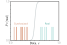
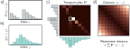
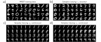
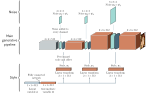

生成对抗网络（GAN）是一种无监督学习模型，其目标是创造出与训练样本集难以区分的新样本。GAN 主要是用来生成新样本的一种机制，它并不建立模型数据的概率分布，因此无法判断一个新数据点是否属于同一分布。

在 GAN 框架中，生成器网络通过将随机噪声映射到输出数据空间来生成样本。若鉴别器网络无法区分生成样本与真实样本，则可认为这些样本是合理的。若鉴别器能识别出二者的差异，则这种识别结果可以作为训练信号反馈给生成器，以提高生成样本的质量。这个概念虽然简单，但GAN的训练充满挑战：学习算法可能会出现不稳定，而且虽然GAN能够生成高度逼真的样本，这并不保证它们能够覆盖所有可能的样本类型。

GAN 已经被广泛应用于众多数据类型，包括音频、三维模型、文本、视频及图形数据等。尤其在图像处理领域，GAN 展现出了极高的成就，能够生成与真实图片几乎无法区分的图像样本。因此，本章主要讨论的是图像合成的应用实例。

## 15.1 将鉴别作为信号
我们的目标是生成新样本集$\{x_j^*\}$，这些样本来源于与真实训练数据集$\{x_i\}$同一分布。生成单个新样本$x_j^*$的过程包括：(i) 从一个简单的基础分布（如标准正态分布）中选择一个潜变量$z_j$，然后 (ii) 通过参数为$\theta$的网络$x^* = g(z_j, \theta)$传递这些数据。此网络称为*生成器*。学习过程的目标是寻找参数$\theta$，使得生成的样本集$\{x_j^*\}$与真实数据集$\{x_i\}$在视觉上“相似”（参见图 14.2a）。

“相似”可以有多种定义方式，但GAN采用的原则是，样本与真实数据在统计上应无法区别。为达此目的，引入了一个名为*鉴别器*的第二网络$f(\cdot, \phi)$，参数为$\phi$。该网络试图将输入分类为真实样本或生成样本。若做到这一点变得不可能，即生成样本与真实样本无法区分，我们便达成了目标。若能区分，鉴别器便提供了一个信号，可用于改善生成过程。

图 15.1 说明了这一方案。我们从一组真实的一维（1D）示例$\{x_i\}$作为训练集出发。每个面板展示了这些示例的不同批次的十个$\{x_i\}^{10}_{i=1}$（青色箭头）。为生成一批样本$\{x_j^*\}$，我们采用简单的生成器公式：

$$
x_j^* = g[z_j, \theta] = z_j + \theta, \tag{15.1}
$$

其中潜变量$\{z_j\}$源自标准正态分布，参数$\theta$使生成样本沿x轴进行平移（见图 15.1）。

在初始阶段，$\theta = 3.0$，生成的样本（橙色箭头）位于真实样本（青色箭头）的左侧。通过训练，鉴别器学习区分生成样本与真实样本（sigmoid曲线显示了数据点为真实的可能性）。训练过程中，调整生成器参数$\theta$，以提高其样本被认为是真实的概率。这意味着增加$\theta$值，使样本向右移，达到sigmoid曲线的较高位置。

我们交替更新鉴别器和生成器。图 15.1b–c 显示了这个过程的两次迭代。随着时间的推移，数据分类变得越来越困难，改变$\theta$的动力相应减弱（即，sigmoid曲线变得更加平缓）。在过程结束时，两组数据变得无法区分；此时的鉴别器表现如同随机选择，因此被舍弃，留下能够生成可信样本的生成器。

`图 15.1 GAN 机制。a) 给定一个参数化函数（生成器），它可以合成样本（橙色箭头）并且接收一批真实样本（青色箭头）。接着，我们对鉴别器进行训练，使其能区分真实样本与生成样本（S形曲线表示样本为真实的估计概率）。b) 通过调整生成器的参数，降低鉴别器对样本合成性的判断准确度（此处通过将橙色样本向右移动实现）。随后更新鉴别器。c) 通过交替更新生成器和鉴别器，使生成样本与真实样本变得难以区分，同时减少改变生成器的动力（即 S形函数的斜率）。`

### 15.1.1 GAN 损失函数
我们接下来将精确定义训练生成式对抗网络（GAN）所用的损失函数。鉴别器$f(x, \phi)$接收输入$x$，拥有参数$\phi$，并返回一个标量值，当输入被判定为真实样本时，此值较大。鉴于这是一个二分类任务，我们适用了二元交叉熵损失函数（见第5.4节），它的原始形式是：

$$
\hat{\phi} = \text{argmin}_{\phi} \left[ \sum_i (1 - y_i) \log \left( 1 - \text{sig}[f(x_i, \phi)] \right) - y_i \log \left( \text{sig}[f(x_i, \phi)] \right) \right], \tag{15.2}
$$

这里$y_i \in \{0, 1\}$表示标签，而$\text{sig}[\cdot]$代表logistic sigmoid函数（参见图5.7）。

在此基础上，我们假定真实样本$x$的标签$y = 1$，生成样本$x^*$的标签$y = 0$，因此损失函数变为：

$$
\hat{\phi} = \text{argmin}_{\phi} \left[ \sum_j -\log \left( 1 - \text{sig}[f(x_j^*, \phi)] \right) - \sum_i \log \left( \text{sig}[f(x_i, \phi)] \right) \right], \tag{15.3}
$$

其中索引$i$和$j$分别代表真实样本和生成样本。

现在，我们用生成器的定义$x_j^* = g(z_j, \theta)$来替代，并注意到对于$\theta$我们需要寻求最大化，因为我们希望生成的样本被误判（即，它们被识别为合成样本的可能性低，或负对数似然度高）：

$$
\hat{\theta} = \text{argmax}_{\theta} \min_{\phi} \left[ \sum_j -\log \left(1 - \text{sig}[f(g(z_j, \theta), \phi)] \right) - \sum_i \log \left( \text{sig}[f(x_i, \phi)] \right) \right]. \tag{15.4}
$$

### 15.1.2 训练 GANs
方程 15.4 描述的损失函数较之前我们所见要复杂；鉴别器参数 $\phi$ 通过最小化损失函数进行调整，而生成器参数 $\theta$ 通过最大化损失函数进行调整。生成式对抗网络（GAN）的训练可以被视作一种*极小极大游戏*；生成器不断寻找新方法以欺骗鉴别器，而鉴别器则不断探索新方法区分出生成样本与真实样本。技术上，这一解决方案被称为*纳什均衡*——优化算法旨在找到一个同时对一个函数是最小值而对另一个函数是最大值的点。如果训练顺利进行，最终在收敛时，$g[z, \theta]$ 的产出将与数据同分布，且 $\text{sig}[f(\cdot, \phi)]$ 的值会接近机会水平（即，0.5）。

为了训练 GAN，我们将方程 15.4 分解成两个损失函数：

$$
\begin{align}
&L[\phi] = \sum_j -\log \left[ 1 - \text{sig}[f(g(z_j, \theta), \phi)] \right] - \sum_i \log \left[ \text{sig}[f(x_i, \phi)] \right] \\
&L[\theta] = \sum_j \log \left[ 1 - \text{sig}[f(g(z_j, \theta), \phi)] \right],
\end{align} \tag{15.5}
$$

其中，我们通过将第二个损失函数乘以负一来将其转化为最小化问题，并且忽略了与 $\theta$ 无关的第二项。最小化第一个损失函数的目的是训练鉴别器，而最小化第二个损失函数则是为了训练生成器。

在训练的每一步骤中，我们从基础分布中抽取一批潜变量 $z_j$，通过生成器生成样本 $x_j^* = g[z_j, \theta]$。接着我们选取一批真实训练样本 $x_i$。有了这两批数据，我们现在可以对每个损失函数执行一次或多次梯度下降步骤（参见图 15.2）。

`图 15.2 GAN 损失函数。一个潜变量 zj 从基本分布中提取，并通过生成器生成样本 x∗。一批生成样本 {x∗j } 和真实样本 {xi} 被送至鉴别器，后者为每个样本分配一个真实性的概率。调整鉴别器参数 φ，以提高对真实样本的识别概率，降低对生成样本的识别概率。同时调整生成器参数 θ，使其能够让鉴别器更倾向于将生成样本判定为真实。`

### 15.1.3 深度卷积生成式对抗网络（DCGAN）
深度卷积生成式对抗网络（DCGAN）是早期专为图像生成设计的GAN架构（参见图15.3）。生成器$g[z, \theta]$接收的输入是一个从均匀分布中采样的100维潜变量$z$。首先，通过线性变换将其映射到一个具有1024个通道的4x4空间表示中。紧接着是四层卷积操作，每层采用分步卷积，实现分辨率加倍（即步长为0.5的卷积）。在最终层，64x64x3的信号通过一个tanh函数处理，生成一个取值范围在\([-1, 1]\)内的图像$x^*$。鉴别器$f(\cdot, \phi)$采用标准的卷积网络架构，在最后一层卷积操作后，图像尺寸被缩减到1x1，通道数为1。这个单一数值经过sigmoid函数$\text{sig}[\cdot]$处理后，得到最终的输出概率。

训练完成后，鉴别器部分将被舍弃。生成新样本时，从基础分布中抽取潜变量$z$，并通过生成器进行处理。图15.4展示了一些生成图像的示例。

`图 15.3 DCGAN 架构。在生成器中，一个 100D 潜变量 z 从均匀分布中抽取，并通过线性变换被映射到一个 4×4、1024 通道的表示。这个表示随后通过多个卷积层进行处理，逐步上采样并减少通道数。最终，通过一个 tanh 函数将 64×64×3 的表示映射到一个固定范围，用于表示图像。鉴别器则由一个标准的卷积网络组成，用于判断输入是真实样本还是生成样本。`

`图 15.4 来自 DCGAN 模型的合成图像。a) 随机抽取的样本，基于在人脸数据集上训练的 DCGAN。b) 使用 ImageNet 数据库的随机样本（参见图 10.15）。c) 基于 LSUN 场景理解数据集的随机抽取样本。据 Radford 等（2015）改编。`
### 15.1.4 训练GAN的困难
理论上，生成式对抗网络（GAN）的概念相对简单。然而，GAN的训练实践却异常困难。举例来说，为了确保深度卷积GAN（DCGAN）能够稳定训练，需要采取以下措施：(i)采用步进卷积实现上下采样；(ii)在生成器和鉴别器中使用批量归一化（BatchNorm），但分别在最末层和首层除外；(iii)在鉴别器中应用leaky ReLU激活函数（参见图3.13）；及(iv)采用Adam优化器，但其动量系数需低于常规设置。这种情况不太常见，因为大部分深度学习模型对这类设置相对不敏感。

一个频繁出现的失败模式是生成器虽能产生看起来合理的样本，但这些样本只覆盖了数据的一小部分（例如，在生成人脸时，可能无法生成带胡须的面孔）。这种现象被称为“模式丢失”。更极端的情况是生成器几乎或完全忽视潜在变量$z$，导致所有样本收敛至一个或少数几个点，这一现象被称作“模式塌缩”（参见图15.5）。

`图 15.5 模式坍塌。使用与 DCGAN 参数和层数相似的 MLP 生成器，在 LSUN 场景理解数据集上训练得到的 GAN 合成图像。这些样本质量低，且多数相似。根据 Arjovsky 等（2017）改编。`

## 15.2 提高稳定性
要弄清楚为什么GAN训练难度大，首先需要深入理解损失函数的实际含义。

### 15.2.1 GAN损失函数的分析
如果我们将方程15.3中两个求和分别除以真实样本数$I$和生成样本数$J$，则损失函数可以用期望形式表示：

$$
\begin{align}
L[\phi] &= \frac{1}{J} \sum_{j=1}^{J} \log \left[ 1 - \text{sig}[f(x_j^*, \phi)] \right] + \frac{1}{I} \sum_{i=1}^{I} \log \left[ \text{sig}[f(x_i, \phi)] \right] \\
&\approx \mathbb{E}_{x^*} \left[ \log \left( 1 - \text{sig}[f(x^*, \phi)] \right) \right] + \mathbb{E}_{x} \left[ \log \left( \text{sig}[f(x, \phi)] \right) \right] \\
&= \int Pr(x^*) \log \left[ 1 - \text{sig}[f(x^*, \phi)] \right] dx^* + \int Pr(x) \log \left[ \text{sig}[f(x, \phi)] \right] dx,
\end{align} \tag{15.6}
$$

这里$Pr(x^*)$和$Pr(x)$分别表示生成样本和真实样本的概率分布。

对于来源未知的示例$\tilde{x}$，最优鉴别器表达为：

$$
Pr(\text{real}|\tilde{x}) = \text{sig}[f(\tilde{x}, \phi)] = \frac{Pr(\tilde{x}|\text{real})}{Pr(\tilde{x}|\text{generated}) + Pr(\tilde{x}|\text{real})} = \frac{Pr(x)}{Pr(x^*) + Pr(x)} \tag{15.7}
$$

这里，我们把$\tilde{x}$分别与生成的分布$Pr(x^*)$和真实分布$Pr(x)$进行对比。将其代入方程15.6中，我们得到：

$$
\begin{align}
L[\phi] &= \int Pr(x^*) \log [1 - sig[f(x^*, \phi)]] dx^* + \int Pr(x) \log [sig[f(x, \phi)]] dx \\
&= \int Pr(x^*) \log \left[ \frac{1 - Pr(x)}{Pr(x^*) + Pr(x)} \right] dx^* + \int Pr(x) \log \left[ \frac{Pr(x)}{Pr(x^*) + Pr(x)} \right] dx \\
&= \int Pr(x^*) \log \left[ \frac{Pr(x^*)}{Pr(x^*) + Pr(x)} \right] dx^* + \int Pr(x) \log \left[ \frac{Pr(x)}{Pr(x^*) + Pr(x)} \right] dx.
\end{align} \tag{15.8}
$$

去掉加法和乘法常数后，这是合成分布$Pr(x^*)$与真实分布$Pr(x)$之间的詹森-香农散度：

$$
\begin{align}
D_{JS} [ Pr(x^*) \| Pr(x) ] &= \frac{1}{2} D_{KL} \left[ Pr(x^*) \| \frac{Pr(x^*) + Pr(x)}{2} \right] + \frac{1}{2} D_{KL} \left[ Pr(x) \| \frac{Pr(x^*) + Pr(x)}{2} \right] \\
&= \frac{1}{2} \int Pr(x^*) \log \left[ \frac{2Pr(x^*)}{Pr(x^*) + Pr(x)} \right] dx^* + \frac{1}{2} \int Pr(x) \log \left[ \frac{2Pr(x)}{Pr(x^*) + Pr(x)} \right] dx.
\end{align} \tag{15.9}
$$

其中$D_{KL}[\cdot\|\cdot]$表示库尔巴克-莱布勒散度。

第一项指出，如果样本密度$Pr(x^*)$较高的地区，混合分布$(Pr(x^*) + Pr(x))/2$也具有较高概率，则距离较小。换言之，它惩罚了那些有$x^*$样本但没有真实样本$x$的区域；这保证了生成样本的质量。第二项表明，如果真实样本密度$Pr(x)$较高的地区，混合分布$(Pr(x^*) + Pr(x))/2$也具有较高概率，则距离较小。换言之，它惩罚了那些有真实样本但没有生成样本的区域；这确保了覆盖范围。回顾方程15.6，我们注意到第二项不依赖于生成器，因此生成器不关心覆盖范围；它只专注于准确生成可能的样本子集。这就是所谓的模式丢失的原因。

### 15.2.2  梯度消失
在上一节，我们了解到，当鉴别器达到最优时，损失函数旨在最小化生成样本与真实样本间距离的度量。然而，将这种概率分布间的距离作为优化 GANs 的准则时，会遇到一个问题。如果这些概率分布彼此之间完全没有交集，那么这个距离将变得无限大，任何微小的调整对于生成器来说都无法减少损失。考虑到原始的公式设定，如果鉴别器能够完美区分生成样本和真实样本，那么对生成数据做出的任何细微调整都不会影响分类得分 (图 15.6)。

遗憾的是，生成样本和真实样例的分布可能确实是分离的。生成样本存在于一个由潜在变量 z 定义的子空间中，而真实样例也因数据生成的物理过程而处于一个低维子空间中 (图 1.9)。这些子空间之间可能几乎没有或根本没有交集，导致梯度非常小或者根本不存在。

图 15.7 提供了支持这种假设的实证证据。如果将 DCGAN 的生成器固定不变，而不断更新鉴别器以提高其分类性能，我们会发现生成器的梯度逐渐减少。简言之，鉴别器与生成器的质量之间需要保持一个极其精细的平衡；一旦鉴别器的性能过于出色，就会削弱对生成器的训练更新。

`图 15.6 GAN 损失函数问题。当生成样本（橙色箭头）与真实样本（青色箭头）容易区分时，鉴别器（sigmoid）在样本处的斜率可能非常平缓；因此，用于更新生成器参数的梯度可能非常微小。`

`图 15.7 DCGAN 的生成器梯度消失问题。生成器在第 1、10 和 25 个训练周期后冻结，而鉴别器继续进行训练。生成器的梯度迅速下降（注意对数刻度）；若鉴别器过于精准，生成器的梯度将消失。根据 Arjovsky & Bottou (2017) 改编。`

### 15.2.3  Wasserstein 距离
前面的部分讨论了两点：(i) GAN 损失可以被理解为不同概率分布间距离的表达，以及 (ii) 当生成样本与真实样例过于容易区分时，这种距离的梯度会降为零。一个自然的改进方向是采用一种具备更佳特性的距离衡量标准。

Wasserstein 距离，或对于离散分布来说的地球推土机距离，指的是将一个分布的概率质量转移至另一个分布所需的劳动量。这里的“劳动量”定义为移动距离与质量的乘积。这一定义明显更具吸引力；即使在分布完全不重叠的情况下，Wasserstein 距离也是有明确定义的，并且随着分布间逐渐接近，其距离会平滑减小。

### 15.2.4 离散分布的 Wasserstein 距离
Wasserstein 距离在处理离散分布时最为直观（见图 15.8）。设想有两个分布 $Pr(x = i)$ 和 $q(x = j)$，它们分别定义在 $K$ 个区间上。设从第一个分布中某区间 $i$ 向第二个分布中某区间 $j$ 移动单位质量的成本为 $C_{ij}$，这个成本可以是两个区间索引的绝对差值 $|i - j|$。这种移动构成了一个*运输计划*，其细节通过矩阵 $P$ 来记录。

Wasserstein 距离的计算公式为：

$$
D_w [ Pr(x) || q(x) ] = \min_{P} \left[ \sum_{i,j} P_{ij} \cdot |i - j| \right], \tag{15.10}
$$

这一计算受到几个约束条件的限制：

$$
\begin{align}
&$\sum_j P_{ij} = Pr(x = i)$，$Pr(x)$ 的起始分布 \\
&$\sum_i P_{ij} = q(x = j)$， $q(x)$ 的起始分布 \\
&$P_{ij} \geq 0$，所有质量都是非负的。 
\end{align} \tag{15.11}
$$

简而言之，Wasserstein 距离是一个将一个分布的质量转移到另一个分布上的最优化问题的解，这个过程受到一系列约束的限制。虽然这个最优化问题需要每次计算距离时都解决，这可能有些不便，但幸运的是，这是一个标准的线性规划问题，对于小型系统方程来说是容易解决的。

| primal form                                     | dual form                              |
| ----------------------------------------------- | -------------------------------------- |
| minimiza c^T p, such that Ap = b and p>=0 | maximiza b^T f, such that A^T f <=c |

此处，$p$ 包含向量化的元素 $P_{ij}$，这些元素确定了转移的质量量，$c$ 记录了各点间的距离，$Ap = b$ 规定了初始分布的约束条件，而 $p \geq 0$ 确保了转移的质量非负。

与所有线性规划问题相同，存在一个等价的*对偶问题*，其解与原问题相同。在对偶问题中，我们尝试最大化与初始分布相关联的变量 $f$ 的值，这一过程需要遵循基于距离 $c$ 的约束条件。对偶问题的解可以表达为：

$$
D_w [Pr(x) || q(x)] = \max_f \left[ \sum_i Pr(x = i)f_i - \sum_j q(x = j)f_j \right], \tag{15.12}
$$

这个过程遵循的约束是：
$$
|f_{i+1} - f_i| < 1 \tag{15.13}
$$
换言之，我们在一组新变量 $\{f_i\}$ 上寻求最优解，要求这组变量中任意相邻两个值之间的差异不得超过一。

`图 15.8 Wasserstein 距离或 earth mover’s distance。a) 考虑离散分布 P r(x = i)。b) 我们希望移动概率质量以形成目标分布 q(x = j)。c) 运输计划 P 确定了从 i 到 j 的质量转移量。例如，青色高亮的方块 p54 表示从 i = 5 到 j = 4 将转移的质量。运输计划的元素必须非负，对 j 的总和应等于 P r(x = i)，对 i 的总和应等于 q(x = j)。因此，P 是一个联合概率分布。d) 元素 i 与 j 之间的距离矩阵。最优运输计划 P 旨在最小化 P 与距离矩阵点乘的总和（即 Wasserstein 距离），因此 P 的元素倾向于聚集在距离成本最低的对角线附近。根据 Hermann (2017) 改编。`

### 15.2.5 连续分布的 Wasserstein 距离
在回到连续多维空间的背景下，原始问题的连续形式（即方程 15.10）可以表示为：

$$
D_w [Pr(x), q(x)] = \min_{\pi \geq 0} \int \int \pi(x_1, x_2) \cdot |x_1 - x_2| dx_1 dx_2 , \tag{15.14}
$$

这里，$\pi(x_1, x_2)$ 代表从 $x_1$ 位置到 $x_2$ 位置转移的质量的运输计划，需要满足与方程 15.11 相似的约束条件。对偶问题的连续形式（即方程 15.12）为：

$$
D_w [Pr(x), q(x)] = \max_{[f]x} \left[ \int Pr(x)f(x)dx - \int q(x)f(x)dx \right] , \tag{15.15}
$$

这一最大化过程受到一个条件的约束，即函数 $f(x)$ 的Lipschitz 常数必须小于一（也就是说，函数的梯度绝对值必须小于一）。

### 15.2.6 Wasserstein GAN 损失函数
在神经网络应用中，我们通过调整神经网络 $f[x, \phi]$ 中的参数 $\phi$ 来最大化函数 $f[x]$ 空间，利用生成的样本 $x_i^*$ 和真实样本 $x_i$ 进行积分近似：

$$
\begin{align}
L[\phi] &= \sum_j [f[x_j^*, \phi]] - \sum_i [f[x_i, \phi]], \\
&= \sum_j [f[g[z_j, \theta], \phi]] - \sum_i [f[x_i, \phi]],
\end{align} \tag{15.16}
$$

我们需要确保神经网络中的判别器 $f[x_i, \phi]$ 在每一个点 $x$ 处的梯度范数都小于一：

$$
\left| \frac{\partial f[x, \phi]}{\partial x} \right| < 1. \tag{15.17}
$$

一种实现方法是将判别器的权重限制在一个较小的区间内（比如 $[-0.01, 0.01]$）。另一种策略是使用*梯度惩罚 Wasserstein GAN（WGAN-GP）*，通过添加一个正则项来确保梯度范数接近于一，当梯度范数偏离一时，这个正则项的值会增加。

## 15.3 渐进式增长、小批量判别和截断
Wasserstein 方法为 GAN 训练带来了更高的稳定性。不过，要生成高品质图像，我们还需要额外的技术手段。接下来，我们将介绍渐进式增长、小批量判别和截断技术，它们均能显著提升生成图像的品质。

在渐进式增长策略中（参见图 15.9），起始阶段是训练一个能够生成 4×4 图像的 GAN，采用与 DCGAN 相似的架构。随后，我们向生成器添加新的层，这些层负责上采样并进一步处理，以生成 8×8 尺寸的图像。判别器同样被加入新的层，使其能够处理并分类更高分辨率的图像。在实践中，高分辨率层会逐渐并平滑地引入，起初通过残差连接传递上采样的结果，随后新加入的层逐步发挥作用。

小批量判别技术确保生成的样本具备足够的多样性，从而有效避免了模式崩溃现象。通过对合成数据和真实数据的小批次进行特征统计，并将统计结果作为特征图加入到判别器中，判别器能够反馈信号给生成器，鼓励其在生成数据时引入与原始数据集相仿的多样性。

提高生成质量的另一技巧是截断策略（见图 15.10），在此策略中，仅在采样时选择那些高概率（即，接近均值的）潜在变量 z。这虽然减少了样本的多样性，但能显著提升样本的品质。通过精确的归一化和规范化处理，样本质量得到进一步改善。采用这些技术组合，GAN 能够生成既多样化又逼真的图像（如图 15.11 所示）。通过在潜在空间内平滑过渡，有时还能实现从一个合成图像到另一个的逼真插值（如图 15.12 所示）。

`图 15.9 逐步增长的 GAN 训练。a) 初始阶段，生成器被训练生成非常小的图像（4×4），鉴别器则被训练识别这些图像是合成的还是降采样的真实图像。b) 在这个低分辨率的训练完成后，为生成器添加更多层来生成更大的图像（8×8），鉴别器也增加相应的降采样层。c) 此过程持续进行，依次生成更大的图像（如16×16等）。通过这种方式，可以训练出能产生极为逼真的高分辨率图像的 GAN。d) 使用相同的潜变量，在不同阶段生成的逐步增大分辨率的图像。据 Wolf (2021)，采用 Karras 等人 (2018) 的方法。`

`图 15.10 样本截断。通过拒绝偏离均值超过 τ 标准差的潜变量 z 的样本，可以权衡 GAN 样本的质量与多样性。a) 当这个阈值较大（τ = 2.0）时，样本在视觉上多样但可能有缺陷。b-c) 随着这个阈值的降低，样本的平均视觉质量提升，但多样性减少。d) 当阈值非常小，样本看起来几乎相同。通过合理选择这个阈值，可以提高 GAN 结果的平均质量。根据 Brock 等人 (2019) 改编。`

`图 15.11 逐步增长法。这种方法在训练 CELEBA-HQ 数据集时能生成逼真的人脸图像，在训练 LSUN 分类时则能生成更为复杂和多变的对象。据 Karras 等（2018）改编。`

`图 15.12 遍历 LSUN 汽车数据集上训练的渐进式 GAN 的潜空间。在潜空间中的移动使得汽车图像平滑地变化，这种现象通常仅在短距离轨迹中有效；最终，潜变量移至一个区域，导致产生不现实的图像。据 Karras 等（2018）改编。`
## 15.4 条件生成
尽管 GAN 能够生成逼真的图像，但它们并不允许指定图像的具体属性，比如无法选择生成的面孔的头发颜色、种族或年龄，除非针对每种属性组合训练单独的 GAN。条件生成模型则为我们提供了这种属性控制的能力。
### 15.4.1 条件 GAN
条件 GAN 通过向生成器和判别器同时传递一个包含属性信息的向量 c 来工作，分别用 g[z, c, θ] 和 f[x, c, φ] 表示。这样，生成器的任务就变成了将潜在变量 z 转换成带有特定属性 c 的数据样本 x，而判别器则致力于辨别生成的样本是否携带目标属性或者是真实样本携带真实属性（见图 15.13a）。

对生成器来说，可以将属性 c 直接加入到潜在向量 z 中。而对于判别器，如果处理的是一维数据，这些属性可以加入到输入数据中；对于图像数据，则可以将属性转换成二维形式并作为一个额外通道加入到判别器的输入或其内部某个中间层。

`图 15.13 条件生成。a) 条件 GAN 的生成器还接收一个描述图像特征的属性向量 c。如常规做法，鉴别器接收真实或生成的样本，但现在它还得接收属性向量，以鼓励样本同时符合逼真性和属性兼容性。b) 辅助分类器 GAN（ACGAN）的生成器采用一个离散属性变量。鉴别器需要判断输入是真实还是合成，并正确识别类别。c) InfoGAN 把潜变量分成噪声 z 和未指定的随机属性 c。鉴别器需要辨识输入的真实性，并重构这些属性。实践中，这意味着变量 c 对应于具有现实世界解释的数据的显著特征（即，潜空间被解耦）。`
### 15.4.2 辅助分类器 GAN
辅助分类器 GAN（ACGAN）通过简化条件生成的要求——判别器需要正确识别出属性——来实现其功能（见图 15.13b）。对于有 C 类别的离散属性，判别器接收真实或合成图像作为输入，并输出 C + 1 个结果；其中第一个结果经过 sigmoid 函数处理，用于预测样本是真实还是生成的，而其他输出通过 softmax 函数处理，预测样本属于各个类别的概率。采用此方法训练的网络能够生成 ImageNet 中的多类图像（见图 15.14）。

`图 15.14 辅助分类器 GAN。生成器接收类别标签和潜向量作为输入。鉴别器不仅需判断数据点是否真实，还要预测类别标签。该模型在十个 ImageNet 类别上进行训练，生成的样本包括帝王蝶、金翅雀、雏菊、红腿鹬和灰鲸等。据 Odena 等（2017）改编。`

### 15.4.3 InfoGAN
与条件 GAN 和 ACGAN 不同，它们生成具有特定属性的样本，InfoGAN（见图 15.13c）则旨在自动发现重要属性。生成器接收一个由随机噪声变量 z 和随机属性变量 c 组成的向量，而判别器则负责判断图像的真假并估计属性变量。

关键洞察是，那些能够容易预测的、与现实世界特征相关的属性，最有可能被属性变量 c 所表示。c 中的属性既可以是离散的（此时使用二元或多分类交叉熵损失函数），也可以是连续的（此时使用最小二乘损失函数）。离散变量用于识别数据的类别，而连续变量则揭示数据的渐变模式（见图 15.15）。

``图 15.15 InfoGAN 在 MNIST 数据集上的应用。a) MNIST 数据库的训练样本包含 28×28 像素的手写数字图像。b) 第一个属性 c1 是一个具有 10 个类别的分类变量；每一列展示了使用其中一个类别生成的样本。InfoGAN 能够复原十个数字。属性向量 c2 和 c3 是连续的。c) 从左到右，每列代表在其他潜变量保持不变时 c2 的不同值，这个属性似乎与字符的方向有关。d) 第三个属性与笔画的粗细度相关。据 Chen 等（2016b）改编。``

## 15.5 图像翻译
虽然对抗性判别器 (adversarial discriminator) 最初是在生成对抗网络 (GAN) 中用于生成随机样本的背景下提出的，但它也可作为一种偏好于现实感的先验，用于将一种数据形式转换成另一种形式的任务中。这种应用最常见于图像处理，例如将灰度图像转换成彩色、将噪声图像清理成干净的图像、将模糊图像转换成清晰的图像，或是将草图转换成照片级逼真的图像。

本节将讨论三种图像翻译模型，它们在训练时依赖于不同程度的手工标注。Pix2Pix 模型利用成对的前/后图像进行训练。采用对抗性损失的模型在主模型中使用成对的图像，同时在判别器中使用未配对的“后”图像。CycleGAN 模型则使用未配对的图像。

### 15.5.1 Pix2Pix
Pix2Pix 模型（图 15.16）是一个网络 $x = g[c, \theta]$，通过一个带有参数 $\Theta$ 的 U-Net（图 11.10）将一幅图像 $c$ 映射到另一种风格的图像 $x$ 上。一个典型的应用场景是色彩化，即将灰度输入转换为彩色输出。输出图像应与输入相似，这一目标通过一个内容损失 (content loss) 来实现，该损失惩罚输入和输出之间的 $\ell_1$ 范数 $\|x - g[c, \Theta]\|_1$ 差异。

然而，输出图像还应看似对输入的一个逼真转换。为达到此目的，使用了一个对抗性判别器 $f[c, x, \phi]$ 来处理前后图像 $c$ 和 $x$。判别器每一步尝试区分真实的前后对和前/合成对。成功区分这些对时，将反馈信号用于调整 U-Net 以让其输出更逼真。由于内容损失确保了图像的大尺度结构正确，判别器主要用于确保局部纹理的真实性。为此，PatchGAN 损失基于纯卷积分类器设计。在最后一层，每个隐藏单元判断其接收范围内的区域是真实的还是合成的。这些反应被平均化，以得出最终输出。

可以将此模型视为一个条件 GAN，其中 U-Net 作为生成器，并且是以图像而非标签作为条件。值得注意的是，U-Net 的输入不包含噪声，因此并不完全是传统意义上的“生成器”。有趣的是，原始作者尝试向 U-Net 中添加噪声 $z$ 以及输入图像 $c$，但网络最终学会忽略了噪声。

`图 15.16 Pix2Pix 模型。a) 这个模型利用 U-Net（参见图 11.10）将输入图像转换成不同风格的预测结果。例如，它能将灰度图像转换为看似真实的彩色版本。U-Net 的训练基于两种损失：内容损失鼓励输出图像结构与输入相似，而对抗损失则确保灰度和彩色图像对在图像的每个局部区域内难以区分。这个框架能够适用于多种任务，包括 b) 将地图转换为卫星图像，c) 将包包的素描转换为逼真图像，d) 彩色化处理，以及 e) 将标签地图转换为逼真的建筑立面图。据 Isola 等（2017）改编。`

### 15.5.2 对抗性损失
Pix2Pix 模型的判别器尝试判断图像翻译任务中的前后图像对是否合理。这样做的不便之处在于，我们需要真实的前后对来利用判别器损失。幸运的是，存在一种更简单的方法可以在监督学习的背景下，不需要额外的标注训练数据，就能利用对抗性判别器的力量。

对抗性损失 (adversarial loss) 通过判别器来增加惩罚，如果判别器能区分出监督网络的输出与其输出域中的真实样例。因此，监督模型会调整其预测以减少这种惩罚。这既可以在整个输出层面上进行，也可以在补丁级别进行，如 Pix2Pix 算法中所示。这有助于提升复杂结构输出的逼真度。然而，这并不一定能在原始损失函数方面带来更好的解决方案。

超分辨率 GAN（SRGAN）采用了这种方法（图 15.17）。主模型是一个含有残差连接的卷积网络，它接收一个低分辨率图像，并通过上采样层转换成高分辨率图像。网络通过三种损失来训练：内容损失测量输出和真实高分辨率图像之间的平方差异；VGG 损失或感知损失通过 VGG 网络传递合成和真实输出，测量它们激活值之间的平方差异，鼓励图像在语义上与目标相似；对抗性损失则使用判别器来尝试区分该图像是否为真实的高分辨率图像或是上采样的图像，以促进输出与真实样例无法区分。

`图 15.17 超分辨率生成对抗网络（SRGAN）。a) 利用残差连接的卷积网络被训练来将图像分辨率提高四倍。这个模型旨在使内容尽可能接近真实的高分辨率图像，同时通过对抗损失惩罚那些可与真实高分辨率图像区分开的结果。b) 采用双三次插值法上采样的图像。c) 使用 SRGAN 上采样的图像。d) 再次采用双三次插值法上采样的图像。e) 再次使用 SRGAN 上采样的图像。据 Ledig 等（2017）改编。`

### 15.5.3 CycleGAN
对抗性损失假设我们拥有用于主监督网络的标记前后图像。CycleGAN 解决了当我们拥有两组具有独特风格但无匹配对的数据时的情况。一个例子是将照片转换为莫奈的艺术风格。虽然存在许多照片和莫奈的画作，但它们之间没有直接对应关系。CycleGAN 利用了一个理念：若图像先转换成一种风格（例如，照片→莫奈），然后再转换回原始风格，应能恢复原图。

CycleGAN 的损失函数是三种损失的加权和（图 15.18）。内容损失鼓励前后图像相似，基于 l1 范数。对抗性损失利用判别器来鼓励输出与目标域的真实样例无法区分。最后，循环一致性损失鼓励映射的可逆性。此处，同时训练两个模型：一个负责从第一个域映射到第二个域，另一个则反向映射。如果通过映射转换的图像能够成功地再次转换回原始域的图像，则循环一致性损失较低。该模型通过结合这三种损失来训练网络，实现图像从一种风格到另一种风格的转换，然后再回到原来的风格。

`图 15.18 CycleGAN。同时训练两个模型，一个模型将第一种风格的图像（马）转换成第二种风格的图像（斑马），另一个模型则进行相反的映射。循环一致性损失确保这两个模型能够成功地进行领域转换并恢复到原图。除此之外，两个对抗损失使转换后的图像在目标领域中看起来更真实（此处以斑马为例）。内容损失确保每次映射前后图像的细节和布局保持一致性（即斑马和马的位置和姿态相同，背景也相同）。据 Zhu 等（2017）改编。`

## 15.6 StyleGAN
StyleGAN 是一款较为先进的生成对抗网络 (GAN)，它能够将数据集中的变异分解为有意义的组件，每个组件都由一小部分潜变量控制。特别地，StyleGAN 能够在不同层级上调控输出图像，并明确区分风格与噪声。在处理人脸图像时，大尺度的变化包括脸型和头部姿势；中尺度变化涉及面部特征的形态和细节；而细尺度变化则涵盖头发和皮肤颜色。风格成分指的是对人类显著的图像特征，而噪声成分则指图像中不那么重要的变化，比如头发的精确位置、胡渣、雀斑或皮肤毛孔等。

我们之前见到的 GAN 从一个标准基础分布中抽取的潜变量 z 开始，经过一系列卷积层的处理生成输出图像。但是，在生成器中，潜变量的输入可以(i)在架构的不同位置引入，且(ii)以不同方式调整这些位置的当前表示。StyleGAN 精心选择了这些方式来控制不同的尺度，并区分风格与噪声（图 15.19）。

StyleGAN 的主要生成分支以一个学习得到的 4×4、512 通道的常数表示开始，通过一系列逐渐上采样的卷积层，生成最终分辨率的图像。在每个尺度上，都会引入代表风格和噪声的两组随机潜变量；这些变量越接近输出，它们代表的细节就越精细。

代表噪声的潜变量是独立采样的高斯向量 $z_1, z_2$ 等，它们在主生成流程的每次卷积操作后以加法形式注入。这些向量在空间大小上与它们被加入时的主要表示相同，但通过乘以学习到的每通道缩放因子 $\psi_1, \psi_2$ 等，因此对每个通道的贡献量不同。随着网络分辨率的提高，这些噪声在更细的尺度上产生影响。

代表风格的潜变量起始于一个 1×1×512 的噪声张量，经过一个七层全连接网络处理，生成一个中间变量 w。这样做使得网络能够解耦风格的各个方面，使得 w 的每个维度都能独立代表现实世界的某个因素，如头部姿势或头发颜色。这个 w 变量经线性转换后成为 2×1×512 的张量 y，用于在主分支的空间位置上调整表示的每通道均值和方差，此过程称为自适应实例规范化 (adaptive instance normalization)（图 11.14e）。通过这种方式，在主分支的几个不同位置注入一系列向量 $y_1, y_2$ 等，使得相同的风格在不同尺度上有所贡献。图 15.20 展示了在不同尺度上操纵风格和噪声向量的示例。

`图 15.19 StyleGAN。其核心流程（中间行）起始于一个固定的学习表示（灰色框）。通过多层卷积和逐步上采样过程生成最终图像。不同尺度的噪声（顶行）通过周期性加入具有每通道缩放的高斯变量 z• 来实现。高斯风格变量 z 通过全连接网络转换成中间变量 w（底行），用于在流程的不同阶段调整每个通道的均值和方差。`

`图 15.20 StyleGAN 结果。前四列展示了不同尺度下风格的系统性变化。第五列显示了增大噪声幅度的效果。最后两列在两个不同的尺度上展示了不同的噪声向量变化。`

## 15.7 总结
GAN（生成对抗网络）通过学习一个生成器网络，可以将随机噪声变换成与训练集中的数据相似的数据。为了达成这一目标，训练生成器时会用到一个鉴别器网络，该网络试图区分出真实的样本与生成的样本。接着，生成器会被调整，以便它产生的数据更加被鉴别器认为是“真实”的。这个思想的原始表述存在一个问题，即当判定样本是真实还是生成的变得容易时，训练信号会变弱。这促成了 Wasserstein GAN 的发展，它能够提供一个更稳定的训练信号。

我们回顾了用于生成图像的卷积GAN技术及一系列提升生成图像质量的技巧，包括渐进增长、小批量判别和截断策略。条件GAN架构通过引入一个辅助向量来控制输出内容（如，选择特定的对象类别）。在图像翻译任务中，这种条件信息以图像的形式被保留，但随机噪声则被省略。如今，GAN的鉴别器充当了一个额外的损失函数，偏好生成看起来“更真实”的图像。最终，我们介绍了StyleGAN，它在不同尺度上通过策略性地向生成器注入噪声来控制风格和噪声。

## Notes
Goodfellow 等人在 2014 年引入了生成对抗网络（GAN）。Goodfellow 在 2016 年的文章中对早期的进展进行了回顾。更近期的综述包括 Creswell 等人于 2018 年以及 Gui 等人于 2021 年的工作。Park 等人在 2021 年发布的综述专注于 GAN 模型在计算机视觉应用中的进展。Hindupur 在 2022 年维护了一份命名的 GAN 模型列表，目前共有 501 个，从 ABC-GAN（Susmelj 等人，2017年）到 ZipNet-GAN（Zhang 等人，2017年）都有涵盖。Odena 在 2019 年列出了 GAN 相关的开放性问题。

**数据**：GAN 主要用于图像数据处理，例如本章介绍的深度卷积 GAN（Radford 等人，2015年）、渐进式 GAN（Karras 等人，2018年）以及 StyleGAN（Karras 等人，2019年）。因此，多数 GAN 基于卷积层构建，近期还开发了融合 Transformer 的 GAN，通过生成器和鉴别器捕捉长距离相关性，如 SAGAN（Zhang 等人，2019年）。此外，GAN 还应用于生成分子结构图（De Cao & Kipf, 2018）、声音数据（Saito 等人，2017; Donahue 等人，2018; Kaneko & Kameoka, 2017; Fang 等人，2018）、脑电波数据（Hartmann 等人，2018）、文本（Lin 等人，2017; Fedus 等人，2018）、音乐（Mogren，2016; Guimaraes 等人，2017; Yu 等人，2017）、3D 模型（Wu 等人，2016）、DNA（Killoran 等人，2017）及视频数据（Vondrick 等人，2016; Wang 等人，2018）。

**GAN 损失函数**：虽然最初认为 GAN 在训练过程中会收敛到纳什均衡，但更多的证据表明这种情况并不总发生（Farnia & Ozdaglar, 2020; Jin 等人，2020; Berard 等人，2019）。Arjovsky 等人（2017）、Metz 等人（2017）和 Qi（2020）指出，原始的 GAN 损失函数存在不稳定性，促使人们提出了不同的公式。Mao 等人在 2017 年引入了最小二乘 GAN，对某些参数选择，这隐式地最小化了 Pearson χ^2 分歧。Nowozin 等人（2016）认为 Jensen-Shannon 分歧是 f-分歧大家族中的一个特例，展示了任何 f-分歧都可以用于训练 GAN。Jolicoeur-Martineau（2019）提出了相对论 GAN，其鉴别器估计真实数据样本比生成样本更真实的概率，而不是绝对的真实性概率。Zhao 等人（2017）将 GAN 重构为一个基于能量的通用框架，鉴别器将低能量赋予真实数据，其他情况则赋予高能量。例如，他们使用自编码器，根据重构误差来定义能量。

Arjovsky 和 Bottou（2017）分析了 GAN 中的梯度消失问题，进而提出了基于地球移动距离/最优传输的 Wasserstein GAN（Arjovsky 等人，2017）。Wasserstein 方法要求鉴别器的 Lipschitz 常数小于一；原文提议通过裁剪鉴别器的权重来实现，但后续研究通过引入梯度惩罚（Gulrajani 等人，2016）或施加谱归一化（Miyato 等人，2018）来限制 Lipschitz 常数。Wasserstein GAN 的其他变种由 Wu 等人（2018）、Bellemare 等人（2017）和 Adler & Lunz（2018）提出。Hermann（2017）讨论了对偶性和 Wasserstein GAN 的卓越博客文章。关于最优传输的更多信息，可以参考 Peyré 等人（2019）的著作。Lucic 等人（2018）对当时的 GAN 损失函数进行了实证比较。

**训练 GAN 的技巧**：许多启发式方法提高了训练 GAN 的稳定性和最终结果的质量。Marchesi（2017）首次采用截断技巧来平衡 GAN 输出的多样性和质量。Pieters & Wiering（2018）和 Brock 等人（2019）也提出了此法，并增加了一个使生成器中权重矩阵保持正交的正则器。这意味着截断潜在变量与缩小输出方差的关系更为紧密，从而提升了样本质量。

其他技巧包括仅利用最真实的前 K 张图像的梯度（Sinha 等人，2020）、在鉴别器中使用标签平滑技术（Salimans 等人，2016）、通过使用生成图像的历史记录而非最新生成器产生的图像来更新鉴别器，以避免模型“振荡”（Salimans 等人，2016），以及在鉴别器输入中加入噪声（Arjovsky & Bottou, 2017）。Kurach 等人（2019）综述了 GAN 中的标准化和正则化方法。Chintala 等人（2020）进一步提出了训练 GAN 的建议。

**样本多样性**：原始 GAN 论文（Goodfellow 等人，2014）提出，只要有足够的容量、训练样本和计算时间，GAN 就能学会最小化生成样本与真实分布之间的 Jensen-Shannon 分歧。然而，后来的研究对此提出了疑问。Arora 等人（2017）指出，鉴别器的有限容量导致即便输出分布的变异有限，GAN 训练目标也可能接近其最优值。Wu 等人（2017）通过退火重要性采样估算 GAN 产生的分布的对数似然值，发现生成的分布与真实分布存在不匹配。Arora & Zhang（2017）通过让人类观察者识别 GAN 生成的（几乎）重复样本，从重复的频率中推测出图像的多样性。他们发现，对于 DCGAN，400个样本中出现重复的概率超过50%，这表明其支持的大小约为400,000，低于训练集的规模。他们还发现，随着鉴别器的大小增加，多样性有所增加。Bau 等人（2019）采用了不同的方法，探索了 GAN 无法生成的数据空间部分。

**增加多样性与防止模式塌陷**：缺乏多样性的极端案例是模式塌陷，这种情况下网络反复生成相同的图像（Salimans 等人，2016）。这在条件 GAN 中尤为突出，因为潜变量有时会被完全忽略，输出完全依赖于条件信息。Mao 等人（2019）提出了一种正则项，以防止条件 GAN 发生模式塌陷，通过最大化生成图像与其对应潜变量之间距离的比率，从而鼓励输出多样性。其他旨在减少模式塌陷的工作包括 VEEGAN（Srivastava 等人，2017），它引入了一个重构网络，把生成的图像映射回原始噪声，从而避免噪声到图像的多对一映射。

Salimans 等人（2016）提出了一种计算小批次内部统计量的方法，并利用鉴别器确保这些统计量与真实图像批次的统计量无法区分。这被称为小批次鉴别，通过在鉴别器的末端添加一个层来实现，该层学习每个图像的批次统计量的张量。Karras 等人（2018）简化了这一过程，为小批次中每个空间位置的每个特征计算标准差。然后，他们对空间位置和特征进行平均，得到一个单一估计值，该估计值被复制形成一个单一特征图，附加在鉴别器网络接近末端的一个层上。Lin 等人（2018）将连接后的（真实或生成的）样本输入鉴别器，并理论分析了向鉴别器提供多个样本如何增加多样性。MAD-GAN（Ghosh 等人，2018）通过使用多个生成器并要求单一鉴别器识别出哪个生成器创建了样本，增加了 GAN 样本的多样性，从而为生成器提供了创造不同样本的动力。

**多尺度处理**：Wang 等人（2018b）通过在不同尺度上使用多个鉴别器，确保了所有频率带中图像质量的高度一致。其他研究在不同分辨率上定义了生成器和鉴别器（Denton 等人，2015; Zhang 等人，2017d; Huang 等人，2017c）。Karras 等人（2018）引入了一种渐进式增长的方法（图 15.9），这种方法更简单，训练速度也更快。

**StyleGAN**：Karras 等人（2019）介绍了 StyleGAN 框架（第 15.6 节）。在随后的研究中（Karras 等人，2020b），他们通过重新设计生成器中的归一化层来消除“水滴”伪影，以及通过改变渐进式增长框架来减少细节不跟随粗略细节的伪影，从而提升了生成图像的质量。进一步的改进包括开发了在数据有限的情况下训练 GAN 的方法（Karras 等人，2020a）和修正走样伪影（Karras 等人，2021）。大量研究通过找到并操纵 StyleGAN 中的潜变量来编辑图像，例如 Abdal 等人（2021）、Collins 等人（2020）、Härkönen 等人（2020）、Patashnik 等人（2021）、Shen 等人（2020b）、Tewari 等人（2020）、Wu 等人（2021）、Roich 等人（2022）等的工作。
**条件生成对抗网络（Conditional GANs）**: 条件生成对抗网络（Conditional GAN）是由 Mirza & Osindero 在 2014 年提出的，辅助分类器生成对抗网络（auxiliary classifier GAN）则是由 Odena 等人在 2017 年开发，InfoGAN 则是由 Chen 等人于 2016 年提出。这些模型的鉴别器通常会将条件信息加在输入层（Mirza & Osindero, 2014; Denton 等人, 2015; Saito 等人, 2017）或某个中间隐藏层（Reed 等人, 2016a; Zhang 等人, 2017d; Perarnau 等人, 2016）。不过，Miyato & Koyama 在 2018 年的实验中尝试了一种新方法，将嵌入的条件信息与鉴别器的某层做内积，这个做法受到了底层概率模型中类别信息作用的启发。GAN 生成的图像可基于多种条件，例如类别（如 Odena 等人, 2017）、文本输入（Reed 等人, 2016a; Zhang 等人, 2017d）、属性（Yan 等人, 2016; Donahue 等人, 2018a; Xiao 等人, 2018b）、边界框和关键点（Reed 等人, 2016b）以及其他图像（如 Isola 等人, 2017）。

**图像翻译**: Isola 等人在 2017 年开发了 Pix2Pix 算法（图 15.16），随后 Wang 等人于 2018 年提出了一个能生成更高分辨率结果的相似系统。StarGAN（Choi 等人, 2018）能够使用单一模型跨多个域进行图像到图像的翻译。周期一致性损失的概念首次由 Zhou 等人（2016b）在 DiscoGAN 中引入，并由 Zhu 等人（2017）在 CycleGAN（图 15.18）中进一步发展。

**对抗性损失**: 在众多图像翻译任务中，并不总是需要“生成器”；这类模型可视为一种带有促进生成结果真实性的对抗性损失的监督学习任务。Ledig 等人在 2017 年提出的超分辨率算法就是一个典型例子（图 15.17）。Esser 等人于 2021 年利用带对抗性损失的自编码器。这种网络通过减小数据表示的尺寸来创建一个“瓶颈”，然后从这一缩减的数据空间重建图像。这个架构在实际应用中类似于编解码网络（例如，图 10.19）。训练后，自编码器能够复原与原图像非常接近且极具真实感的图像。他们将自编码器的瓶颈进行矢量量化（离散化），随后使用 Transformer 解码器来学习离散变量上的概率分布。通过从该 Transformer 解码器采样，他们能生成极其高质量的大尺寸图像。

**反转 GANs**: 编辑真实图像的一种方法是将它们映射到潜在空间，调整潜在变量后，再将其投射回图像空间，这一过程称为重合成。遗憾的是，GANs 只能从潜在变量映射到观察数据，反之则不行。这促成了反转 GANs 的方法发展，即寻找与观察图像尽可能接近的潜在变量。这些方法大致分为两类：第一类是学习一个能够反向映射的网络（Donahue 等人, 2018b; Luo 等人, 2017a; Perarnau 等人, 2016; Dumoulin 等人, 2017; Guan 等人, 2020），即编码器。第二种方法是从某个潜在变量 z 出发，通过优化使其尽可能精确地重构图像（Creswell & Bharath, 2018; Karras 等人, 2020b; Abdal 等人, 2019; Lipton & Tripathi, 2017）。Zhu 等人（2020a）将这两种方法结合起来。

StyleGAN 的反转特别受到关注，因为它能产生出色的结果，并能在不同尺度上控制图像。然而，Abdal 等人（2020）表明，在没有人为痕迹的情况下反转 StyleGAN 是不可能的，并提出了向扩展的样式空间反转的方案，Richardson 等人（2021）训练了一个可靠映射到该空间的编码器。即使在反转到扩展空间之后，编辑超出域的图像可能仍旧面临挑战。Roich 等人（2022）通过对 StyleGAN 的生成器进行微调以精确重建图像来解决这一问题，并展示了良好的编辑效果。他们还增加了精确重建邻近点的额外条件，以确保修改的局部性。这种技术称为关键调整。关于 GAN 反转技术的综述可以在 Xia 等人（2022）的研究中找到。

**利用 GANs 编辑图像**: iGAN（Zhu 等人，2016）允许用户通过在现有图像上涂鸦或变形来进行交互式编辑。工具随后调整输出图像，使之既真实又符合这些新的约束条件。它通过寻找一个能生成与编辑图像相似并遵循任何新增线条边缘映射的潜在向量来实现这一点。通常，还会添加一个遮罩，以便只有靠近编辑部位的图像区域会被更改。EditGAN（Ling 等人，2021）同时处理图像及其语义分割掩码，并允许对掩码进行编辑。

## Problems
问题 15.1 当 \(q(x) = Pr(x)\) 时，方程 15.8 中的损失是多少？

问题 15.2* 描述方程 15.8 中的损失 \(L\) 与方程 15.9 中的 Jensen-Shannon 距离 $D_{JS}[q(x) || Pr(x)]$ 之间的关系。

问题 15.3 考虑使用线性规划的原始形式来计算推土机距离（Wasserstein 距离）。离散分布 Pr(x=i) 和 q(x=j) 定义在 x = 1,2,3,4 上，其中：

$$
b = [Pr(x=1), Pr(x=2), Pr(x=3), Pr(x=4), q(x=1), q(x=2), q(x=3), q(x=4)]^T \tag{15.18}
$$

请给出 8x16 矩阵 \(A\) 的内容。假设 \(P\) 的内容已按列优先顺序向量化为 \(p\)。

问题 15.4* 计算两个分布之间的 (i) KL 散度 (KL divergence)，(ii) 反向 KL 散度 (reverse KL divergence)，(iii) Jensen-Shannon 散度 (Jensen-Shannon divergence)，以及 (iv) Wasserstein 距离 (Wasserstein distance)：

$$
Pr(z) = \begin{cases}
0 & z < 0 \\
1 & 0 \leq z \leq 1 \\
0 & z > 1
\end{cases}
$$

和

$$
Pr(z) = \begin{cases}
0 & z < a \\
1 & a \leq z \leq a + 1 \\
0 & z > a
\end{cases} \tag{15.19}
$$

对于 \(a \in [-3,3]\) 的范围。为了这个特殊情况下计算 Wasserstein 距离，考虑必须移动的总“土壤”（即，概率质量）并乘以其必须移动的平方距离。

问题 15.5 当 \(\sigma_1 = \sigma_2 = 1\) 时，以 \(\mu_1 - \mu_2\) 为自变量，绘制单变量高斯分布间的 KL 距离和 Wasserstein 距离：

$$
D_{KL} = \log \left( \frac{\sigma_2}{\sigma_1} \right) + \frac{\sigma_1^2 + (\mu_1 - \mu_2)^2}{2\sigma_2^2} - \frac{1}{2}, \tag{15.20}
$$

和

$$
D_{W} = (\mu_1 - \mu_2)^2 + \sigma_1^2 + \sigma_2^2 - 2\sqrt{\sigma_1\sigma_2}, \tag{15.21}
$$

问题 15.6 设想一个维度为 100 的潜变量 z。当我们对这个变量的值进行截断处理，分别考虑 τ = 2.0、τ = 1.0、τ = 0.5 以及 τ = 0.04 标准差 (standard deviations) 的情况。在每种情况下，有多大比例的原始概率分布被排除了？

