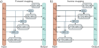

第 15 章介绍了生成对抗网络（GANs）。这些生成模型通过深度网络处理潜在变量来生成新的样本。GANs 的训练原则是让样本与真实数据难以区分。然而，它们并没有定义在数据样本上的分布，因此不容易评估新样本属于同一数据集的概率。

本章将讨论标准化流（Normalizing Flows）。这种方法通过深度网络将简单的分布转化为复杂的分布，从而学习概率模型。标准化流不仅能从该分布采样，还能计算新样本的概率。但它们需要特定的架构设计，即每个网络层都必须是可逆的，这意味着数据转换能够双向进行。

## 16.1  一维示例
标准化流（Normalizing Flows）是概率生成模型，它们通过拟合训练数据来建立概率分布（见图 14.2b）。考虑建模一维分布 Pr(x)。标准化流以一个简单、易于处理的基础分布 Pr(z) 作为起点，这个分布基于潜变量 z，并应用函数 x = f[z,φ]。这里的参数 φ 被选定，目的是使得 Pr(x) 达到期望的分布（见图 16.1）。生成新的样本 $x^∗$ 相当简单：我们从基础分布中抽取一个 $z^∗$，然后通过函数得到 $x^∗ = f[z^∗, φ]$。

`图 16.1 概率分布的转换。a) 基本分布是定义在潜变量 z 上的标准正态分布。b) 该变量经过函数 x = f[z, φ] 转换为新变量 x，进而 c) 形成新的分布。要从该模型抽样，我们需要从基本分布中抽取 z 值（图 (a) 示意了两个抽样过程，分别用绿色和棕色箭头表示）。这些值经过函数 f[z, φ] 的转换，如图 (b) 中的虚线箭头所示，生成 x 的值，在图 (c) 中以箭头形式显示。`
### 16.1.1 测量概率
衡量数据点 x 的概率更为复杂。设想应用函数 f[z, φ] 到具有已知密度 Pr(z) 的随机变量 z。当函数拉伸其输入的区域时，概率密度会减少；当函数压缩其输入的区域时，概率密度则会增加，以保证新分布下的面积总和为一。函数 f[z,φ] 拉伸或压缩输入的程度，依赖于其梯度的大小。若输入的微小变化导致输出变化较大，则函数发生拉伸；若导致输出变化较小，则发生压缩（见图 16.2）。

更具体地说，数据 x 在变换后的分布下的概率为：
$$
Pr(x|\phi) = \left| \frac{\partial f(z, \phi)}{\partial z} \right|^{-1} \cdot Pr(z), \tag{16.1}
$$

其中 $z = f^{-1}[x, \phi]$ 是产生 $x$ 的潜在变量。项 $Pr(z)$ 是这个潜在变量在基础密度下的原始概率，根据函数的导数大小进行调整。如果这个导数值大于一，则概率减小；如果小于一，则概率增加。

`图 16.2 分布的转换。基本分布（青色，底部）通过一个函数（蓝色曲线，右上）转换，形成模型分布（橙色，左侧）。将基本分布划分为等间隔（灰色垂直线），变换后相邻间隔之间的概率质量保持不变。当青色阴影区域通过梯度大于一的函数部分时，该区域被拉伸；因此，橙色阴影区域的高度降低，以保持面积不变。在其他位置（例如，z = −2），梯度小于一，模型分布相对于基本分布有所增加。`

### 16.1.2 正向与逆向映射
为了从分布中抽样，我们需要使用正向映射 $x = f[z, \phi]$，但为了计算似然度，我们必须计算逆映射 $z = f^{-1}[x, \phi]$。因此，我们必须谨慎选择 $f[z, \phi]$，以确保它是可逆的。

正向映射有时也被称作生成方向。基础密度通常设为标准正态分布。相应地，由于反向映射将关于 $x$ 的生成分布转化为关于 $z$ 的正态分布（图 16.3），它被称为规范化方向。

`图 16.3 逆映射（归一化方向）。如果函数可逆，则可以将模型分布逆转回原始基本分布。模型分布下 x 点的概率部分依赖于基本分布下等效 z 点的概率（参见方程 16.1）。`

### 16.1.3 学习

为了学习这个分布，我们需要找到参数 $\phi$，这些参数能使训练数据集 $\{x_i\}_{i=1}^I$ 的似然度最大化，或等效地，使负对数似然度最小化：

$$
\begin{align}
\hat{\phi} &= \underset{\phi}{\arg\max} \left[ \prod_{i=1}^I Pr(x_i|\phi) \right] \\
&= \underset{\phi}{\arg\min} \left[ -\sum_{i=1}^I \log[Pr(x_i|\phi)] \right] \\
&= \underset{\phi}{\arg\min} \left[ \sum_{i=1}^I \log \left| \frac{\partial f(z_i, \phi)}{\partial z_i} \right|^{-1} - \log[Pr(z_i)] \right],
\end{align} \tag{16.2}
$$

其中，我们假定数据在第一行是独立同分布的，并且第三行使用了方程 16.1 的似然定义。

## 16.2 通用案例
前一节通过转换一个简单的基础密度 $Pr(z)$ 来模拟一个一维的概率分布 $Pr(x)$ 的例子。现在我们将这种方法扩展到多元分布 $Pr(x)$ 和 $Pr(z)$，并引入深度神经网络定义的变换作为新的复杂性因素。

设想对一个随机变量 $z \in \mathbb{R}^D$ 应用函数 $x = f[z, \phi]$，这里 $z$ 有一个基础密度 $Pr(z)$，而 $f[z, \phi]$ 是一个深度神经网络。得到的变量 $x \in \mathbb{R}^D$ 将具有新的分布。可以通过以下步骤生成新的样本 $x^*$：(i) 从基础密度中抽取样本 $z^*$，(ii) 通过神经网络计算得到 $x^* = f[z^*, \phi]$。

根据方程 16.1 的类比，这个分布下的样本似然度为：

$$
Pr(x|\phi) = \left| \frac{\partial f(z, \phi)}{\partial z} \right|^{-1} \cdot Pr(z), \tag{16.3}
$$

这里 $z = f^{-1}[x, \phi]$ 是生成 $x$ 的潜变量 $z$。第一项是关于 $z$ 的 $f[z, \phi]$ 的 $D \times D$ 雅可比矩阵的行列式的逆，该矩阵在 $(i, j)$ 位置的元素是 $\frac{\partial f(z, \phi)}{\partial z_i}$。就像绝对导数衡量一维函数应用时点的面积变化，绝对行列式衡量多变量函数中点的体积变化。第二项是基础密度下潜变量的概率。

### 16.2.1 深度神经网络的正向映射
在实际应用中，正向映射 $f[z, \phi]$ 通常由一个包含多个层次 $[f_k^{\circ}, \phi_k]$ 的神经网络定义，其中每层都有其参数 $\phi_k$，这些层次按照以下方式组合：

$$
x = f[z, \phi] = f_k \left[ f_{k-1} \left[ ... \left[ f_1[z, \phi_1], \phi_2 \right], ... \phi_{k-1} \right], \phi_k \right]. \tag{16.4}
$$

反向映射（即规范化方向）则是通过按相反顺序应用每个层的逆 $[f_k^{\circ}, \phi_k]$ 来定义的：

$$
z = f^{-1}[x, \phi] = f_1^{-1} \left[ ... \left[ f_{k-1}^{-1} \left[ f_k^{-1}[x, \phi_k], \phi_{k-1} \right], ... \phi_2 \right], \phi_1 \right]. \tag{16.5}
$$

基础密度 $Pr(z)$ 通常定义为多元标准正态分布（即均值为零，协方差为单位矩阵）。因此，每个后续逆层的作用是逐步将数据密度向这个正态分布“流动”（图 16.4），从而引出了“标准化流”这一术语。

正向映射的雅可比可以表达为：

$$
\frac{\partial f[z, \phi]}{\partial z} = \frac{\partial f_k[f_{k-1}, \phi_k]}{\partial f_{k-1}} \cdot \frac{\partial f_{k-1}[f_{k-2}, \phi_{k-1}]}{\partial f_{k-2}} \cdot ... \cdot \frac{\partial f_1[z, \phi_1]}{\partial z}, \tag{16.6}
$$

其中 $f_k$ 表示函数 $f_{\ell}[\cdot, \phi_{\ell}]$ 的输出。这个雅可比的绝对行列式可以通过计算各个绝对行列式的乘积来得到：

$$
\left| \frac{\partial f[z, \phi]}{\partial z} \right| = \left| \frac{\partial f_k[f_{k-1}, \phi_k]}{\partial f_{k-1}} \right| \cdot \left| \frac{\partial f_{k-1}[f_{k-2}, \phi_{k-1}]}{\partial f_{k-2}} \right| \cdot ... \cdot \left| \frac{\partial f_1[z, \phi_1]}{\partial z} \right|. \tag{16.7}
$$

通过对方程 16.5 应用同样的规则，可以找到反向映射的雅可比的绝对行列式，它是正向映射中绝对行列式的倒数。

使用负对数似然标准，我们用数据集 $\{x_i\}$ 中的 $I$ 个训练样本来训练标准化流：

$$
\begin{align}
\hat{\phi} &= \underset{\phi}{\arg\max} \left[ \prod_{i=1}^I Pr(z_i) \cdot \left| \frac{\partial f[z_i, \phi]}{\partial z_i} \right|^{-1} \right] \\
&= \underset{\phi}{\arg\min} \left[ \sum_{i=1}^I \log \left| \frac{\partial f[z_i, \phi]}{\partial z_i} \right| - \log[Pr(z_i)] \right],
\end{align} \tag{16.8}
$$

其中 $z_i = f^{-1}[x_i, \phi]$，$Pr(z_i)$ 是在基础分布下测量的，绝对行列式 $\left| \frac{\partial f[z_i, \phi]}{\partial z_i} \right|$ 根据方程 16.7 计算得出。

`图 16.4 深度神经网络的正向和逆向映射。基本分布（左侧）通过网络层 f1[•, φ1]、f2[•, φ2] 等逐渐转换，形成模型分布。每层都是可逆的，可以认为是通过这些层的逆过程逐渐将模型分布“流动”回基本分布。`

### 16.2.2 网络层设计要求
标准化流理论本身是直观的。但要实际应用，我们的神经网络层 $f_k$ 必须具备四个特性。

1. 网络层整体上必须具有足够的表达能力，能将多元标准正态分布映射到任意密度函数。
2. 网络层需可逆，即每层都应定义从任一输入点到输出点的唯一双射关系。如果多个输入映射到同一个输出，则逆映射将不明确。
3. 每层的逆映射必须能够高效计算。鉴于我们在训练过程中需要反复评估似然性，故此过程必须有闭式解或快速算法。
4. 无论正向还是逆向映射，都必须能高效计算雅可比行列式。

这些要求确保了标准化流在实践中的可行性和效率。
## 16.3 可逆网络层

接下来，我们将介绍用于这些模型的各种可逆网络层或流类型。首先考虑的是线性流和逐元素流。这些流易于逆向计算，并且可以计算它们的雅可比行列式，但它们对于描述基础密度的任意转换表达能力不足。然而，它们是构建更具表达性的耦合流、自回归流和残差流的基础。

### 16.3.1 线性流
线性流的形式为 $f[h] = \beta + \Omega h$，其中如果矩阵 $\Omega$ 可逆，则这种线性变换也是可逆的。对于维度为 $D \times D$ 的 $\Omega$，其逆运算和行列式的计算复杂度均为 $\mathcal{O}(D^3)$，意味着随着维度 $D$ 增大，线性流的计算成本急剧上升。

如果 $\Omega$ 采用特殊的结构，如对角矩阵，逆运算和行列式的计算会更高效，仅需 $\mathcal{O}(D)$ 的复杂度，但这会限制其表达能力，因为此时 $h$ 的各元素不互相作用。而正交矩阵虽然逆运算更高效且行列式固定，但不能对各维度进行缩放。三角矩阵在实用性方面表现更好，可以通过 $\mathcal{O}(D^2)$ 复杂度的回代过程逆运算，其行列式为对角元素的乘积。

一种既通用又易于逆运算、能高效计算雅可比行列式的线性流可以通过直接基于 LU 分解来参数化，即：

$$
\Omega = PL(U + D), \tag{16.9}
$$

其中 $P$ 是预定的置换矩阵，$L$ 是下三角矩阵，$U$ 是对角线元素为零的上三角矩阵，$D$ 是补充对角线元素的对角矩阵。该形式的逆运算复杂度为 $\mathcal{O}(D^2)$，且其对数行列式为 $D$ 对角线上绝对值的对数和。

然而，线性流的表达能力有限。当应用于正态分布输入 $Norm[\mu, \Sigma]$ 的线性函数 $f[h] = \beta + \Omega h$ 会产生均值为 $\beta + \Omega \mu$、方差为 $\Omega \Sigma \Omega^\top$ 的正态分布输出，因此仅用线性流无法实现正态分布到任意密度的映射。

### 16.3.2 逐元素流
鉴于线性流表达能力的限制，我们转向非线性流，其中最基本的是逐元素流。逐元素流通过对输入的每个元素应用带参数 $\phi$ 的逐点非线性函数 $f[\cdot, \phi]$ 来工作，表达式为：

$$
f[h] = [f[h_1, \phi], f[h_2, \phi], ..., f[h_D, \phi]]^T. \tag{16.10}
$$

逐元素流的雅可比 $\frac{\partial f[h]}{\partial h}$ 是对角矩阵，这意味着 $f[h]$ 的每个输入元素只影响相应的输出元素。因此，雅可比的行列式是对角线元素乘积：

$$
\left| \frac{\partial f[h]}{\partial h} \right| = \prod_{d=1}^D \left| \frac{\partial f[h_d]}{\partial h_d} \right|. \tag{16.11}
$$

这里的 $f[\cdot, \phi]$ 函数可以是固定的可逆非线性函数，比如泄露的 ReLU，或者任何参数化的一对一可逆映射。例如，一个分段线性函数划分为 $K$ 个区域，它将区间 $[0, 1]$ 映射到自身：

$$
f[h_d, \phi] = \left( \sum_{k=1}^{b-1} \phi_k \right) + (hK - b)\phi_b, \tag{16.12}
$$

这里的参数 $\phi_1, \phi_2, ..., \phi_K$ 是正值且总和为 $K$，$b = \lfloor Kh \rfloor$ 是包含 $h$ 的区间的索引。第一项是所有先前区间的参数和，第二项反映了 $h$ 在当前区间的位置比例。这样的函数不仅易于逆运算，而且其梯度几乎在所有位置都可计算。类似地，使用样条函数等方案可以创建光滑且因为单调性保证可逆的函数。

尽管逐元素流是非线性的，但它们不混合输入维度，无法产生变量间的相关性。若与混合维度的线性流交替使用，能够实现更为复杂的变换。实际上，逐元素流常作为更复杂结构，如耦合流的组成部分。

`图 16.5 分段线性映射。可以通过将输入域 h ∈ [0, 1] 分为 K 个等大小的区域（此处 K = 5）来创建一个可逆的分段线性映射 h′ = f[h, φ]。每个区域都有一个参数为 φ_k 的斜率。a) 当这些参数均为正且和为一时，b) 该函数将是可逆的，并能将输出映射到 h′ ∈ [0, 1] 的输出域。`

### 16.3.3 耦合流
耦合流通过将输入 $h$ 分割成两个部分 $h = [h_1^T, h_2^T]^T$ 来工作，其流的定义为：
$$
\begin{align}
&h_1' = h_1 \\
&h_2' = g[h_2, \phi[h_1]].
\end{align} \tag{16.13}
$$

其中 $g[\cdot, \phi]$ 是以输入 $h_1$ 的非线性函数 $\phi[h_1]$ 为参数的逐元素流（或其他可逆层），通常通过神经网络实现 $\phi[\cdot]$。原始变量的恢复可以表示为：

$$
\begin{align}
&h_1 = h_1' \\
&h_2 = g^{-1}[h_2', \phi[h_1]].
\end{align} \tag{16.14}
$$

若 $g[\cdot, \phi]$ 为逐元素流，则其雅可比为对角矩阵，左上角是单位矩阵，右下角是逐元素变换的导数。雅可比的行列式即为这些对角线值的乘积。

耦合流的逆映射和雅可比都能高效计算，但它仅调整第二部分参数，这一调整依赖于第一部分。为了达到更广泛的变换效果，层间通过置换矩阵随机打乱 $h$ 的元素，确保每个变量最终都被其他变量转换。实际上，这些置换矩阵一旦随机初始化就固定下来，不再学习。对于结构化数据，如图像，通过在层间用 1x1 卷积进行置换，将通道分为两部分 $h_1$ 和 $h_2$。

`图 16.6 耦合流。a) 输入（橙色向量）被划分为 h_1 和 h_2。输出的第一部分 h′_1（青色向量）是 h_1 的副本。输出 h′_2 由对 h_2 应用可逆变换 g[•, φ] 产生，其中参数 φ 是 h1 的一个（不必可逆）函数。b) 在逆映射中，h_1 = h′_1。这允许我们计算 φ[h_1] 参数，然后应用逆变换 g^−1[h′_2, φ] 来恢复 h_2。`

### 16.3.4 自回归流
自回归流是对耦合流的泛化，它把每个输入维度处理为独立的“块”（图 16.7）。这种方法根据输入 $h$ 的前 $d-1$ 维度来计算输出 $h'$ 的第 $d$ 维度：

$$
h_d' = g[h_d, \phi[h_{1:d-1}]]. \tag{16.15}
$$

这里的函数 $g[\cdot, \phi]$ 称为转换器（transformer），参数 $\phi$、$\phi[h_1]$、$\phi[h_2]$ 等称为条件器（conditioners）。与耦合流相同，转换器 $g[\cdot, \phi]$ 需要是可逆的，但条件器 $\phi[\cdot]$ 可以是任意形式，通常是神经网络。如果转换器和条件器足够灵活，自回归流可以作为通用逼近器（universal approximators），表示任意的概率分布。

通过使用带有适当掩码的网络，可以并行计算输出 $h'$ 的所有元素，使得在 $d$ 位置的参数 $\phi$ 仅依赖于之前的位置。这种方法称为掩码自回归流（masked autoregressive flow）。其原理与掩码自注意力（第 12.7.2 节）非常相似，它剪除了将输入与之前输出相关联的连接。

反向变换的效率较低。考虑如下的前向映射：

$$
\begin{align}
&h'^1 = g(h_1, \phi) \\
&h'^2 = g(h_2, \phi|h_1) \\
&h'^3 = g(h_3, \phi|h_{1:2}) \\
&h'^4 = g(h_4, \phi|h_{1:3}) .
\end{align} \tag{16.16}
$$

这需要按照耦合流的类似原理，顺序反向进行：

$$
\begin{align}
&h_1 = g^{-1}(h'^1, \phi) \\
&h_2 = g^{-1}(h'^2, \phi|h_1) \\
&h_3 = g^{-1}(h'^3, \phi|h_{1:2}) \\
&h_4 = g^{-1}(h'^4, \phi|h_{1:3}) .
\end{align} \tag{16.17}
$$

因为 $h_d$ 的计算依赖于 $h_{1:d-1}$（即迄今为止的部分结果），所以这个过程不能并行执行。因此，当输入规模较大时，逆变换过程会非常耗时。

`图 16.7 自回归流。输入 h（橙色列）和输出 h′（青色列）被拆分为各自的维度（这里是四个维度）。a) 输出 h′_1 是输入 h_1 的一个可逆变换。输出 h′_2 是输入 h_2 的一个可逆函数，其参数取决于 h_1。输出 h′_3 是输入 h_3 的一个可逆函数，其参数依赖于先前的输入 h_1 和 h_2，以此类推。由于输出间无相互依赖，它们可以并行计算。b) 使用类似耦合流的方法计算自回归流的逆，但需注意计算 h_2 时必须知道 h_1，计算 h3 时必须知道 h_1 和 h_2，依此类推，因此逆过程不能并行执行。`

### 16.3.5 逆自回归流
掩码自回归流是在规范化（逆向）过程中定义的，目的是为了高效评估似然值，从而学习模型。然而，在正向过程中进行采样时，每一层的每个变量都必须逐个计算，导致速度较慢。使用自回归流进行正向（生成性）变换可以高效采样，但计算似然值（和训练）则较慢。这种流称为逆自回归流（inverse autoregressive flow）。

一个技巧是构建一个掩码自回归流来学习分布（即教师），然后利用它来训练一个可以高效采样的逆自回归流（即学生）。这种方法需要一种新的标准化流形式，它基于另一个函数学习，而不是依赖于一组样本（参见第 16.5.3 节）。

### 16.3.6 残差流：iRevNet
残差流受到残差网络设计的启发，将输入分为两部分 $h = [h^T_1, h^T_2]^T$（与耦合流类似），并按如下方式定义输出：
$$
\begin{align}
&h'^1 = h_1 + f_1[h_2, \phi_1] \\
&h'^2 = h_2 + f_2[h'^1, \phi_2],
\end{align} \tag{16.18}
$$

其中，$f_1[\cdot, \phi_1]$ 和 $f_2[\cdot, \phi_2]$ 是两个函数，它们不一定要可逆（见图 16.8）。逆过程可以通过逆转计算顺序得到：

$$
\begin{align}
&h_2 = h'^2 - f_2[h'^1, \phi_2] \\
&h_1 = h'^1 - f_1[h_2, \phi_1].
\end{align} \tag{16.19}
$$

如同耦合流，通过将输入分块，限制了可以表示的变换类型。因此，为了使变量能够以任意方式混合，需要在各层之间进行输入置换。

虽然这种公式可以较容易地进行反转，但对于一般的函数 $f_1[\cdot, \phi_1]$ 和 $f_2[\cdot, \phi_2]$，没有一种高效的方法来计算其雅可比矩阵。在训练残差网络时，有时采用这种公式以节省内存，因为网络是可逆的，在前向传播中无需存储每一层的激活状态。

`图 16.8 残差流。通过将输入拆分为 h_1 和 h_2 并建立两个残差层来计算一个可逆函数。在第一层，处理 h_2 并加上 h_1。在第二层，再次处理结果并加上 h_2。b) 在反向操作中，函数计算顺序相反，加法变为减法。`

### 16.3.7 残差流与收缩映射：iResNet
利用残差网络的另一种方法是采用 *Banach 不动点定理*（Banach fixed point theorem）或 *收缩映射定理*（contraction mapping theorem），这些定理指出每个收缩映射都有一个不动点。收缩映射 $f[\cdot]$ 具有以下特性：

$$
\text{dist} [f(z'), f(z)] < \beta \cdot \text{dist} [z', z] \quad \forall z, z', \tag{16.20}
$$

其中 $\text{dist}[\cdot,\cdot]$ 是距离函数，$0 < \beta < 1$。当这种具有特定性质的函数反复迭代（即输出被反复作为输入传回）时，结果会收敛至固定点，满足 $f[z] = z$（见图 16.9）。理解这个过程可以通过将函数同时作用于固定点和当前位置来实现；固定点保持不变，但两者之间的距离会减小，导致当前位置逐渐接近固定点。

我们可以利用这一定理来求逆形如

$$
y = z + f[z] \tag{16.21}
$$

的方程，前提是 $f[z]$ 为收缩映射。换言之，可以用它来寻找映射到给定值 $y^*$ 的 $z^*$。这个过程可以从任意点 $z_0$ 开始，通过迭代 $z_{k+1} = y^* - f[z_k]$ 来实现，并最终在 $z + f[z] = y^*$ 处收敛到固定点（见图 16.9b）。

如果我们确保 $f[h, \phi]$ 是一个收缩映射，同样的原理可以用于逆转形式为 $h' = h + f[h, \phi]$ 的残差网络层。在实践中，这意味着 Lipschitz 常数（Lipschitz constant）必须小于一。假设激活函数的斜率不超过一，这相当于要求每个权重矩阵 $\Omega$ 的最大特征值必须小于一。一种粗略的方法是通过限制它们的绝对大小来确保权重 $\Omega$ 较小。

雅可比行列式不容易直接计算，但可以通过一系列技巧近似计算其对数值。
$$
\begin{align}
\log \left[ I + \frac{\partial f(h, \phi)}{\partial h} \right] &= \text{trace} \left[ \log \left( I + \frac{\partial f(h, \phi)}{\partial h} \right) \right] \\
&= \sum_{k=1}^{\infty} (-1)^{k-1} \text{trace} \left[ \left( \frac{\partial f(h, \phi)}{\partial h} \right)^k \right],
\end{align} \tag{16.22}
$$

其中利用了 $\log|A| = \text{trace}[\log|A|]$ 的恒等式，并将其展开为幂级数。

即便是截断该级数，计算各项的迹值仍然计算量大。因此，我们采用 *Hutchinson 迹估计器*（Hutchinson's trace estimator）来进行近似。考虑均值为 0 且方差为 I 的正态随机变量 $\epsilon$，矩阵 A 的迹可以估计为：

$$
\begin{aligned}
\text{trace}[A] &= \text{trace} [\mathbb{E} [\epsilon \epsilon^T]] \\
&= \text{trace} [\mathbb{E} [A \epsilon \epsilon^T]] \\
&= \mathbb{E} [\text{trace} [A \epsilon \epsilon^T]] \\
&= \mathbb{E} [\text{trace} [\epsilon^T A \epsilon]] \\
&= \mathbb{E} [\epsilon^T A \epsilon], \\
\end{aligned} \tag{16.23}
$$

其中第一行成立因为 $\mathbb{E}[\epsilon \epsilon^T] = I$。后续各行基于期望算子的性质、迹算子的线性及迹的循环置换不变性。最后，我们通过从 $Pr(\epsilon)$ 中抽取样本 $\epsilon_i$ 来估计迹值：

$$
\text{trace}[A] = \mathbb{E} [\epsilon^T A \epsilon] \approx \frac{1}{I} \sum_{i=1}^I \epsilon_i^T A \epsilon_i. \tag{16.24}
$$

通过这种方法，我们可以近似地计算泰勒级数幂次的迹，并估算对数概率（方程 16.22）。

`图 16.9 收缩映射。若函数处处的绝对斜率小于一，则该函数的迭代会收敛到固定点 f[z] = z。a) 从 z_0 开始，我们计算 z_1 = f[z_0]，然后将 z_1 重新传入函数并迭代。最终，此过程会收敛到 f[z] = z 的点（即函数与虚线对角恒等线交汇处）。b) 通过观察固定点 y^∗ − f[z]（橙线与虚线恒等线的交点），可以用来反转形如 y = z + f[z] 的方程，找到 y^∗ = z + f[z] 的解。`

## 16.4 多尺度流
在正规化流模型中，潜变量空间 z 必须与数据空间 x 的尺寸相同，但我们知道，自然数据集往往可以由更少的底层变量描述。因此，在某个阶段，我们需要引入这些变量，但让它们穿越整个网络是效率低下的。这催生了多尺度流（图 16.10）的理念。

在生成过程中，多尺度流将潜向量分割为 $z = [z_1,z_2,...,z_N]$。第一部分 z1 经过一系列与 z1 维数相同的可逆层处理，直至某一阶段，z2 被追加并与第一部分合并。这个过程一直进行，直到网络尺寸与数据 x 相匹配。在规范化过程中，网络从 x 的完整维度开始，但当达到添加 $z_n$ 的阶段时，这一部分会根据基础分布进行评估。

`图 16.10 多尺度流。在正规化流中，潜在空间 z 的大小必须与模型密度相等。但是，它可以被分成几个部分，这些部分可以在不同的层次逐渐引入，从而加快密度估计和抽样速度。对于逆过程，黑色箭头方向反转，且每块的最后部分跳过剩余处理步骤。例如，f^{−1}_3[•, φ_3] 仅作用于前三块，而第四块直接成为 z_4 并根据基本密度进行评估。`

## 16.5 应用
现在，我们讨论正规化流的三个应用场景。首先是建模概率密度，其次是用于图像合成的 GLOW 模型，最后是使用正规化流来近似其他分布。

### 16.5.1 建模密度

本书讨论的四种生成模型中，只有正规化流能够精确计算新样本的对数似然值。生成对抗网络（GAN）不具有概率特性，变分自编码器（VAE）和扩散模型则只能提供似然的下界。图 16.11 展示了在两个简单问题中使用 i-ResNet 估计的概率分布。密度估计的一项应用是异常检测，即用正规化流模型描述干净数据集的分布。低概率的新样本会被标记为离群点。然而，需要谨慎，因为高概率的离群点也可能存在，这些点不属于典型集（参见图 8.13）。

`图 16.11 建模密度。a) 二维玩具数据样本。b) 利用 iResNet 建模得到的密度。c–d) 第二个示例。摘自 Behrmann et al. (2019)。`

### 16.5.2 图像合成
生成流模型 GLOW 是一种正规化流模型，能够生成高保真度的图像（见图 16.12），采用了本章提到的许多概念。这一模型在规范化方向上更易于理解。GLOW 以一个包含 RGB 图像的 256×256×3 张量开始，使用耦合层进行处理，其中通道被分为两部分。第二部分在每个空间位置经过不同的仿射变换，这些变换的参数由运行在另一半通道上的 2D 卷积神经网络计算。耦合层与 1×1 卷积层交替进行，后者通过 LU 分解进行参数化，从而混合各通道。

为了降低分辨率，系统会周期性地将每个 2×2 区域合并为一个位置，并将通道数量增加四倍。GLOW 作为一种多尺度流，其部分通道会周期性地被移除，并加入到潜向量 z 中。由于图像是离散的（RGB 值被量化），在输入中加入噪声以防止训练似然值无限增加，这个过程称为去量化。

为了生成更逼真的图像，GLOW 模型从提高到正次幂的基础密度中采样。这种方法倾向于选择更接近密度中心而不是边缘的样本，类似于 GAN 中的截断技巧（见图 15.10）。但是，这些样本的质量并不如 GAN 或扩散模型生成的样本。目前尚不清楚这是否由于可逆层相关的基本限制，还是因为对这一目标的研究投入较少。

图 16.13 展示了使用 GLOW 进行插值的例子。通过对两个真实图像在规范化方向进行转换，计算得到两个潜向量。这些潜向量之间的中间点通过线性插值计算得出，并通过生成方向的网络映射回图像空间，生成了一系列在两个真实图像之间逼真过渡的图像。

`图 16.12 基于 CelebA HQ 数据集（Karras et al., 2018）训练的 GLOW 模型样本。这些样本质量较好，虽然与 GANs 和扩散模型相比，GLOW 的结果稍逊一筹。摘自 Kingma & Dhariwal (2018)。`

`图 16.13 使用 GLOW 模型的插值。左右两边的图像是真实的人物照片。中间的图像是通过将真实图像映射到潜空间进行插值，然后将插值结果映射回图像空间而生成的。摘自 Kingma & Dhariwal (2018)。`

### 16.5.3 近似其他密度模型
正规化流还能学习生成样本，这些样本近似于一个易于评估却难以从中抽样的现有密度。在这种情境下，我们把正规化流 $Pr(x|\phi)$ 称为“学生”，将目标密度 $q(x)$ 称为“教师”。

为了进展，我们从“学生”模型生成样本 $x_i = f(z_i, \phi)$。因为这些样本是由我们自己生成的，我们知道它们的对应潜变量 $z_i$，可以直接计算学生模型中的似然度，而不需要进行逆运算。因此，我们可以采用掩码自回归流（masked-autoregressive flow）这样的模型，在这种模型中逆运算较慢。我们定义了一个基于反向 KL 散度的损失函数，该函数促使学生模型和教师模型的似然度一致，并用它来训练学生模型（见图 16.14）：

$$
\hat{\phi} = \underset{\phi}{\text{argmin}} \, KL \left[ \sum_{i=1}^{I} \delta [x - f(z_i, \phi)] \, || \, q(x) \right]. \tag{16.25}
$$

这种方法与通常使用正规化流构建概率模型 $Pr(x_i, \phi)$ 形成对比，后者是基于未知分布的样本 $x_i$ 采用最大似然估计，依赖于前向 KL 散度中的交叉熵项（参见第 5.7 节）：

$$
\hat{\phi} = \underset{\phi}{\text{argmin}} \, KL \left[ \left\| \frac{1}{I} \sum_{i=1}^{I} \delta (x - x_i) \, || \, Pr(x_i; \phi) \right\| \right]. \tag{16.26}
$$

正规化流可以利用这种技巧在变分自编码器（VAE）中建模后验（参见第 17 章）。

`图 16.14 近似密度模型。a) 训练数据。b) 通常，我们调整流模型的参数，以最小化训练数据与流模型之间的 KL 散度，这相当于执行最大似然拟合（参见第 5.7 节）。c) 或者，我们可以调整流参数 φ，以将流样本 xi = f[zi , φ] 与目标密度之间的 KL 散度最小化。`

## 16.6 总结
正规化流把基础分布（通常是正态分布）转变为新的密度。其优势在于能够精确计算样本的似然值并生成新样本。但它们的一个架构限制是每一层必须可逆；我们需要用正向变换生成样本，用反向变换计算似然值。

确保可以高效估计雅可比行列式对于评估似然值也很关键；为了学习密度，这个过程需要反复执行。即便雅可比行列式不能高效估计，可逆层本身依然有用，因为它们能将训练一个 K 层网络的内存需求从 O[K] 降低到 O[1]。本章回顾了可逆网络层或流动。我们讨论了线性流和元素级流，这些流简单但表达能力有限。接着，我们探讨了更复杂的流类型，如耦合流、自回归流和残差流。最后，我们展示了正规化流如何用于估计似然值、生成及插值图像和近似其他分布。

## Notes
归一化流最早由 Rezende & Mohamed (2015) 提出，其思想基础还包括 Tabak & Vanden-Eijnden (2010)、Tabak & Turner (2013) 和 Rippel & Adams (2013) 的研究。关于归一化流的综述可参见 Kobyzev 等 (2020) 和 Papamakarios 等 (2021) 的工作。Kobyzev 等 (2020) 对多种归一化流方法进行了定量比较，并认为当时 Flow++ 模型（一种引入了新型元素级变换和其他创新的耦合流模型）表现最佳。

**可逆网络层**：可逆层可以减少反向传播算法的内存需求，因为在反向传播时可以重新计算前向传播过程中的激活值，无需存储。除了本章讨论的常规网络层和残差层（Gomez 等, 2017; Jacobsen 等, 2018），图神经网络（Li 等, 2021a）、循环神经网络（MacKay 等, 2018）、掩蔽卷积（Song 等, 2019）、U-Net（Brügger 等, 2019; Etmann 等, 2020）以及 Transformer（Mangalam 等, 2022）等领域也开发了可逆层。

**径向和平面流**：归一化流的初始论文（Rezende & Mohamed, 2015）介绍了平面流（沿特定维度压缩或扩展分布）和径向流（围绕特定点压缩或扩展）。这些流的逆过程不易计算，但对于近似难以快速采样的分布或只能评估到未知缩放因子的似然，它们非常有用（图 16.14）。

**应用**：归一化流的应用范围广泛，包括图像生成（Ho 等, 2019; Kingma & Dhariwal, 2018）、噪声建模（Abdelhamed 等, 2019）、视频生成（Kumar 等, 2019b）、音频生成（Esling 等, 2019; Kim 等, 2018; Prenger 等, 2019）、图生成（Madhawa 等, 2019）、图像分类（Kim 等, 2021; Mackowiak 等, 2021）、图像隐写（Lu 等, 2021）、超分辨率（Yu 等, 2020; Wolf 等, 2021; Liang 等, 2021）、风格转换（An 等, 2021）、运动风格转换（Wen 等, 2021）、3D 形状建模（Paschalidou 等, 2021）、压缩（Zhang 等, 2021b）、sRGB 到 RAW 图像转换（Xing 等, 2021）、去噪（Liu 等, 2021b）、异常检测（Yu 等, 2021）、图像到图像转换（Ardizzone 等, 2020）、细胞显微图像合成（Yang 等, 2021）以及光传输模拟（Müller 等, 2019b）。对于处理图像数据的应用，在学习前需加入噪声，因为输入数据是量化且离散的（参见 Theis 等, 2016）。

Rezende & Mohamed (2015) 利用归一化流对 VAEs 中的后验进行建模。Abdal 等 (2021) 通过归一化流来建模 StyleGAN 潜在空间中的属性分布，并据此改变真实图像中的指定属性。Wolf 等 (2021) 则用归一化流学习噪声输入图像与干净图像之间的关系，进而生成可用于训练去噪或超分辨率模型的噪声数据。

归一化流还在物理（Kanwar 等, 2020; Köhler 等, 2020; Noé 等, 2019; Wirnsberger 等, 2020; Wong 等, 2020）、自然语言处理（Tran 等, 2019; Ziegler & Rush, 2019; Zhou 等, 2019; He 等, 2018; Jin 等, 2019）和强化学习（Schroecker 等, 2019; Haarnoja 等, 2018a; Mazoure 等, 2020; Ward 等, 2019; Touati 等, 2020）领域找到了广泛应用。

**线性流**：对角线性流能够实现类似 Batch-Norm（Dinh 等, 2016）和 ActNorm（Kingma & Dhariwal, 2018）的规范化转换。Tomczak & Welling (2016) 研究了结合三角矩阵和使用 Householder 变换参数化的正交变换。Kingma & Dhariwal (2018) 提出了第 16.5.2 节所述的 LU 参数化方法。Hoogeboom 等 (2019b) 建议使用 QR 分解，避免了预设置换矩阵的需求。卷积作为线性变换（图 10.4），在深度学习中被广泛应用，但计算其逆和行列式并不直观。Kingma & Dhariwal (2018) 使用 1×1 卷积，实质上是在每个位置独立应用的完整线性变换。Zheng 等 (2017) 提出了仅限于一维卷积的 ConvFlow。Hoogeboom 等 (2019b) 为二维卷积建模提供了更通用的解决方案，方法包括堆叠掩蔽自回归卷积或在傅立叶域操作。

**逐元素流和耦合函数**：逐元素流通过使用相同的函数独立变换每个变量来工作，每个变量有其参数。这些流也可以形成耦合流和自回归流中的耦合函数，其中参数由前面的变量决定。为保证函数的可逆性，必须保证这些函数是单调的。

加性耦合函数（Dinh 等, 2015）只向变量添加一个偏移量。仿射耦合函数则对变量进行缩放并添加偏移量，这一方法被 Dinh 等 (2015)、Dinh 等 (2016)、Kingma & Dhariwal (2018)、Kingma 等 (2016) 和 Papamakarios 等 (2017) 所采用。Ziegler & Rush (2019) 提出了非线性平方流，即用五个参数的多项式之比构成的可逆函数。连续混合 CDF（Ho 等, 2019）通过基于 K logistics 混合物的累积密度函数 (CDF) 应用单调变换，然后经过逆逻辑 sigmoid 函数处理，并进行缩放和偏移。

分段线性耦合函数（图 16.5）由 Müller 等 (2019b) 开发。此后，基于三次样条（Durkan 等, 2019a）和有理二次样条（Durkan 等, 2019b）的系统被提出。Huang 等 (2018a) 引入了神经自回归流，其函数由能产生单调函数的神经网络表示。一个必要条件是所有权重均为正，且激活函数是单调的。由于训练所有权重为正的网络较难，因此提出了无约束单调神经网络（Wehenkel & Louppe, 2019），它们建模严格正的函数，并通过数值积分获得单调函数。Jaini 等 (2019) 根据所有正单变量多项式均为多项式平方和的原理，构建了可以闭式积分的正函数。Dinh 等 (2019) 进一步探讨了分段单调耦合函数。

**耦合流**：Dinh 等 (2015) 首次引入了耦合流，其中将维度分为两半（图 16.6）。Dinh 等 (2016) 推出的 RealNVP 通过交替选取像素或通道块来分割图像输入。Das 等 (2019) 根据导数的大小选择特征进行传播。Dinh 等 (2016) 将逐步引入维度的多尺度流视为耦合流，其中参数 φ 不依赖于数据的另一半。Kruse 等 (2021) 提出了耦合流的层次化表述，递归地将每个分区一分为二。GLOW（图 16.12–16.13）由 Kingma & Dhariwal (2018) 设计，并采用耦合流，同样适用于 NICE（Dinh 等, 2015）、RealNVP（Dinh 等, 2016）、FloWaveNet（Kim 等, 2018）、WaveGlOW（Prenger 等, 2019）和 Flow++（Ho 等, 2019）。

**自回归流**：Kingma 等 (2016) 在归一化流研究中采用了自回归模型。Germain 等 (2015) 开发了一种遮蔽前面变量的通用方法，Papamakarios 等 (2017) 利用该方法在遮蔽自回归流中同时计算所有输出。Kingma 等 (2016) 推出了逆自回归流。Parallel WaveNet（Van den Oord 等, 2018）将 WaveNet（Van den Oord 等, 2016）转化为逆自回归流，以加速音频生成的采样过程（参见图 16.14c–d）。

**残差流**：残差流基于残差网络（He 等, 2016a）。RevNets（Gomez 等, 2017）和 iRevNets（Jacobsen 等, 2018）将输入分为两部分（图 16.8），每部分通过一个残差网络。这些网络虽可逆，但雅可比行列式不易计算。残差连接被视为普通微分方程的离散化，这一观点催生了不同的可逆架构（Chang 等, 2018, 2019a）。Behrmann 等 (2019) 提出，若网络的 Lipschitz 常数小于一，可通过固定点迭代反转网络，进而开发了 iResNet，可以用 Hutchinson 的迹估计器（Hutchinson, 1989）估计雅可比的对数行列式。Chen 等 (2019) 使用俄罗斯轮盘赌估计器消除方程中功率级数截断引起的偏差。

**无穷小流**：如果将残差网络视作普通微分方程（ODE）的离散化，那么直接用 ODE 表示变量变化成为下一步合逻辑的发展。Chen 等 (2018e) 探索了神经 ODE，利用标准方法进行 ODE 的前向和后向传播。此时，计算似然不再需要雅可比，因为可以通过另一个 ODE 表示，其中对数概率的变化与前向传播的导数的迹相关。Grathwohl 等 (2019) 使用 Hutchinson 估计器估计迹，并进一步简化了这一过程。Finlay 等 (2020) 在损失函数中添加了正则化项以简化训练，而 Dupont 等 (2019) 扩展了表达形式，使神经 ODE 能表示更广泛的微分同胚类。Tzen & Raginsky (2019) 和 Peluchetti & Favaro (2020) 将 ODE 替换为随机微分方程。

**通用性**：通用性指归一化流能够任意精确地模拟任何概率分布的能力。某些流（如平面流、逐元素流）不具备这种属性。当耦合函数为神经单调网络（Huang 等, 2018a）、基于单调多项式（Jaini 等, 2020）或基于样条（Kobyzev 等, 2020）时，自回归流被证明具有通用性。对于 D 维，D 个耦合流可以构成自回归流。分成两部分 h1 和 h2 的过程说明，在任一层，h2 仅依赖于先前变量（图 16.6）。因此，每层将 h1 增加一个单位，可以实现自回归流，从而达到通用性。目前尚不清楚耦合流是否能在少于 D 层的情况下实现通用性，但实践中它们（如 GLOW）表现良好，无需诱导的自回归结构。

**其他研究**：归一化流的研究热点包括离散流（Hoogeboom 等, 2019a; Tran 等, 2019）、非欧几里得流形上的归一化流（Gemici 等, 2016; Wang & Wang, 2019）及等变流（Köhler 等, 2020; Rezende 等, 2019），后者旨在创建对变换族不变的密度。

## Problems
**问题 16.1** 考虑用函数 $x = f(z) = z^2$ 变换在 $z \in [0, 1]$ 上定义的均匀基本密度。求变换后分布 $Pr(x)$ 的表达式。

**问题 16.2** 考虑将标准正态分布：

$$
Pr(z) = \frac{1}{\sqrt{2\pi}} \exp\left(-\frac{z^2}{2}\right), \tag{16.27}
$$

通过函数变换：

$$
x = f(z) = \frac{1}{1 + \exp(-z)}. \tag{16.28}
$$

求变换后的分布 $Pr(x)$ 的表达式。

**问题 16.3** 写出逆映射 $z = f^{-1}(x, \phi)$ 的雅可比矩阵及其绝对行列式的表达式，形式类似于方程 16.6 和 16.7。

**问题 16.4** 手动求解以下矩阵的逆和行列式：

$$
\Omega_1 = \begin{bmatrix}
2 & 0 & 0 \\
0 & -5 & 0 \\
0 & 0 & 1 \\
0 & 0 & 2
\end{bmatrix}, \quad
\Omega_2 = \begin{bmatrix}
1 & 0 & 0 & 0\\
2 & 4 & 0 & 0\\
1 & -1 & 2 & 0\\
4 & -2 & -2 & 1
\end{bmatrix}. \tag{16.29}
$$

**问题 16.5** 假设随机变量 $z$ 的均值为 $\mu$，协方差为 $\Sigma$，经变换 $x = Az + b$。证明 $x$ 的期望值为 $A\mu + b$，$x$ 的协方差为 $A\Sigma A^T$。

**问题 16.6** 若 $x = f(z) = Az + b$ 且 $Pr(z) = \text{Norm}_z[\mu, \Sigma]$，证明 $Pr(x) = \text{Norm}_x[A\mu + b, A\Sigma A^T]$，利用关系式：

$$
Pr(x) = Pr(z) \cdot \left| \frac{\partial f}{\partial z} \right|^{-1}. \tag{16.30}
$$

**问题 16.7** Leaky ReLU 定义为：

$$
LReLU[z] = \begin{cases}
0.1z & \text{if } z < 0, \\
z & \text{if } z \geq 0.
\end{cases} \tag{16.31}
$$

求 leaky ReLU 的逆函数表达式。对于多元变量 $z$ 的逐元素变换 $x = f[z]$，其中：

$$
f[z] = [LReLU[z_1], LReLU[z_2], ..., LReLU[z_p]]^T, \tag{16.32}
$$

求雅可比的逆绝对行列式 $\left| \frac{\partial f}{\partial z} \right|^{-1}$ 的表达式。

**问题 16.8** 考虑对输入 $h = [h_1, h_2, ..., h_p]^T$ 逐元素应用方程 16.12 中定义的分段线性函数 $f[h, \phi]$，其中 $h' \in [0, 1]$，使得 $f[h] = [f[h_1, \phi], f[h_2, \phi], ..., f[h_p, \phi]]$。求出雅可比 $\frac{\partial f}{\partial h}$ 及其行列式。

**问题 16.9** 考虑基于等间隔区间中平方根函数的锥形组合构建逐元素流：

$$
h' = f[h, \phi] = \sqrt{K h - b} \phi_b + \sum_{k} \sqrt{\phi_k}, \tag{16.33}
$$

其中 $b = [Kh]$ 是 $h$ 所属的区间，且参数 $\phi_k$ 均为正且和为一。当 $K = 5$ 且 $\phi_1 = 0.1, \phi_2 = 0.2, \phi_3 = 0.5, \phi_4 = 0.1, \phi_5 = 0.1$ 时，画出函数 $f[h, \phi]$ 和其逆函数 $f^{-1}[h', \phi]$。

**问题 16.10** 对残差流的前向映射的雅可比结构进行绘图（指出哪些元素为零），当 $f_1[\phi_1]$ 和 $f_2[\phi_2]$ 分别为 (i) 全连接神经网络，(ii) 逐元素流时。

**问题 16.11** 写出方程 16.25 中 KL 散度的表达式。为何只能估计概率 $q(x)$ 至一个缩放因子 $K$ 也没有关系？最小化这个损失函数时，网络必须是可逆的吗？解释你的推理。
