第 15 章描述了生成对抗模型（Generative Adversarial Models, GANs），这些模型可以生成逼真样本，但不为数据定义概率分布。第 16 章讨论了归一化流（Normalizing Flows），它们确立了特定的概率分布，但须对网络架构施加限制：每层都必须可逆，且其雅可比矩阵的行列式计算要简便。第 17 章介绍的变分自编码器（Variational Autoencoders, VAEs）具有坚实的概率基础，但似然性的计算不可直接求解，需要用一个下界来近似。

本章将介绍扩散模型（Diffusion Models）。与归一化流类似，扩散模型是定义了从潜在变量到观测数据之间非线性映射的概率模型，且这两者的维度是相同的。与变分自编码器相似，扩散模型使用基于某种编码器的下界来近似数据的似然，该编码器将数据映射到潜在变量。不过，在扩散模型中，这种编码器是预设的。其目标是学习一个解码器，作为该过程的逆过程，以生成样本。扩散模型训练简便，并能生成高于生成对抗网络所产样本真实度的高质量样本。在阅读本章之前，读者应熟悉变分自编码器（第 17 章）。

## 18.1 概览
扩散模型包括一个编码器（encoder）和一个解码器（decoder）。编码器取一个数据样本 x，通过一连串中间潜变量 $z_1 \ldots z_T$ 进行映射。解码器则逆向操作：从 $z_T$ 开始，逐步映射回 $z_{T-1}, \ldots, z_1$，最终重构出数据点 x。编码器和解码器的映射过程都是随机的，而非确定性的。

编码器的设计是固定的，它会逐步将输入数据与白噪声融合（参见图 18.1）。随着步骤增加，最终潜变量的条件分布 $q(z_T|x)$ 和边缘分布 $q(z_T)$ 会趋于标准正态分布。这一过程既定，解码器中包含了所有的学习参数。

解码器由一系列网络组成，这些网络负责逆向映射每对相邻潜变量 $z_t$ 和 $z_{t-1}$。损失函数促使每个网络反转对应的编码步骤，从而逐渐消除表示中的噪声，留下逼真的数据样例。为生成新的数据样例 x，我们从 $q(z_T)$ 抽样，并通过解码器进行处理。

第 18.2 节将详细探讨编码器的特性，这些特性虽不显眼，但对学习算法至关重要。第 18.3 节将讨论解码器。第 18.4 节将推导出训练算法，而第 18.5 节将对其进行改进，使之更加实用。第 18.6 节讨论实施细节，包括如何依据文本提示来指导生成过程。

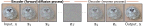

`图 18.1 扩散模型。编码器（前向或扩散过程）将输入 x 映射通过一系列潜变量 z1 ... zT。此过程是预设的，它逐步将数据与噪声混合，最终仅留下噪声。解码器（逆过程）经过学习，逐级通过潜变量传递数据，同时在每个阶段去除噪声。训练完成后，通过对噪声向量 zT 进行采样，并通过解码器处理这些向量来生成新的样本。`

## 18.2 编码器（前向过程）

扩散或前向过程（图 18.2）将数据样例 x 映射为一系列与 x 同维度的中间变量 $z_1, z_2, \ldots, z_T$，过程如下： $$ \begin{align} &z_1 = \sqrt{1 - \beta_1} \cdot x + \sqrt{\beta_1} \cdot \epsilon_1 \\ &z_t = \sqrt{1 - \beta_t} \cdot z_{t-1} + \sqrt{\beta_t} \cdot \epsilon_t \quad \forall t \in 2, \ldots, T, \end{align} \tag{18.1} $$ 其中 $\epsilon_t$ 是从标准正态分布中抽取的噪声。第一项逐渐减弱原始数据和已添加噪声的影响，而第二项引入更多噪声。噪声级别 $\beta_t \in [0, 1]$ 控制噪声融合的快慢，这一系列参数被称为_噪声调度_（noise schedule）。前向过程可以等价表达为：

$$
\begin{align}
&q(z_1|x) = \text{Norm}_{z_1} \left[ \sqrt{1 - \beta_1}, \beta_1 \right] \\
&q(z_t|z_{t-1}) = \text{Norm}_{z_t} \left[ \sqrt{1 - \beta_{t-1}}, \beta_t \right] \quad \forall t \in \{2, \ldots, T\}.
\end{align} \tag{18.2}
$$

该过程形成了一个马尔可夫链（Markov chain），其中 $z_t$ 的概率仅依赖于它前一变量 $z_{t-1}$ 的值。经过足够多的步骤 $T$，所有原始数据的痕迹将被消除，最终 $q(z_T|x)$ 和 $q(z_T)$ 都会趋向于标准正态分布。

给定输入 x，所有潜变量 $z_1, z_2, \ldots, z_T$ 的联合分布表达为：

$$
q(z_1\ldots T|x) = q(z_1|x) \prod_{t=2}^{T} q(z_t|z_{t-1}). \tag{18.3}
$$

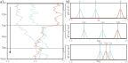

Figure 18.2
### 18.2.1 Diffusion kernel $q(z_t|x)$
为了训练解码器逆转此过程，我们对同一数据样本 $x$ 在不同时间点 $t$ 生成多个样本。然而，当 $t$ 较大时，根据方程 (18.1) 顺序生成这些样本会非常耗时。幸运的是，$q(z_t|x)$ 有一个封闭形式的解，使我们能直接从给定的初始数据点 x 抽取 $z_t$ 样本，而不需要计算中间的变量 $z_1 \ldots z_{t-1}$。这称为_扩散核_（图 18.3）。 为了得出 $q(z_t|x)$ 的表达式，让我们考虑前向过程的前两步：

$$
\begin{align}
&z_1 = \sqrt{1 - \beta_1} \cdot x + \sqrt{\beta_1} \cdot \epsilon_1 \\
&z_2 = \sqrt{1 - \beta_2} \cdot z_1 + \sqrt{\beta_2} \cdot \epsilon_2
\end{align} \tag{18.4}
$$

将第一步的结果代入第二步，我们得到：
$$
\begin{align}
z_2 &= \sqrt{1 - \beta_2} \left( \sqrt{1 - \beta_1} \cdot x + \sqrt{\beta_1} \cdot \epsilon_1 \right) + \sqrt{\beta_2} \cdot \epsilon_2 \\
&= \sqrt{1 - \beta_2} \left( \sqrt{1 - \beta_1} \cdot x + \sqrt{1 - (1 - \beta_1)} \cdot \epsilon_1 \right) + \sqrt{\beta_2} \cdot \epsilon_2 \\
&= \sqrt{(1 - \beta_2)(1 - \beta_1)} \cdot x + \sqrt{\beta_2 - (1 - \beta_2)(1 - \beta_1)} \cdot \epsilon_1 + \sqrt{\beta_2} \cdot \epsilon_2.
\end{align} \tag{18.5}
$$

最后两项分别是均值为零的正态分布中独立抽取的样本，其方差为 $1 - \beta_2 - (1 - \beta_2)(1 - \beta_1)$ 和 $\beta_2$。这些项的和的均值为零，其方差为各部分方差之和（参见问题 18.2）。因此：

$$
z_2 = \sqrt{(1 - \beta_2)(1 - \beta_1)} \cdot x + \sqrt{1 - (1 - \beta_2)(1 - \beta_1)} \cdot \epsilon, \tag{18.6}
$$

其中，$\epsilon$ 也是标准正态分布的一个样本。

若继续这一过程，将该方程代入 $z_3$ 的表达式中，以此类推，我们可以得出：

$$
z_t = \sqrt{\alpha_t} \cdot x + \sqrt{1 - \alpha_t} \cdot \epsilon, \tag{18.7}
$$

其中 $\alpha_t = \prod_{s=1}^{t} (1 - \beta_s)$。这可以等价地表示为概率形式：

$$
q(z_t|x) = \text{Norm}_{z_t} \left[ \sqrt{\alpha_t} \cdot x, 1 - \alpha_t \right]. \tag{18.8}
$$

对于任何初始数据点 x，变量 $z_t$ 遵循均值和方差已知的正态分布。因此，如果我们不考虑中间变量 $z_1 \ldots z_{t-1}$ 的演化历史，生成 $q(z_t|x)$ 的样本就变得简单。

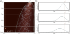

`图 18.3 扩散核。a) 点 x∗ = 2.0 使用方程 18.1 在潜变量中传播（显示为灰色的五条路径）。扩散核 q(zt|x∗) 表示从 x∗ 出发到变量 zt 的概率分布，这个分布可以以闭合形式计算，是一个均值向零递减、方差随时间 t 增加的正态分布。热图展示了每个 zt 的 q(zt|x∗)，青色线条表示均值的 ±2 标准差。b) 对 t = 20、40、80，扩散核 q(zt|x∗) 被具体显示出来。实际上，扩散核使我们能够直接采样给定 x∗ 的潜变量 zt，而无需计算 z1,...,zt−1 的中间变量。当 t 非常大时，扩散核近似为标准正态分布。`

### 18.2.2 边缘分布 $q(z_t)$
边际分布 $q(z_t)$ 表示在给定初始点 x 的分布和每个初始点可能的扩散路径的条件下，观察到 $z_t$ 值的概率（见图 18.4）。通过考虑联合分布 $q(x, z_1\ldots)$ 并对所有其他变量进行边际化，可以计算得到：

$$
\begin{align}
q(z_t) &= \int \int \ldots \int q(z_1\ldots t, x) dz_1\ldots dz_{t-1}dx \\
&= \int \int \ldots \int q(z_1\ldots t|x) Pr(x) dz_1\ldots dz_{t-1}dx,
\end{align} \tag{18.9}
$$

其中 $q(z_1\ldots t|x)$ 的定义见方程 18.3。

但是，鉴于我们已有表示扩散核 $q(z_t|x)$ 的表达式，该表达式直接“跳过”了中间变量，因此我们可以等价地表达为：

$$
q(z_t) = \int q(z_t|x) Pr(x)dx. \tag{18.10}
$$

所以，如果我们不断从数据分布 $Pr(x)$ 中取样，并在每个样本上应用扩散核 $q(z_t|x)$，就能得到边际分布 $q(z_t)$（见图 18.4）。然而，由于不知道原始数据分布 $Pr(x)$，边际分布不能用封闭形式表示。

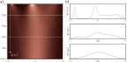

`图 18.4 边缘分布。a) 给定一个初始密度 Pr(x)（顶行），随着扩散过程通过潜变量 zt 的传播，分布逐渐模糊，趋向于标准正态分布。热图的每一层代表一个时间点的边缘分布 q(zt)。b) 顶部图展示了初始分布 Pr(x)，其他两图分别展示了 z20 和 z60 时刻的边缘分布 q(z20) 和 q(z60)。`

### 18.2.3 条件分布 $q(z_{t-1}|z_t)$
我们定义条件概率 $q(z_{t-1}|z_t)$ 来描述混合过程（见方程 18.2）。为了逆向这一过程，我们采用贝叶斯规则：

$$
q(z_{t-1}|z_t) = \frac{q(z_t|z_{t-1})q(z_{t-1})}{q(z_t)} \tag{18.11}
$$

这一计算难以实现，因为我们无法得出边际分布 $q(z_{t-1})$。

对于这个简单的一维例子，可以通过数值方法评估 $q(z_{t-1}|z_t)$（参见图 18.5）。通常情况下，这类分布形态较为复杂，但它们经常可以用正态分布进行良好的近似。这一点对我们来说极为重要，因为在构建解码器时，我们会用正态分布来近似这一逆过程。

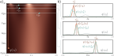

`图 18.5 条件分布 q(zt−1|zt)。a) 展示了边缘密度 q(zt) 和三个特定点 zt∗。b) 条件概率 q(zt−1|zt∗)（青色曲线）是通过贝叶斯规则计算得到的，与 q(zt∗|zt−1) 和 q(zt−1) 的乘积成比例。通常，这个分布不是正态的（顶部图），但在许多情况下正态分布是一个良好的近似（底部两个图）。第一个似然项 q(zt∗|zt−1) 关于 zt−1 是正态的（方程 18.2），其均值比 zt∗ 略远离零点（棕色曲线），第二项是边`

### 18.2.4 条件扩散分布 $q(z_{t-1}|z_t, x)$
最后，我们需要考虑与编码器相关的一个分布。之前我们提到无法确定条件分布 $q(z_{t-1}|z_t)$，因为我们不知道边际分布 $q(z_{t-1})$。但是，如果我们已知起始变量 $x$，则可以确定之前时刻的分布 $q(z_{t-1}|x)$，即扩散核（见图 18.3），这是一个正态分布。

因此，我们能够闭式计算条件扩散分布 $q(z_{t-1}|z_t, x)$（见图 18.6）。这个分布用于训练解码器，它描述了在已知当前潜在变量 $z_t$ 和训练样本 $x$ 的情况下 $z_{t-1}$ 的分布（显然，在训练时我们是知道这些的）。要计算 $q(z_{t-1}|z_t, x)$ 的表达式，我们首先应用贝叶斯规则：

$$
\begin{align}
q(z_{t-1}|z_t, x) &= \frac{q(z_t|z_{t-1}, x)q(z_{t-1}|x)}{q(z_t|x)} \\
&\propto q(z_t|z_{t-1})q(z_{t-1}|x) \\
&= \text{Norm}_{z_t} \left[ \sqrt{1 - \beta_t \cdot z_{t-1}, \beta_t} \right] \text{Norm}_{z_{t-1}} \left[ \sqrt{\alpha_{t-1} \cdot x, (1 - \alpha_{t-1})} \right] \\
&\propto \text{Norm}_{z_{t-1}} \left[ \frac{1}{\sqrt{1 - \beta_t}} z_t, \frac{\beta_t}{1 - \beta_t} \right] \text{Norm}_{z_{t-1}} \left[ \sqrt{\alpha_{t-1} \cdot x, (1 - \alpha_{t-1})} \right]
\end{align} \tag{18.12}
$$

在第一行和第二行之间，我们依据扩散过程是马尔可夫的，因此 $q(z_t|z_{t-1}, x) = q(z_t|z_{t-1})$，所有关于 $z_t$ 的信息均由 $z_{t-1}$ 表达。在第三行和第四行之间，我们应用高斯变量变换公式：

$$
\text{Norm}_{v} [Aw, B] \propto \text{Norm}_{w} \left[ (A^T B^{-1} A)^{-1} A^T B^{-1} v, (A^T B^{-1} A)^{-1} \right], \tag{18.13}
$$

将第一个分布转换为 $z_{t-1}$ 的形式。接下来，我们利用另一个高斯公式：

$$
\text{Norm}_{w}[a, A] \cdot \text{Norm}_{w}[b, B] \propto \text{Norm}_{w} \left[ (A^{-1} + B^{-1})^{-1} (A^{-1} a + B^{-1} b), (A^{-1} + B^{-1})^{-1} \right], \tag{18.14}
$$

结合 $z_{t-1}$ 中的两个正态分布，得到：

$$
q(z_{t-1}|z_t, x) = \text{Norm}_{z_{t-1}} \left[
\frac{(1 - \alpha_{t-1})}{1 - \alpha_t} \sqrt{\frac{\beta_t}{1 - \alpha_t}} z_t + \sqrt{\frac{\alpha_{t-1}\beta_t}{1 - \alpha_t}} x, 
\frac{\beta_t (1 - \alpha_{t-1})}{1 - \alpha_t} 
\right]. \tag{18.15}
$$

需要注意的是，方程 18.12、18.13 和 18.14 中的比例常数最终必须相互抵消，因为最终结果是一个已正确归一化的概率分布。

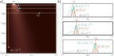

`图 18.6 条件分布 q(zt−1|zt,x)。a) 对于 x∗ = −2.1 的扩散核，其中三个点 zt∗ 被突出显示。b) 概率 q(zt−1|zt∗,x∗) 根据贝叶斯规则计算，与 q(zt∗|zt−1) 和 q(zt−1|x∗) 成正比。这是一个正态分布，可以以闭合形式计算。第一个似然项 q(zt∗|zt−1) 在 zt−1 中呈正态分布（根据方程 18.2），其均值略大于 zt∗（棕色曲线），第二项为扩散核 q(zt−1|x∗)（灰色曲线）。`

## 18.3 解码器模型（反向过程）
在学习扩散模型时，我们主要关注的是逆过程，即通过一系列概率映射从潜在变量 $z_T$ 逐步回溯到 $z_{T-1}$，再到 $z_{T-2}$，直至回到原始数据 $x$。扩散过程中真实的逆分布 $q(z_{t-1}|z_t)$ 形态复杂且多模态（见图 18.5），取决于数据分布 $Pr(x)$。我们用正态分布来近似这些复杂分布：

$$
\begin{align}
&Pr(z_T) = \text{Norm}_{z_T}[0, I] \\
&Pr(z_{t-1}|z_t, \phi_t) = \text{Norm}_{z_{t-1}}[f_t[z_t, \phi_t], \sigma_t^2] \\
&Pr(x|z_1, \phi_1) = \text{Norm}_{x}[f_1[z_1, \phi_1], \sigma_1^2],
\end{align} \tag{18.16}
$$

其中 $f_t[z_t, \phi_t]$ 代表一个神经网络，用于计算从 $z_t$ 映射到 $z_{t-1}$ 的正态分布的均值。这里的 $\{\sigma_t^2\}$ 是预先确定的。如果扩散过程的超参数 $\beta_t$ 接近于零（且时间步长 $T$ 足够大），这种正态近似是可行的。

通过祖先抽样方法从 $Pr(x)$ 生成新样本。首先从 $Pr(z_T)$ 抽取 $z_T$，然后从 $Pr(z_{T-1}|z_T, \phi_T)$ 中抽取 $z_{T-1}$，接着从 $Pr(z_{T-2}|z_{T-1}, \phi_{T-1})$ 中抽取 $z_{T-2}$，如此继续，直到最终从 $Pr(x|z_1, \phi_1)$ 生成 $x$。

## 18.4 训练
观测变量 $x$ 和潜在变量 $\{z_t\}$ 的联合分布定义如下：

$$
Pr(x, z_1...T|\phi_1...T) = Pr(x|z_1, \phi_1) \prod_{t=2}^{T} Pr(z_{t-1}|z_t, \phi_t) \cdot Pr(z_T) \tag{18.17}
$$

通过对潜在变量边际化处理，我们得到观测数据的似然函数 $Pr(x|\phi_1...T)$：

$$
Pr(x|\phi_1...T) = \int Pr(x, z_1...T|\phi_1...T)dz_1...T. \tag{18.18}
$$

为了训练模型，我们需要最大化训练数据集 $\{x_i\}$ 相对于参数 $\phi$ 的对数似然函数：

$$
\hat{\phi}_{1...T} = \arg\max_{\phi_1...T} \left[ \sum_{i=1}^{I} \log Pr(x_i|\phi_1...T) \right]. \tag{18.19}
$$

因为方程 18.18 中的边际化过程难以直接处理，所以我们不能直接进行最大化。因此，我们采用詹森不等式 (Jensen's inequality) 来定义似然的下界，并以此对参数 $\phi_{1...T}$ 进行优化，这一做法与我们在变分自编码器 (VAE) 的处理方式完全一致（参见章节 17.3.1）。

### 18.4.1 证据下界（ELBO）
为了推导下界，我们在对数似然函数中引入编码器分布 $q(z_1...T|x)$，并应用詹森不等式（参见章节 17.3.2）：

$$
\begin{align}
\log \left[ Pr(x|\phi_1...T) \right] &= \log \left[ \int Pr(x, z_1...T|\phi_1...T)dz_1...T \right] \\
&= \log \left[ \int \frac{Pr(x, z_1...T|\phi_1...T)}{q(z_1...T|x)} q(z_1...T|x) dz_1...T \right] \\
&\geq \int q(z_1...T|x) \log \left[ \frac{Pr(x, z_1...T|\phi_1...T)}{q(z_1...T|x)} \right] dz_1...T.
\end{align} \tag{18.20}
$$

从而得到证据下界（ELBO）：

$$
\text{ELBO}[\phi_1...T] = \int q(z_1...T|x) \log \left[ \frac{Pr(x, z_1...T|\phi_1...T)}{q(z_1...T|x)} \right] dz_1...T. \tag{18.21}
$$

在变分自编码器（VAE）中，编码器 $q(z|x)$ 逼近潜在变量的后验分布，以使得边界尽可能紧密，解码器则努力最大化这一边界（见图 17.10）。在扩散模型中，所有工作均由解码器承担，因为编码器没有参数。解码器通过改变其参数使静态编码器近似后验分布 $Pr(z_1...T|x, \phi_1...T)$，并围绕这一边界优化其参数，以此使边界更加紧密（参见图 17.6）。

### 18.4.2 简化 ELBO
我们将 ELBO 中的对数项转化为将要优化的最终形式。首先将等式 18.17 和 18.3 定义的分子和分母代入：

$$
\begin{align}
\log \left[ \frac{Pr(x, z_1...T|\phi_1...T)}{q(z_1...T|x)} \right] &= \log \left[ \frac{Pr(x|z_1, \phi_1) \prod_{t=2}^{T} Pr(z_{t-1}|z_t, \phi_t) \cdot Pr(z_T)}{q(z_1|x) \prod_{t=2}^{T} q(z_t|z_{t-1})} \right] \\
&= \log \left[ \frac{Pr(x|z_1, \phi_1)}{q(z_1|x)} \right] + \log \left[ \prod_{t=2}^{T} \frac{Pr(z_{t-1}|z_t, \phi_t)}{q(z_t|z_{t-1})} \right] + \log [ Pr(z_T) ].
\end{align} \tag{18.22}
$$

然后我们展开第二项的分母：

$$
q(z_t|z_{t-1}) = q(z_t|z_{t-1}, x)q(z_t|x) / q(z_{t-1}|x), \tag{18.23}
$$

其中第一个等式成立是因为关于变量 $z_t$ 的所有信息都包含在 $z_{t-1}$ 中，所以额外的条件数据 $x$ 是无关的。第二个等式是贝叶斯规则的直接应用。

代入这个结果得到：
$$
\begin{align}
\log \left[ \frac{Pr(x, z_1...T|\phi_1...T)}{q(z_1...T|x)} \right] &= \log \left[ \frac{Pr(x|z_1, \phi_1)}{q(z_1|x)} \right] + \log \left[ \frac{\prod_{t=2}^{T} Pr(z_{t-1}|z_t, \phi_t) \cdot q(z_{t-1}|x)}{\prod_{t=2}^{T} q(z_t|z_{t-1}, x) \cdot q(z_t|x)} \right] + \log \left[ \frac{Pr(z_T)}{q(z_T|x)} \right] \\
&= \log \left[ \frac{Pr(x|z_1, \phi_1)}{q(z_1|x)} \right] + \log \left[ \prod_{t=2}^{T} \frac{Pr(z_{t-1}|z_t, \phi_t)}{q(z_t|z_{t-1}, x)} \right] + \log \left[ \frac{Pr(z_T)}{q(z_T|x)} \right] \\
&\approx \log \left[ Pr(x|z_1, \phi_1) \right] + \sum_{t=2}^{T} \log \left[ \frac{Pr(z_{t-1}|z_t, \phi_t)}{q(z_t|z_{t-1}, x)} \right],
\end{align} \tag{18.24}
$$

其中在第二行和第三行之间的乘积比中的项 $q(z_{t-1}|x)/q(z_t|x)$ 除了 $q(z_1|x)$ 和 $q(z_T|x)$ 之外都相互抵消了。第三行中的最后一项大约是 $\log[1] = 0$，因为前向过程的结果 $q(z_T|x)$ 是一个标准正态分布，与先验 $Pr(z_T)$ 相等。

因此，简化的 ELBO 是：

$$
\begin{align}
\text{ELBO}[\phi_{1...T}] &= \int q(z_{1...T|x}) \log \frac{Pr(x, z_{1...T}|\phi_{1...T})}{q(z_{1...T|x})} dz_{1...T} \\
&\approx \int q(z_{1...T|x}) \left( \log [Pr(x|z_1, \phi_1)] + \sum_{t=2}^T \log \frac{Pr(z_{t-1}|z_t, \phi_t)}{q(z_{t-1}|z_t, x)} \right) dz_{1...T} \\
&= E_{q(z_{1|x})} \left[ \log [Pr(x|z_1, \phi_1)] \right] - \sum_{t=2}^T E_{q(z_{t|x})} \left[ D_{KL} \left[ q(z_{t-1}|z_t, x)||Pr(z_{t-1}|z_t, \phi_t) \right] \right],
\end{align}
$$

其中我们在第二行和第三行之间对 $q(z_{1...T|x})$ 中的不相关变量进行了边际化，并使用了 KL 散度的定义（见问题 18.7）。

### 18.4.3 分析 ELBO
ELBO 中的第一个概率项在等式 18.16 中被定义为：

$$
Pr(x|z_1, \phi_1) = \text{Norm}_x \left[ f_1[z_1, \phi_1], \sigma^2_{1} \right], \tag{18.26}
$$

这相当于 VAE 中的重构项。如果模型预测与观测数据匹配，ELBO 将会增大。与 VAE 相同，我们将使用蒙特卡洛估计来近似这个数量对数的期望值（见等式 17.22-17.23），其中我们用从 $q(z_1|x)$ 抽取的样本来估计期望值。

ELBO 中的 KL 散度项衡量了 $Pr(z_{t-1}|z_t, \phi_t)$ 与 $q(z_{t-1}|z_t, x)$ 之间的距离，它们分别在等式 18.16 和 18.15 中定义：

$$
\begin{align}
&Pr(z_{t-1}|z_t, \phi_t) = \text{Norm}_{z_{t-1}} \left[ f_t[z_t, \phi_t], \sigma^2_t \right] \\
&q(z_{t-1}|z_t, x) = \text{Norm}_{z_{t-1}} \left[ \frac{(1 - \alpha_{t-1})}{1 - \alpha_t} - \frac{\sqrt{\alpha_{t-1}\beta_t}}{1 - \alpha_t} z_t + \frac{\sqrt{\alpha_{t-1}\beta_t}}{1 - \alpha_t} x, \beta_t(1 - \alpha_{t-1}) \right].
\end{align} \tag{18.27}
$$

两个正态分布之间的 KL 散度有一个封闭形式的表达式。此外，这个表达式中的许多项不依赖于 $\phi$（见问题 18.8），表达式简化为均值之间的平方差加上一个常数 C：

$$
D_{KL} \left[ q(z_{t-1}|z_t, x)||Pr(z_{t-1}|z_t, \phi_t) \right] = \frac{1}{2\sigma^2_t} \left| \left| \frac{(1 - \alpha_{t-1})}{1 - \alpha_t} - \sqrt{\frac{\beta_t}{1 - \alpha_t}} z_t + \sqrt{\frac{\alpha_{t-1}\beta_t}{1 - \alpha_t}} x - f_t[z_t, \phi] \right| \right|^2 + C. \tag{18.28}
$$

### 18.4.4 扩散损失函数
为了拟合模型，我们需要最大化 ELBO，并将其通过参数 $\phi_{1...T}$ 来实现。我们将这个过程转化为最小化问题，方法是乘以负一，并用样本来近似期望值，以此来定义损失函数：

$$
\begin{align}
L(\phi_{1...T}) &= \sum_{i=1}^I \left( -\log \text{Norm}_{x_i} [f_1[z_{i1}, \phi_1], \sigma^2_{1}] \right) \\ 
+ &\sum_{t=2}^T \frac{1}{2\sigma^2_t} \left| \left| \frac{1 - \alpha_{t-1}}{1 - \alpha_t} - \sqrt{\frac{\alpha_{t-1}\beta_t}{1 - \alpha_t}} z_{it} + \sqrt{\frac{\alpha_{t-1}\beta_t}{1 - \alpha_t}} x_i - f_t[z_{it}, \phi_t] \right| \right|^2),
\end{align} \tag{18.29}
$$

其中 $x_i$ 代表第 $i$ 个数据点，$z_{it}$ 是在第 $t$ 步扩散过程中的关联潜变量。

### 18.4.5 训练过程
这个损失函数被用于在各个扩散时间步训练网络，其目的是最小化前一时间步隐藏变量估计值 $f_t[z_t, \phi_t]$ 与基于去噪数据 $x$ 的最可能值之间的差距。

图 18.7 和图 18.8 显示了对简单一维示例的逆过程拟合。这个模型的训练过程包括：(i) 从原始分布中获取大量样本 $x$，(ii) 利用扩散核在各个时间点 $t$ 为潜变量 $z_t$ 预测多个相应值，然后 (iii) 训练模型 $f_t[z_t, \phi_t]$ 以最小化方程 18.29 中定义的损失函数。这些模型虽然是非参数的（即一维输入到一维输出的查找表），但更常见的是使用深度神经网络。

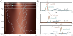

`图 18.7 拟合模型。a) 通过首先从标准正态分布 P r(zT ) 采样（底部行），然后根据 Pr(zT−1|zT) = NormzT−1[fT[zT,φT],σT^2I] 逐步采样 zT−1 等，可以生成个体样本，直至获得 x（展示了五条路径）。估计的边缘密度（热图）是这些样本的集合，与图 18.4 中的真实边缘密度相似。b) 估计分布 Pr(zt−1|zt)（棕色曲线）是扩散模型的真实后验 q(zt−1|zt)（图 18.5 中的青色曲线）的合理近似。估计的和真实的边缘分布 Pr(zt) 和 q(zt)（分别是深蓝色和灰色曲线）也相似。`

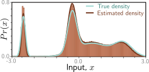

`图 18.8 拟合模型结果。青色和棕色曲线分别代表原始和估计密度，并分别对应于图 18.4 和 18.7 顶部的行。垂直条形代表模型生成的分箱样本，这些样本是通过从 P r(zT ) 采样并通过图 18.7 所示的五条路径向后传播 zT−1、zT−2 等变量得到的。`

## 18.5 损失函数的重新参数化
虽然方程 18.29 中的损失函数是可行的，但研究发现，对扩散模型采用不同的参数化方式能够获得更好的效果；损失函数经修改，目标是使模型预测出与原始数据混合生成当前变量的噪声。第 18.5.1 节讨论了如何重新参数化目标（方程 18.29 第二行的前两项），第 18.5.2 节讨论了如何重新参数化网络（方程 18.29 第二行的最后一项）。

### 18.5.1 目标的重参数化
原始的扩散更新由下式给出：

$$
z_t = \sqrt{\alpha_t} \cdot x + \sqrt{1 - \alpha_t} \cdot \epsilon. \tag{18.30}
$$

因此，在方程 18.28 中的数据项 $x$ 可以表示为扩散图像减去其上添加的噪声：

$$
x = \frac{1}{\sqrt{\alpha_t}} \cdot z_t - \frac{\sqrt{1 - \alpha_t}}{\sqrt{\alpha_t}} \cdot \epsilon. \tag{18.31}
$$

将这个表示代入方程 18.29 中的目标项，我们得到：
$$
\begin{align}
\frac{(1 - \alpha_{t-1})}{1 - \alpha_t} \sqrt{1 - \beta_t}z_t &+ \frac{\sqrt{\alpha_{t-1}}\beta_t}{1 - \alpha_t}x  \\
&= \frac{(1 - \alpha_{t-1})}{1 - \alpha_t} \sqrt{1 - \beta_t} z_t + \frac{\sqrt{\alpha_{t-1}}\beta_t}{1 - \alpha_t} \left( \frac{1}{\sqrt{\alpha_t}} z_t - \frac{\sqrt{1 - \alpha_t}}{\sqrt{\alpha_t}} \epsilon \right) \\
&= \frac{(1 - \alpha_{t-1})}{1 - \alpha_t} \sqrt{1 - \beta_t} z_t + \frac{\beta_t}{1 - \alpha_t} \left( \frac{1}{\sqrt{1 - \beta_t}} z_t - \frac{\sqrt{1 - \alpha_t}}{\sqrt{1 - \beta_t}} \epsilon \right),
\end{align} \tag{18.32}
$$

这里我们利用了从第二行到第三行 $\sqrt{\alpha_t} / \sqrt{\alpha_{t-1}} = \sqrt{1 - \beta_t}$ 的关系。进一步简化，可以得到：
$$
\begin{align}
\frac{(1 - \alpha_{t-1})}{1 - \alpha_t} \sqrt{1 - \beta_t} z_t &+ \frac{\sqrt{\alpha_{t-1}\beta_t}}{1 - \alpha_t} x  \\
&= \left( \frac{(1 - \alpha_{t-1})\sqrt{1 - \beta_t}}{1 - \alpha_t} + \frac{\beta_t}{(1 - \alpha_t)\sqrt{1 - \beta_t}} \right) z_t - \frac{\beta_t}{\sqrt{1 - \alpha_t}\sqrt{1 - \beta_t}} \epsilon \\
&= \left( \frac{(1 - \alpha_{t-1})(1 - \beta_t) + \beta_t}{(1 - \alpha_t)\sqrt{1 - \beta_t}} \right) z_t - \frac{\beta_t}{\sqrt{1 - \alpha_t}\sqrt{1 - \beta_t}} \epsilon \\
&= \frac{1 - \alpha_{t-1} - \beta_t + \beta_t}{(1 - \alpha_t)\sqrt{1 - \beta_t}} z_t - \frac{\beta_t}{\sqrt{1 - \alpha_t}\sqrt{1 - \beta_t}} \epsilon \\
&= \frac{1 - \alpha_{t-1}}{(1 - \alpha_t)\sqrt{1 - \beta_t}} z_t - \frac{\beta_t}{\sqrt{1 - \alpha_t}\sqrt{1 - \beta_t}} \epsilon \\
&= \frac{1}{\sqrt{1 - \beta_t}} z_t - \frac{\beta_t}{\sqrt{1 - \alpha_t}\sqrt{1 - \beta_t}} \epsilon,
\end{align} \tag{18.33}
$$

这个过程包括了在第二行和第三行间对第一项的分子和分母乘以 $\sqrt{1 - \beta_t}$，展开这些项，并在第三行和第四行间简化第一项的分子。

最后，将这个结果代回损失函数（方程 18.29），我们得到：

$$
L(\phi_{1...T}) = \sum_{i=1}^I -\log \text{Norm}_{x_i} [f_1[z_{i1}, \phi_1], \sigma^2_{1}] + \sum_{t=2}^T \frac{1}{2\sigma^2_t} \left| \left| \left( \frac{1}{\sqrt{1 - \beta_t}}z_{it} - \frac{\beta_t}{\sqrt{1 - \alpha_t}\sqrt{1 - \beta_t}}\epsilon_{it} \right) - f_t[z_{it}, \phi_t] \right| \right|^2, \tag{18.34}
$$

### 18.5.2 网络的重参数化
现在我们用新模型 $\hat{\epsilon} = g_t[z_t, \phi_t]$ 替换原有的模型中的 $\hat{z}_{t-1} = f_t[z_t, \phi_t]$ 部分，这个新模型用于预测与 $x$ 混合生成 $z_t$ 的噪声 $\epsilon$：

$$
f_t[z_t, \phi_t] = \frac{1}{\sqrt{1 - \beta_t}}z_t - \frac{\beta_t}{\sqrt{1 - \alpha_t}\sqrt{1 - \beta_t}}g_t[z_t, \phi_t].
\quad \tag{18.35}
$$
将这个新模型代入方程 18.34，我们得到以下准则：
$$
L(\phi_1...T) = \sum_{i=1}^{I} -\log \left[  \left( \text{Norm}_{x_i} [f_1(z_{i1}, \phi_1), \sigma_1^2 I] \right) \right] + \sum_{t=2}^{T} \frac{\beta_t^2}{(1 - \alpha_t)(1 - \beta_t)2\sigma_t^2} \left\| g_t[z_{it}, \phi_t] - \epsilon_{it} \right\|^2 . \tag{18.36}
$$

对数正态分布的表达可以被转换为一个最小二乘损失加上常数 $C_i$（参见 5.3.1 节）：

$$
L(\phi_1...T) = \sum_{i=1}^{I} \frac{1}{2\sigma_1^2} \left\| x_i - f_1(z_{i1}, \phi_1) \right\|^2 + \sum_{t=2}^{T} \frac{\beta_t^2}{(1 - \alpha_t)(1 - \beta_t)2\sigma_t^2} \left\| g_t[z_{it}, \phi_t] - \epsilon_{it} \right\|^2 + C_i.
$$
将方程 18.31 和 18.35 中的 $x$ 和 $f_1[z_1, \phi_1]$ 的定义代入后，第一项可以简化为：

$$
\frac{1}{2\sigma_1^2} \|x_i - f_1[z_{i1}, \phi_1]\|^2 = \frac{1}{2\sigma_1^2} \left\| \frac{\beta_1}{\sqrt{1 - \alpha_1}\sqrt{1 - \beta_1}} g_1[z_{i1}, \phi_1] - \frac{\beta_1}{\sqrt{1 - \alpha_1}\sqrt{1 - \beta_1}} \epsilon_{i1} \right\|^2. \tag{18.37}
$$

把这个结果加回最终的损失函数，我们得到：

$$
L(\phi_1...T) = \sum_{i=1}^{I} \sum_{t=1}^{T} \frac{\beta_t^2}{(1 - \alpha_t)(1 - \beta_t)2\sigma_t^2} \| g_t[z_{it}, \phi_t] - \epsilon_{it} \|^2, \tag{18.38}
$$

这里我们忽略了加性常数 $C_i$。

在实际应用中，通常会忽略不同时间步骤可能不同的缩放因子，从而得到一个更简单的公式：

$$
\begin{align}
L(\phi_1...T) &= \sum_{i=1}^{I} \sum_{t=1}^{T} \left\| g_t[z_{it}, \phi_t] - \epsilon_{it} \right\|^2 \\
&= \sum_{i=1}^{I} \sum_{t=1}^{T} \left\| g_t \left[ \sqrt{\alpha_t} \cdot x_i + \sqrt{1 - \alpha_t} \cdot \epsilon_{it}, \phi_t \right] - \epsilon_{it} \right\|^2,
\end{align} \tag{18.39}
$$
其中我们在第二行使用扩散核（方程 18.30）重写了 $z_t$。

## 18.6 实现
这导致我们为模型训练（算法 18.1）和采样（算法 18.2）分别得出了直观的算法。训练算法的优点在于：(i) 实现简单，(ii) 能够自然地扩充数据集；我们可以在每个时间步反复利用每个原始数据点 $x_i$，每次配合不同的噪声实例 $\epsilon$ 使用。而采样算法的不足之处在于，它需要顺序处理多个神经网络 $g_t[z_t,\phi_t]$，因此比较耗时。

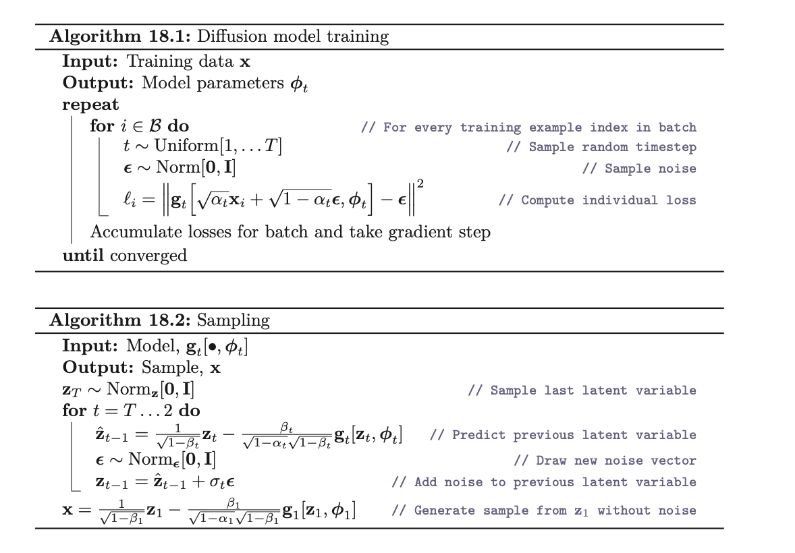

### 18.6.1 应用于图像
扩散模型在图像数据的建模方面取得了巨大成功。这里，我们需构建的模型能够处理带噪声的图像，并预测每个步骤中添加的噪声。在进行这种图像到图像的映射时，U-Net（图 11.10）是一个理想的选择。然而，可能存在大量的扩散步骤，训练和存储众多的 U-Net 十分低效。一个解决办法是训练一个能够同时接受表示时间步骤的预定向量作为输入的单一 U-Net（图 18.9）。实际上，这个向量会被调整大小，以便在 U-Net 的每个阶段与通道数匹配，并用来在每个空间位置调整和/或缩放表示。

由于超参数 $\beta_t$ 接近零时，条件概率 $q(z_{t-1}|z_t)$ 趋近于正态分布，与解码器分布 $Pr(z_{t-1}|z_t, \phi_t)$ 的形式相匹配，因此需要很多时间步骤。但这会导致采样过程缓慢。我们可能需要让 U-Net 模型经历高达 1000 个步骤，才能生成高质量的图像。

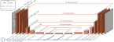

`图 18.9 在图像扩散模型中使用的 U-Net。网络目标是预测加入到图像中的噪声。它包括一个编码器，用于降低图像尺寸并增加通道数，以及一个解码器，用于增加图像尺寸并减少通道数。编码器和解码器中的对应层通过连接结合在一起。这些连接由残差块构成，并且包括周期性的全局自注意力机制，使得每个空间位置能与其他位置相互作用。通过将正弦时间嵌入通过浅层神经网络处理并将其结果添加到 U-Net 的每个阶段的每个空间位置的通道中，这种单一网络被用于处理所有时间步。`

### 18.6.2 提高生成速度
损失函数（方程 18.39）兼容的扩散核形式为 $q(z_t|x) = \text{Norm}[ \sqrt{\alpha_t}x, \sqrt{1 - \alpha_t} I ]$。这种损失函数对任何前向过程都有效。

在此关系基础上，有一系列相容的过程。这些过程虽然优化标准相同，但前向过程的规则和逆过程中如何利用估计噪声 \( g[z_t, \phi_t] \) 预测 $z_{t-1}$ 的规则各不相同（见图 18.10）。

这一系列中包括*去噪扩散隐式模型*，在从 x 到 $z_1$ 的第一步后不再随机，以及*加速采样模型*，后者的前向过程仅在时间步骤的子序列中定义。这使得逆过程可以跳过某些时间步骤，从而显著提高采样效率；当前向过程非随机时，仅需 50 个时间步骤就能产生优质样本。这比以往快了不少，但与大多数其他生成模型相比，速度仍较慢。

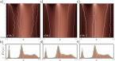

`图 18.10 与同一模型兼容的不同扩散过程。a) 重新参数化模型的五个采样轨迹叠加在真实边缘分布上。顶部行表示 Pr(x)，其后的行表示 q(xt)。b) 从重新参数化模型生成的样本的直方图与真实密度曲线 Pr(x) 并列显示。这个训练过的模型与包括去噪扩散隐式（DDIM）模型在内的扩散模型系列兼容，DDIM 是一种确定性模型，在每一步不添加噪声。c) DDIM 模型的五条轨迹。d) DDIM 模型的样本直方图。这个模型还与那些跳过某些推理步骤以提高采样速度的加速扩散模型兼容。e) 加速模型的五条轨迹。f) 加速模型的样本直方图。`

### 18.6.3 条件生成
如果数据有关联标签 c，我们可以利用这些标签来控制生成过程。在生成对抗网络（GANs）中，这有时能够改进生成的结果，我们有理由相信，在扩散模型中也能达到类似的效果；如果我们对图像包含的内容有所了解，去除噪声就更加容易。在扩散模型中进行条件合成的一种方法是*分类器引导*。这种方法调整了从 $z_t$ 到 $z_{t-1}$ 的去噪步骤，以包含类别信息 c。实际操作中，这意味着在算法 18.2 的最终更新步骤中增加了一个额外的项：

$$
z_{t-1} = \hat{z}_{t-1} + \alpha \frac{\sigma^2_t}{\sigma^2_{\epsilon}} \nabla_{z_t} \log Pr(c|z_t) + \sigma_{\epsilon} \cdot \epsilon. \tag{18.40}
$$

这个新项取决于基于潜变量 $z_t$ 的分类器 $Pr(c|z_t)$ 的梯度。它将 U-Net 的下采样部分的特征映射到类别 c。如同 U-Net，这通常贯穿所有时间步，并将时间作为输入。现在，从 $z_t$ 更新到 $z_{t-1}$ 更有可能得到类别 c。

*无分类器引导* 不需要学习一个独立的分类器 $Pr(c|z_t)$，而是将类别信息直接整合到主模型 $g_{\theta}(z_t, c, \phi_c)$ 中。这通常通过类似于时间步骤添加方式，在 U-Net 的各层中加入基于 c 的嵌入来实现（参见图 18.9）。这个模型通过在训练期间随机省略类别信息，对条件和非条件目标进行联合训练。因此，它可以在测试时生成无条件或有条件的数据示例，或者两者的任意加权组合。这带来了意外的优势；如果过度强调条件信息，模型会倾向于生成质量非常高但略显典型的示例。这有点类似于生成对抗网络中使用的截断技术（参见图 15.10）。

### 18.6.4 提高生成质量
就像其他生成模型一样，通过对基础模型实施各种技巧和扩展，可以得到最高质量的结果。首先，估计反向过程的方差 $\sigma_t^2$ 以及均值（即图 18.7 中棕色正态分布的宽度）被认为是有益的，这在减少采样步骤时尤其能提高生成质量。其次，可以调整正向过程的噪声计划，使得每步的 $\beta_t$ 发生变化，这同样有助于优化结果。

第三，为生成高分辨率的图像，采用了扩散模型级联。首个模型生成低分辨率图像（可能受类别信息的引导）。随后的模型逐步生成更高分辨率的图像，通过调整低分辨率图像的大小并将其及相关类别信息融入到 U-Net 的各层实现条件化处理（见图 18.11）。

`图 18.11 基于文本提示的级联条件生成。a) 使用一系列 U-Nets 的扩散模型生成 64×64 分辨率的图像。b) 生成过程基于由语言模型计算得到的句子嵌入。c) 接着生成更高分辨率的 256×256 图像，这一过程依赖于较小图像和文本编码。d) 通过重复这个过程生成 1024×1024 分辨率的图像。e) 最终图像序列。据 Saharia 等人（2022b）改编。`

综合这些技术可以生成极高质量的图像。图 18.12 展示了基于 ImageNet 类别条件化的模型生成的图像示例，该模型能生成极其多样化的类别，这一点尤其令人印象深刻。图 18.13 则展示了一个训练以根据文本标题条件化的模型生成的图像，这些标题通过类似 BERT 的语言模型编码，并以类似时间步的方式嵌入模型中（参见图 18.9 和 18.11）。结果是非常逼真的图像，与标题高度匹配。由于扩散模型的随机性，它能够根据同一标题生成多个不同的图像。

`图 18.12 使用分类器引导的条件生成。这里展示了根据不同 ImageNet 类别条件化的图像样本。同一个模型能够生成各种类别的高质量图像样本。改编自 Dhariwal & Nichol（2021）。`

## 18.7 总结
扩散模型将数据示例通过一系列潜变量映射，这个过程涉及将当前的数据表示与随机噪声反复混合。在进行足够多的步骤后，数据的表示将变得无法与白噪声区分。因为这些步骤较小，每一步的逆去噪过程都可以近似为正态分布，并且可以通过深度学习模型来预测。损失函数建立在证据下界（ELBO）之上，并最终简化为最小二乘法公式。

在图像生成方面，每一个去噪步骤都采用 U-Net 来实施，因此相较于其他生成模型，其采样速度较慢。为了提升生成速度，可以把扩散模型转换为确定性公式，这样少量的采样步骤就能够取得良好效果。已经提出了几种方法，用以根据类别信息、图像和文本信息来调节生成过程。结合这些方法可以得到令人印象深刻的文本到图像的合成效果。

## Notes
去噪扩散模型最早由 Sohl-Dickstein 等人于 2015 年提出，随后 Song & Ermon 在 2019 年基于得分匹配进行了早期相关研究。Ho 等人于 2020 年生成的图像样本能够与 GANs 相竞争，引发了对这一领域的广泛兴趣。本章的主要内容，包括最初的公式和参数重新设定，源自他们的工作。Dhariwal & Nichol 在 2021 年进一步提升了结果的质量，并首次证明扩散模型在 Fréchet Inception Distance 方面量化优于 GAN 模型。截至目前，Karras 等人在 2022 年实现了条件图像合成的最新进展。关于去噪扩散模型的综述可见 Croitoru 等人（2022）、Cao 等人（2022）、Luo（2022）和 Yang 等人（2022）的研究。

**图像应用**：扩散模型在图像领域的应用广泛，包括文本到图像生成、图像到图像的转换任务（如上色、修复、去裁剪和恢复）、超分辨率、图像编辑、去除对抗性扰动、语义分割和医学成像。在这些应用中，扩散模型有时用作生成过程的先验知识。

**不同数据类型**：扩散模型还应用于视频数据的生成、帧预测和插值，以及 3D 形状生成。最近，还开发了一种新技术，通过 2D 文本到图像扩散模型生成 3D 模型。此外，扩散模型也被应用于音频数据的处理。

**去噪的替代方法**：虽然本章的扩散模型通过与数据混合噪声逐步去噪，但还有其他非随机退化方法，如遮蔽、变形、模糊和像素化，可以逐步模糊图像，而不必使用噪声。

**与其他生成模型的比较**：与其他生成模型相比，扩散模型能够生成更高质量的图像，并且训练简单。它们可视为具有固定编码器和数据大小相同潜空间的分层 VAE 的特例。虽然它们是概率模型，但基本形式下只能为数据点的可能性提供下界估计。Kingma 等人（2021）指出，扩散模型的这种下界在测试数据上优于归一化流和自回归模型的精确对数可能性。扩散模型的可能性可以通过转换为普通微分方程或训练基于扩散标准的连续归一化流模型来计算。扩散模型的主要缺点是处理速度慢，且潜空间缺乏语义解释。

**提高质量**：为了改进图像质量，提出了众多技术。其中包括第 18.5 节所述的网络重新参数化和随后术语的等权重处理（Ho 等人，2020）。Choi 等人（2022）进一步研究了损失函数中不同术语的权重分配。

Kingma 等人（2021）通过学习去噪权重 $\beta_t$ 提升了模型的测试对数似然度。另一方面，Nichol & Dhariwal（2021）通过除了均值之外还学习每个时间步的去噪估计方差 $\sigma^2$，来增强了模型性能。Bao 等人（2022）则展示了在模型训练后如何学习方差。

Ho 等人（2022a）开发了产生极高分辨率图像的级联方法（见图 18.11）。为防止低分辨率图像的瑕疵扩散到高分辨率，他们引入了噪声条件增强技术，即在每个训练步骤中通过添加噪声来降低低分辨率条件图像的质量。这降低了对低分辨率图像细节的依赖，并且在推理时也采用了这种方法，通过对不同噪声水平进行评估来确定最优噪声水平。

**提高速度**：扩散模型的主要缺点之一是其训练和采样耗时长。稳定扩散模型（Rombach 等人，2022）通过传统自编码器将原始数据映射到一个较小的潜在空间，然后在这个小空间内执行扩散过程。这种方法的优势在于减少了扩散过程中训练数据的维数，并使得扩散模型能够描述文本、图形等其他数据类型。Vahdat 等人（2021）也采用了类似的方法。

Song 等人（2021a）证明了一个整体的扩散过程家族（diffusion process）与训练目标相兼容。其中大部分过程是非马尔可夫的（non-Markovian），即扩散步骤不只是依赖前一步的结果。在去噪扩散隐式模型（DDIM）中，更新过程是确定性的（见图 18.10b）。该模型能够执行较大的步骤（见图 18.10b），而不会产生大的误差，并有效地将其转换为常微分方程（ODE），使轨迹曲率较低，并允许使用高效的数值方法解常微分方程。

Song 等人（2021c）提出将基础的随机微分方程转换成具有与原过程相同边际分布的概率流常微分方程（probability flow ODE）。Vahdat 等人（2021）、Xiao 等人（2022b）和 Karras 等人（2022）都采用了解常微分方程的技术以加快合成速度。Karras 等人（2022）找到了采样过程中最优的时间离散化方法，并对不同的采样计划进行了评估，从而显著降低了合成所需的步骤数。

由于需要多个小扩散步骤来确保后验分布 q(zt−1|zt) 接近高斯分布（见图 18.5），采样过程变得缓慢，这也就是解码器中使用高斯分布的合理性。如果使用的模型能够在每个去噪步骤描述更复杂的分布，就可以减少扩散步骤的数量。为此，Xiao 等人（2022b）研究了条件 GAN（Generative Adversarial Network）模型的使用，而 Gao 等人（2021）则研究了条件能量基模型（conditional energy-based model）的应用。虽然这些模型不能完全描述原始数据分布，但它们足以准确预测更为简单的逆扩散步骤。

Salimans 和 Ho（2022）将去噪过程中的连续步骤简化为单一步骤以加快合成速度。Dockhorn 等人（2022）在扩散过程中引入了动量，这使得轨迹更加平滑，因而更适合进行粗略采样。

**条件生成**：Dhariwal 和 Nichol（2021）提出了分类器指导（classifier guidance）方法，其中分类器在每一步学习识别被合成对象的类别，并将这一信息用于偏向去噪更新以靠近该类别。虽然这种方式效果显著，但单独训练分类器成本高。Ho 和 Salimans（2022）提出的无分类器指导（classifier-free guidance）通过在训练过程中以一定比例随机丢弃类别信息，同时训练条件和非条件的去噪模型，类似于 dropout 技术。这种方法允许调节条件成分和非条件成分的相对重要性，过分强调条件成分可以让模型生成更典型、更逼真的样本。

在图像上进行条件化的标准做法是将（调整尺寸的）图像附加到 U-Net 的各个层。例如，Ho 等人（2022a）在超分辨率的级联生成过程中采用了此方法。Choi 等人（2021）提出了一种方法，在无条件扩散模型中通过匹配潜变量与条件图像的潜变量来实现基于图像的条件化。对于文本的条件化，标准做法是将文本嵌入线性变换至与 U-Net 层同样大小，然后以引入时间嵌入的方式加入到模型表示中（参见图 18.9）。

现有扩散模型还可以微调，通过一个称为控制网络（control network）的神经网络结构，使其能够基于边缘图、关节位置、分割、深度图等进行条件化（Zhang & Agrawala, 2023）。

**文本到图像**：在扩散模型出现之前，基于 Transformer 的系统是最先进的文本到图像解决方案（例如 Ramesh 等人，2021）。GLIDE（Nichol 等人，2022）和 Dall·E 2（Ramesh 等人，2022）都是基于 CLIP 模型（Radford 等人，2021）的嵌入条件化，该模型为文本和图像数据生成联合嵌入。Imagen（Saharia 等人，2022b）展示了来自大语言模型的文本嵌入能产生更优结果（见图 18.13）。这些作者还提出了一个基准测试 DrawBench，用于评估模型在渲染颜色、对象数量、空间关系等方面的能力。Feng 等人（2022）开发了一种中文文本到图像模型。

**与其他模型的连接**：本章将扩散模型描述为层次化变分自编码器，这种视角与本书的其他部分紧密相关。然而，扩散模型也与随机微分方程（参考图 18.5 中的路径）和得分匹配（Song & Ermon, 2019, 2020）关系密切。Song 等人（2021c）基于随机微分方程提出了一个框架，涵盖了去噪和得分匹配的理论。扩散模型还与规范化流（Zhang & Chen, 2021）有紧密联系。Yang 等人（2022）总结了扩散模型与其他生成方法之间的关系。

`图 18.13 使用文本提示的条件生成。这些图像是在一个级联生成框架下合成的，依赖于由大语言模型编码的文本提示进行条件化。该随机模型能生成多种与文本提示相匹配的图像。模型具有对象计数能力，并能将文本内容融入生成的图像中。改编自 Saharia 等人（2022b）。`

## Problems
**问题 18.1** 证明如果 $Var[x_{t-1}] = 1$ 并且我们使用更新：

$$
x_t = \sqrt{1 - \beta_t} \cdot x_{t-1} + \sqrt{\beta_t} \cdot \epsilon_t, \tag{18.41}
$$

那么 $Var[x_t] = 1$，所以方差保持不变。

**问题 18.2** 考虑变量：

$$
z = a \cdot \epsilon_1 + b \cdot \epsilon_2, \tag{18.42}
$$

其中 $\epsilon_1$ 和 $\epsilon_2$ 都是从独立的标准正态分布中抽取的，这个分布的平均值为零，方差为单位。证明：

$$
E[z] = 0
$$

$$
Var[z] = a^2 + b^2, \tag{18.43}
$$

因此，我们可以等价地计算 $z = \sqrt{a^2 + b^2} \cdot \epsilon$，其中 $\epsilon$ 也是从标准正态分布中抽取的。

**问题 18.3** 继续等式 18.5 中的过程以显示：

$$
z_3 = \sqrt{(1 - \beta_3)(1 - \beta_2)(1 - \beta_1)} \cdot x + \sqrt{1 - (1 - \beta_3)(1 - \beta_2)(1 - \beta_1)} \cdot \epsilon', \tag{18.44}
$$

其中 $\epsilon'$ 是从标准正态分布中抽取的。

**问题 18.4** 证明关系：

$$
\text{Norm}[A\mathbf{w}, B] \text{ or Norm} \left[ (A^T B^{-1} A)^{-1} A^T B^{-1}\mathbf{v}, (A^T B^{-1} A)^{-1} \right]. \tag{18.45}
$$

**问题 18.5** 证明关系：

$$
\text{Norm}[x, a] \text{Norm}[x, b] \propto \text{Norm}_x \left[ (A^{-1} + B^{-1})^{-1}(A^{-1}a + B^{-1}b), (A^{-1} + B^{-1})^{-1} \right]. \tag{18.46}
$$

**问题 18.6** 导出公式 18.15。

**问题 18.7** 从等式 18.25 的第二行推导出第三行。

**问题 18.8** 两个正态分布在 D 维空间中的 KL 散度，均值分别为 a 和 b，协方差矩阵分别为 A 和 B，其给出为：

$$
D_{KL} [\text{Norm}[w, A] \| \text{Norm}[w, B]] = \frac{1}{2} \left( \text{tr}[B^{-1}A] - d + (a - b)^T B^{-1}(a - b) + \log \frac{|B|}{|A|} \right). \tag{18.47}
$$

将等式 18.27 的定义代入这个表达式，并显示参数 ϕ 依赖的唯一项是等式 18.28 的第一项。

**Problem 18.9** 如果 $\alpha_t = \prod_{s=1}^{t} (1 - \beta_s)$, 则:

$$
\sqrt{\frac{\alpha_t}{\alpha_{t-1}}} = \sqrt{1 - \beta_t}. \tag{18.48}
$$

**问题 18.10** 如果 $\alpha_t = \prod_{s=1}^{t} (1 - \beta_s)$, 则:

$$
\frac{(1 - \alpha_{t-1})(1 - \beta_t) + \beta_t}{(1 - \alpha_t)\sqrt{1 - \beta_t}} = \frac{1}{\sqrt{1 - \beta_t}}. \tag{18.49}
$$

**问题 18.11** 证明等式 18.37。

**问题 18.12** 无分类器指导允许我们创建给定类别的更加典型的“标准”图像。当我们描述 Transformer 解码器、生成对抗网络和 GLOW 算法时，我们也讨论了减少变异量并产生更加典型输出的方法。这些方法是什么？你认为我们应该以这种方式限制生成模型的输出吗？
