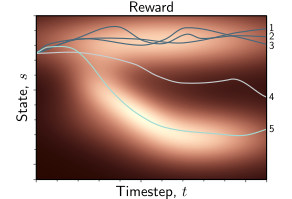

强化学习（RL）是一个序贯决策框架，智能体在此框架中通过在环境内执行动作来学习，旨在最大化获得的奖励。例如，RL 算法可以控制视频游戏中角色（智能体）的移动（动作），以最大化分数（奖励）。在机器人领域，RL 算法能控制机器人（智能体）在现实世界（环境）内的活动，执行特定任务以赚取奖励。在金融领域，RL 算法或许会控制一个虚拟交易员（智能体），在交易平台（环境）上进行资产买卖（动作），以最大化利润（奖励）。

以学习下棋为例，游戏结束时，根据智能体的胜、负或平，奖励分别为 +1、-1 或 0，而在游戏的其他时间步骤中奖励为 0。这体现了 RL 的挑战。首先，奖励是稀疏的，即只有在完成整场游戏后才能获得反馈。其次，奖励与导致其发生的动作之间存在时间上的延迟，如在获得胜利的三十步之前可能就已获得决定性优势，这要求将奖励与关键动作关联起来，这种情况称为时间信用分配问题。第三，环境具有随机性，对手的每次移动不总是相同的，这使得判断一个动作是真正有效还是仅仅依赖运气变得困难。最后，智能体需要在探索环境（例如，尝试新的开局方式）与利用已有知识（例如，使用之前成功的开局）之间做出平衡，这种平衡称为探索与利用的权衡。

强化学习是一个广泛的框架，不必须依赖深度学习。然而，在实际应用中，先进的系统通常会使用深度网络，这些网络对环境（如视频游戏画面、机器人传感器、金融时间序列或棋盘）进行编码，并将其直接或间接映射到下一步动作（图 1.13）。

## 19.1 马尔可夫决策过程、回报与策略
强化学习将环境观察转化为动作，其目标是最大化与所获奖励相关的数值。通常，我们通过学习一个策略来最大化马尔科夫决策过程中的预期回报。本节将解释这些术语。

### 19.1.1 马尔科夫过程
马尔科夫过程是一种假设，认为世界总是存在于一系列可能的状态中。马尔科夫性指的是，一个状态的出现概率只与其前一个状态有关，而与更早的状态无关。状态之间的转变通过转移概率 $Pr(s_{t+1}|s_t)$ 描述，即从当前状态 $s_t$ 转移到下一个状态 $s_{t+1}$ 的概率，这里的 t 表示时间步。因此，马尔科夫过程是不断演化的，它生成一系列状态 $s_1, s_2, s_3$ ...（图 19.1）。

### 19.1.2 马尔可夫奖励过程
*马尔科夫奖励过程* 包含一个分布 $Pr(r_{t+1}|s_t)$，用以确定在状态 $s_t$ 下，下一时间步骤可能获得的奖励 $r_{t+1}$。这构建了一个由状态和其对应奖励组成的序列 $r_1, s_1, r_2, s_2, r_3, s_3, r_4 \ldots$（图 19.2）。

在马尔科夫奖励过程中，还引入了一个*折扣因子* $\gamma \in (0, 1)$ 来计算在时间点 $t$ 的*回报* $G_t$：

$$
G_t = \sum_{k=0}^{\infty} \gamma^k r_{t+k+1}. \tag{19.1}
$$

回报是对未来奖励进行累积折扣计算后的总和，用于评估沿此轨迹的未来收益。折扣因子小于一意味着越近期的奖励比远期的奖励更有价值。

### 19.1.3 马尔科夫决策过程

*马尔科夫决策过程*（MDP）为每一个时间步增加了一组可能的*动作*。这些动作 $a_t$ 会改变转移概率，现在表示为 $Pr(s_{t+1}|s_t, a_t)$。奖励同样可能受到动作的影响，现表示为 $Pr(r_{t+1}|s_t, a_t)$。MDP 描述了一个由状态、动作及奖励组成的序列 $s_1, a_1, r_2, s_2, a_2, r_3, s_3, a_3, r_4 \ldots$（图 19.3）。进行这些动作的实体称为*智能体*。

### 19.1.4 部分可观测马尔可夫决策过程
在*部分可观测马尔科夫决策过程*（POMDP）中，状态并不直接显现给智能体（图 19.4）。智能体得到的是观测值 $o_t$，这个观测值根据 $Pr(o_t|s_t)$ 的概率分布得出。因此，POMDP 创造了一个由状态、观测、动作和奖励组成的序列 $s_1, o_1, a_1, r_2, s_2, o_2, a_2, r_3, s_3, o_3, a_3, r_4 \ldots$。一般而言，每个观测值与某些状态更为匹配，但不足以精确确定具体的状态。

### 19.1.5 策略
*策略*（图 19.5）是指导智能体在各个状态下采取何种行动的规则。策略可以是随机的，即为每个状态定义一系列动作的概率分布；也可以是确定性的，即智能体在特定状态下总是执行相同的动作。随机策略 $\pi(a|s)$ 对于状态 $s$ 下的每个可能动作提供一个概率分布，用于抽样决定新的动作。确定性策略 $\pi(a|s)$ 对于状态 $s$ 下选定的动作 $a$ 返回一，对其他动作返回零。*静态*策略仅与当前状态相关，而*非静态*策略还考虑了时间步的变化。

环境与智能体之间形成一个交互循环（图 19.6）。智能体接收上一时间步的状态 $s_t$ 和奖励 $r_t$，并依此来调整策略 $\pi(a|s_t)$，选择下一步的动作 $a_t$。随后，环境根据 $Pr(s_{t+1}|s_t, a_t)$ 确定下一个状态，并根据 $Pr(r_{t+1}|s_t, a_t)$ 确定奖励。

## 19.2 预期回报

上一节我们介绍了马尔科夫决策过程，以及智能体如何根据策略进行动作。我们的目标是找到一个最大化预期回报的策略。在本节中，我们将对这一概念进行数学上的精确定义。为了做到这点，我们给每个状态 $s_t$ 和每对状态-动作 $\{s_t, a_t\}$ 赋予一个*数值*。

### 19.2.1 状态与动作价值

回报 $G_t$ 取决于状态 $s_t$ 和策略 $\pi(a|s)$。智能体将从这个状态出发，经历一系列状态的变迁，执行动作并收获奖励。由于策略 $\pi(a|s_t)$、状态转移 $Pr(s_{t+1}|s_t, a_t)$ 以及奖励 $Pr(r_{t+1}|s_t, a_t)$ 都具有随机性，即使是从同一起点出发，智能体经历的序列也会每次不同。

在特定策略 $\pi$ 下，通过考虑预期回报 $v(s_t|\pi)$，我们可以评估一个状态的价值。这是从该状态开始，遵循策略所得到的平均回报，称为*状态价值*或*状态价值函数*（图 19.7a）：

$$
v(s_t|\pi) = \mathbb{E} [ G_t|s_t, \pi ]. \tag{19.2}
$$

状态价值反映了从某一状态出发，长期遵循特定策略所能期待的平均奖励。在后续状态转移可能快速获得较大奖励的情况下，这一价值尤为显著（假定折扣因子 $\gamma$ 小于一）。

同样，*动作价值*或*状态-动作价值函数* $q(s_t, a_t|\pi)$ 表示在状态 $s_t$ 中执行动作 $a_t$ 的预期回报（图 19.7b）：

$$
q(s_t, a_t|\pi) = \mathbb{E} [ G_t|s_t, a_t, \pi ]. \tag{19.3}
$$

动作价值显示了从一个状态出发，采取某动作并遵循特定策略之后，长期所能获取的平均奖励。强化学习算法利用这个指标将当前动作与未来的奖励相连接，从而解决时间信用分配问题。

### 19.2.2 最优策略
我们追求的策略目标是最大化预期回报。在 MDP 中（POMDP 则不适用），总能找到一个既确定性又静态的策略，以最大化所有状态的价值。如果我们掌握了这一最优策略，我们便能获得最优状态价值函数 $v^*(s_t)$：

$$
v^*(s_t) = \max_{\pi} \mathbb{E} [ G_t|s_t, \pi ].  \tag{19.4}
$$

同理，最优状态-动作价值函数可以在最优策略下得到：

$$
q^*(s_t, a_t) = \max_{\pi} \mathbb{E} [ G_t|s_t, a_t, \pi ]. \tag{19.5}
$$

进一步地，如果我们知道了最优动作价值 $q^*(s_t, a_t)$，就可以通过选取最高价值的动作 $a_t$ 来确定最优策略（图 19.7c）：

$$
\pi(a_t|s_t) = argmax_{a_t} q^*(s_t, a_t). \tag{19.6}
$$

事实上，有些强化学习算法就是基于动作价值和策略的交替估计来实现的（参见第 19.3 节）。

### 19.2.3 贝尔曼方程
对于任何策略，我们可能无法准确知道状态价值 $v(s_t)$ 或动作价值 $q(s_t, a_t)$。但是，这些价值需要相互协调一致，我们可以容易地确定它们之间的关系。状态价值 $v(s_t)$ 由动作价值 $q(s_t, a_t)$ 的加权和构成，权重由策略 $\pi(a_t|s_t)$ 决定动作的概率（图 19.8）：

$$
v(s_t) = \sum_{a_t} \pi(a_t|s_t)q(s_t, a_t). \tag{19.7}
$$

同理，动作的价值等于执行该动作所获得的即时奖励 $r_{t+1} = r(s_t, a_t)$，加上下一状态 $s_{t+1}$ 的价值 $v(s_{t+1})$ 经过折扣 $\gamma$ 后的结果（图 19.9）。因为状态 $s_{t+1}$ 的确定不是一成不变的，我们需要根据转移概率 $Pr(s_{t+1}|s_t, a_t)$ 来加权 $v(s_{t+1})$：

$$
q(s_t, a_t) = r(s_t, a_t) + \gamma \sum_{s_{t+1}} Pr(s_{t+1}|s_t, a_t)v(s_{t+1}). \tag{19.8}
$$

将方程 19.8 代入方程 19.7，我们可以得到时间 $t$ 和 $t + 1$ 之间状态价值的关系：

$$
v(s_t) = \sum_{a_t} \pi(a_t|s_t) \left[ r(s_t, a_t) + \gamma \sum_{s_{t+1}} Pr(s_{t+1}|s_t, a_t)v(s_{t+1}) \right].  \tag{19.9}
$$

同样，将方程 19.7 代入方程 19.8，我们可以得到时间 $t$ 和 $t + 1$ 之间动作价值的关系：

$$
q(s_t, a_t) = r(s_t, a_t) + \gamma \sum_{s_{t+1}} Pr(s_{t+1}|s_t, a_t) \left[ \sum_{a_{t+1}} \pi(a_{t+1}|s_{t+1})q(s_{t+1}, a_{t+1}) \right].  \tag{19.10}
$$

这两个关系构成了*贝尔曼方程*，它们是许多强化学习方法的基础。简言之，它们要求状态价值和动作价值之间保持一致性。因此，当我们更新某个状态或动作价值的估计时，会引起其他所有价值的连锁调整。

## 19.3 表格式强化学习
表格型强化学习算法，也就是不依赖函数逼近技术的算法，分为基于模型和无模型两种方法。基于模型的方法利用 MDP 结构来明确寻找最佳策略，通过分析转移矩阵 $Pr(s_{t+1}|s_t,a_t)$ 和奖励结构 r[s, a] 实现。若这些信息已知，问题则转化为可通过动态规划解决的直接优化问题。如果未知，就需要先基于观测到的 MDP 轨迹进行估计。

无模型方法则不依赖于 MDP 的具体模型，分为两种：1. 值估计方法，旨在估计最优状态-动作价值函数，然后为每个状态指定最大价值动作的策略；

2. 策略估计方法，通过梯度下降直接估计最优策略，无需经过模型或价值的估计阶段。

在这两个方法系列中，蒙特卡洛方法通过模拟多个给定策略的 MDP 轨迹来积累信息，进而优化策略。然而，在策略更新前模拟众多轨迹有时既不可行也不实际。时序差分（TD）方法允许在智能体遍历 MDP 过程中实时更新策略。

接下来简述动态规划、蒙特卡洛值估计和 TD 值估计方法。第 19.4 节将介绍深度网络如何用于 TD 值估计方法，而第 19.5 节继续讨论策略估计。

### 19.3.1 动态规划
动态规划算法基于完整了解转移和奖励结构的前提。与大多数强化学习算法不同，后者依靠观测智能体与环境的交互来间接获得这些数据。

状态价值 $v(s)$ 通常初始化为零，而确定性策略 $\pi(a|s)$ 则通过为每个状态随机选择一个动作来初始化。接下来，算法交替执行对当前策略的状态价值计算（策略评估）和策略的优化（策略改进）。

**策略评估：** 遍历各状态 $s_t$，根据贝尔曼方程更新它们的价值：

$$
v(s_t) \leftarrow \sum_{a_t} \pi(a_t|s_t) \left[ r(s_t, a_t) + \gamma \sum_{s_{t+1}} Pr(s_{t+1}|s_t, a_t)v(s_{t+1}) \right], \tag{19.11}
$$

其中 $s_{t+1}$ 是后继状态，$Pr(s_{t+1}|s_t, a_t)$ 表示状态转移概率。更新使 $v(s_t)$ 与后继状态 $s_{t+1}$ 的价值保持一致，这个过程称为自举。

**策略改进：** 更新策略时，我们贪心地选择能使每个状态价值最大化的动作：

$$
\pi(a_t|s_t) \leftarrow argmax_{a_t} \left[ r(s_t, a_t) + \gamma \sum_{s_{t+1}} Pr(s_{t+1}|s_t, a_t)v(s_{t+1}) \right]. \tag{19.12}
$$

根据策略改进定理，这种方法能够保证策略的持续优化。这两个步骤持续迭代，直到策略稳定（图 19.10）。

这种方法有多种变体。在策略迭代中，会先将策略评估迭代至收敛，然后再进行策略改进。值的更新可以在每次扫描时就地或同步进行。值迭代中，策略评估只进行一次扫描就直接进入策略改进。异步动态规划算法无需每步都系统地遍历所有状态，而是可以任意顺序地就地更新部分状态。

### 19.3.2 蒙特卡洛方法
与动态规划算法不同，蒙特卡洛方法不需要预先知道 MDP 的转移概率和奖励结构。它们通过重复采样 MDP 的轨迹并观察奖励来积累经验。这些方法在计算行动价值（基于累积的经验）和更新策略（基于行动价值）之间交替进行。

为了估计行动价值 $q(s, a)$，会运行一系列轮次。每个轮次从给定状态和行为开始，随后按照当前策略执行，产生一连串的行为、状态和收益（图 19.11a）。给定状态-行为对的行动价值，在当前策略下，通过平均每次观察到此对后获得的实证回报来估计（图 19.11b）。然后，通过选择每个状态下价值最大的行为来更新策略（图 19.11c）：

$$
\pi(a|s) \leftarrow argmax_a q(s, a). \tag{19.13}
$$

这是一种在策略学习方法；使用当前最优策略来指导智能体穿行于环境中。这个策略是基于每个状态观察到的行动价值确定的，但是未使用的行为的价值是无法估计的，同时没有机制促使算法去探索这些未知行为。一种解决方法是采用探索初始法。在此方法中，每种可能的状态-行为对都会启动一个轮次，确保每种组合至少被观察一次。然而，如果状态数量庞大或起始点无法控制，则这种方法不切实际。另一种方法是采用 ε-贪婪策略，即以 ε 的概率采取随机行动，而将剩余的概率分配给最优行动。ε 的选择实现了利用与探索之间的权衡。在这种情况下，基于 ε-贪婪策略的在策略学习方法会寻找最佳策略，但这通常不是最佳的整体策略。

相反，在离策略学习方法中，通过不同的行为策略 π′ 生成的轮次来学习最优策略 π（目标策略）。通常目标策略是确定性的，而行为策略是随机的（例如，ε-贪婪策略）。因此，行为策略能够探索环境，而学到的目标策略则保持高效。某些离策略方法明确采用重要性采样（第 17.8.1 节）来估计在策略 π 下的行动价值，使用来自 π′ 的样本。其他方法，如 Q 学习（将在下一节描述），则基于最优行动来估计价值，即便实际选择的行动可能并非如此。

### 19.3.3 时序差分学习
动态规划方法采用自举方法来更新数值，确保它们在当前策略下自洽。蒙特卡洛方法通过对 MDP 的采样来获得信息。时序差异 (Temporal Difference, TD) 方法融合了自举和采样。不过，与蒙特卡洛方法不同的是，TD 方法在智能体遍历 MDP 状态的过程中就更新数值和策略，而不是之后。

*SARSA*（状态-行动-奖励-状态-行动）是一种在策略 (on-policy) 算法，其更新公式为：

$$
q(s_t, a_t) \leftarrow q(s_t, a_t) + \alpha \left[ r(s_{t+1}, a_t) + \gamma q(s_{t+1}, a_{t+1}) - q(s_t, a_t) \right], \tag{19.14}
$$

其中，$\alpha \in \mathbb{R}^+$ 表示学习率。方括号内的项称为*TD 误差*，用于衡量经过单步操作后，估计的行动价值 $q(s_t, a_t)$ 与其后的估计值 $r(s_t, a_t)+\gamma q(s_{t+1}, a_{t+1})$ 之间的一致性。

相对而言，*Q-学习* 是一种离策略 (off-policy) 算法，其更新公式如下（图 19.12）：

$$
q(s_t, a_t) \leftarrow q(s_t, a_t) + \alpha \left[ r(s_t, a_t) + \gamma \max_{a} [q(s_{t+1}, a)] - q(s_t, a_t) \right], \tag{19.15}
$$

其中，每一步的行动选择是基于不同的行为策略 $\pi'$ 来确定的。

在这两种情况下，策略通过在每个状态下取行动价值的最大值来更新（方程 19.13）。可以证明，这些更新是收敛映射（参见方程 16.20）；只要每个状态-行动对被访问无限次，行动价值就会最终收敛。

## 19.4 拟合 Q-learning
上文描述的表格式 Monte Carlo 和 TD (时序差分) 算法反复遍历整个马尔科夫决策过程 (MDP) 并更新动作价值。但是，只有当状态-动作空间较小时，这种方法才是可行的。遗憾的是，这种情况并不常见；即便是在棋盘这样的限制环境中，也存在超过 $10^{40}$ 个可能的动作价值。

在拟合 Q-学习中，法定状态的离散表示 $q(s_t, a_t)$ 被替换为机器学习模型 $q(s_t, a_t; \theta)$，现在状态由向量 $s_t$ 表示，而不仅仅是一个索引。接着我们定义了一个基于相邻动作价值一致性的最小二乘法损失（类似于 Q-学习中的做法，见方程 19.15）：

$$
L(\phi) = \left[ r(s_t, a_t) + \gamma \max_{a} q(s_{t+1}, a; \phi) - q(s_t, a_t; \phi) \right]^2, \tag{19.16}
$$

这进而引导了以下更新公式：

$$
\phi \leftarrow \phi + \alpha \left[ r(s_t, a_t) + \gamma \cdot \max_a [q(s_{t+1}, a, \phi)] - q(s_t, a_t, \phi) \right] \frac{\partial q(s_t, a_t, \phi)}{\partial \phi} \tag{19.17}
$$

拟合 Q-学习与 Q-学习的区别在于它不再保证收敛性。参数的改变可能会同时影响目标 $r(s_t, a_t) + \gamma \max_{a} q(s_{t+1}, a_{t+1}; \phi)$（最大值可能发生变化）和预测 $q(s_t, a_t; \phi)$，这在理论和实践上都被证明会对收敛性产生不利影响。

### 19.4.1 深度 Q-网络在 ATARI 游戏中的应用
深度网络非常适合于从高维状态空间进行预测，因此在拟合 Q-学习中成为模型的自然选择。理论上，它们能够同时处理状态和动作作为输入以预测值，但实践中，网络只接收状态作为输入，并同时预测各个动作的值。

Deep Q-Network 是一个突破性的强化学习架构，它利用深度网络学会了玩 ATARI 2600 游戏。观测数据包括 220×160 像素的图像，每个像素拥有 128 种可能的颜色（见图 19.13）。这些图像被重塑为 84×84 像素，并且只保留了亮度值。不幸的是，单一帧图像无法展现完整的状态。例如，游戏中物体的速度未知。为解决这个问题，网络在每个时间步骤摄取最后四帧图像，组成 $s_t$。网络通过三个卷积层及一个全连接层处理这些帧，以预测每个动作的价值（见图 19.14）。

对标准训练过程进行了数项修改。首先，根据游戏得分驱动的奖励被限制在 −1 到 +1 之间，这种做法旨在平衡不同游戏间得分的巨大差异，并允许使用统一的学习率。其次，系统采用了经验回放机制。不是仅基于当前步骤的 $<s_t, a_t, r_{t+1}, s_{t+1}>$ 元组或最近 I 个元组的批处理来更新网络，而是将所有近期的元组都保存在一个缓冲区内。这个缓冲区被随机采样以在每一步生成一个批量，这种方法使得数据样本被多次重用，并降低了批次中样本间因相邻帧的相似性而产生的相关性。

最终，通过固定目标参数到 φ− 值并定期更新，解决了拟合 Q-网络中的收敛问题，给出了以下更新公式：

$$
\phi \leftarrow \phi + \alpha \left[ r(s_t, a_t) + \gamma \cdot \max_a [q(s_{t+1}, a, \phi)] - q(s_t, a_t, \phi) \right] \frac{\partial q(s_t, a_t, \phi)}{\partial \phi} \tag{19.18}
$$

现在网络不再追逐不断变化的目标，从而减少了振荡的倾向。

利用这些和其他启发式方法，结合 $\epsilon$-贪婪策略，Deep Q-Networks 在 49 个游戏的集合上达到了与专业游戏测试者相媲美的水平，每个游戏都使用单独训练的同一网络。值得注意的是，训练过程非常耗费数据，学习每款游戏约需要 38 天的完整体验。在某些游戏中，该算法的性能超越了人类水平。而在如“Montezuma's Revenge”这样的游戏中，进展几乎寥寥无几，因为该游戏的奖励稀疏，且包含多个外观差异显著的屏幕。

### 19.4.2 双 Q-学习与双深度 Q-网络
Q-学习的一个潜在问题是，在进行更新时对动作执行最大化操作：

$$
q(s_t, a_t) \leftarrow q(s_t, a_t) + \alpha \left[ r(s_t, a_t) + \gamma \max_{a} [q(s_{t+1}, a)] - q(s_t, a_t) \right] \tag{19.19}
$$

这导致估计的状态价值 $q(s_t, a_t)$ 出现系统性偏差。假设两个动作提供相同的平均奖励，但一个动作的奖励是随机的，而另一个是确定性的。随机奖励在约一半的时间里会超过平均值并被最大化操作选中，从而导致对应的动作价值 $q(s_t, a_t)$ 被过高估计。网络输出 $q(s_t, a_t; \phi)$ 的随机误差或 q-函数的随机初始化也可能导致类似的问题。

这个问题的核心在于同一个网络同时负责选择目标（通过最大化操作）和更新值。双重 Q-学习通过同时训练两个模型 $q_1(s_t, a_t, \phi_1)$ 和 $q_2(s_t, a_t, \phi_2)$ 来解决这一挑战：

$$
\begin{align}
&q_1(s_t, a_t) \leftarrow q_1(s_t, a_t) + \alpha \left[ r(s_t, a_t) + \gamma \cdot q_2 \left( s_{t+1}, argmax_{a} [q_1(s_{t+1}, a, \phi_1)] \right) - q_1(s_t, a_t) \right] \\
&q_2(s_t, a_t) \leftarrow q_2(s_t, a_t) + \alpha \left[ r(s_t, a_t) + \gamma \cdot q_1 \left( s_{t+1}, argmax_{a} [q_2(s_{t+1}, a, \phi_2)] \right) - q_2(s_t, a_t) \right]
\end{align} \tag{19.20}
$$

如此一来，目标的选择与目标本身被分开，有助于避免这些偏见。在实际应用中，新的元组 $<s, a, r, s'>$ 会被随机分配到其中一个模型进行更新，这种方法被称为双重 Q-学习。双重深度 Q-网络（Double DQNs）利用深度网络 $q(s_t, a_t; \phi_1)$ 和 $q(s_t, a_t; \phi_2)$ 来估计动作价值，更新过程变为：

$$
\begin{aligned}
\phi_1 &\leftarrow \phi_1 + \alpha \left[ r(s_t, a_t) + \gamma \cdot q \left( s_{t+1}, \text{argmax}_a [q(s_{t+1}, a, \phi_1)], \phi_2 \right) - q(s_t, a_t, \phi_1) \right] \frac{\partial q(s_t, a_t, \phi_1)}{\partial \phi_1} \\
\phi_2 &\leftarrow \phi_2 + \alpha \left[ r(s_t, a_t) + \gamma \cdot q \left( s_{t+1}, \text{argmax}_a [q(s_{t+1}, a, \phi_2)], \phi_1 \right) - q(s_t, a_t, \phi_2) \right] \frac{\partial q(s_t, a_t, \phi_2)}{\partial \phi_2}
\end{aligned} \tag{19.21}
$$

## 19.5 策略梯度方法
Q-学习首先估计动作价值，然后利用这些价值来更新策略。与之相反，策略基方法直接学习一个随机策略 $\pi(a_t|s_t, \theta)$。这是一个带有可训练参数 $\theta$ 的函数，能将状态 $s_t$ 映射到动作 $a_t$ 的分布 $Pr(a_t|s_t)$ 上，我们可以从这个分布中进行抽样。在 MDPs 中，总存在一个最优的确定性策略。但是，采用随机策略有三个理由：

1. 随机策略有助于自然探索空间；我们不需要在每个时间步采取最优动作。
2. 当我们调整随机策略时，损失函数会平滑变化。这意味着我们可以使用梯度下降法，即使奖励是离散的。这与在离散分类问题中使用最大似然估计类似。模型参数的变化使得真实类别变得更有可能，从而使损失平滑变化。
3. MDP 的假设通常是不准确的；我们通常不具有对状态的完全了解。例如，考虑一个代理只能观察到其附近位置的导航环境（如图 19.4）。如果两个位置外观相同，但附近的奖励结构不同，随机策略就能允许采取不同的行动，直至解决这种歧义。

### 19.5.1 梯度更新推导
考虑通过马尔科夫决策过程 (MDP) 的一条轨迹 $\tau = [s_1, a_1, s_2, a_2, ..., s_T, a_T]$。这条轨迹的概率 $Pr(\tau|\theta)$ 取决于状态演化函数 $Pr(s_{t+1}|s_t, a_t)$ 和当前的随机策略 $\pi(a_t|s_t, \theta)$：

$$
Pr(\tau|\theta) = Pr(s_1) \prod_{t=1}^{T} \pi(a_t|s_t, \theta)Pr(s_{t+1}|s_t, a_t). \tag{19.22}
$$

策略梯度算法旨在最大化许多此类轨迹上的期望回报 $r(\tau)$：

$$
\theta = argmax_{\theta} E_{\tau} \left[ r(\tau) \right] = argmax_{\theta} \left[ \int Pr(\tau|\theta)r(\tau) d\tau \right], \tag{19.23}
$$

其中回报是沿轨迹获取的所有奖励之和。

为了最大化这个量，我们采用梯度上升法更新：

$$
\theta \leftarrow \theta + \alpha \cdot \frac{\partial}{\partial \theta} \int Pr(\tau|\theta)r(\tau) d\tau
= \theta + \alpha \cdot \int \frac{\partial Pr(\tau|\theta)}{\partial \theta} r(\tau) d\tau. \tag{19.24}
$$

我们希望通过经验观察到的轨迹的总和来近似这个积分。这些轨迹来源于分布 $Pr(\tau|\theta)$，因此为了进展，我们用这个分布乘除被积函数：

$$
\begin{align}
\theta &\leftarrow \theta + \alpha \cdot \int \frac{\partial Pr(\tau|\theta)}{\partial \theta} r(\tau) d\tau \\
&= \theta + \alpha \cdot \int Pr(\tau|\theta) \frac{1}{Pr(\tau|\theta)} \frac{\partial Pr(\tau|\theta)}{\partial \theta} r(\tau) d\tau \\
&\approx \theta + \alpha \cdot \frac{1}{I} \sum_{i=1}^I \frac{1}{Pr(\tau_i|\theta)} \frac{\partial Pr(\tau_i|\theta)}{\partial \theta} r(\tau_i).
\end{align} \tag{19.25}
$$

这个方程简单来说，就是通过增加观察到的轨迹 $\tau_i$ 的可能性 $Pr(\tau_i|\theta)$ 来调整参数，与该轨迹的奖励 $r(\tau_i)$ 成比例。但同时，它通过首次观察到该轨迹的概率进行归一化，以补偿某些轨迹更频繁观察到的事实。如果一个常见且高奖励的轨迹已存在，则无需大幅改变。最大的更新将源自那些不常见但能带来大量奖励的轨迹。

我们可以使用“似然比恒等式”简化这个表达式：

$$
\frac{\partial \log[f(z)]}{\partial z} = \frac{1}{f(z)} \frac{\partial f(z)}{\partial z}, \tag{19.26}
$$

产生如下更新：

$$
\theta \leftarrow \theta + \alpha \cdot \frac{1}{I} \sum_{i=1}^{I} \frac{\partial \log [Pr(\tau_i|\theta)]}{\partial \theta} r[\tau_i]. \tag{19.27}
$$

轨迹的对数概率 $\log[Pr(\tau|\theta)]$ 可以表示为：

$$
\begin{align}
\log[Pr(\tau|\theta)] &= \log [Pr(s_1)] \prod_{t=1}^{T} \pi(a_t|s_t, \theta) Pr(s_{t+1}|s_t, a_t) \\
&= \log [Pr(s_1)] + \sum_{t=1}^{T} \log [\pi(a_t|s_t, \theta)] + \sum_{t=1}^{T} \log [Pr(s_{t+1}|s_t, a_t)],
\end{align} \tag{19.28}
$$

由于只有中间项依赖于 $\theta$，我们可以根据方程 19.27 重新写更新式为：

$$
\theta \leftarrow \theta + \alpha \cdot \frac{1}{I} \sum_{i=1}^{I} \sum_{t=1}^{T} \frac{\partial \log [\pi(a_t|s_{it}, \theta)]}{\partial \theta} r[\tau_i], \tag{19.29}
$$

其中 $s_{it}$ 是第 $i$ 集中时间 $t$ 的状态，$a_{it}$ 是第 $i$ 集中时间 $t$ 执行的动作。由于与状态演化 $Pr(s_{t+1}|s_t, a_t)$ 相关的项消失了，这种参数更新不需要假设马尔科夫时间演化过程。

进一步简化这个表达，我们注意到：

$$
r[\tau_i] = \sum_{t=1}^{T} r_{it} = \sum_{k=1}^{t-1} r_{ik} + \sum_{k=t}^{T} r_{ik}, \tag{19.30}
$$

其中 $r_{it}$ 是第 $i$ 集中时间 $t$ 的奖励。时间 $t$ 之前的奖励（第一项）不影响时间 $t$ 的更新，因此我们可以表示为：

$$
\theta \leftarrow \theta + \alpha \cdot \frac{1}{I} \sum_{i=1}^{I} \sum_{t=1}^{T} \frac{\partial \log [\pi(a_t|s_{it}, \theta)]}{\partial \theta} \sum_{k=t}^{T} r_{ik}. \tag{19.31}
$$

### 19.5.2 REINFORCE 算法
REINFORCE 是一种初期策略梯度算法，该算法利用了前述结果并加入了折现因素。它采用蒙特卡罗方法，根据当前策略 $\pi(a|s, \theta)$ 生成轨迹 $\tau_i = [s_{i1}, a_{i1}, r_{i2}, s_{i2}, a_{i2}, \ldots, r_{iT}]$。在离散动作情况下，可以通过神经网络 $\pi(s|\theta)$ 来确定这一策略，该网络接受当前状态 $s$ 并为每种可能动作输出一个值。这些输出值通过 softmax 函数转换成动作的分布，每一时间步都从这个分布中进行抽样。

对于每个轨迹 $i$，我们遍历其每个时间步 $t$，计算从该时间步开始的部分轨迹 $\tau_{it}$ 的实际折扣回报：

$$
r[\tau_{it}] = \sum_{k=t+1}^{T} \gamma^{k-t-1} r_{ik}, \tag{19.32}
$$

接着，我们在每个轨迹的每个时间步更新参数：

$$
\theta \leftarrow \theta + \alpha \cdot \gamma^{t} \frac{\partial \log [\pi(a_t|s_{it}, \theta)]}{\partial \theta} r[\tau_{it}] \quad \forall i, t, \tag{19.33}
$$
其中 $\pi(a_t|s_t, \theta)$ 是神经网络给定当前状态 $s_t$ 和参数 $\theta$ 时产生动作 $a_t$ 的概率，$\alpha$ 为学习率。额外的 $\gamma^{t}$ 项确保奖励根据序列起点进行折扣，因为我们在整个序列中最大化回报的对数概率（参见方程 19.23）。

### 19.5.3 Baselines
策略梯度方法存在高方差的问题，可能需要多个轮次才能获得稳定的导数更新。降低方差的一个方法是用基线 $b$ 减去轨迹回报 $r[\tau]$：

$$
\theta \leftarrow \theta + \alpha \cdot \frac{1}{I} \sum_{i=1}^{I} \sum_{t=1}^{T} \frac{\partial \log [\pi(a_t|s_{it}, \theta)]}{\partial \theta} (r[\tau_{it}] - b). \tag{19.34}
$$

只要基线 $b$ 不与动作相关联：
$$
\mathbb{E}_{\tau}\left[ \sum_{t=1}^T \frac{\partial \log[\pi_{\text{ait}}[s_{it}, \theta]]}{\partial \theta} \cdot b \right] = 0, \tag{19.35}
$$

期望值就不会改变。然而，如果基线与其他无关且增加不确定性的因素相关联，那么减去基线就能减少方差（见图 19.16）。这是控制变量方法的一个特殊情况（参见问题 19.7）。

这就引出了如何选择 $b$ 的问题。我们可以通过构建方差的表达式，对 $b$ 进行求导，将结果置为零，并解出方程来找到使方差最小的 $b$ 值：

$$
b = \frac{\sum_{i} \sum_{t=1}^T (\frac{\partial \log[\pi_{\text{ait}}[s_{it}, \theta]]}{\partial \theta})^2 r[\tau_{it}]}{\sum_{i} \sum_{t=1}^T (\frac{\partial \log[\pi_{\text{ait}}[s_{it}, \theta]]}{\partial \theta})^2 }. \tag{19.36}
$$
实际操作中，这通常被近似为：

$$
b = \frac{1}{I} \sum_{i} r[\tau_{i}]. \tag{19.37}
$$

通过减去这个基线，可以消除由于所有轨迹的回报 $r[\tau_i]$ 超出平均水平仅因它们通过的状态具有高于平均回报的特性引起的方差。

### 19.5.4 依赖当前状态的 baselines
更佳的方案是使用依赖于当前状态 $s_{it}$ 的基线 $b[s_{it}]$。
$$
\theta \leftarrow \theta + \alpha \cdot \frac{1}{I} \sum_{i=1}^{I} \sum_{t=1}^{T} \frac{\partial \log[\pi_{\text{ait}}[s_{it}, \theta]]}{\partial \theta} (r[\tau_{it}] - b[s_{it}]). \tag{19.38}
$$

这里，我们正在对一些状态比其他状态具有更高总回报而引入的方差进行补偿，不论采取何种行动。

一个合理的选择是基于当前状态的预期未来奖励，即状态值 $v[s]$。在这种情况下，经验观察到的奖励与基线之间的差异称为优势估计（advantage estimate）。鉴于我们处于蒙特卡罗环境，这可以通过参数为 $\phi$ 的神经网络 $b[s] = v[s, \phi]$ 来参数化，并使用最小二乘损失对观测到的回报进行拟合：

$$
L[\phi] = \sum_{i=1}^{I} \sum_{t=1}^{T} \left( v[s_{it}, \phi] - \sum_{j=t}^{T} r_{ij} \right)^2. \tag{19.39}
$$

## 19.6 Actor-Critic 方法
Actor-critic 算法属于时间差分 (TD) 策略梯度算法，能够在每一步骤更新策略网络的参数。这与必须等待一个或多个轮次结束才能更新参数的蒙特卡罗 REINFORCE 算法形成对比。

在 TD 方法中，我们不能获取到沿此轨迹的未来奖励 $r[\tau_t] = \sum_{k=t}^T r_k$。Actor-critic 算法通过观测的当前奖励加上下一个状态的折扣值来近似计算所有未来奖励的总和：

$$
\sum_{k=1}^{T} r[\tau_{ik}] \approx r_{it} + \gamma \cdot v[s_{i,t+1}, \phi]. \tag{19.40}
$$

其中，值 $v[s_{i,t+1}, \phi]$ 通过参数为 $\phi$ 的第二个神经网络进行估计。

将其代入方程 19.38，我们得到如下更新：

$$
\theta \leftarrow \theta + \alpha \cdot \frac{1}{I} \sum_{i=1}^{I} \sum_{t=1}^{T} \frac{\partial \log[\Pr(a_{it}|s_{it}, \theta)]}{\partial \theta} (r_{it} + \gamma \cdot v[s_{i,t+1}, \phi] - v[s_{it}, \phi]). \tag{19.41}
$$

同时，我们利用损失函数对参数 $\phi$ 进行自举更新：

$$
L[\phi] = \sum_{i=1}^{I} \sum_{t=1}^{T} \left( r_{it} + \gamma \cdot v[s_{i,t+1}, \phi] - v[s_{it}, \phi] \right)^2. \tag{19.42}
$$
预测 $Pr(a|s_t)$ 的策略网络 $π[s_t,θ]$ 称为 actor，值网络 $v[s_t,φ]$ 称为 critic。常见的是，同一网络同时充当 actor 和 critic，它具有两套输出，分别预测策略和值。虽然 actor-critic 方法理论上可以在每步更新策略参数，但实际上这种操作较为罕见。通常，智能体会在多个时间步之后累积一定的经验，再进行策略更新。

## 19.7 离线强化学习
强化学习的核心是与环境的交互。但在某些情况下，例如自动驾驶车辆的驾驶或进行金融交易，由于环境中的不稳定行为可能危险，或数据收集过程耗时且成本高昂，让未经训练的智能体进入环境进行探索是不现实的。

然而，在这两种情况下，我们可以从人类操作者那里收集历史数据。离线强化学习 (Offline RL) 或批量强化学习 (Batch RL) 旨在通过观察过去的行为序列 $s_1,a_1,r_2,s_2,a_2,r_3$,... 来学习如何采取行动，以便在未来的轮次中最大化奖励，而不需要与环境直接交互。这与模仿学习不同，后者没有奖励信息，只是尝试复制历史操作者的行为而不是改善它。

虽然存在基于 Q-Learning 和策略梯度的离线 RL 方法，但这一领域开启了新的可能性。特别地，我们可以将其视作一个序列学习问题，目的是在给定状态、奖励和行动的历史下预测下一个行动。决策变换器（Decision Transformer）采用 Transformer 解码器框架（见第12.7节）进行预测（见图 19.17）。

但目标是基于*未来奖励*预测行动，这些在标准的 $s, a, r$ 序列中无法体现。因此，决策变换器用*剩余回报* $R_t:T = \sum_{t'=t}^T r_{t'}$（即未来奖励的累积和）来替换当前奖励 $r_t$。剩余部分的框架与标准的 Transformer 解码器非常相似。状态、行动和剩余回报通过学习得到的映射转换成固定大小的嵌入。对于 Atari 游戏，状态嵌入可能通过类似图 19.14 中的卷积网络进行转换。行动和剩余回报的嵌入可类似于单词嵌入（见图 12.9）进行学习。Transformer 通过带掩码的自注意力和位置嵌入进行训练。

这种方法在训练时自然有效，但在推理时会遇到问题，因为我们不知道剩余回报。这可以通过在第一步设定目标总回报，并随着奖励的获得逐步减少这个值来解决。例如，在 Atari 游戏中，目标总回报可能是赢得比赛所需的总分。

决策变换器还可以从在线经验中进行微调，并逐渐学习。它们的优势在于摒弃了大部分强化学习的机制及其相关的不稳定性，转而采用了标准的监督学习方法。Transformer 能够处理大量数据，并在广阔的时间范围内整合信息，使时间信用分配问题变得更易于处理。这为强化学习开辟了一条新的、令人兴奋的道路。

## 19.8 总结
增强学习 (Reinforcement Learning) 是针对马尔科夫决策过程 (Markov Decision Processes) 及其类似系统的序贯决策框架。本章介绍了增强学习的表格方法，包括动态规划（环境模型已知）、蒙特卡罗方法（通过运行多个回合并根据获得的奖励调整动作值和策略）和时差分方法（在回合进行中更新这些值）。

深度Q学习 (Deep Q-Learning) 是一种时差分方法，使用深度神经网络预测每个状态的动作价值，能够训练智能体在Atari 2600游戏中达到类似人类的水平。策略梯度方法直接对策略进行优化，而非对动作进行价值赋值。这些方法生成的是随机策略，在部分可观测的环境中尤其重要。这些更新过程含有噪声，为减少其方差已经引入了多种改进措施。

当无法直接与环境互动而必须依赖历史数据学习时，就会使用离线增强学习。决策变换器 (Decision Transformer) 利用深度学习的最新进展构建状态-动作-奖励序列模型，并预测能够最大化奖励的动作。

## Notes
Sutton 和 Barto 在 2018 年的作品中详细介绍了表格型增强学习方法。Li (2017)、Arulkumaran 等人 (2017)、François-Lavet 等人 (2018) 和 Wang 等人 (2022c) 分别提供了深度增强学习领域的综述。Graesser 和 Keng 的 2019 年作品是一本优秀的入门资源，其中包含了 Python 代码示例。

**深度增强学习的里程碑**：增强学习的重大成就主要在视频游戏或现实世界游戏中实现，这些游戏提供了具有有限动作和固定规则的约束性环境。深度Q学习（由 Mnih 等人在 2015 年提出）在 ATARI 游戏的基准测试中达到了人类水平的表现。AlphaGo（由 Silver 等人在 2016 年提出）战胜了围棋的世界冠军，这是一个之前被认为计算机难以掌握的游戏。Berner 等人在 2019 年构建的系统在 Dota 2（五对五玩家游戏）中击败了世界冠军队，显示出了玩家间合作的必要性。Ye 等人在 2021 年开发的系统能够在有限的数据下超越人类玩家在 Atari 游戏中的表现，这与之前需要大量经验的系统形成鲜明对比。最近，FAIR 在 2022 年推出的 Cicero 系统在需要自然语言协商和玩家协调的《外交》游戏中展示了人类级别的表现。

RL 还成功应用于组合优化问题，Mazyavkina 等人在 2021 年的研究中有所涉及。例如，Kool 等人在 2019 年开发的模型在解决旅行商问题上与最佳启发式方法表现相当。最近，Fawzi 等人在 2022 年提出的 AlphaTensor 将矩阵乘法视作一种游戏，学会了用更少的乘法操作更快地进行矩阵乘法，这一发现对深度学习领域，尤其是因其重度依赖矩阵乘法的特性，意义重大，标志着 AI 领域自我进化的重要里程碑。

**经典增强学习方法**：关于马尔科夫决策过程 (MDPs) 理论的早期贡献分别由 Thompson 在 1933 年和 1935 年作出。Bellman 在 1966 年引入了 Bellman 递归，Howard 在 1960 年引入了策略迭代方法。Sutton 和 Barto 在 2018 年的研究中指出，Andreae 在 1969 年的工作首次使用 MDP 形式主义来描述增强学习。

现代增强学习的发展起源于 Sutton (1984) 和 Watkins (1989) 的博士论文。Sutton 在 1988 年引入时序差分学习，Watkins (1989) 和 Watkins & Dayan (1992) 提出了 Q 学习，并证明了它通过 Banach 定理收敛到一个固定点，因为 Bellman 操作是收缩映射。Watkins (1989) 首次明确地将动态规划和增强学习联系起来。SARSA 是由 Rummery & Niranjan (1994) 开发的。Gordon (1995) 提出了拟合 Q 学习，用机器学习模型预测每个状态-动作对的价值。Riedmiller (2005) 引入了神经拟合 Q 学习，使用神经网络从一个状态一次性预测所有动作的价值。Singh & Sutton (1996) 对蒙特卡罗方法进行了早期研究，探索启动算法则由 Sutton & Barto (1999) 提出。这是对五十多年工作的极简总结，Sutton & Barto (2018) 的著作中有更为全面的论述。

**深度 Q 网络**：Mnih 等人在 2015 年设计的深度 Q 学习是神经拟合 Q 学习的理论衍生。它利用了当时卷积网络的进展，开发出一种拟合 Q 学习方法，在 ATARI 游戏基准测试中达到人类水平的表现。深度 Q 学习存在致命的三重问题，即训练在包含自举、离策略学习和函数逼近的方案中可能不稳定（Sutton & Barto, 2018）。很多后续研究致力于让训练过程更加稳定。Mnih 等人 (2015) 引入了经验回放机制（Lin, 1992），Schaul 等人 (2016) 对其进行改进，优先考虑更重要的经验，从而加快学习速度，这就是所谓的优先经验回放。

原始的 Q 学习论文使用四帧图像串联，以便网络观察到对象的速度，使底层过程更接近完全可观测。Hausknecht & Stone (2015) 引入了深度递归 Q 学习，使用循环网络架构，一次只处理一个帧图像，因为它能“记住”之前的状态。Van Hasselt (2010) 指出由于最大化操作导致的状态价值系统性过高估计，并提出了双 Q 学习，通过同时训练两个模型来解决这个问题。这种方法后来被应用于深度 Q 学习（Van Hasselt 等人，2016），虽然其有效性后来受到了质疑（Hessel 等人，2018）。Wang 等人 (2016) 引入了深度对决网络，其中网络的两个部分分别预测状态的价值和每个动作的相对优势，这种解耦可以提高稳定性，因为有时状态的价值更为重要，而具体采取哪种动作的影响不大。

Fortunato 等人（2018）提出了噪声深度 Q-网络，其特点是 Q-网络中的部分权重乘以噪声以增加预测的随机性并促进探索行为。该网络能够在逐步收敛到合理策略的过程中学会减少噪声的强度。分布式 DQN（Bellemare 等人，2017a；Dabney 等人，2018，继 Morimura 等人，2010）的目标是估计回报分布的更全面信息，而不仅仅是期望值。这使得网络有可能减轻最坏情况下的影响，并且还可以通过预测更高阶矩来提高性能，因为这为训练提供了更丰富的信号。Rainbow（Hessel 等人，2018）结合了六项对原始深度 Q-学习算法的改进，包括决策网络、分布式 DQN 和噪声 DQN，从而提高了在 ATARI 基准测试上的训练速度和最终性能。

**策略梯度**：Williams（1992）首次提出了 REINFORCE 算法。"策略梯度方法"一词最早见于 Sutton 等人（1999）。Konda 和 Tsitsiklis（1999）引入了演员-评论家算法。使用不同的基准来降低方差在 Greensmith 等人（2004）和 Peters & Schaal（2008）的工作中被探讨。Mei 等人（2022）后来指出，价值基准主要是减少更新的激进性而非其方差。

策略梯度已经被改进以产生确定性策略（Silver 等人，2014；Lillicrap 等人，2016；Fujimoto 等人，2018）。最直接的方法是对所有可能的行动进行最大化，但如果行动空间是连续的，则每一步都需要一个优化过程。深度确定性策略梯度算法（Lillicrap 等人，2016）按照行为价值梯度的方向调整策略，这表明使用了演员-评论家方法。

**现代策略梯度**：我们之前提到，策略梯度可以从参数更新的角度进行介绍。但它们也可以视为基于当前策略参数下预期奖励的重要性采样来优化一个代理损失。这种方法允许我们合理地进行多次优化步骤。然而，这样做可能会导致很大的策略更新。在监督学习中，过度更新只是一个较小的问题，因为后续可以对轨迹进行修正。但在强化学习中，这会影响到未来的数据收集，可能造成极大的破坏。

为了缓和这些更新，提出了几种方法。自然策略梯度（Kakade，2001）基于自然梯度（Amari，1998），它通过 Fisher 信息矩阵来调整下降方向，从而提供了更优的更新路径，减少了陷入局部平稳区的可能。然而，对于参数众多的模型，计算 Fisher 矩阵并不实际。在信赖区域策略优化（TRPO）中（Schulman 等人，2015），通过对旧策略和新策略之间的 KL 散度施加约束来最大化代理目标。Schulman 等人（2017）提出了一种更简化的方案，将 KL 散度作为正则化项引入，其权重根据 KL 散度与设定目标的距离调整，以反映我们希望策略变化的程度。邻近策略优化（PPO）（Schulman 等人，2017）则是一种更简化的方法，通过剪裁损失来保证较小的更新幅度。

**演员-评论家模型**：在第19.6节描述的演员-评论家模型（Konda & Tsitsiklis, 1999）中，评论家部分使用了单步估计方法。此外，还可以使用 k 步估计方法（在此方法中，我们观测 k 个打折后的奖励，并使用状态值的估计来近似后续奖励）。随着 k 的增加，估计的方差也增加，但偏差则减少。广义优势估计（Schulman 等人，2016）将多步的估计结果综合起来，并通过单个参数来调整偏差与方差之间的权衡。Mnih 等人（2016）提出了异步演员-评论家模型（A3C），在该模型中，多个代理在并行环境中独立运行并更新相同的参数。每隔 T 时间步，策略和价值函数根据 k 步回报的混合来更新。Wang 等人（2017）引入了几种方法，使异步演员-评论家模型更加高效。软演员-评论家模型（Haarnoja 等人，2018b）在成本函数中增加了一个熵项，以鼓励探索并减少过拟合，使策略倾向于更加不自信。

**离线强化学习**：离线强化学习中，策略的学习是通过观察其他代理的行为及其获得的奖励来实现的，而无需直接干预策略。这与模仿学习类似，后者旨在复制另一代理的行为，但不需要奖励信息（参见 Hussein 等人，2017）。离线强化学习可被视为与离策略强化学习相同的处理方式。然而，实践中，观测到的策略与实际应用的策略之间的分布偏移可能导致对行动价值过于乐观的估计，进而影响性能（参见 Fujimoto 等人，2019；Kumar 等人，2019a；Agarwal 等人，2020）。保守 Q-学习（Kumar 等人，2020b）通过对 Q-值进行正则化，学习价值函数的保守下界估计。决策变换器（Chen 等人，2021c）是一种简便的离线学习方法，利用了广泛研究的自注意力架构。后续，它可以通过在线训练进行进一步微调（Zheng 等人，2022）。

**强化学习和聊天机器人**：聊天机器人的训练可以采用一种称为强化学习结合人类反馈（RLHF）的技术（Christiano 等人，2018；Stiennon 等人，2020）。例如，InstructGPT（ChatGPT 的前身，Ouyang 等人，2022）起始于一个标准的 Transformer 解码器模型。接着，基于人类注释者编写的提示-响应对进行微调。在这一训练阶段，模型优化以预测真实响应中的下一个词。

遗憾的是，产生足够的训练数据以保证高质量表现的成本非常高。为了解决这个问题，人类注释者随后指出他们更偏好的模型响应。这些成本更低的数据用于训练奖励模型，即一个第二个 Transformer 网络，它根据提示和模型响应给出评分。最后，经过微调的聊天机器人模型进一步训练，以根据奖励模型的监督产生高奖励。由于无法通过聊天机器人输出的采样过程计算导数，因此无法使用标准的梯度下降法。于是，使用近似策略优化（一种可计算导数的策略梯度方法）对模型进行训练，以产生更高的奖励。

**强化学习的其他领域**：强化学习是一个广阔的领域，足以单独编成一本书，而本文的综述仅触及了表面。我们未涉及的强化学习的其他重要领域包括基于模型的强化学习，在这个领域中，状态转移概率和奖励函数是被建模的（参见 Moerland 等人，2023）。这种方法支持前瞻性规划，并且具有可以针对不同奖励结构重用同一模型的优势。像 AlphaGo（Silver 等人，2016）和 MuZero（Schrittwieser 等人，2020）这样的混合方法为状态的动态、策略和未来位置的价值分别建立了模型。

本章只简要讨论了如 epsilon-greedy 方法、噪声 Q-学习和添加熵项以惩罚过度自信策略等探索方法。内在动机是指为探索增加奖励的方法，这样做可以赋予智能体“好奇心”（参见 Barto，2013；Aubret 等人，2019）。层次化强化学习（参见 Pateria 等人，2021）是指将最终目标分解成子任务的方法。多智能体强化学习（参见 Zhang 等人，2021a）探讨了多个智能体在共享环境中共存的情况，这可以是竞争性或合作性的情境。

## Problems
**问题 19.1** 在图 19.18 展示的 MDP 示例中考虑一条特定的轨迹。假设折扣因子 $\gamma$ 为 0.9，请计算该轨迹中每一步的回报。

**问题 19.2** 证明策略改进定理。假设从策略 $\pi$ 更改为策略 $\pi'$，在状态 $s_t$ 时新策略 $\pi'$ 选择能够最大化期望回报的动作：

$$
\pi'[a_t|s_t] = \arg\max_{a_t} \left[ r(s_t, a_t) + \gamma \cdot \sum_{s_{t+1}} Pr(s_{t+1} | s_t, a_t)v[s_{t+1} | \pi] \right]. \tag{19.43}
$$

对于所有其他状态，两个策略保持一致。证明原始策略 $\pi$ 下的值 $v_{\pi}(s_t)$ 必须小于或等于新策略 $\pi'$ 下的值 $v_{\pi'}(s_t) = q_{\pi}(s_t, \pi'(s_t))$：

$$
\begin{align}
v[s_t | \pi] &\leq q[s_t, \pi'[a_t|s_t] | \pi] \\
&= \mathbb{E}_{\pi'}[r_{t+1} + \gamma \cdot v[s_{t+1} | \pi]].
\end{align} \tag{19.44}
$$

提示：首先尝试用新策略 $\pi'$ 来表达 $v_{\pi}(s_{t+1})$。

**问题 19.3** 假设状态值和策略按图 19.10a 初始化，展示它们在进行两次迭代后变成图 19.10b 中的状态。迭代包括：(i) 策略评估（其中所有状态基于当前值进行更新，然后替换前一个值），和 (ii) 策略改进。状态转移给策略指示的方向分配一半的概率，其余概率平均分配给其他有效动作。无论采取何种动作，当企鹅离开洞穴时奖励函数返回 -2；当企鹅离开鱼瓦片且剧情结束时，奖励函数返回 +3，因此鱼瓦片的价值为 +3。

**问题 19.4** Boltzmann 策略通过基于当前状态-动作奖励函数 $q[s, a]$ 来决定动作概率 $\pi[a|s]$，从而在探索和利用之间实现平衡：

$$
\pi[a|s] = \frac{\exp(q[s, a]/\tau)}{\sum_{a'} \exp(q[s, a']/\tau)}. \tag{19.45}
$$

讨论如何通过调整温度参数 $\tau$ 来偏向探索或利用。

**问题 19.5** 当学习率 $\alpha$ 为 1 时，Q-Learning的更新公式为：

$$
f[q(s, a)] = r[s, a] + \gamma \cdot \max_{a'} q[s', a']. \tag{19.46}
$$

证明这是一个压缩映射（参照方程 16.30），所以：

$$
\| f[q_1(s, a)] - f[q_2(s, a)] \|_{\infty} \leq \gamma \| q_1(s, a) - q_2(s, a) \|_{\infty} \quad \forall q_1, q_2. \tag{19.47}
$$

其中 $\| \cdot \|_{\infty}$ 表示 $\ell_{\infty}$ 范数。根据 Banach 定理，存在一个固定点，且更新最终会收敛。

**问题 19.6** 证明：
$$
\mathbb{E}_\tau \left[ \frac{\partial}{\partial \theta} \log[Pr(\tau|\theta)]b \right] = 0, \tag{19.48}
$$
所以添加基线更新不改变策略梯度更新的期望值。

**问题 19.7*** 假设我们要根据样本 $a_1, a_2 \ldots a_I$ 估计量 $\mathbb{E}[a]$。同时，我们有与 $a$ 相关联的样本对 $b_1, b_2 \ldots b_I$，其平均值为 $\mathbb{E}[b] = \mu_b$。定义新变量：
$$
a' = a - c(b - \mu_b). \tag{19.49}
$$
证明当恰当选择常数 $c$ 时，$\text{Var}[a'] \leq \text{Var}[a]$ 成立，并给出 $c$ 的最优值表达式。

问题 19.8 在方程 19.34 中，梯度的估计可表示为：
$$
\mathbb{E}_\tau \left[ g(\theta)(r[\tau] - b) \right], \tag{19.50}
$$
其中
$$
g(\theta) = \sum_{t=1}^{T} \frac{\partial}{\partial \theta} \log[Pr(a_t|s_t, \theta)], \tag{19.51}
$$
且
$$
r[\tau] = \sum_{k=t}^{T} r_k. \tag{19.52}
$$
证明最小化梯度估计方差的 $b$ 值由以下式子给出：
$$
b = \frac{\mathbb{E}[g(\theta)^2r[\tau]]}{\mathbb{E}[g(\theta)^2]}. \tag{19.53}
$$

## 附图

图 19.1 马尔可夫过程。马尔可夫过程由一组状态和定义从当前状态 $s_t$ 转移到状态 $s_{t+1}$ 的概率的转移概率 $Pr(s_{t+1}|s_t)$ 组成。a) 企鹅可以在冰面上访问 16 个不同的位置（状态）。b) 冰面很滑，所以企鹅每次都有相同的概率移动到任一相邻状态。例如，在位置 6，它分别有 25% 的概率移动到状态 2、5、7 和 10。从这个过程中得到的轨迹 $\tau = \{s_1, s_2, s_3, \ldots\}$ 是一个状态序列。

图 19.2 马尔可夫奖励过程。它把一个奖励分布 $Pr(r_{t+1}|s_t)$ 与每个状态 $s_t$ 相关联。a) 这里，奖励是确定的：企鹅如果落在鱼上获得 $+1$ 奖励，否则为 $0$。轨迹 $\tau$ 现在是状态和奖励交替的序列 $s_1, r_2, s_2, r_3, s_3, r_4 \ldots$，在八步后终止。序列的总回报 $G_t$ 是折扣后未来奖励的总和，此处的折扣因子为 $\gamma = 0.9$。b-c) 随着企鹅沿轨迹前进逐渐靠近奖励，其回报逐步增加。

图 19.3 马尔可夫决策过程。a) 智能体（企鹅）可以在每个状态中选择一组动作之一执行。动作会影响到转移到下一状态的概率及获得奖励的可能性。b) 在这里，四个动作分别对应上、右、下、左移动。c) 在任何状态下（如状态 6），动作会改变到下一个状态的转移概率。企鹅有 50% 的概率向预定方向移动，但由于冰面滑，它也可能以相同的概率滑到其他相邻位置。因此，在面板 (a) 中，实际采取的动作（灰色箭头）不一定与轨迹（橙色线）一致。这里的动作并不影响奖励，因此 $Pr(r_{t+1}|s_t, a_t) = Pr(r_{t+1}|s_t)$。MDP 的轨迹 $\tau$ 是由状态 $s_t$、动作 $a_t$ 和奖励 $r_{t+1}$ 交替构成的序列。请注意，在此，企鹅在离开有鱼的状态时获得奖励，即通过鱼的格子即可获得奖励，无论是故意还是偶然。

图 19.4 部分可观测马尔可夫决策过程（POMDP）。在 POMDP 中，智能体无法完全知晓状态。例如，企鹅在状态三时只能看到虚线框内的区域，这与其在状态九的视角无异。在前者中，向右移动将导致掉入冰洞（奖励为 -2），而在后者中，则可获得鱼（奖励为 +3）。

图 19.5 策略。a) 确定性策略在每个状态下总是采取相同的动作（箭头指示）。虽然有些策略优于其他策略，但这种策略能够基本引导企鹅从左上角向右下角移动以获取奖励。b) 此策略更具随机性。c) 随机策略为每个状态设定一个动作的概率分布（概率由箭头大小表示），这有助于智能体更全面地探索状态，这在部分可观测的马尔可夫决策过程中可能是必要的以达到最优表现。

图 19.6 强化学习循环。智能体在时间点 $t$ 根据策略 $\pi[a_t|s_t]$ 和当前状态 $s_t$ 执行动作 $a_t$，引发新的状态 $s_{t+1}$（通过状态转移函数）和奖励 $r_{t+1}$（通过奖励函数）的产生。这两者随后被反馈给智能体，促使其选择下一个动作。

图 19.7 状态和动作价值。a) 状态 $s_t$ 的价值 $v(s_t|\pi)$（每个位置的数值）代表在策略 $\pi$（灰色箭头）下，从该状态出发可获得的预期回报，即多条轨迹的折扣奖励平均值。这里，靠鱼越近的状态价值越高。b) 在状态 $s_t$ 中采取动作 $a_t$ 的价值 $q(s_t, a_t, \pi)$（每个位置/状态对应的四个数值分别对应四种动作）反映了采取该动作所期望的回报。这个价值会随着接近鱼而增加，并且朝鱼的方向的动作价值更高。c) 如果我们了解某状态的动作价值，策略就可以调整为选择这些价值中的最大者（面板 b 的红色数字表示）。

图 19.8 状态值与动作值的关系。状态六的值 $v[s_t =6]$ 是其动作值 $q[s_t =6,a_t]$ 的加权和，权重是采取各动作的策略概率 $π[a_t|s_t =6]$。

图 19.9 动作值与状态值的关系。在状态六采取动作二的价值 $q[s_t = 6, a_t = 2]$ 等于采该动作获得的奖励 $r[s_t = 6, a_t = 2]$ 加上后继状态的折扣价值 $v[s_t+1]$ 的加权和，其中权重为转移概率 $Pr(s_{t+1}|s_t = 6, a_t = 2)$。通过贝尔曼方程，这种关系与图 19.8 的状态值和动作值关系相连，形成了当前与下一个状态值和动作值之间的联系。

图 19.10 动态规划。a) 最初，状态值设为零，策略随机选定（箭头表示）。b) 状态值根据其邻近值进行更新（经过两次迭代后的方程 19.11）。策略调整为指向价值最高的状态（方程 19.12）。c) 经过多次迭代，算法逐步优化至最佳策略，此时企鹅会尽量避开洞并寻找鱼。

图 19.11 蒙特卡洛方法。a) 初始时，策略（箭头）是随机设置的。通过反复模拟 MDP，记录下各次模拟的轨迹（橙色和棕色路径表示两个轨迹）。b) 通过对这些轨迹观测到的回报进行平均，经验性地估计动作价值。这里，所有动作价值起初都是零，后根据观测到的动作进行更新。c) 接下来可以根据获得最优（或较优）奖励的动作来更新策略。

图 19.12 Q-learning：a) 智能体在状态st处开始，并按策略采取动作at=2。它未在冰面上滑倒，并向下移动，在离开原始状态时获得奖励r[st,at]=0。b) 找到新状态下的最大动作价值（此处为0.43）。c) 基于对后续状态的最大动作价值的当前估计、奖励、折现因子γ=0.9和学习率α=0.1，原始状态的动作2的价值被更新为1.12。这导致原始状态的最高动作价值发生变化，因而策略也随之改变。

图 19.13 阿塔里基准。阿塔里基准包含了 49 款阿塔里 2600 游戏，如突破、乒乓及多种射击、平台等类型的游戏。a-d) 单屏幕游戏的状态无法仅通过一个画面完全确定，因为物体的速度信息不可见。因此，通常用几个连续帧（此处为四帧）来表达状态。e) 通过操纵杆模拟用户的动作输入。f) 共有十八种动作，对应八个方向的移动或停止，并且对这九种状态，按钮可按下或不按。

图 19.14 深度 Q-网络架构。输入 $s_t$ 为阿塔里游戏的四帧连续画面，每帧调整至 84×84 像素并转为灰度图。这些帧作为四通道输入，先经过 8×8 卷积处理（步长为 4），然后是 4×4 卷积（步长为 2），最后通过两个全连接层。最终输出为此状态下 18 个动作的动作价值 $q[s_t, a_t]$ 预测。

图 19.15 策略梯度。同一策略下的五次模拟（亮度高表示奖励大）。轨迹 1、2 和 3 持续获得高奖励，但这种轨迹在当前策略下已频繁出现，故无需变动。相反，轨迹 4 奖励较低，策略需调整以避免生成类似轨迹。轨迹 5 奖励高且不常见，根据方程 19.25，它将引起策略的最大改变。

图 19.16 使用控制变量降低估计方差。a) 考虑基于少量样本估计 $E[a]$。估计值（样本均值）会因样本数和方差的不同而变化。b) 接着观察一个与 $a$ 共变的变量 $b$，其期望值 $E[b] = 0$ 且方差与 $a$ 相同。c) $a - b$ 的样本方差明显低于 $a$ 的方差，但其期望值 $E[a - b] = E[a]$，因此我们得到了一个方差更低的估计器。

图 19.17 决策变换器。决策变换器把离线强化学习处理为序列预测问题。输入是状态、动作和剩余回报的序列，每个元素都被转换为固定大小的嵌入。每一步，网络预测下一动作。在测试阶段，剩余回报未知；实际中，通常从一个初始估计出发，逐渐扣除观测到的奖励。

图 19.18 通过 MDP 的一条轨迹。企鹅在到达第一个鱼位置时获得 +1 奖励，掉入洞时失去 -2 奖励，到达第二个鱼位置时再获得 +1 奖励。折扣因子 $\gamma$ 设定为 0.9。