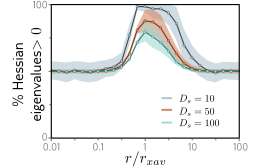

本章不同于前面的章节。它不展示已确立的结果，而是探讨了深度学习为何和如何取得显著成功的问题，这些问题在教科书里很少被提及。然而，需明白（尽管本书的标题所示），我们对深度学习的理解还很有限。

我们发现，深度网络之所以易于训练及其泛化能力强，都是令人惊异的现象。接下来，我们将逐一分析这些议题。我们将探讨影响训练成功的各种因素，并讨论深度网络损失函数的已知信息。接着，我们分析影响泛化能力的因素。最后，我们讨论网络是否需要过度参数化和深化的问题。

## 20.1 深度学习的质疑
MNIST-1D 数据集（图 8.1）只有40个输入维度和10个输出维度。在每层具有足够的隐藏单元的情况下，一个两层全连接网络能够完美分类10000个 MNIST-1D 训练数据点，并合理泛化到未见样本（图 8.10a）。实际上，我们已经习以为常，认为只要隐藏单元足够，深度网络几乎可以完美分类任意训练集，并预期这样的模型会对新数据具有泛化能力。然而，训练过程的成功和模型的泛化能力并非不言自明。本节将阐述为何这两个现象令人意外。

### 20.1.1 训练
在每层有 43 个隐藏单元（约 4000 参数）的情况下，两层全连接网络在 10000 个 MNIST-1D 训练样本上的表现是完美的。然而，寻找任意非凸函数的全局最小值是 NP-困难问题（Murty & Kabadi, 1987），这同样适用于特定的神经网络损失函数（Blum & Rivest, 1992）。算法避免陷入局部最小值或鞍点，有效利用模型剩余容量拟合未解释的训练数据，这非常显著。

参数远超训练数据时，这种成功似乎不足为奇。但这种情况是否普遍存在还有待商榷。AlexNet 拥有 6000 万参数，训练了约 100 万个数据点，且每个训练样本增加了 2048 个变换。GPT-3 则有 1750 亿参数，训练了 3000 亿个 token。这两个模型是否过参数化尚无定论，但它们的训练都取得了成功。

总之，我们能够可靠且高效地拟合深度网络，这本身就值得惊讶。数据、模型、训练算法或它们的某种组合，一定有些特殊的属性，才使这成为可能。

### 20.1.2 泛化
神经网络的高效拟合已经足够令人惊讶，而它们对新数据的泛化能力则更是难以理解。首先，典型数据集是否足以描述输入/输出映射并不是显然的。维数灾难告诉我们，训练数据集与可能的输入相比简直微不足道；例如，若 MNIST-1D 数据的每个输入都有 10 种可能值，将产生 10^40 个可能的输入，这是训练样本数量的 10^35 倍。

其次，深度网络能描述极其复杂的函数。一个具有 400 个单元的两层全连接网络可以为 MNIST-1D 创建多达 10^42 个线性区域，大约为每个训练样本 10^37 个区域，训练阶段的大部分区域都不包含数据；但是，包含数据点的区域会限制其他区域，使之表现合理。

第三，模型的泛化能力随着参数数量增加而提高（图 8.10）。前面提到的模型有 177,201 个参数，假定每个参数可以拟合一个训练样例，它有 167,201 个额外自由度。这种参数过剩让模型在训练数据间的行为几乎无拘无束，但它依然表现得很合理。

### 20.1.3 深度学习的不合理效果
总结来说，深度网络的拟合与泛化能力并不是自明的。从理论上讲，深度学习本不应有效，但实际却大有成效。本章将探讨这背后的原因。20.2 至 20.3 节将阐述我们对深度网络拟合及其损失函数的理解；20.4 至 20.6 节将讨论泛化问题。

## 20.2 影响拟合性能的因素
图 6.4 展示了非线性模型的损失函数具有局部最小值和鞍点。尽管如此，我们能够可靠地训练深度网络以适应复杂的训练集，如图 8.10 所示，MNIST-1D、MNIST 和 CIFAR-100 上的训练表现均达到完美。本节将探讨可能化解这种矛盾的因素。

### 20.2.1 数据集
我们需要认识到，并非所有函数都能被学习。以将每个可能的 28×28 二进制图像随机映射到十个类别中的一个为例，这样的函数没有固定结构，因此唯一的方法是记住 2^784 的映射。然而，在包含 60,000 个标记为十类之一的 28×28 图像的 MNIST 数据集上进行训练却相对容易（见图 8.10 和 15.15）。这种矛盾可能因为我们试图近似的现实世界函数相对简单，更容易找到全局最小值。

这一假设由 Zhang 等人在 2017 年的研究中得到验证，他们对 CIFAR-10 图像分类数据集进行了实验，其中一是将每个图像替换为高斯噪声，二是随机置换了十个类别的标签（见图 20.1）。这些变化降低了学习速度，但网络仍然能够很好地适应这个有限的数据集。这表明数据集的特性并非决定性因素。

### 20.2.2 正则化
模型易于训练的另一个原因可能是某些正则化方法，例如 L2 正则化（权重衰减），让损失函数的表面变得更加平滑和接近凸形。但是，Zhang 等人（2017a）的研究发现，无论是 L2 正则化还是 Dropout 都不是拟合随机数据所必需的。这不排除由拟合算法的有限步长带来的隐式正则化（见第 9.2 节）。尽管这种影响随学习率增大而加剧（参见公式 9.9），模型拟合的难度并未因较大的学习率而减小。

### 20.2.3 随机训练算法
第 6 章提到，SGD 算法可能使优化过程在训练期间穿越不同的“谷”。但 Keskar 等人（2017）证明了，使用大批量（5000-6000 图像）的方法，多个模型（包括全连接和卷积网络）可以在多个数据集（包括 CIFAR-100 和 MNIST）上几乎完美地拟合。这大大减少了随机性，但训练依然取得了成功。

图 20.2 展示了四个全连接模型使用全批量（非随机）梯度下降，在 4000 个带随机标签的 MNIST-1D 示例上的训练结果。过程中没有使用显式正则化，学习率被设定为较小的恒定值 0.0025，以尽量减少隐式正则化的影响。尽管数据到标签的映射没有固定结构，训练是确定性的，未经正则化，训练误差还是降到了零。这暗示这些损失函数可能确实不存在局部最小值。

### 20.2.4 过参数化
过参数化无疑是促进训练简化的一个关键因素。这表明存在一个庞大的等效解集合，因此几乎总能找到一个方向来调整参数以减少损失。Sejnowski（2020）指出，“...解的等效性改变了问题本质，从海量的稻草堆中找到一根针变成了找到一个充满针的稻草堆。”

在实际应用中，网络常常被过度参数化至一个或两个数量级（如图 20.3 所示）。然而，数据增强的使用使得精确陈述变得复杂。数据增强可能将数据量增加数个数量级，但这些仅是对现有示例的变换，而非新增独立数据点。此外，如图 8.10 所示，即使参数数量与数据点数量相当或更少，神经网络有时也能很好地拟合训练数据，这可能归因于相同基础函数下训练样本的冗余性。

多项理论研究结果表明，在特定条件下，如果网络过度参数化，随机梯度下降（SGD）能收敛至全局最小值。例如，Du 等人（2019b）发现，对于具有足够隐层单元的浅层全连接 ReLU 网络，随机初始化的 SGD 能够收敛至最小二乘损失的全局最小值。类似地，Du 等人（2019a）研究了当激活函数是平滑且Lipschitz连续时的深度残差网络和卷积网络。Zou 等人（2020）分析了在使用铰链损失函数的深层全连接网络上梯度下降的收敛性。Allen-Zhu 等人（2019）考察了使用 ReLU 激活函数的深层网络。

如果神经网络过度参数化到可以记忆任意固定大小的数据集，那么所有静止点将成为全局最小值（Livni 等人，2014；Nguyen & Hein，2017, 2018）。其他研究结果表明，如果网络足够宽，则高于全球最小值的局部最小值很少出现（参见 Choromanska 等人，2015；Pascanu 等人，2014；Pennington & Bahri，2017）。Kawaguchi 等人（2019）证明，随着网络变得更深、更宽或两者兼有，局部最小值处的损失会趋近于全局最小值，特别是对于平方损失函数而言。

这些理论成果令人兴奋，但它们通常基于对网络结构的不切实际假设。例如，Du 等人（2019a）发现，当网络宽度 D（即隐层单元数）为 Ω[I^4K^2] 时，残差网络能够收敛到零训练损失，其中 I 是训练数据量，K 是网络深度。类似地，Nguyen & Hein（2017）的假设认为网络宽度超过数据集大小，这在大多数实践情境中并不现实。过参数化显然很重要，但当前的理论还不能完全解释实证的拟合性能。

### 20.2.5 激活函数
激活函数的选择显著影响训练难度。相比 ReLU（其变化覆盖了半个输入范围）和 Leaky ReLU（覆盖整个输入范围），在输入范围的小部分内变化的激活函数使得网络更难以拟合；例如，sigmoid 和 tanh 函数（如图 3.13a 所示）在其尾部具有较浅的梯度，在激活函数近似常数的区域，训练梯度接近零，因此无法有效改善模型。

### 20.2.6 初始化
Xavier/He 初始化将参数设置为易于优化的值，这是另一个可能的解释。显然，对于更深层的网络，这种初始化是避免梯度爆炸和消失不可或缺的，因此在一定意义上，初始化对训练的成功至关重要。但对于较浅的网络，权重的初始方差就显得不那么重要。Liu 等人（2023c）在 1000 个 MNIST 数据点上训练了一个三层全连接网络，每层有 200 个隐藏单元。他们发现，随着方差从 He 建议的值增加，拟合训练数据所需的迭代次数也随之增加（如图 20.4 所示），但这并未最终阻碍拟合。因此，虽然爆炸/消失的梯度揭示了使训练困难的初始化条件，初始化并没有完全解释拟合神经网络为何较为容易。

### 20.2.7 网络深度
由于梯度爆炸和消失（如图 7.7 所示）以及碎裂梯度（如图 11.3 所示），深层神经网络更加难以拟合。但这些主要是实际的数值问题，并无确凿证据表明随着网络深度增加，底层损失函数的凸性会有本质的增减。图 20.2 显示，在使用 He 初始化的 MNIST 数据上，更深的网络在更少的迭代次数内完成训练。这可能是因为更深网络的梯度更为陡峭，或者 He 初始化使得宽而浅的网络从更远离最优参数的点开始训练。

Frankle & Carbin（2019）通过对小型网络如 VGG 的研究，展示了通过先训练网络，再剪裁幅度最小的权重，并从相同的初始权重重新训练，可以获得相同或更优的性能。如果权重随机重新初始化，则此方法不适用。他们认为，原始的过参数化网络含有可训练的小型子网络，足以提供所需的性能，这种现象被称为彩票假设，这些高效的子网络被视为“获胜彩票”。这表明，在拟合过程中，有效子网络的数量可能具有关键作用。尽管如此，对于固定的参数数量，这种作用可能随网络深度而变化，但目前还缺乏对这一现象的精确描述。

## 20.3 损失函数的属性
前一部分讨论了促使神经网络易于训练的因素。参数的数量（过参数化程度）和激活函数的选择都是关键因素。然而，数据集的选择、拟合算法的随机性以及正则化的应用似乎并不那么重要。目前还没有明确的证据表明（对于给定的参数数量）网络的深度（除了因梯度爆炸/消失/碎裂而引起的数值问题外）具有重要影响。本节从损失函数的经验属性这一不同角度探讨了相同的主题。大多数证据来源于全连接网络和卷积神经网络（CNN）；而对 Transformer 网络的损失函数了解较少。

### 20.3.1 多个全局最小值
我们期待深层网络的损失函数存在大量等价的全局最小值。在全连接网络中，可以改变每层隐藏单元及其相关权重的排列而不改变输出。在卷积网络中，适当改变通道和卷积核的排列也不会改变输出。在任何 ReLU 函数前乘以权重，在其后除以一个正数，同样不会改变输出。引入批量归一化（BatchNorm）会产生额外的冗余，因为它重置了每个隐藏单元或通道的均值和方差。

这些修改对每个输入都产生相同的输出。然而，全局最小值仅取决于训练数据点上的输出。在过参数化网络中，还存在着一些在数据点上行为相同但在其间行为不同的解集合，这些也都属于全局最小值。

### 20.3.2 到达最小值的路径
Goodfellow 等人（2015b）研究了从初始参数到最终值之间的直线路径。他们发现，沿此路径的损失函数通常呈单调递减（尽管有时起始处会有小幅波动）。这一现象在不同类型的网络和激活函数中都有观察到（如图 20.5a 所示）。

当然，实际的优化路径并非直线。然而，Li 等人（2018b）发现，它们实际上位于低维子空间中。这归因于损失景观中存在大而近乎凸的区域，这些区域在早期捕捉到优化轨迹，并将其朝几个关键方向引导。有趣的是，Li 等人（2018a）发现，即使将优化限制在一个随机的低维子空间中，网络的训练仍然表现良好（如图 20.6 所示）。

Li & Liang（2018）研究表明，随着网络宽度增加，训练中参数的相对变化减少；对于更宽的网络，参数起始值较小，相对变化幅度也较小，并且在更少的步骤内收敛。

### 20.3.3 极小值间的关联
Goodfellow 等人（2015b）考察了两个独立确定的最小值间直线路径上的损失函数变化，发现在这两点之间损失显著增加（见图 20.5b），表明良好的最小值通常不直接线性连接。然而，Frankle 等人（2020）发现，如果网络在最初相同的训练条件下开始，后来允许通过不同的 SGD 噪音和增强策略分开发展，这种损失增加会消失。这说明解决方案在训练初期就受到约束，而且某些最小值族可以线性连接。

Draxler 等人（2018）在 CIFAR-10 数据集上找到了表现良好但不同的最小值，并证明可以构建一条从一个最小值到另一个最小值的路径，在该路径上损失函数保持较低。他们得出结论，存在一条连续的低损失流形（如图 20.7 所示）。随着网络宽度和深度的增加，这一现象变得更加明显。Garipov 等人（2018）和 Fort & Jastrzębski（2019）也提出了连接最小值的不同方法。

### 20.3.4 损失表面的曲率
随机高斯函数的一个有趣特性是：对于梯度为零的点，当这些点的损失值较低时，函数向下弯曲的方向比例会减小（参见 Bahri 等人，2020）。Dauphin 等人（2014）研究了神经网络损失函数中的鞍点，发现损失与负特征值数量之间存在相关性（见图 20.8）。Baldi & Hornik（1989）分析了浅层网络的误差表面，发现除了鞍点外没有局部最小值。这些研究表明，网络中不良的局部最小值较少或不存在。

Fort & Scherlis（2019）研究了神经网络损失表面上随机点的曲率，发现当权重的 l2 范数处于某个特定范围内时，损失表面的曲率异常正向（见图 20.9），他们将这个范围称为“刚刚好区域”。He 和 Xavier 初始化方法都处于这一范围之内。

## 20.4 决定泛化能力的因素
最近两节分析了影响网络训练成功的因素和神经网络损失函数的相关知识。本节将探讨影响网络泛化能力的因素，这对于理解第 9 章讨论的正则化（旨在促进泛化）非常有补充意义。

### 20.4.1 训练算法
鉴于深度网络通常是过参数化的，训练过程的细节决定了算法收敛到哪个解集中的特定最小值。这些细节中的一些被证明能有效提升泛化能力。

LeCun 等人（2012）发现，相比于全批量梯度下降，随机梯度下降（SGD）具有更优的泛化效果。虽然有观点认为 SGD 的泛化能力超过 Adam（如 Wilson 等人，2017；Keskar & Socher，2017），但最新研究指出，如果仔细调整超参数，二者之间的差异并不明显（Choi 等人，2019）。Keskar 等人（2017）发现，在不使用其他形式正则化的情况下，使用较小批量大小的深度网络能实现更好的泛化。已知较大的学习率通常能带来更好的泛化效果（如图 9.5）。Jastrzębski 等人（2018）、Goyal 等人（2018）以及 He 等人（2019）强调批量大小与学习率的比值对泛化非常关键。He 等人（2019）还证明了这一比值与网络泛化程度存在显著的正相关性，并且为神经网络的泛化能力确立了界限，这一界限与该比值正相关（如图 20.10 所示）。

这些发现支持了随机梯度下降（SGD）会隐式地向损失函数添加正则化项的观点（见第 9.2 节），而这些正则化项的大小取决于学习率。这种正则化改变了参数的更新轨迹，使得它们趋向于泛化良好的损失函数区域。

### 20.4.2 极小点的平坦性
自 Hochreiter & Schmidhuber（1997a）以来，人们推测损失函数中的平坦最小值比尖锐最小值具有更佳的泛化能力（见图 20.11）。简而言之，最小值越平坦，对模型参数的小误差影响越小。这一点也得到了各种理论的支持，比如最小描述长度理论表明，由更少比特定义的模型能更好地泛化（Rissanen，1983）。对于宽广的最小值，存储权重所需的精度更低，因此泛化能力应该更强。

平坦性可以通过几种方法来衡量：一是最小值周围训练损失相似的连通区域的大小（Hochreiter & Schmidhuber，1997a），二是最小值附近的二阶曲率（Chaudhari et al., 2019），三是最小值邻域内的最大损失（Keskar et al., 2017）。但是，需要注意的是，由于 ReLU 函数的非负同质性，对网络的简单重新参数化可能会影响平坦性的估计（Dinh et al., 2017）。

然而，Keskar 等人（2017）通过改变批量大小和学习率发现，平坦性与泛化能力存在相关性。Izmailov 等人（2018）通过平均学习轨迹中多个点的权重，不仅使最小值处的测试和训练表面更平坦，也提高了模型的泛化性。其他正则化技术也可以从这个视角进行理解，例如模型输出的平均化（集成方法）可以使测试损失表面更平坦。Kleinberg 等人（2018）指出，训练过程中较大的梯度方差有助于避免尖锐区域，这解释了为什么减小批量大小和增加噪声能够促进泛化。

以上研究主要考虑了单个模型和训练集的平坦性。然而，尖锐度并不是一个能够预测不同数据集间泛化性能的可靠标准；例如，当 CIFAR 数据集的标签被随机化（导致泛化不可能）时，最小值的平坦度并没有相应地减少（Neyshabur et al., 2017）。

### 20.4.3 架构
网络的归纳偏置是由其结构所决定的，而恰当地选择模型可以大幅度提高泛化。第 10 章介绍了卷积网络，这些网络专为处理规则网格上的数据而设计；它们假定输入的统计特性在各处都相同，因此在不同位置共享参数。同理，Transformers 适用于对置换不变的数据建模，而图神经网络适合于不规则图上的数据表示。架构与数据属性的匹配优于泛化的通用全连接架构（参见图 10.8）。

### 20.4.4 权重的范数
第 20.3.4 节回顾了 Fort & Scherlis（2019）的发现，即权重的 l2 范数在特定范围内时，损失表面的曲率异常正向。该研究还表明，在这个所谓的金发姑娘区域内，l2 权重范数与良好的泛化性能有关（见图 20.12）。权重范数与模型的 Lipschitz 常数间接相关，影响泛化能力：范数过小，模型变化不足以捕捉底层函数的波动；范数过大，则模型在训练点间变化过度，无法平滑插值。

Liu 等人（2023c）利用这一发现解释了 grokking 现象（Power 等人，2022），即在训练误差已降至零后的许多轮次中，泛化性能可能会突然显著提升（见图 20.13）。grokking 发生于权重范数起初过大的情况下；尽管训练数据拟合良好，但模型在数据点间的变化较大。随时间推移，隐式或显式正则化减小权重范数，直至进入金发姑娘区域，此时泛化能力得以突然提高。

### 20.4.5 过参数化
图 8.10 展示了泛化性能随过参数化程度的增加而提升的趋势。结合偏差/方差权衡曲线后，可以观察到双重下降现象。这种提升的可能解释是，在模型过参数化的情况下，网络在训练数据点之间变得更平滑的自由度更高。

因此，权重的范数同样可以用来解释双重下降现象。当参数数量接近数据点数量时（模型此时会扭曲自己以精确拟合这些点），权重的范数会增大，进而降低泛化性能。随着网络加宽和权重数量的增加，这些权重的总范数开始减小；权重采用与网络宽度成反比的方差进行初始化（即使用 He 或 Glorot 初始化方法），权重从其初始值变化甚微。

### 20.4.6 超出数据流形
迄今为止，我们探讨了模型对从训练数据相同分布中提取的新数据的泛化能力。这在实验中是一个合理假设。但是，实际部署的系统可能会遇到由噪声、数据统计特征随时间变化或故意攻击引起的意外数据。显然，在这种情况下做出明确的判断更为困难，但 D’Amour 等人 (2020) 的研究表明，在损坏数据上用不同种子训练的相同模型的变异性可能非常大且不可预测。

Goodfellow 等人 (2015a) 的研究证实了深度学习模型对对抗性攻击的脆弱性。想象一下对一个网络正确识别为“狗”的图像进行扰动，以便尽可能快地减少正确类别的概率直到类别改变。如果这幅图像现在被识别为飞机，人们可能会预期扰动后的图像看上去是狗和飞机的混合物。然而，实际上，扰动后的图像与原始的狗图像几乎毫无区别（见图 20.14）。

我们得出的结论是，有些位置虽接近但不位于数据流形上，却会被误分类，这些位置就是所谓的对抗性示例。它们的存在令人意外；如此细微的网络输入变化如何能引起输出的剧烈变化？目前最合理的解释是，对抗性示例并非因为缺乏对训练数据流形外数据的鲁棒性。而是因为它们利用了训练数据中的某种信息，这种信息虽然范数小且对人不可察觉，但却足以造成影响（Ilyas 等人，2019）。

## 20.5 真的需要这么多参数吗？
第 20.4 节讨论了模型在过参数化（Over-parameterized）情况下更易于泛化的观点。实际上，在处理复杂数据集时，极少有模型的参数数量明显低于训练数据点数却能达到顶尖水平的例子。

然而，第 20.2 节回顾了证据表明，随着参数数量的增加，训练过程变得更加容易。因此，目前还不清楚是小模型固有属性的限制导致它们表现不佳，还是训练算法未能为小模型找到有效的解决方案。模型修剪（Pruning）和蒸馏（Distilling）是两种用于缩减训练模型大小的方法。本节将探讨这些方法是否能够生成既小又保持过参数化模型性能的欠参数化模型。

### 20.5.1 剪枝
通过修剪训练模型可以减小模型大小，进而降低存储需求（图 20.15）。最简单的修剪方法是去除个别权重，可以根据损失函数的二阶导数（LeCun 等人，1990；Hassibi & Stork，1993）或更实用地，根据权重的绝对值来进行（Han 等人，2016, 2015）。还有研究通过修剪隐藏单元（Zhou 等人，2016a；Alvarez & Salzmann，2016）、卷积网络的通道（Li 等人，2017a；Luo 等人，2017b；He 等人，2017；Liu 等人，2019a）或残差网络的整层（Huang & Wang，2018）来减小模型。修剪后，通常会对网络进行微调，有时这一过程还需重复。

举例来说，Han 等人（2016）在只保留 8% 权重的情况下，VGG 网络在 ImageNet 分类任务上仍然保持了良好的性能。这显著降低了模型大小，但还不足以证明非过参数化模型不可行；VGG 网络的参数数量是 ImageNet 训练数据的约 100 倍（未计入数据增强）。

修剪本质上是一种架构搜索过程。Frankle & Carbin（2019）在其关于彩票假说的研究（见第 20.2.7 节）中，首先训练网络，然后修剪幅度最小的权重，并从相同初始权重开始对剩余网络进行重新训练。通过重复这个过程，他们在 CIFAR-10 数据集（60,000 样本）上将 VGG-19 网络（原有 1.38 亿参数）的大小减少了 98.5%，同时维持了良好的性能。对于 ResNet-50（有 2,560 万参数），他们在不损失 ImageNet（1,280 万样本）上的性能的情况下，将参数减少了 80%。这些成果虽然印象深刻，但即使是修剪后（不考虑数据增强），这些网络仍然过参数化。

### 20.5.2 知识蒸馏
通过训练一个较小的网络（学生）模仿一个较大网络（教师）的性能，也可以减少模型参数。这种方法称为知识蒸馏，最早由 Buciluǎ 等人（2006）提出。Hinton 等人（2015）发现，不同输出类别间的信息模式很重要，并且他们训练了一个小型网络以近似大型网络的 Softmax 函数前的 logits（图 20.16）。

Zagoruyko & Komodakis（2017）进一步推动了学生网络的激活空间图与教师网络在多个点上的相似性。他们利用这种注意力转移方法来模拟一个 34 层残差网络（大约 6300 万参数）与一个 18 层残差网络（大约 1100 万参数）在 ImageNet 分类任务上的性能。然而，这个参数数量仍然超过了训练样本的数量（大约 100 万图像）。尽管现代方法（例如 Chen 等人，2021a）取得了一定进展，但目前为止，知识蒸馏还没有确凿证据证明欠参数化模型能够有良好的表现。

### 20.5.3 讨论
目前的证据显示，至少对于当前使用的数据集大小和复杂度来说，过参数化对于模型的泛化是必要的。目前尚无证据显示，在复杂数据集上能用远少于训练样本的参数实现顶尖性能。尽管尝试通过修剪或蒸馏已训练的网络来减小模型的规模，但这并未改变过参数化的必要性。

此外，最近的理论研究发现模型的 Lipschitz 常数与过参数化之间存在一种权衡关系。Bubeck & Sellke（2021）的研究表明，在 D 维空间中，要实现平滑插值，所需的参数数量是仅进行插值所需参数的 D 倍。他们认为，目前用于大型数据集（如 ImageNet）的模型过参数化程度还不够，进一步增加模型容量可能是提升性能的关键。

## 20.6 网络必须深吗？
第 3 章探讨了通用逼近定理，定理指出只要隐藏单元足够多，浅层神经网络能以任意精度逼近任何函数。这就引出了一个明显的问题：神经网络是否必须要深层结构。

首先，我们需要考虑支持深度必要性的证据。从历史上看，性能与网络深度之间存在明确的相关性。比如，最初在 ImageNet 基准测试上的性能随着网络深度的增加而提升，直至训练遇到困难。此后，引入残差连接和批量归一化（第 11 章）使得更深层次网络的训练成为可能，并带来了性能的显著提升。截至目前，几乎所有的顶尖应用，如图像分类（例如视觉 Transformer）、文本生成（例如 GPT3）和文本引导的图像合成（例如 DALL·E-2），都是基于拥有数十甚至数百层的深度网络。

尽管趋势如此，也有研究尝试使用浅层网络。Zagoruyko & Komodakis（2016）构建了较浅但较宽的残差神经网络，性能与 ResNet 相当。近期，Goyal 等人（2021）设计了一个仅有 12 层的网络，通过并行卷积通道达到了与深层网络相似的性能。Veit 等人（2016）的研究显示，在残差网络中，通常是 5 至 17 层的较短路径决定了网络性能。

然而，总体证据表明深度至关重要；即使是性能优良的图像分类网络也需要超过 10 层。目前还没有明确解释为什么会这样。可能的原因包括：（i）深度网络能表示更为复杂的函数，（ii）深度网络更易训练，（iii）深度网络能提供更好的归纳偏好。

### 20.6.1 建模函数的复杂度
第 4 章显示，与浅层网络相比，深层网络在相同参数量下可以形成更多的线性分割区域。我们还注意到，一些特殊的“病态”函数被识别出来，相比于深层网络，使用浅层网络来建模这些函数需要远多的隐藏单元（如 Eldan & Shamir，2016；Telgarsky，2016）。事实上，Liang & Srikant（2016）发现了一些由深层网络更有效建模的广泛函数族。然而，Nye & Saxe（2018）发现，这些函数中的一些在实践中并不易于被深层网络拟合。此外，几乎没有证据显示我们试图逼近的现实世界函数具有这种特殊属性。

### 20.6.2 训练的可行性
另一个解释是，尽管拥有实际数量的隐藏单元的浅层网络理论上可以支持顶尖性能，但找到一个既能良好拟合训练数据又能合理进行插值的有效解决方案非常困难。

一个验证这一点的方法是将成功的深层网络蒸馏成较浅但更宽的学生模型，并检验是否能保持性能。Urban 等人（2017）将 CIFAR-10 数据集上的 16 个卷积网络集成体蒸馏到不同深度的学生模型中。他们发现，浅层网络无法复制更深的教师网络的性能，学生模型的性能随着深度的增加而在固定的参数量下提高。

### 20.6.3 归纳偏见
当前多数模型依赖于卷积块或 Transformer。这些网络对输入数据的局部区域共享参数，并且常常逐步将这些信息融合到整个输入中。这种设计限制了网络能够表示的函数类型，并不具有普遍性。因此，深度网络之所以优越，部分原因是它们具有合适的归纳偏置，而且让浅层网络遵循这些限制相当困难。

多层卷积架构似乎天生就有益处，即便是在未经训练的情况下也是如此。Ulyanov 等（2018）证明了未经训练的 CNN 结构可以作为低级任务，如去噪和超分辨率的先验。Frankle 等（2021）通过随机初始化核，固定它们的值，仅训练批归一化的偏移和缩放因子，就在图像分类任务中达到了良好的性能。Zhang 等（2017a）发现，随机初始化的卷积滤波器的特征可以支持后续使用核模型的图像分类。

来自 Urban 等（2017）的进一步证据显示，卷积网络提供了有用的归纳偏置，他们试图将卷积网络转换为更浅的网络。研究发现，与转换到全连接网络相比，向卷积架构的转换系统地表现更佳，说明卷积架构具有某些内在优势。由于卷积网络的序贯局部处理不易被更浅的网络模仿，这强调了深度的重要性。

## 20.7 Summary
本章论述了深度学习的成功令人意外的论点。我们探讨了优化高维损失函数的挑战，并认为过参数化和激活函数选择是使深度网络可行的两个关键因素。我们观察到，在训练过程中，参数在低维子空间中移动，趋向于一系列相连的全局最小值，并且局部最小值并不显著。

神经网络的泛化能力也随着过参数化而增强，但最小值的平坦度和架构的归纳偏置也同样重要。尽管原因尚不明确，但看来，要实现良好的泛化，大量的参数和多层网络都是必需的。

仍有许多问题未得到解答。我们目前没有确切的理论来预测训练和泛化何时会成功或失败。我们还不了解深度网络学习的极限，也不清楚是否存在更高效的模型。我们不确定在同一模型中是否存在能更好泛化的参数。深度学习的研究依旧依赖于经验示范，这些成果虽然印象深刻，但我们对深度学习机制的理解尚未达到相匹配的水平。

## Problems
问题 20.1 在 ImageNet 图像分类任务中，输入图像的分辨率为 224×224 像素，每个像素点包含 RGB 三通道的颜色值。如果将这些 RGB 值粗略地量化到每个通道十个等级，并且用大约 1000 万个训练样本进行训练，每个训练数据点会有多少种可能的输入？

问题 20.2 考虑图 20.1。为什么当像素被随机化时，相比于标签被随机化，算法能更快地拟合数据呢？

问题 20.3 图 20.2 展示了使用固定学习率的非随机拟合过程成功地拟合了随机数据。这是否表明损失函数没有局部最小值？这是否意味着该函数是凸形的？请对你的回答进行证明，并且如果你认为以上任何一种说法是错误的，请给出反例。

## 附图

图 20.1 拟合随机数据。训练在 CIFAR-10 数据集上的 AlexNet 架构所得的损失。当像素从一个与原始数据有相同均值和方差的高斯随机分布中抽取时，尽管速度更慢，但模型仍然能够拟合。当标签随机化后，模型的拟合过程进一步放缓。改编自 Zhang et al. (2017a)。

图 20.2 MNIST-1D 训练。利用完全批量梯度下降、He 初始化（He initialization）、无动量或正则化，以及 0.0025 的学习率，四个全连接网络被用来拟合 4000 个带有随机标签的 MNIST-1D 示例。1、2、3、4 层的模型分别具有 298、100、75、63 个隐藏单元，以及 15208、15210、15235、15139 个参数。所有模型均成功训练，但深层模型需要的训练周期更少。

图 20.3 过参数化。作为卷积网的过参数化（相对于数据集大小的倍数）的函数，ImageNet 的性能展示了大部分模型的参数是训练样例的 10 至 100 倍。比较的模型包括 ResNet (He et al., 2016a,b)、DenseNet (Huang et al., 2017b)、Xception (Chollet, 2017)、EfficientNet (Tan & Le, 2019)、Inception (Szegedy et al., 2017)、ResNeXt (Xie et al., 2017) 和 AmoebaNet (Cubuk et al., 2019)。

图 20.4 初始化和拟合。一个具有每层 200 个隐藏单元的三层全连接网络在使用 AdamW、一位热目标（one-hot targets）和均方误差损失（mean-squared error loss）训练的 1000 个 MNIST 示例上进行了训练。使用较大倍数的 He 初始化时，虽然拟合网络需要更长时间，但最终结果不受影响。这可能仅仅反映了权重需要移动更长的距离。改编自 Liu et al. (2023c)。

图 20.5 通过损失函数的线性切片。a) 一个在 MNIST 上训练的两层全连接 ReLU 网络，其损失沿着从初始参数（δ=0）到训练参数（δ=1）的直线单调下降。b) 然而，在 MNIST 上的这个两层全连接 MaxOut 网络中，损失在一个解（δ=0）和另一个解（δ=1）之间的直线上却有所增加。改编自 Goodfellow et al. (2015b)。

图 20.6 子空间训练。一个包含两个隐藏层、每层 200 个单元的全连接网络在 MNIST 上进行训练。参数通过标准方法（如 He 初始化）初始化后，被限制在一个随机子空间内。在这个子空间为 750D（即内在维度）时，性能可达到无约束模型性能的 90%，仅占原始参数的 0.4%。改编自 Li et al. (2018a)。

图 20.7 极小值之间的连接。对 CIFAR-10 上 DenseNet 的损失函数进行切片分析。参数 φ1 和 φ2 代表两个独立发现的极小值。这些参数之间的线性插值展示了一个能量障碍（虚线所示）。但是，在足够深且宽的网络中，能够在两个极小值间找到一条低能量的曲线路径（显示为青色线）。改编自 Draxler et al. (2018)。

图 20.8 损失函数的临界点。a) 在随机高斯函数中，函数在零梯度点下降的方向数随函数值的增加而减少，从而所有极小值都位于较低的函数值。b) Dauphin et al. (2014) 在神经网络的损失面上找到了临界点（即零梯度的点）。研究表明，负特征值（指向下方的方向）的比例随损失的增加而减少，这表明所有的极小值（零梯度且没有向下指向的点）均对应于较低的损失。改编自 Dauphin et al. (2014) 和 Bahri et al. (2020)。

图 20.9 适中区域。在一个随机子空间内，对于一个应用了 ReLU 函数、有两层全连接的网络，在 MNIST 上相对于 Xavier 初始化的参数平方半径 r2，Hessian 的正特征值（反映正曲率/凸性）比例显示了一个明显的正曲率区域，称为适中区域。改编自 Fort & Scherlis (2019)。

图 20.10 批大小与学习率的比率。在 CIFAR-10 数据库上，两种模型的泛化性依赖于批大小与学习率的比例。随着批大小的增加，泛化性下降；随着学习率的增加，泛化性提升。改编自 He et al. (2019)。

图 20.11 平坦与尖峭极小值。平坦极小值通常具有更好的泛化能力。在估计参数或训练和测试损失函数的对齐时，小误差在平坦区域中的影响较小。改编自 Keskar et al. (2017)。

图 20.12 在超球面上进行泛化。一个具有两个隐藏层、每层 200 个单元（198,450 个参数）的全连接网络在 MNIST 数据库上进行了训练。参数被初始化到一个给定的 l2 范数，并被限制在这个范数下维持在一个子空间（垂直方向）。这个网络在由 Xavier 初始化定义的半径 r 的小范围内表现出良好的泛化能力（青色虚线表示）。改编自 Fort & Scherlis (2019)。

图 20.13 Grokking 现象。当参数初始化使其 l2 范数（半径）远大于 He 初始化所指定的时，训练需要更长时间（表示为虚线），泛化过程则更加缓慢（表示为实线）。泛化的滞后归因于权重的范数减少回到“适中区”所需的时间。改编自 Liu et al. (2023c)。

图 20.14 对抗样本。在每个例子中，左侧图像被 AlexNet 正确分类。通过考虑网络输出对输入的梯度，可以找到一个小的扰动（中间图，为了可见性放大了 10 倍），这个扰动加到原始图像（右侧）上时，会使网络错误地将其分类为鸵鸟。这是尽管原始图像和扰动图像对人类来说几乎无法区分的情况下。改编自 Szegedy et al. (2014)。

图 20.15 神经网络剪枝。目标是在不影响性能的前提下尽可能剪枝权重。这通常基于权重的幅值来进行。剪枝后，网络通常需要进行细微调整。a) 示例全连接网络。b) 剪枝后。

图 20.16 知识蒸馏。a) 教师网络用于图像分类，按照常规方法进行训练，采用多类交叉熵作为分类损失。b) 学生网络则使用相同的损失进行训练，并额外增加了蒸馏损失，该损失鼓励学生网络在 softmax 操作前的激活值与教师网络的相同。
