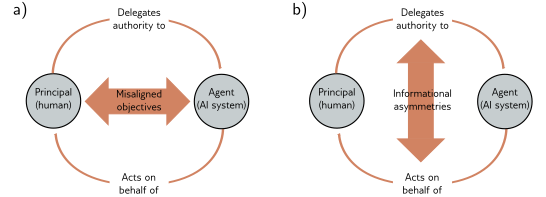
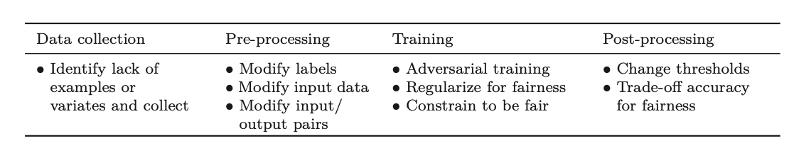
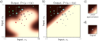

*本章由 Travis LaCroix 和 Simon J.D. Prince 编写。*

人工智能 (AI) 正在成为改变社会的力量，这种改变可能带来好处也可能带来弊端。这些技术在促进社会福祉方面拥有巨大的潜力（Taddeo & Floridi, 2018; Tomašev et al., 2020），尤其体现在医疗保健（Rajpurkar et al., 2022）和抗击气候变化（Rolnick et al., 2023）的重要作用。然而，它们也存在被误用和造成无意伤害的风险。这催生了 AI 伦理学这一领域的发展。

深度学习的现代纪元始于 2012 年的 AlexNet，但 AI 伦理的关注并未随之立即兴起。事实上，一个关于机器学习公平性的研讨会在 2013 年的 NeurIPS 被拒绝，原因是缺乏相关材料。直到 2016 年，随着 ProPublica 对 COMPAS 再犯预测模型中的偏见进行揭露（Angwin et al., 2016）和 Cathy O’Neil 出版的《数学毁灭武器》（O’Neil, 2016），AI 伦理学才迎来了其“AlexNet”时刻。自那以后，对此领域的兴趣急剧增长；自 2018 年首次举办以来，提交给公平、问责和透明会议 (FAccT) 的论文数量增加了近十倍。

同时，许多组织提出了负责任的 AI 政策建议。Jobin 等人 (2019) 发现了 84 份包含 AI 伦理原则的文件，其中 88% 是自 2016 年以来发布的。这些非立法的政策协议大量增加，主要依赖自愿的、非强制性的合作，这让人质疑它们的有效性（McNamara et al., 2018; Hagendorff, 2020; LaCroix & Mohseni, 2022）。总的来说，AI 伦理学仍处于发展初期，其伦理考量往往是事后反应而非主动预防。

本章将探讨由 AI 系统的设计和使用所引发的潜在危害，包括算法偏见、缺乏可解释性、数据隐私侵犯、军事化、欺诈和环境问题。我们的目标不是提供如何更加伦理的建议，而是通过在哲学、政治学和更广泛的社会科学领域受到关注的关键区域内表达观点和开展对话，来启发思考和讨论。

## 21.1 价值观对齐
当我们设计人工智能 (AI) 系统时，我们希望它们的价值观（目标）与人类的价值观保持一致。这通常被称作价值对齐问题（Russell, 2019; Christian, 2020; Gabriel, 2020）。这项挑战主要有三个原因：首先，完整且准确地定义我们的价值观本身就是困难的；其次，把这些价值观转化为 AI 模型的具体目标是一项艰巨的任务；第三，确保模型真正学会实现这些目标也不容易。

在机器学习模型中，损失函数作为我们真实目标的代理指标。当损失函数与真实目标不一致时，我们称之为外部对齐问题（Hubinger et al., 2019）。如果这种代理指标不够完善，系统可能会找到“漏洞”，通过最小化损失函数来达成目标，但实际上却未能满足真正的预期目标。例如，在训练强化学习（RL）智能体玩国际象棋的过程中，如果智能体因捕获棋子而获得奖励，可能导致很多平局而非赢得比赛，这就是我们期望的行为。而内部对齐问题则是确保即使损失函数被准确定义，AI 系统的行为也不会偏离既定目标。如果学习算法未能找到全局最优解，或者训练数据不具备代表性，那么训练可能会收敛于一个与真实目标不一致的解，从而导致不良行为（Goldberg, 1987; Mitchell et al., 1992; Lehman & Stanley, 2008）。

Gabriel (2020) 将价值对齐问题分为技术和规范两部分。技术层面关注的是如何将价值观编码进模型，确保它们可靠地执行既定任务。某些具体问题，比如避免奖励操纵和安全探索，可能存在技术层面的解决方案（Amodei et al., 2016）。而规范层面则关注什么是正确的价值观。考虑到不同文化和社会的价值多样性，这个问题可能没有统一的答案。重要的是，所编码的价值观应代表所有人，而非仅仅是占主导地位的文化群体。

价值对齐也可以被视为一种结构问题，出现在人类主体将任务委托给人工代理的情况中（LaCroix, 2022）。这与经济学中的委托代理问题（Laffont & Martimort, 2002）相似，后者指出任何一方期望另一方代表其最佳利益行事的关系中都存在着内在的竞争激励。在 AI 的背景下，当目标设定不当或当主体与代理之间存在信息不对称时，就可能产生利益冲突（图 21.1）。

AI 伦理的许多议题都可以从价值对齐的结构视角来理解。接下来的部分将讨论偏见与公平、人工道德代理（这两者与目标设定有关）、透明度与可解释性（这两者与信息不对称相关）等问题。

### 21.1.1 偏见和不公正
从科学的角度来看，偏见指的是与某个规范的统计偏离。在 AI 领域，当这种偏离基于非法因素而影响输出时，它便成为了一种恶劣的现象。例如，性别与工作表现无关，因此用性别作为招聘依据是不合理的。同样，种族与犯罪行为无关，所以使用种族作为再犯预测的依据同样是不合理的。

AI 模型中的偏见可能通过以下途径引入（Fazelpour & Danks, 2021）：

- **问题定义**：选择模型的目标需要进行价值判断，这可能导致偏见的产生（Fazelpour & Danks, 2021）。如果我们无法成功实施这些选择，并且问题定义未能准确反映我们的预期目标，进一步的偏见就可能产生（Mitchell et al., 2021）。

- **数据**：当数据集不具代表性或不完整时，算法偏见就可能形成（Danks & London, 2017）。例如，PULSE 面部超分辨率算法（Menon et al., 2020）是基于主要是白人名人的照片数据库训练的。当它用于处理低分辨率的奥巴马肖像时，生成了一张白人男性的照片（Vincent, 2020）。

如果生产训练数据的社会结构对边缘化群体存在偏见，那么即使数据集完整且具有代表性，也会引入偏见（Mayson, 2018）。比如，在美国，黑人相比白人更频繁地遭到警察执法和监禁。因此，用于训练再犯预测模型的历史数据对黑人社群已存在偏见。

- **建模和验证**：选择数学定义来衡量模型的公平性需要进行价值判断。存在多种直观但逻辑不一致的公平性定义（Kleinberg et al., 2017; Chouldechova, 2017; Berk et al., 2017）。这暗示我们需要从纯数学的公平性定义转向更实质性的评估，即算法在实际应用中是否促进了正义（Green, 2022）。

- **部署**：部署的算法可能与社会中的其他算法、结构或机构相互作用，形成复杂的反馈循环，加剧现有偏见（O’Neil, 2016）。例如，大型语言模型如 GPT-3（Brown et al., 2020）是基于网络数据训练的。然而，当 GPT-3 的输出内容被发布到网络上时，未来模型的训练数据质量可能下降，这可能会加剧偏见并产生新的社会伤害（Falbo & LaCroix, 2022）。

不公正的情况可能因交叉性的因素而加剧；不同的社会类别可以交织在一起，形成重叠且相互依存的压迫体系。例如，有色女同性恋者所遭遇的歧视并不仅仅是她因同性恋、性别或种族身份可能遭遇的歧视之和（Crenshaw, 1991）。在 AI 领域，Buolamwini & Gebru（2018）的研究显示，主要针对浅肤色面孔训练的面部分析算法在处理深肤色面孔时性能较差。更严重的是，当考虑皮肤颜色和性别等特征组合时，它们的性能甚至比单独考虑这些特征时还要差。

当然，我们可以采取措施确保数据的多样性、代表性和完整性。但如果生成训练数据的社会本质上对边缘化群体存在结构性偏见，即使数据集再准确，也无法避免引入偏见。鉴于上述算法偏见潜力和训练数据集中的代表性不足，有必要考虑这些系统的输出错误率如何可能加剧对已边缘化群体的歧视（Buolamwini & Gebru, 2018; Raji & Buolamwini, 2019; Raji et al., 2022）。结果产生的模型可能会固化和加深包括资本主义、阶级主义、性别歧视、厌女症、父权制、殖民主义、帝国主义、种族主义、白人至上主义、能力主义以及顺性别和异性恋规范性在内的权力和压迫体系。从维持对权力动态敏感的偏见视角来看，需要考虑数据中编码的历史不公和劳动条件（Micelli et al., 2022）。

为防止这种情况，我们必须积极确保算法的公平性。一种简单的方法是通过无知实现公平，即从输入特征中删除受保护的属性（例如，种族、性别）。但不幸的是，这种方法并不有效；剩余特征仍然可以反映出受保护的属性信息。更实际的方法是首先定义一个数学公平性标准。例如，在二元分类中，分离度量要求预测结果 ŷ 在给定真实标签 y 的条件下，与受保护变量 a（例如，种族）独立。然后通过各种方式干预，以最小化与该公平性度量的偏差（图 21.2）。

一个进一步的复杂因素是，除非我们能够确认社群成员身份，否则我们无法判断算法对某个社群是否不公平或采取避免这种情况的措施。大多数关于算法偏见和公平性的研究都集中在训练数据中可能存在的明显可观察特征上（例如，性别）。然而，边缘化社群的特征可能是不可观察的，这使得减轻偏见变得更加困难。这些特征包括酷儿性、残疾状态、神经多样性、社会阶层和宗教信仰。当从训练数据中移除可观察特征以阻止模型利用它们时，会出现类似的问题。

### 21.1.2 人工道德代理
许多决策领域并不涉及具有道德意义的行为。例如，选择下一步国际象棋走法并无明显的道德影响。然而，在某些情况下，行为可能具有重要的道德意义。这包括自动驾驶汽车中的决策（Awad et al., 2018; Evans et al., 2020）、致命自主武器系统（Arkin, 2008a,b）以及用于儿童保育、老年护理和医疗护理的专业服务机器人（Anderson & Anderson, 2008; Sharkey & Sharkey, 2012）。随着这些系统变得更加自主，它们可能需要独立于人类输入做出道德决定。

这引入了人工道德代理的概念，即一个能够独立作出道德判断的自主 AI 系统。道德代理可以按复杂性递增分为几类（Moor, 2006）：

1. 伦理影响代理，其行为具有伦理影响，因此几乎所有部署在社会中的技术都可以视为伦理影响代理。
2. 隐含伦理代理，除了具有伦理影响外，还包括一些内置的安全功能。
3. 显式伦理代理，能够根据情境遵循一般的道德原则或伦理行为规则。
4. 完全伦理代理，具有信仰、欲望、意图、自由意志，并对其行为具有自觉认识。

机器伦理学领域致力于寻找创建人工道德代理的方法。这些方法可以分为自上而下、自下而上或混合型（Allen et al., 2005）。自上而下（理论驱动）方法直接基于某种道德理论实施并层级排列具体规则来指导伦理行为。阿西莫夫的“机器人三定律”是这种方法的一个简单例证。

在自下而上（学习驱动）方法中，模型通过数据学习道德规律，无需显式编程（Wallach et al., 2008）。例如，Noothigattu et al.（2018）设计了一个基于投票的伦理决策系统，通过从道德困境中收集的人类偏好数据来学习社会偏好；然后该系统总结并汇总这些结果，以做出“伦理”决策。混合方法结合了自上而下和自下而上的策略。

一些研究人员对人工道德代理的可行性提出了质疑，并主张道德代理对确保安全并非必需（van Wynsberghe & Robbins, 2019）。Cervantes et al.（2019）对人工道德代理进行了最新的调查研究，而 Tolmeijer et al.（2020）则对人工道德代理的技术方法进行了最新的调查研究。

### 21.1.3 透明与不透明
当一个复杂的计算系统的运作细节全部明晰时，我们称之为透明。如果人们能够理解它如何做决策，那么这个系统便是可解释的。透明性或可解释性的缺失导致用户与 AI 系统间的信息不对称，这使得确保价值对齐变得困难。

Creel（2020）从不同的粒度级别对透明性进行了阐述。功能性透明性关乎系统算法功能的知擂（即输入与输出间的逻辑规则）。本书所述方法即在此层面详细介绍。结构透明性则是指了解程序如何执行算法，在高级编程语言编写的命令被机器码执行时，这种透明性可能受到阻碍。而运行透明性要求理解程序在特定情况下如何运行，对于深度网络而言，这涉及对硬件、输入数据、训练数据及其互动的了解，这些细节无法仅通过审查代码来获取。

以 GPT3 为例，其在功能上是透明的，其架构已在 Brown 等人（2020）的研究中描述。然而，由于无法访问代码，它在结构上不透明，同样，由于无法获取到学习过的参数、硬件或训练数据，它在运行上也不透明。其后续产品 GPT4 则完全缺乏透明性，这个商业产品的运作细节尚不为外界所知。

### 21.1.4 可解释性与可解读性
即使系统透明，我们也不一定能理解其决策如何形成，或决策依据何种信息。深度网络含有数十亿参数，单凭检查无法完全明了其工作机制。然而，在某些地区，公众有权获取决策解释。例如，欧盟通用数据保护条例第22条指出，在决策完全基于自动化过程时，所有数据主体都应享有获得决策解释的权利。

这种挑战催生了解释性 AI 的子领域。在这一领域内，局部解释取得了一定成效。虽然无法对整个系统进行解释，但我们可以解释特定输入如何被分类。比如，LIME（Local interpretable model-agnostic explanations, Ribeiro 等，2016）通过采样模型在临近输入上的输出，构建一个简化模型（图 21.3），为分类决策提供了洞见，哪怕原模型不透明且难以解释。

复杂决策系统是否能对用户乃至其创造者完全可理解，目前尚无定论。对于系统何为可解释、可理解或可诠释，学界仍有持续讨论（Erasmus 等，2021）；目前这些概念尚无确切定义。关于这一主题的更多信息，可参考 Molnar（2022）。

## 21.2 故意误用
上文提到的问题主要是由于目标不明确和信息不对称造成的。但即使在系统正常运行的情况下，也可能出现不道德的行为或被有意滥用。这一节将着重探讨由于 AI 系统被滥用而引发的一些特别的伦理问题。

### 21.2.1 人脸识别与分析
面部识别技术极易被滥用。例如，威权国家可能利用这项技术识别和镇压抗议者，危及民主的核心价值，如言论自由和抗议权。Smith & Miller（2022）指出，自由民主的价值观（如安全、隐私、自治和问责）与这些技术的潜在应用场景（如边境安全、刑事侦查、国家安全和个人数据商业化）之间存在冲突。因此，不少研究人员、活动家和政策制定者开始质疑这项技术的存在合理性（Barrett，2020）。

而且，这些技术经常未能实现它们所宣称的功能（Raji et al., 2022）。比如纽约大都会交通局在面部识别的概念验证试验中100%失败率的情况下，仍推进并扩大了该技术的使用（Berger，2019）。类似地，面部分析工具常常夸大其能力，如声称能推断个人的性取向（Leuner，2019）、情感（Stark & Hoey，2021）、聘用潜力（Fetscherin et al., 2020）或犯罪可能性（Wu & Zhang，2016）。Stark & Hutson（2022）强调，计算机视觉系统已促使面相学和颅相学这些无科学依据、被广泛驳斥的伪科学领域重新浮现。

### 21.2.2 军事化与政治干涉
政府因国家安全和国家建设的需要而投资 AI 研究，这种做法可能引起国家间的武器竞赛，导致高投资、透明度低、相互猜疑和恐惧，以及抢先部署的倾向（Sisson 等人，2020）。

致命的自主武器系统因其容易被想象并且多个系统正在开发中而成为关注焦点（Heikkilä，2022）。同时，AI 也加剧了网络攻击和虚假信息活动的风险，即传播意图欺骗的不准确或误导性信息。AI 系统使得制作极其逼真的假内容成为可能，并有助于信息的针对性传播（Akers 等人，2018）和大规模传播（Bontridder & Poullet，2021）。

Kosinski 等人（2013）研究表明，通过社交媒体上的“点赞”就能预测包括性取向、种族、宗教和政治观点、个性特征、智力、幸福度、使用成瘾物质、父母分离情况、年龄和性别在内的敏感信息。这些信息可以被用来进行操纵，例如影响选民的投票行为。

### 21.2.3 欺诈
遗憾的是，AI 常被用作自动化各类欺诈活动的工具，例如发送钓鱼电子邮件或短信，诱骗人们泄露敏感信息或汇款。生成式 AI 能制造假象，让人误以为自己在与真实实体交互，或产生能误导和欺骗人们的虚假文件。此外，AI 还能提高网络攻击的复杂性，比如制作更加逼真的钓鱼邮件或对抗目标组织的防御措施。

这揭示了机器学习系统透明度呼声的潜在弊端：系统越开放透明，它们就可能越容易遭受安全风险或被恶意行为者利用。例如，像 ChatGPT 这样的生成式语言模型，已经被用于编写软件和电子邮件，这些软件和邮件可能用于间谍活动、勒索软件及其他恶意软件（Goodin，2023）。

人们倾向于将计算机行为人性化，并将意义投射到符号串上，这种现象称为 ELIZA 效应（Hofstadter，1995）。这种倾向使人在与高级聊天机器人交互时产生错误的安全感，从而更容易陷入文本欺诈，如网络恋情骗局或商业电子邮件欺诈（Abrahams，2023）。Vélez（2023）指出，一些聊天机器人使用表情符号本质上是利用人的情感反应进行操纵。

### 21.2.4 数据隐私
现代深度学习依赖的大规模众包数据集可能涉及敏感或私人信息。即便移除了敏感信息，借助辅助知识和冗余编码，仍可实现数据集的去匿名化（Narayanan & Shmatikov，2008）。例如，1997年，马萨诸塞州州长威廉·韦尔德的健康记录被一名研究生通过公开选民名单解密，尽管这些记录已删除了诸如患者姓名和地址的直接个人信息。

因此，在医疗和金融等高风险领域应用深度学习技术时，采用以隐私为先的设计策略极为重要。可以采用差分隐私和语义安全（如同态加密或安全多方计算）技术来保障模型训练过程中的数据安全（见 Mireshghallah 等，2020；Boulemtafes 等，2020）。

## 21.3 其它社会、伦理及专业议题
上一节讨论了 AI 可能被有意滥用的情形。这一节将探讨 AI 大规模应用可能带来的其他副作用。

### 21.3.1 知识产权
知识产权（IP）被视为非物理财产，是原创思维的产物（Moore & Himma, 2022）。实际上，许多AI模型的训练基于版权材料。因此，这些模型的部署可能引发法律和道德风险，甚至触犯知识产权（Henderson et al., 2023）。

有时，这些问题非常明显。例如，当语言模型以版权材料的摘录作为输入时，其输出可能直接包含版权文本。在扩散模型中生成图像的情境中，也面临着相似的问题（Henderson et al., 2023; Carlini et al., 2022, 2023）。即便这种训练属于“合理使用”，也可能在某些情况下侵犯内容创作者的道德权利（Weidinger et al., 2022）。

更为微妙的是，生成模型（章节 12,14–18）引发了关于AI与知识产权的新问题。例如，机器学习模型的输出（如艺术、音乐、代码、文本）能否获得版权或专利保护？基于特定艺术家的作品对模型进行微调以复制该艺术家风格的行为，在道德上或法律上是否可接受？知识产权法凸显出现有立法未能预见到机器学习模型的发展。虽然政府和法院可能会在不久的将来建立先例，但在撰写本文时，这些问题仍然未有定论。

### 21.3.2 自动化偏见与道德技能退化
随着社会对AI系统依赖程度的增加，自动化偏见的风险也随之增加，人们期望模型输出是正确的，因为它们被认为是“客观的”。这种情况促使人们认为定量方法优于定性方法。然而，如21.5节所示，那些自称客观的努力很少不带有价值判断。

社会学的技能退化概念指的是，在自动化的背景下，人类技能变得冗余和贬值（Braverman, 1974）。例如，把记忆等认知技能外包给技术可能导致我们记忆能力的衰退。同样，在道德重要性高的决策中采用AI自动化，可能会削弱我们的道德判断能力（Vallor, 2015）。例如，在战争中，自动化武器系统的使用可能使战争受害者被非人化（Asaro, 2012; Heyns, 2017）。类似地，老年、儿童或医疗保健领域中的护理机器人的使用可能削弱我们互相照顾的能力（Vallor, 2011）。

### 21.3.3 环境影响
训练深度网络耗能巨大。Strubell等人（2019, 2020）估计，训练一个拥有2.13亿参数的Transformer模型会产生约284吨二氧化碳排放。Luccioni等人（2022）对训练BLOOM语言模型产生的排放也给出了相似的估算。遗憾的是，封闭和专有模型的增加意味着我们对其环境影响所知甚少（Luccioni, 2023）。

### 21.3.4 就业与社会
技术创新历来伴随着工作岗位的取代。麦肯锡全球研究所在2018年估计，到2030年，AI可能使经济产出增加约13万亿美元，主要通过自动化替代人力（Bughin et al., 2018）。麦肯锡全球研究所的另一项研究显示，从2016年到2030年间，全球多达30%的劳动力（1亿到8亿人）可能因AI而失去工作（Manyika et al., 2017; Manyika & Sneader, 2018）。

然而，预测固然充满挑战，虽然AI的自动化可能导致短期失业，但技术失业被视为“短暂的不适应阶段”（Keynes, 2010）。因为财富增长可以通过增加对产品和服务的需求来抵消生产力的增长所带来的收益，而且新技术能够创造新型工作岗位。

即使自动化最终不会导致长期总就业的净损失，短期内可能仍需推出新的社会计划。因此，不论对AI带来的失业可能性持乐观（Brynjolfsson & McAfee, 2016; Danaher, 2019）、中性（Metcalf et al., 2016; Calo, 2018; Frey, 2019）还是悲观（Frey & Osborne, 2017）看法，显然，社会将经历重大变革。

### 21.3.5 权力集中
随着深度网络的规模扩大，训练这些模型所需的数据和计算能力也随之增长。在这种情况下，小型公司和初创企业可能难以与大型、成熟的科技公司竞争。这可能会形成一个使权力和财富越来越集中于少数公司手中的循环。最近的一项研究发现，在主要AI会议上，大型科技公司和“精英”大学与中等或低等大学之间的发表差距在扩大（Ahmed & Wahed, 2016）。从多个角度看，这种财富和权力的集中与社会公正分配原则不符（Rawls, 1971）。

这促使了对AI民主化的呼声，目标是让每个人都能创建此类系统（Li, 2018; Knight, 2018; Kratsios, 2019; Riedl, 2020）。这个过程需要通过开源和开放科学使深度学习技术更广泛可用和更易于使用，让更多人从中受益。这降低了进入门槛，并提高了AI的可获取性，同时降低了成本，确保了模型的准确性，并提高了参与度和包容性（Ahmed et al., 2020）。

## 21.4 案例研究
我们接下来介绍一个案例研究，它关联到本章讨论的多个问题。2018年，主流媒体报道了一种引发争议的面部分析模型——被昵称为“同性恋识别 AI”（Wang & Kosinski, 2018）——其标题颇为耸动，例如 AI 能判断你是否为同性恋：人工智能从一张照片预测性取向，准确度惊人（Ahmed, 2017）；一种令人惊恐的 AI 能以91%的准确率判断一个人是否为同性恋（Matsakis, 2017）；以及人工智能系统能判断你是否为同性恋（Fernandez, 2017）。

这项工作有若干问题。首先，其训练数据集存在严重偏差，不具有代表性，主要由白人图像构成。其次，鉴于性别和性取向的多样性，其建模和验证过程也存在疑问。第三，这种模型最直接的应用场景是在将同性恋定罪的国家中针对 LGBTQ+ 个体进行有针对性的歧视和迫害。第四，在透明度、可解释性和价值一致性方面，据称，“同性恋识别”模型似乎捕捉到了基于个人打扮、表现和生活方式的表面相关性，而非作者声称的面部结构（Agüera y Arcas et al., 2018）。第五，关于数据隐私，从约会网站上获取“公开”照片和性取向标签的伦理性引发了争议。最后，在科学传播方面，研究者的表达方式明显旨在吸引媒体头条，甚至论文的标题也过于夸大了模型的能力：深度神经网络能够通过面部特征判断性取向。（事实并非如此。）

显然，用于判断性取向的面部分析模型对 LGBTQ+ 社群没有任何正面影响。如果它真要造福社会，最关键的问题是特定的研究、实验、模型、应用或技术是否真正符合所涉及社群的利益。

## 21.5 科学的价值中立理想
本章列举了多种情况，展示了 AI 系统的目标可能无意中或通过误用偏离了人类的价值观。我们进而认为，科学家并非中立的参与者；他们的价值观不可避免地影响到了他们的研究工作。

这可能令人意外。普遍存在一种观点，认为科学是或应当是客观的，这一观点被科学的无价值观理念所体现。许多人认为，机器学习之所以客观，是因为算法本质上是数学。然而，与算法偏见（第21.1.1节）相似，AI 实践者的价值观可能在以下四个阶段影响其工作（Reiss & Sprenger, 2017）：

1. 研究问题的选择。
2. 收集与研究问题相关的证据。
3. 将某一科学假设接受为问题的解答。
4. 应用科学研究结果。

在这些阶段中，价值观在第一和最后阶段发挥着重要作用是较为普遍接受的。研究问题的初选和随后应用的选择，受到科学家、机构和资助机构利益的影响。然而，科学的无价值观理念主张在科学过程中尽量减少道德、个人、社会、政治和文化价值观的影响。这种理念基于价值中立的假设，认为科学家可以（至少在原则上）在处理第（2）和（3）阶段时，避免做出这些价值判断。

然而，无论是有意还是无意，价值观都已融入机器学习研究。这些价值观多数被视为认知价值（例如，性能、泛化能力、基于过去工作、效率、创新性）。但决定这些价值观本身就是一个带有价值倾向的决策；很少有研究明确讨论社会需求，更不用说潜在的负面影响了（Birhane et al., 2022b）。科学哲学家质疑科学的无价值理念是否可行或者理想。例如，Longino（1990, 1996）认为这些认知价值并非完全是认知性的。Kitcher（2011a,b）则认为，科学家通常不是单纯追求真理；而是追求与他们的目标和兴趣相关的真理。

机器学习依赖于归纳推理，因此容易承担归纳风险。模型只能在训练数据点上受到约束，而维度的诅咒意味着这只是输入空间的一小部分；无论我们使用多少数据来训练模型，输出结果总有可能是错误的。因此，选择接受或拒绝一个模型的预测本身就涉及价值判断：即接受错误的风险是否低于拒绝错误的风险。

因此，归纳推理的使用意味着机器学习模型本质上包含了价值观（Johnson, 2022）。实际上，如果不包含价值观，它们就无法发挥作用：它们之所以有用，正是因为它们包含了价值观。因此，认识到算法在现实世界中被用于排名、分类、过滤、推荐、标记、预测等，意味着这些过程将对现实世界产生影响。随着机器学习系统越来越多地商业化和应用，它们在我们关心的领域中的影响也越来越深。

这些见解对于那些认为算法比人类决策者更客观（因此，在我们认为客观性重要的领域应取代人类决策者）的研究者有重要启示。

## 21.6 将负责任的 AI 研究视为集体行动的问题
推卸责任很容易。读过这一章的学生和专业人士可能会认为，他们的工作与现实世界相去甚远，或仅是庞大体系中的一小部分，认为他们的行为无法产生影响。然而，这种想法是错误的。研究者通常可以选择他们投入时间的项目、为之工作的公司或机构、追求的知识、他们交流的社交及智力圈子，以及他们的沟通方式。

做正确的事情，无论这涉及什么，往往会呈现为一个社会难题；最好的结果需要依靠合作，尽管对任何个人来说合作不一定符合其个人利益：负责任的 AI 研究是一个集体性的行动难题。

### 21.6.1 科学交流
一个积极的措施是负责任地进行交流。在多种社交网络中，错误信息比真相传播得更快、更容易持久化（LaCroix et al., 2021; Ceylan et al., 2023）。因此，不夸大机器学习系统的能力（参见上述案例研究）并避免误导性的拟人化非常重要。同样重要的是意识到机器学习技术可能被误用的风险。例如，颅相学和面相学这样的伪科学实践在 AI 领域意外复兴（Stark & Hutson, 2022）。

### 21.6.2 多样性和异质性
鼓励多样性是第二个积极措施。当社会群体同质化（主要由相似成员构成）或趋同（成员倾向于与相似者交往）时，主导群体往往会巩固并稳定其习俗（O’Connor & Bruner, 2019）。一种减轻压迫系统的方法是确保考虑多样化的观点。这可以通过机构层面的公平、多样性、包容性和可访问性举措，研究层面的参与式和基于社区的研究方法，以及个人层面对社会、政治和道德问题的深入了解来实现。

立场认识论（Harding, 1986）认为，知识是受社会位置影响的。技术圈子的同质性可能导致技术偏见（Noble, 2018; Eubanks, 2018; Benjamin, 2019; Broussard, 2023）。缺乏多样性意味着创建技术的个体视角将默认地渗透到数据集、算法和代码中。Broussard（2023）指出，因为许多技术是由健康的白人、顺性别、美国男性开发的，这些技术最优化地服务于这一群体，其视角成为默认标准。确保技术惠及历史上被边缘化的社区，要求研究人员理解这些社区的需求、愿望和视角（Birhane et al., 2022a）。设计正义和参与式及基于社区的 AI 研究方法主张，受技术影响的社区应积极参与技术的设计过程（Constanza-Chock, 2020）。

## 21.7 前行之道
毫无疑问，人工智能 (AI) 将从正面或负面根本改变社会。然而，我们应该谨慎对待那些乐观的、由 AI 驱动的乌托邦式未来社会愿景，并进行深思熟虑的批判性反思。许多所谓的 AI 带来的好处，实际上只在特定情境下对部分社会群体有利。例如，Green (2019) 强调，有项目利用 AI 来提升警察问责制和寻找监禁的替代方案，还有项目旨在通过预测性警务增强安全性，这些都被宣称为“社会良善的 AI”。这种标签的使用实际上是一种缺乏基础原则的价值判断；对一个社区可能是利益，对另一个则可能造成伤害。

在考虑新兴技术对社会潜在益处时，我们必须深入思考这些益处是否能够公平或均等地分配。人们往往误认为最先进的技术方案就是最佳选择，这种观点被称为技术优越主义 (technochauvinism, Broussard, 2018)。但实际上，许多社会问题根源于深层的社会问题，它们并不适合用技术手段解决。

本章讨论了一些共通主题，我们希望向读者强调以下四个关键点：

1. 机器学习 (Machine Learning) 研究无法回避伦理问题。历史上，研究者可以在受控实验室环境中专注于其工作的基本方面。但现在，由于将 AI 商业化的巨大经济激励，以及学术工作受到行业资金的影响（参见 Abdalla & Abdalla, 2021），这种奢侈正在消失；即使是理论研究也可能带来社会影响，因此研究者必须考虑他们工作的社会和伦理维度。
2. 纯技术决策亦充满价值判断。尽管普遍认为 AI 基本上是数学，因此是“客观的”，与伦理无关，但这种观点在我们考虑 AI 系统的创建或部署时并不成立。
3. 我们应质疑 AI 工作所处的结构环境。大量关于 AI 伦理的研究仅聚焦于具体案例，却未对 AI 将运作的更广泛的社会结构提出质疑。例如，确保算法公正性引起了广泛关注，但要在现行的社会和政治结构中实现公正、正义或平等的理念可能并非总是可行的。因此，技术本质上具有政治属性。
4. 社会和伦理问题并非总需要技术方案来解决。围绕 AI 技术的众多潜在伦理问题主要是社会和结构性的，技术创新本身不能解决这些问题；如果科学家想通过新技术带来积极变革，他们必须持有政治和道德立场。

对于普通科学家，这意味着什么？或许他们需要深思自己工作的道德和社会维度。这可能意味着积极参与那些最有可能受到新技术影响的社区，建立研究人员与社区间的联系，并赋权给这些社区。同样，这也可能涉及到跨越自己专业领域的文献研究。对于哲学问题而言，斯坦福哲学百科全书是极为宝贵的资源。跨学科会议在此也大有裨益，尤其是在公平、问责和透明度会议 (FAccT) 和 AI、伦理与社会会议 (AIES) 上发表的领先工作。

## 21.8 总结
本章探讨了深度学习和人工智能 (AI) 的伦理含义。价值对齐问题关乎确保 AI 系统的目标与人类目标保持一致。偏见、可解释性、人工道德代理性以及其它相关主题均可从这个角度进行考量。AI 可能被有意地误用，本章详细介绍了这种情况可能发生的一些途径。AI 的发展对知识产权法、气候变化等多个领域都产生了深远的影响。

伦理 AI 是一个集体的行动难题。本章最后呼吁科学家们深思他们的工作对道德和伦理的影响。每一个伦理问题并非每个计算机科学家都能掌控。然而，这并不意味着研究人员就完全无需考虑或尽力减少他们所开发的系统可能被误用的风险。

## Problems
**问题 21.1** 通常认为 AI 的价值对齐问题可以定义为“确保 AI 系统的价值观与人类价值观保持一致”。讨论这种问题描述的不足之处。讨论资料来自 LaCroix (2023)。

**问题 21.2** 古德哈特法则指出，当一个衡量指标变成了追求的目标，它就不再是一个好的衡量指标。考虑这个法则如何针对 AI 的价值对齐问题进行改编，特别是当损失函数只是我们真实目标的一个近似时。

**问题 21.3** 假设一所大学利用过去学生的数据建模，预测“学生成功”，以便支持政策和实践的知情决策。思考在这个模型的开发和部署的四个阶段中，偏见可能如何产生影响。 讨论资料来自 Fazelpour & Danks (2021)。

**问题 21.4** 功能透明性、结构透明性和运行透明性可以被视为相互独立的。举例说明，在某一透明度方面的增加可能不会导致另一方面透明度的相应增加。 讨论资料来自 Creel (2020)。

**问题 21.5** 如果一位计算机科学家撰写了一篇关于 AI 的研究论文或将代码推送到公开仓库，你认为他们应对其工作未来可能的误用负责吗？

**问题 21.6** 你认为 AI 军事化的程度有多大的不可避免性？

**问题 21.7** 考虑到第 21.2 节所强调的 AI 可能的误用问题，分析深度学习研究中开源文化的利弊。

**问题 21.8** 有观点认为，个人数据是其所有者的一种力量来源。讨论个人数据对于采用深度学习的公司的价值，并考虑这种观点：隐私的损失是集体而不是个体所经历的。
*讨论资源：Véliz (2020)*。

**问题 21.9** 生成式 AI（Generative AI）将如何影响创意产业？你认为应该如何修改知识产权法以应对这一新变化？

**问题 21.10** 有效的预测必须（i）足够具体，以便知道何时判断错误，（ii）顾及可能的认知偏误，并（iii）允许理性更新信念。分析最近媒体关于 AI 未来的任何预测，并讨论它是否符合这些标准。
*讨论资源：Tetlock & Gardner (2016)*。

**问题 21.11** 有批评者认为，呼吁 AI 民主化过分强调了民主的参与性，这可能增加在集体感知、推理和行动中犯错的风险，导致道德上的负面结果。思考下列问题：AI 的哪些方面应该民主化？为什么要民主化 AI？如何实现 AI 的民主化？
*讨论资源：Himmelreich (2022)*。

**问题 21.12** 2023年3月，未来生活研究所发表了一封题为“暂停巨型 AI 实验”的公开信，呼吁所有 AI 实验室至少暂停六个月训练超过 GPT-4 的强大 AI 系统。分析作者发此信的动机、公众反应及此类暂停的影响，并将此事件与 AI 伦理被视为一种集体行动问题的观点（第 21.6 节）联系起来。
*讨论资源：Gebru et al. (2023)*。

**问题 21.13** 讨论第 21.7 节提出的四个观点的优点。你对这些观点持何看法？

## 附图

图 21.1 值对齐问题的结构描述。a) 问题源于 a) 目标不匹配（如偏差）或 b) 信息不对称，这种不对称存在于人类委托人与人工代理之间（例如，缺乏可解释性）。据 LaCroix (2023) 改编。

图 21.2 缓解偏见。已提出多种方法，在训练流程的各个阶段对偏见进行补偿，从数据收集到对已训练模型的后处理。参考 Barocas 等人 (2023) 和 Mehrabi 等人 (2022)。

图 21.3 LIME。深度网络的输出函数非常复杂；在高维情况下，很难知道决策的形成原因或在无法接触模型的情况下如何修改输入以改变结果。a) 尝试理解在白色十字处 Pr(y = 1|x) 为何较低。LIME 通过探测临近点来分析网络，查看这些点是否被识别为 Pr(y = 1|x) < 0.5（青色点）或 Pr(y = 1|x) ≥ 0.5（灰色点），并根据与关注点的接近度对这些点进行加权（权重由圆圈大小表示）。b) 这些加权点用于训练一个更简单的模型（此处为逻辑回归——一个通过 sigmoid 函数的线性函数）。c) 在白色十字附近，这个近似值接近于 d) 原始函数。虽然我们无法接触原始模型，但我们可以通过这个近似模型的参数推断，增加 x1 或减少 x2 将使 Pr(y = 1|x) 增加，进而改变输出类别。根据 Prince (2022) 改编。