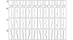
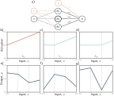
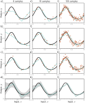
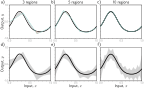
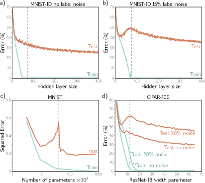
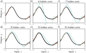

前文介绍了神经网络模型、损失函数和训练算法。本章将探讨如何评估训练好的模型性能。对于具备足够容量（即隐藏单元数量）的神经网络模型而言，它们在训练数据上的表现往往是完美无瑕的。但这并不保证模型能够同样出色地适用于新的测试数据。

我们会发现，测试误差主要由三种不同的原因造成，它们各自的影响程度依赖于：（i）任务本身的固有不确定性，（ii）训练数据的量，以及（iii）模型选择。特别地，模型选择引出了超参数搜索的议题。本章还将讨论如何确定模型超参数（如隐藏层的数目及每层的隐藏单元数）和学习算法的超参数（如学习率和批次大小）的选择方法。
## 8.1 训练一个简单模型
本节我们将通过 MNIST-1D 数据集（图 8.1）来分析模型的性能。该数据集包括十个类别 $y \in \{0,1,\ldots,9\}$，分别代表数字 0 到 9。这些数据是基于每个数字的一维模板，通过随机变换这些模板并加入噪声生成的。训练数据集 $\{x_i, y_i\}$ 共有 4000 个样本，每个样本有 40 维，代表了 40 个位置的水平偏移。在生成数据时，十个类别被等概率地抽取，因此每个类别约有 400 个样本。

我们采用了一个输入为 $D_i = 40$，输出为 $D_o = 10$ 的网络，通过 softmax 函数输出类别概率（参见第 5.5 节）。该网络包含两个隐藏层，每层各有 100 个隐藏单元。使用批次大小为 100，学习率为 0.1 的随机梯度下降法进行了 6000 步（150 个周期）的训练，采用的是多类别交叉熵损失（公式 5.24）。如图 8.2 所示，训练误差随着训练的进行而逐渐减少，训练数据在大约 4000 步后完美分类，训L练损失也逐渐降低至接近零。

但这并不表示我们的分类器完美无缺。可能存在过拟合现象，即模型仅记住了训练数据，却无法准确预测新的样本。为准确评估模型性能，我们需要一个独立的测试集 {xi,yi}。因此，我们按照相同的过程生成了额外的 1000 个样本。如图 8.2a 所示，测试误差随训练步骤增加而减少，但最终稳定在约 40%，虽然优于随机猜测的 90% 误差率，但与训练集相比差距甚远，说明模型对测试数据的泛化能力不佳。

测试损失在训练的前 1500 步中下降，之后又有所上升。此时，测试误差率基本稳定，模型以更高的自信度重复犯同样的错误。这降低了正确答案的概率，从而增加了负对数似然值。这种增加的自信度是 softmax 函数一个副作用，为了让训练数据的概率趋向于 1（参见图 5.10），预 softmax 激活值被推向越来越极端的值。

`图 8.1 MNIST-1D。a) 以 0–9 十个数字为基础构建的十类 (y ∈ {0, . . . , 9}) 模板示例。b) 通过对一个模板进行随机变换并 c) 加入噪声，生成训练样本 x。d) 接着，对变换后的模板在 40 个垂直位置进行水平偏移采样。据 (Greydanus, 2020) 改编。`

`图 8.2 MNIST-1D 结果。a) 随训练步骤变化的分类错误百分比。训练集的错误率能降至零，但测试集的错误率无法降至 40% 以下，显示出模型对新测试数据的泛化能力不强。b) 随训练步骤变化的损失值。训练损失稳步降低至零，而测试损失初期下降后，随着模型对其错误预测的置信度增加而开始上升。`
## 8.2 错误的来源
现在，让我们关注在模型泛化失败时产生错误的根本原因。为了便于理解，我们重新考虑一个一维线性最小二乘回归问题，该问题中我们完全了解生成地面真实数据的过程。如图 8.3 所示，展示了一个近似正弦波形的函数；通过在 [0, 1] 范围内采样输入值，并经过此函数处理再加上固定方差的高斯噪声，生成了训练和测试数据。

`图 8.3 回归函数。实心黑线代表真实函数。为生成 I 个训练样例 {xi,yi}，将输入空间 x ∈ [0,1] 等分为 I 段，每段内按均匀分布抽取一个样本 xi，并在 xi 点评估函数后加入高斯噪声得到对应的 yi 值（灰色区域显示正负两个标准差）。测试数据采用相同方式生成。`

我们对这些数据应用了一个简化的浅层神经网络模型（见图 8.4）。该模型的输入层到隐藏层的权重和偏置被适当选择，以确保在整个区间内函数的转折点均匀分布。若隐藏单元为 D 个，那么这些转折点将出现在 0, 1/D, 2/D,...,(D−1)/D 的位置。该模型能够表示 [0, 1] 范围内分为 D 个等大部分的任意分段线性函数。这个模型不仅易于理解，而且它还有一个优点，即可以通过封闭形式进行拟合，无需依赖随机优化算法（参见问题 8.3）。因此，我们能够保证在训练过程中找到损失函数的全局最小值。

`图 8.4 三隐藏单元的简化神经网络。a) 输入层与隐藏层之间的权重和偏置固定（表示为虚线箭头）。b–d) 权重和偏置被设定，使得隐藏单元激活函数的斜率为 1，且其断点在区间内等距分布，分别位于 x = 0, x = 1/3, 和 x = 2/3。通过调整其余参数 φ = {β, ω1, ω2, ω3}，可在 x ∈ [0,1] 范围内生成任何断点位于 1/3 和 2/3 的分段线性函数。e–g) 展示了三个参数 φ 不同值下的示例函数。`
### 8.2.1 噪声、偏差与方差
模型未能泛化时的错误可以来源于三个方面：噪声、偏差和方差（参见图 8.5）：

`图 8.5 测试误差来源。a) 噪声。数据生成过程中存在较大噪声，因此即便模型完美复现了真实底层函数（黑线），测试数据的噪声（灰点）也会导致一定误差（灰色区域表示正负两个标准差的范围）。b) 偏差。即使采用最佳参数，三区模型（青线）也无法完全拟合真实函数（黑线），这种偏差是误差的另一个来源（灰色区域表示符号误差）。c) 方差。实际中，我们仅有有限的噪声训练数据（橙点）。拟合模型时，并非恢复出最佳可能函数（如 b 面板所示），而是得到了一个略有不同、反映训练数据特异性的函数（青线），这也是误差的一个额外来源（灰色区域表示正负两个标准差的范围）。图 8.6 展示了该区域的计算方式。`

**噪声** 指的是在数据生成过程中引入的随机性，导致每个输入 x 可能对应多个有效的输出 y（如图 8.5a 所示）。这种类型的错误在处理测试数据时难以避免。值得注意的是，这并不一定会影响训练性能；因为在训练过程中，相同的输入 x 出现两次的可能性极低，所以理论上可以完美拟合训练数据。

产生噪声的原因可能是数据生成过程本身具有随机性，或是部分数据标记错误，亦或是存在未被观察到的解释变量。极少数情况下，噪声可能完全不存在，例如，网络可能尝试近似一个确定性的、但计算量巨大的函数。然而，噪声通常是测试性能潜在的基本限制因素。

**偏差** 指模型由于不够灵活，无法完美拟合真实函数而可能出现的错误。举例来说，即便参数经过最优选择，一个分为三区域的神经网络模型也不能精确描述一个近似正弦波形的函数（如图 8.5b 所示），这种现象称为偏差。

**方差** 源于我们仅有有限的训练样本，不能区分数据中的系统性变化和随机噪声。因此，当我们拟合模型时，不能得到对真实基础函数的最佳近似。实际上，对于不同的训练数据集，模型的结果每次都会略有不同。这种在拟合函数上的额外变异性称为方差（如图 8.5c 所示）。在实践中，随机学习算法本身的随机性也可能引入额外的方差，不一定每次都能收敛到同一个解。
### 8.2.2 测试误差的数学公式
我们现在以数学的方式精确定义噪声、偏差和方差。考虑一个具有加性噪声且方差为 $\sigma^2$ 的一维回归问题（如图 8.3 所示）；对同一个输入 $x$，可能会观察到不同的输出 $y$，因此对每个 $x$，存在一个期望值（均值）为 $\mu[x]$ 的分布 $Pr(y|x)$：

$$
\mu[x] = \mathbb{E}_y[\mu[x]] = \int y[x] Pr(y|x)dy, \tag{8.1}
$$

和固定噪声 $\sigma^2 = \mathbb{E}_y [(\mu[x] - y[x])^2]$。这里，$y[x]$ 表示在给定输入 $x$ 处的输出 $y$。

现在考虑在输入位置 $x$，模型预测 $f(x, \phi)$ 与观测值 $y[x]$ 之间的最小二乘损失：

$$
\begin{align}
L[x] &= (f(x, \phi) - y[x])^2 \\
&= ((f(x, \phi) - \mu[x]) + (\mu[x] - y[x]))^2 \\
&= (f(x, \phi) - \mu[x])^2 + 2(f(x, \phi) - \mu[x])(\mu[x] - y[x]) + (\mu[x] - y[x])^2,
\end{align} \tag{8.2}
$$

其中通过在第二行同时加上和减去基础函数的均值 $\mu[x]$，并在第三行展开平方项。

由于基础函数具有随机性，损失取决于我们观测到的特定的 $y[x]$。期望损失为：
$$
\begin{align}
\mathbb{E}_y[L[x]] &= \mathbb{E}_y[(f(x, \phi) - \mu[x])^2 + 2(f(x, \phi) - \mu[x])(\mu[x] - y[x]) + (\mu[x] - y[x])^2] \\
&= (f(x, \phi) - \mu[x])^2 + 2(f(x, \phi) - \mu[x])(\mu[x] - \mathbb{E}_y[y[x]]) + \mathbb{E}_y[(\mu[x] - y[x])^2] \\
&= (f(x, \phi) - \mu[x])^2 + 2(f(x, \phi) - \mu[x]) \cdot 0 + \mathbb{E}_y[(\mu[x] - y[x])^2] \\
&= (f(x, \phi) - \mu[x])^2 + \sigma^2,
\end{align} \tag{8.3}
$$

利用了期望操作的规则。在第四行，我们通过定义替换了固定噪声 $\sigma^2$。因此，期望损失分为两部分：模型与真实函数均值之间的平方偏差，以及噪声。

第一个部分进一步细分为偏差和方差。模型 $f[x, \phi]$ 的参数 $\phi$ 取决于训练数据集 $D = \{x_i, y_i\}$，因此，我们应表示为 $f[x, \phi[D]]$。训练数据集是数据生成过程中的随机样本，不同样本会导致不同的参数值。因此，对所有可能的数据集 $D$，期望模型输出 $f_\mu[x]$ 为：

$$
f_\mu[x] = \mathbb{E}_D[f[x, \phi[D]]].\tag{8.4}
$$

回到方程 8.3 的第一项，我们加减 $f_\mu[x]$ 并展开：

$$
\begin{align}
&(f[x, \phi[D]] - \mu[x])^2 \\
&= ((f[x, \phi[D]] - f_\mu[x]) + (f_\mu[x] - \mu[x]))^2 \\
&= (f[x, \phi[D]] - f_\mu[x])^2 + 2(f[x, \phi[D]] - f_\mu[x])(f_\mu[x] - \mu[x]) + (f_\mu[x] - mu[x])^2.
\end{align} \tag{8.5}
$$

对训练数据集 $D$ 取期望：

$$
\mathbb{E}_D [(f[x, \phi[D]] - \mu[x])^2] = \mathbb{E}_D [(f[x, \phi[D]] - f_\mu[x])^2] + (f_\mu[x] - \mu[x])^2, \tag{8.6}
$$

采用与方程 8.3 相似的简化步骤。最后，我们将此结果代入方程 8.3：

$$
\mathbb{E}_D[\mathbb{E}_y[L[x]]] = \mathbb{E}_D [(f[x, \phi[D]] - f_\mu[x])^2] + (f_\mu[x] - \mu[x])^2 + \sigma^2. \tag{8.7}
$$
（等式右边三个部分分别表示方差、偏差和噪声）
这表明，考虑到训练数据 D 和测试数据 y 的不确定性后，期望损失由三个加和项构成：方差、偏差和噪声。方差是由于特定训练数据集样本导致的拟合模型的不确定性；偏差是模型与我们试图建模的函数均值之间的系统性偏离；噪声是输入到输出的真实映射中固有的不确定性。这三种错误来源对于任何任务都存在，并且在线性回归中以加和的形式出现，但在其他问题类型中，它们的相互作用可能更复杂。
## 8.3 降低误差

在前一节中，我们了解到测试误差源自三个方面：噪声、偏差和方差。噪声是一个不可逾越的障碍；我们无法避开它，它设定了模型性能的基本极限。但是，我们可以减少其他两个因素。
### 8.3.1 减少方差
回顾一下，方差是由于训练数据的有限性和噪声引起的。用两个不同的训练集来训练模型会得到略有差异的参数。因此，通过增加训练数据量可以减少方差。这有助于平衡固有噪声并确保输入空间得到充分采样。

图 8.6 展示了使用 6、10 和 100 个样本训练的效果。对于每种数据集大小，我们都展示了三个训练数据集的最佳拟合模型。仅用六个样本时，每次拟合的函数都相差很大：方差显著。随着样本数的增加，拟合模型变得越来越相似，方差也随之减少。总的来说，增加训练数据几乎总能提升测试表现。

`图 8.6 通过增加训练数据以降低方差。a–c) 对三个不同的、随机选择的六点数据集进行的三区域模型拟合，结果每次都大相径庭。d) 这个实验被多次重复，我们画出了模型预测的平均值（青线）和预测的方差（灰色区域表示正负两个标准差）。e–h) 进行同样的实验，但这次的数据集大小为十，预测方差有所减小。i–l) 使用大小为 100 的数据集重复实验，现在拟合模型几乎总是一致的，且方差很小。`

### 8.3.2 减少偏差
偏差来源于模型无法准确描述真实底层函数。这意味着，我们可以通过提高模型的灵活性来减少此类误差。通常，这是通过增加模型的容量来实现的。对于神经网络，这意味着增加更多的隐藏单元和/或隐藏层。

在简化的模型中，增加容量意味着增加更多的隐藏单元，使得区间 [0, 1] 被划分成更多的线性区域。图 8.7a–c 显示，增加线性区域的数量到十，如预期那样，确实减少了偏差；模型变得足够灵活，能够更紧密地拟合真实函数。

`图 8.7 模型容量与偏差和方差的关系。a–c) 随着我们增加玩具模型的隐藏单元数，线性区域的数目增加，使得模型能够更紧密地拟合真实函数，偏差（灰色区域）减小。d–f) 然而，不幸的是，增加模型容量也会增加方差项（灰色区域），这就是所谓的偏差-方差权衡。`
### 8.3.3 偏差-方差权衡
然而，图 8.7d–f 揭示了增加模型容量的一个意外副作用。对于固定规模的训练数据集，随着模型容量的提升，方差也会增加。因此，增加模型容量并不一定能降低测试误差。这就是所谓的偏差-方差权衡。

图 8.8 探讨了这一现象。在面板 a–c）中，我们将简化的三区域模型拟合到三个不同的、各含十五点的数据集上。尽管数据集不同，但最终的模型大致相同；数据集中的噪声在每个线性区域中大致被平均掉。在面板 d–f）中，我们用一个拥有十个区域的模型拟合相同的三个数据集。这个模型更加灵活，但这其实是不利的；模型确实更好地拟合了数据，训练误差也更低，但很大一部分额外的描述能力实际上用于了对噪声的建模。这种现象被称为过拟合。

我们发现，随着模型容量的增加，偏差会减少，但对于固定规模的训练数据集，方差却会增加。这表明存在一个最佳容量，在这一点上，偏差不过分而方差仍然相对较小。图 8.9 通过使用图 8.8 的数据展示了随着容量增加，这些项如何在数值上变化。对于回归模型，总期望误差是偏差与方差的和，在模型容量为四（即有四个隐藏单元和四个线性区域）时，这个和最小。

`图 8.8 过拟合现象。a–c) 对每个包含十五个数据点的三个不同数据集，拟合了一个三区域模型。所有三种情况下的结果都相似（即方差较低）。d–f) 对相同的数据集拟合了一个十区域模型，增加的灵活性并不一定能产生更好的预测。虽然这三个模型都更好地描述了训练数据，但它们并不一定更接近于真实的底层函数（黑色曲线）。相反，它们过度拟合了数据，只是描述了噪声，而方差（拟合曲线之间的差异）更大。`

`图 8.9 偏差-方差权衡。根据方程 8.7，模型容量（隐藏单元/线性区域的数量）的变化绘制了偏差和方差项。随着模型容量的增加，偏差（实线橙色线）减少，但方差（实线青色线）增加。这两项的总和（灰色虚线）在模型容量为四时达到最小。`
## 8.4 双下降现象
在上一节中，我们探讨了随模型容量增加时偏差与方差之间的权衡关系。现在，让我们重新关注 MNIST-1D 数据集，实际观察这种现象是否发生。我们采用了 10,000 个训练样本进行模型训练，并使用另外 5,000 个样本进行测试，以此来观察随着模型中参数数量（即模型容量）增加时，训练和测试性能的变化。模型的训练采用了 Adam 优化算法，步长设置为 0.005，通过对全部 10,000 个样本进行 4000 步的批量训练。

图 8.10a 展示了一个具有两个隐藏层的神经网络在隐藏单元数增加时，训练误差与测试误差的变化情况。可以看到，随着模型容量的扩大，训练误差逐渐降低并迅速趋近于零。图中的虚线表示模型的参数数量达到训练样本数的时刻，但值得注意的是，模型在达到这一点之前就已经能够记忆整个数据集了。测试误差随着模型容量的增加而下降，但与偏差-方差权衡理论预测的不同，它并没有上升，而是持续下降。

在图 8.10b 中，我们重复了此实验，但这次我们随机更改了 15% 训练标签的值。结果再次显示，训练误差降至零。这一次，由于引入了更多的随机性，模型几乎需要与数据点数量一样多的参数才能记住这些数据。测试误差确实展示出随着模型容量增加所期望的偏差-方差权衡特征，直至模型完美拟合训练数据。然而，接下来发生了意外；测试误差再次开始下降。事实上，如果我们进一步增加模型容量，测试损失可以降至最初曲线部分所达到的最低水平之下。

这种现象被称为“双下降”现象。对于某些数据集，如 MNIST，在原始数据中就已经存在（见图 8.10c）。而对于其他数据集，如 MNIST-1D 和 CIFAR-100（见图 8.10d），在我们向标签中添加噪声后，这种现象会显现出来或变得更加明显。曲线的前半部分被认为是“经典”或“欠参数化”阶段，后半部分则被视为“现代”或“过参数化”阶段。而在误差上升的中间部分，则被称为“临界”阶段。

`图 8.10 双下降现象。a) 随着我们在每层增加隐藏单元（从而增加参数）数量，对 MNIST-1D 数据集进行两层隐藏层网络训练和测试损失的分析。当参数数量接近训练样本数量（垂直虚线表示）时，训练损失降至零。测试误差并未展现出预期的偏差-方差权衡，而是在模型记住数据集之后继续下降。b) 使用更加嘈杂的训练数据重复相同的实验。尽管此时几乎需要与训练点数量相等的参数来记住数据集，训练误差仍降至零。测试误差显示出预测的偏差/方差权衡；随着容量增加而减少，但在接近完全记住训练数据的点时再次增加，然而之后它再次下降，并最终达到更优的性能水平。这称为双下降现象。根据损失、模型和数据中的噪声量，这种双下降模式在许多数据集中都有不同程度的表现。c) Belkin 等人 (2019) 在无标签噪声的 MNIST 数据集上使用浅层神经网络的结果。d) Nakkiran 等人 (2021) 使用 ResNet18 网络在 CIFAR-100 上的结果（见第 11 章）。详细信息见原始论文。`
#### 8.4.1 解释
双下降的发现是近年来意料之外且有些令人困惑的新现象。它源于两个现象的交互作用。首先，当模型刚好具有足够的容量记住数据时，测试性能会暂时恶化。其次，即使在训练性能达到完美之后，随着容量的进一步增加，测试性能仍然会继续提升。第一个现象正符合偏差-方差权衡的预测。而第二个现象则更加令人迷惑；目前尚不清楚，为什么在模型过度参数化的情况下，性能反而会更好，尽管这时已经没有足够的训练数据点来唯一约束模型的参数了。

要理解为什么随着参数数量的增加，性能仍然能够得到改善，需要注意到一旦模型拥有足够的容量将训练损失降至近乎零，模型便几乎完美地拟合了训练数据。这意味着进一步增加容量无法使模型更好地拟合训练数据；任何改进都必须发生在训练数据点之间。模型在数据点之间进行推断时倾向于选择某种解决方案而非另一种，这种倾向称为模型的“归纳偏置”。

因为在高维空间中，训练数据极其稀疏，模型在数据点之间的行为尤为关键。以 40 维的 MNIST-1D 数据集为例，我们使用了 10,000 个样本进行训练。如果将每个输入维度划分为 10 个区间，那么总共将有 10^40 个区间，但只有 10^5 个样本点。即使是这样粗略的划分，也意味着在每 10^35 个区间中仅有一个数据点！这种情况，即高维空间的广阔程度远超训练数据点数，被称为“维度的诅咒”。

因此，在高维中的问题可能更类似于图 8.11a 所示；我们在输入空间的小区域内观察到数据点，而这些数据点之间存在着显著的间隙。“双下降”的一种解释是，随着模型容量的增加，它在相邻数据点之间的插值变得更加平滑。在不知道训练点之间发生了什么的情况下，假设平滑是合理的，并且可能会合理地推广到新数据上。

这个观点是有道理的。随着模型容量的增加，它确实能够构造出更平滑的函数。图 8.11b–f 展示了随着隐藏单元数的增加，模型能够构建的尽可能平滑且仍然通过数据点的函数。当参数数量接近训练数据量时（图 8.11b），模型不得不强行适应训练数据，导致预测结果出现异常波动。这解释了双下降曲线中峰值异常显著的原因。随着我们增加更多隐藏单元，模型能够构建出更平滑的函数，这些函数更有可能在新数据上表现出更好的泛化能力。

然而，这并未解释为什么过参数化模型会产生平滑的函数。图 8.12 展示了一个简化模型（拥有 50 个隐藏单元）可以创建的三种函数。在每种情况下，模型都完美拟合了数据，因此损失为零。如果双下降的“现代”阶段是通过增加平滑性来解释的，那么是什么驱使模型趋向于这种平滑性呢？

`图 8.11 增加容量（隐藏单元）可以实现稀疏数据点之间更加平滑的插值。a) 在这个场景中，训练数据（橙色圆圈）分布稀疏，中心区域没有数据来限制模型以模仿真实函数（黑色曲线）。b) 若我们拟合一个仅具有足够容量以适应训练数据的模型（青色曲线），模型必须调整自身以通过训练点，导致输出预测缺乏平滑性。c–f) 但是，随着我们增加更多的隐藏单元，模型能够在点之间进行更平滑的插值（每种情况下绘制了尽可能平滑的曲线）。然而，值得注意的是，模型并非一定要这样做。`

`图 8.12 正则化。a–c) 三个拟合曲线都恰好穿过了数据点，因此每个的训练损失都为零。但是，我们可能期望 (a) 面板中的平滑曲线比 (b) 和 (c) 面板中的波动曲线在泛化到新数据上时表现得更好。任何倾向于使模型偏好于一组具有相似训练损失的解的因素都称为正则化器。人们认为神经网络的初始化和/或拟合过程具有隐式的正则化效果。因此，在参数过多的情况下，像 (a) 面板中那样更合理的解决方案受到鼓励。`
## 8.5 超参数的选择
在上一节，我们探讨了模型容量如何影响测试性能。遗憾的是，在传统的模型阶段，我们既不能直接获得偏差信息（因为这需要对真实的底层函数有所了解），也无法准确知道方差（因为这需要多个独立抽样的数据集来评估）。而在现代模型阶段，预判增加多少模型容量才能使测试误差停止改进变得更加困难。这就引出了一个实际问题：我们该如何在实际应用中合理选择模型的容量。

对于深度网络而言，模型的容量不仅取决于隐藏层的数目和每层的单元数量，还包括其它我们还未提及的架构特征。同时，所选择的学习算法及其参数（比如学习率等）也会影响到测试性能。这些因素统一被称为超参数。寻找最优超参数的过程被称作超参数搜索，或者当专注于网络结构时，被称作神经架构搜索。

超参数的选择通常基于经验；我们会在同一个训练集上对多个不同超参数设置的模型进行训练，评估它们的性能，并保留表现最佳的模型。但我们不会在测试集上评估它们的性能，以避免选出的超参数仅仅是偶然适合于测试集而不具有普适性。因此，我们引入了一个称为验证集的第三数据集。对每一组超参数配置，我们使用训练集来训练模型，并在验证集上评估其性能。最终，我们选取在验证集上表现最佳的模型，并在测试集上评估其性能。按理说，这种方法能够合理估计模型的真实性能。

尽管超参数空间通常比参数空间要小，但其范围仍然广泛，以至于无法穷尽所有组合进行尝试。不幸的是，许多超参数是离散的（例如隐藏层的数目），有些则是相互依赖的（比如，只有当存在十层或更多层时，我们才需要指定第十层的单元数目）。因此，我们无法依赖于梯度下降方法来进行学习，这种方法是我们在学习模型参数时所采用的。超参数优化算法通过考虑之前的结果来对超参数空间进行智能采样。由于我们需要为每一组超参数组合训练一个完整的模型并评估其在验证集上的性能，这个过程是计算成本很高的。
## 8.6 Summary

为了评估模型性能，我们采用了独立的测试集。模型在这一测试集上的表现好坏反映了其泛化能力。测试误差主要受三个因素影响：噪声、偏差和方差。在使用最小二乘法的回归问题中，这些因素以加法形式共同作用。增加训练数据量能够有效降低方差。当模型的容量不足以处理训练样本时，提升模型容量可以减少偏差，但同时会导致方差增加。这种现象称为偏差-方差权衡，存在一个最优的模型容量点，可以达到两者之间的最佳平衡。

然而，值得注意的是，即使模型的参数数量超过训练样本，性能随容量的增加而提高的趋势依然存在。这两种现象共同形成了所谓的双下降曲线。人们普遍认为，在参数过剩的“现代”模型阶段，模型能够在训练数据点之间实现更平滑的插值，但目前尚不清楚具体是什么因素推动了这一过程。为了确定模型容量及其他模型和训练算法的超参数，我们需要训练多个模型，并借助独立的验证集来评估它们的表现。
## Notes
**偏差与方差的权衡**：我们证明了，对于使用最小二乘损失的回归问题，测试误差可以分解为噪声、偏差及方差三者的总和。这些因素在采用其他损失函数的模型中同样存在，但它们之间的相互作用往往更为复杂（Friedman, 1997; Domingos, 2000）。在分类问题中，存在一些违反直觉的预测现象；例如，若模型在输入空间的某区域倾向于错误分类，则增加方差有助于提高分类准确率，因为这样做能将部分预测值推过分类阈值，实现正确分类。

**交叉验证**：通常的做法是将数据分为三部分：训练数据（用来学习模型参数）、验证数据（用来选择超参数）和测试数据（用来估计最终的性能）。这种方法称为交叉验证。然而，当可用的数据总量有限时，这种分法可能会带来问题；如果训练样本的数量与模型的容量相近，则会导致较大的方差。

为缓解此问题，可以采用 k 折交叉验证。训练和验证数据被分割成 K 个互不重叠的子集。比如，我们可以将数据分为五份，每次用其中四份进行训练，剩下一份进行验证，如此针对五种可能的排列组合分别选择超参数，并基于平均验证性能做出选择。最终测试性能是通过对选出的最佳超参数下五个模型在完全不同的测试集上的预测平均值进行评估得出的。虽然这个方法有许多变种，但它们的共同目标都是利用更大比例的数据进行模型训练，以此来降低方差。

**模型容量**：我们通常将“容量”一词非正式地用来描述模型中的参数或隐藏单元数（从而间接地描述模型拟合日益复杂函数的能力）。模型的表示容量是指在考虑所有可能的参数值时，模型能够构造的函数空间。考虑到优化算法可能无法找到所有这些解，我们所关注的便是有效容量。

Vapnik-Chervonenkis (VC) 维度（Vapnik & Chervonenkis, 1971）是衡量容量的更为正式的指标。它指的是一个二元分类器能够任意标记的最大训练样本数。Bartlett 等人（2019）从层数和权重的角度给出了 VC 维度的上下界。Rademacher 复杂度是另一种衡量指标，预期的经验性能是指在随机标签数据上，采用最优参数的分类模型的表现。Neyshabur 等人（2017）基于 Rademacher 复杂度，给出了泛化误差的下界。

**双下降现象**：Belkin 等人（2019）首次提出“双下降”这一术语，并证明了在过参数化情况下，对于两层神经网络和随机特征，测试误差会再次下降。尽管 Buschjäger & Morik (2021) 后来提供了相反的证据，他们还声称决策树中也会发生这一现象。Nakkiran 等人（2021）展示了双下降现象在不同的现代数据集（CIFAR-10, CIFAR-100, IWSLT’14 de-en）、架构（CNNs, ResNets, transformers）和优化器（SGD, Adam）中的存在。当目标标签添加噪声（Nakkiran 等人，2021）以及使用某些正则化技术（Ishida 等人，2020）时，这种现象尤为明显。

Nakkiran 等人（2021）还提供了实证证据，显示测试性能依赖于有效模型容量（即给定模型和训练方法可以达到零训练误差的最大样本数）。此时，模型开始专注于平滑的插值。因此，测试性能不仅取决于模型本身，还取决于训练算法和训练时长。当研究容量固定的模型并增加训练迭代次数时，他们观察到了同样的模式，称之为“按时代双下降”。Pezeshki 等人（2022）通过模型中不同特征以不同速度学习的情况，对这一现象进行了建模。

双下降现象提出了一个奇特的预测，即增加训练数据有时会导致测试性能下降。在曲线的第二下降部分，对于一个过参数化模型，如果我们增加训练数据量以匹配模型容量，那么我们现在将处于新测试误差曲线的关键区域，测试损失可能会增加。

Bubeck & Sellke (2021) 证明了在高维情况下，过参数化是平滑插值数据的必要条件。他们展示了模型参数数量与 Lipschitz 常数（模型输出对小输入变化的最快响应速度）之间的权衡关系。Dar 等人（2021）对过参数化机器学习的理论进行了综述。

**维度诅咒**：随着维度增加，空间体积的增长速度极快，导致需要的数据量以指数形式增长以实现密集采样。这种现象被称为维度诅咒。高维空间具有许多不可思议的属性，在尝试用低维例子进行推理时应当小心。本书尝试将深度学习的多个方面在一维或二维中进行可视化，但对这些可视化应持谨慎态度。

高维空间的一些惊奇属性包括：(i) 两个从标准正态分布中随机选取的数据点很可能与原点几乎正交。(ii) 从标准正态分布抽样的点到原点的距离大致是恒定的。(iii) 大部分高维球体（超球体）的体积靠近其表面（常用的比喻是，大部分高维橙子的体积在皮里，而不是果肉中）。(iv) 如果将单位直径的超球体放置在边长为单位长度的超立方体内，随着维度的增加，超球体占超立方体体积的比例会逐渐减小。由于超立方体的体积固定为1，这意味着高维超球体的体积近乎为零。(v) 对于从高维超立方体中均匀抽取的随机点，最近点与最远点之间的欧氏距离比接近于一。更多信息，可参考 Beyer 等人（1999）和 Aggarwal 等人（2001）。

**实际性能**：我们在本章中讨论了，通过留出测试集可以评估模型的性能。然而，如果测试集的统计特征与实际世界数据的不一致，那么所得结果并不能真实反映实际性能。更进一步，实际世界数据的统计特征可能随时间变化，导致模型逐渐过时，性能下降。这种现象称为数据偏移，意味着部署的模型需要细致监控。

实际性能不如测试性能所示的原因主要有三个。首先，输入数据 x 的统计特征可能发生变化，我们可能遇到了训练期间采样稀少或未曾采样的函数部分，称为协变量偏移。其次，输出数据 y 的统计特征可能变化，若某些输出值在训练期间较为罕见，则模型可能学习在不确定情况下不预测这些值，如果这些值在实际世界中变得更常见，则会导致错误，这称为先验偏移。第三，输入与输出之间的关系可能发生变化，称为概念偏移。Moreno-Torres 等人 (2012) 对这些问题进行了讨论。

**超参数搜索**：寻找最佳超参数是一个挑战性的优化任务。测试单一配置的超参数成本高昂，需要训练完整模型并测量其性能。我们无法轻易获得性能变化的导数（即，对超参数的微小改变）。此外，许多超参数是离散的，无法应用梯度下降方法。存在多个局部最小值，且无法确定是否接近全局最小值。由于每次训练/验证周期都采用随机训练算法，噪声水平高，相同超参数的模型训练两次可能得到不同结果。最后，某些变量是条件性的，仅在设置了其他变量时存在，例如，仅当模型至少有三个隐藏层时，第三隐藏层的隐藏单元数才有意义。

一种简单方法是随机采样空间（Bergstra & Bengio, 2012）。然而，对于连续变量，构建一个将性能作为超参数函数的模型，并利用此函数中的不确定性，更为有效。这可以用来探索不确定性较大的区域或专注于性能表现有希望的区域。贝叶斯优化正是基于此思想的高斯过程框架，其在超参数搜索中的应用由 Snoek 等人 (2012) 描述。Beta-Bernoulli bandit（参见 Lattimore & Szepesvári, 2020）为描述离散变量导致的结果不确定性提供了一个类似的模型。

基于序列模型的配置（SMAC）算法（Hutter 等人，2011）能够处理连续、离散和条件参数。其基本方法是利用随机森林模拟目标函数，其中树预测的均值是对目标函数最好的估计，它们的方差代表不确定性。完全不同的方法，也能处理连续、离散和条件参数的组合，即 Tree-Parzen 估计器（Bergstra 等人，2011）。这些方法模拟了给定超参数下模型性能的概率，与之相对，Tree-Parzen 估计器模拟了给定模型性能下超参数的概率。

Hyperband（Li 等人，2017b）是一种针对超参数优化的多臂老虎机策略。它假设存在计算成本低但近似的性能测量方法（例如，未完全训练完成）并且可以与预算关联（例如，固定迭代次数训练）。抽样若干随机配置并运行，直到预算耗尽。然后保留最佳的一小部分 η 运行，并将预算乘以 1/η。重复此过程直到达到最大预算。此方法的优势在于效率；对于表现不佳的配置，无需将实验进行到底。然而，每个样本的选择都是随机的，这种方式效率不高。BOHB 算法（Falkner 等人，2018）结合了 Hyperband 的效率和来自 Tree Parzen 估计器更合理的超参数选择，构建出了更优秀的方法。
## Problems
**问题 8.1** 在图 8.2 中，多类交叉熵（multiclass cross-entropy）训练损失能达到零吗？请解释你的理由。

**问题 8.2** 对于图 8.4a 中模型的第一层，我们应该如何选择三个权重和偏置的值，以使得隐藏单元的响应符合图 8.4b-d 所描绘的情况？

**问题 8.3** 假设有一个训练数据集，包含 \( I \) 个输入/输出对 \( \{x_i; y_i\} \)，展示如何利用最小二乘损失函数，为图 8.4a 中的模型参数 \( \{\beta, \omega_1, \omega_2, \omega_3\} \) 寻找闭式解。

**问题 8.4** 考虑到图 8.10b 中的曲线，在我们训练一个隐藏层规模为 200，参数总数为 50,410 的模型时的情况。如果我们将训练样本数量从 10,000 增加到 50,410，你认为训练和测试性能会怎样变化？

**问题 8.5** 当模型容量超过训练数据点的数量，并且模型足够灵活以使训练损失降至零时，这对于拟合一个异方差模型（heteroscedastic model）意味着什么？提出一种方法来解决你发现的问题。

**问题 8.6** 证明从一个 1000 维标准高斯分布中随机选取的两个点，它们相对于原点高概率正交。

**问题 8.7** 在 \( D \) 维空间中，一个半径为 \( r \) 的超球体的体积公式为：

$$
\text{Vol}[r] = \frac{r^D \pi^{D/2}}{\Gamma[D/2 + 1]}, \tag{8.8}
$$

其中 \( \Gamma[\cdot] \) 代表伽马函数（Gamma function）。利用斯特林公式（Stirling's formula），展示当维度增加时，直径为一（半径 \( r=0.5 \)）的超球体体积如何趋于零。

**问题 8.8** 考虑半径 \( r = 1 \) 的超球体。求出一个表达式来计算总体积中位于中心最外层 1% 距离内的体积比（即，位于厚度为 0.01 的最外壳层内的体积比）。证明随着维数的增加，这个比例趋于 1。

**问题 8.9** 图 8.13c 显示了随维度增加，标准正态分布样本距离的分布情况。通过在 25、100 和 500 维度下从标准正态分布采样并绘制距离中心的直方图来验证这一现象。哪种闭式概率分布（closed-form probability distribution）描述了这些距离？

`图 8.13 典型集合。a) 二维标准正态分布。圆圈代表从该分布中抽取的四个样本。随着距中心的距离增加，概率降低，而在该半径处的空间体积（即相邻等距圆圈间的区域）增大。b) 这些因素的权衡使得样本距中心的距离的直方图显示出明显的峰值。c) 在更高的维度中，这种效应变得更加极端，接近均值的样本的概率极低。尽管分布的均值处是最可能的点，但典型样本实际上位于一个相对狭窄的壳层内。`