第 8 章 描述了如何测量模型的性能，并指出了训练数据与测试数据之间可能存在的显著性能差异。这种差异可能的原因包括：（一）模型只描述了训练数据的统计特征，这些特征并不代表从输入到输出的真实映射关系（即过拟合现象）；（二）模型在没有训练样本的区域内行为不受约束，导致预测结果不理想。

本章将讨论正则化技术，一系列旨在减少训练与测试性能之间泛化差距的方法。严格来讲，正则化是指在损失函数中添加特定项以偏好某些参数选择的过程。然而，在机器学习领域，这个概念通常被广泛用来指代任何能够改善泛化能力的策略。

文章首先从最严格的正则化概念入手，接着展示随机梯度下降算法本身是如何偏好某些解决方案的，这种现象称为隐式正则化。随后，我们将探讨一系列启发式方法，旨在提升测试性能，包括早停（early stopping）、集成方法（ensembling）、dropout、标签平滑（label smoothing）和迁移学习（transfer learning）。

## 9.1 显式正则化

考虑用一组输入/输出对 $\{x_i, y_i\}$ 来拟合模型 $f(x, \phi)$，其中 $\phi$ 为模型参数。我们的目标是找到损失函数 $L[\phi]$ 的最小值：

$$
\begin{align}
\hat{\phi} &= \underset{\phi}{\text{argmin}} [L[\phi]] \\
&= \underset{\phi}{\text{argmin}} \left[ \sum_{i=1}^I l_i(x_i, y_i) \right],
\end{align} \tag{9.1}
$$

这里，每个项 $l(x_i, y_i)$ 衡量了对每对训练数据，网络预测 $f(x_i, \phi)$ 与实际输出 $y_i$ 之间的误差。为了让这一最小化过程倾向于特定的解决方案，我们加入了一个附加项：

$$
\hat{\phi} = \underset{\phi}{\text{argmin}} \left[ \sum_{i=1}^I l_i(x_i, y_i) + \lambda \cdot g(\phi) \right], \tag{9.2}
$$

其中 $g(\phi)$ 是一个函数，用于返回一个标量值，该值在参数较不理想时会较大。系数 $\lambda$ 是一个正数，用于平衡原始损失函数和正则化项的贡献。采用正则化后的损失函数通常会导致与原始损失函数不同的最小值，因此训练过程会收敛至不同的参数值（见图 9.1）。

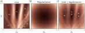

`图 9.1 显式正则化。a) Gabor 模型的损失函数（见 6.1.2 节）。青色圆圈代表局部最小值。灰色圆圈代表全局最小值。b) 正则化项通过增加远离该点处的惩罚，倾向于选择接近图中心的参数。c) 最终损失函数是原始损失函数与正则化项之和。这个曲面的局部最小值更少，全局最小值移至不同位置（箭头指示变化方向）。`

## 9.1.1 概率解释

正则化也可以从概率学的视角进行理解。如第 5.1 节所示，损失函数是基于最大似然准则构建的：

$$
\hat{\phi} = \underset{\phi}{\mathrm{argmax}} \left[ \prod_{i=1}^I Pr(y_i | x_i, \phi) \right]. \tag{9.3}
$$

这里，正则化项可以视为一个先验知识 $Pr(\phi)$，它代表在我们观测到数据之前对参数的了解。于是，我们采用了最大后验（MAP）准则：

$$
\hat{\phi} = \underset{\phi}{\mathrm{argmax}} \left[ \prod_{i=1}^I Pr(y_i | x_i, \phi) \cdot Pr(\phi) \right]. \tag{9.4}
$$

通过对上式取对数并乘以负一转换为负对数似然损失函数，我们得到 $\lambda \cdot g(\phi) = -\log(Pr(\phi))$，这表明正则化项 $\lambda \cdot g(\phi)$ 实际上等同于先验概率的负对数。

## 9.1.2 L2 正则化

本讨论未触及正则化项应当惩罚哪些解决方案（或等价地，先验应当支持哪些解决方案）的问题。考虑到神经网络被广泛应用于各种领域，这些偏好只能是非常通用的。最常用的正则化形式是 L2 范数，它通过惩罚参数值的平方和来实施：

$$
\hat{\phi} = \underset{\phi}{\mathrm{argmax}} \left[ \sum_{i=1}^I l_i(x_i, y_i) + \lambda \sum_j \phi_j^2 \right], \tag{9.5}
$$
其中 j 代表参数的索引。这种正则化也被称为 Tikhonov 正则化、岭回归，或者在应用于矩阵时，被称为 Frobenius 范数正则化。

对于神经网络而言，L2 正则化通常只应用于权重，而不是偏置，因此这被称作权重衰减项。其效果是促使权重更小，从而使模型的输出函数变化更加平缓。为了理解这一点，可以考虑输出预测是最后一个隐藏层激活值的加权和。如果权重较小，输出变化会更少。这一逻辑也适用于最后一个隐藏层之前的预激活计算，如此逐层向后直至网络的输入层。在极端情况下，如果所有权重被强制设置为零，则网络将输出一个由最终偏置参数决定的常数值。

图 9.2 展示了在不同的正则化系数 λ 下，使用权重衰减拟合简化网络（参见图 8.4）的效果。当 λ 很小时，影响微乎其微。然而，随着 λ 的增加，对数据的拟合精度下降，函数变得更加平滑。这可能因两个原因而提升测试性能：

- 如果网络发生过拟合，引入正则化项意味着网络需要在严格匹配数据与追求平滑输出之间做出权衡。这可以理解为，由方差引起的误差减少了（模型不再试图穿过每个数据点），但以增加偏差的代价（模型仅能描述平滑的函数）。

- 对于参数过多的网络，一些额外的模型容量用于描述没有训练数据的区域。在这种情况下，正则化项会倾向于选择在相邻数据点之间平滑插值的函数。在不了解真实函数的情况下，这是一种合理的做法。

`图 9.2 在简化网络中的 L2 正则化（参见图 8.4）。a-f) 随着正则化系数 λ 增大，所得到的拟合函数变化。黑色曲线代表真实函数，橙色圆点代表含噪声的训练数据，青色曲线是拟合出的模型。当 λ 较小（图 a-b）时，拟合函数精确穿过所有数据点。中等 λ 值（图 c-d）时，函数变得更平滑，与真实函数更为接近。λ 值较大（图 e-f）时，拟合函数过于平滑，导致拟合效果不佳。`
## 9.2 隐式正则化

最近的一项引人注目的发现是，无论是梯度下降还是随机梯度下降，它们在向损失函数的最小值移动时都不是中立的；它们都倾向于某些解决方案而不是其他。这种现象被称为隐式正则化。
#### 9.2.1 梯度下降中的隐式正则化

考虑梯度下降的一个连续版本，其步长无限接近于零。在这种情况下，参数 $\phi$ 的变化遵循以下微分方程：

$$
\frac{\partial \phi}{\partial t} = -\frac{\partial L}{\partial \phi}. \tag{9.6}
$$

梯度下降使用一系列固定大小 $\alpha$ 的离散步骤来逼近这一过程：
$$
\phi_{t+1} = \phi_t - \alpha \frac{\partial L[\phi_t]}{\partial \phi} , \tag{9.7}
$$

这种离散步骤导致了与理想连续路径的偏移（参见图 9.3）。

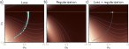

`图 9.3 梯度下降中的隐式正则化。a) 在 φ1 = 0.61 的水平线上具有全局最小值族的损失函数。虚线蓝色显示从左下方开始的连续梯度下降路径。青色轨迹展示了步长为 0.1 的离散梯度下降过程（前几步以箭头明确标出）。有限步长使得路径发散，最终达到不同的位置。b) 通过在连续梯度下降的损失函数中添加一个正则化项，该项对梯度的平方幅度进行惩罚，可以近似模拟这种路径差异。c) 添加这一项后，连续梯度下降的路径能够收敛到离散梯度下降在原始函数上达到的同一位置。`

可以通过为连续情况推导出一个修改后的损失项 $\tilde{L}$ 来理解这种偏移，该损失项使离散化版本能够与原始损失 $L$ 达到相同的结果。据证明（详见章节末尾），这种修改后的损失表达式为：

$$
\tilde{L}_{GD}[\phi] = L[\phi] + \frac{\alpha}{4} \left\| \frac{\partial L}{\partial \phi} \right\|^2 . \tag{9.8}
$$

也就是说，离散化的路径会避开那些梯度范数较大（即表面较陡峭）的区域。这并不会改变梯度为零处的极小值位置，但它会在其他位置改变有效损失函数，并因此改变优化的路径，这可能导致收敛到不同的最小值。梯度下降引起的隐式正则化可能解释了为何在使用较大步长时，全批量梯度下降的泛化能力会更好的观察结果（参见图 9.5a）。

### 9.2.2 在随机梯度下降中的隐式正则化
对随机梯度下降的分析同样适用。我们现在寻求一个修改后的损失函数，以便其连续版本的结果与随机SGD更新的平均值相匹配。其表示方式如下：

$$
\begin{align}
\tilde{L}_{SGD}[\phi] &= \tilde{L}_{GD}[\phi] + \frac{\alpha}{4B} \sum_{b=1}^{B} \left\| \frac{\partial L_b}{\partial \phi} - \frac{\partial L}{\partial \phi} \right\|^2 \\
&= L[\phi] + \frac{\alpha}{4} \left\| \frac{\partial L}{\partial \phi} \right\|^2 + \frac{\alpha}{4B} \sum_{b=1}^{B} \left\| \frac{\partial L_b}{\partial \phi} - \frac{\partial L}{\partial \phi} \right\|^2 .
\end{align} \tag{9.9}
$$

此处，$L_b$表示某个批次中第 b 个批次的损失，而 L 和 $L_b$ 分别代表了整个数据集内 I 个单独损失值的平均和某个批次内 $\beta$ 个单独损失值的平均：

$$
L = \frac{1}{I} \sum_{i=1}^{I} \ell_i[x_i, y_i] \quad \text{and} \quad L_b = \frac{1}{|\beta|} \sum_{i \in \beta_b} \ell_i[x_i, y_i]. \tag{9.10}
$$

方程 9.9 揭示了一个额外的正则化项，对应于批次损失$L_b$ 梯度的方差。换言之，SGD 隐式地倾向于梯度稳定的位置（即所有批次对斜率的一致性）。这一次，虽然调整了优化路径（见图 9.4），但并不必然改变全局最小值的位置；若模型参数过多，可能会完美拟合所有训练数据，在全局最小值处所有梯度项均为零。

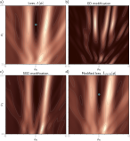

`图 9.4 随机梯度下降的隐式正则化。a) Gabor 模型的原始损失函数（参见 6.1.2 节）。b) 梯度下降引入的隐式正则化项对梯度的平方幅度进行惩罚。c) 随机梯度下降的附加隐式正则化通过惩罚批量梯度的方差来实施。d) 修改后的损失函数包括原始损失和两个隐式正则化部分的总和。`

相较于梯度下降，SGD 表现出更好的泛化能力，且一般来说，小批次尺寸比大批次尺寸有更好的表现（见图 9.5b）。一种可能的解释是，固有的随机性让算法能够探索损失函数的不同区域。然而，这种性能提升部分或全部可能源于隐式的正则化效应；它倾向于促成所有数据都很好拟合的解决方案（因此批次方差小），而不是一些数据拟合得非常好而其他数据拟合较差的解决方案（可能总体损失相同，但批次方差更大）。前者的解决方案往往能更好地泛化。

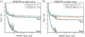

`图 9.5 对于两个隐藏层的神经网络，在 MNIST-1D 数据集（参见图 8.1）中的 4000 个训练样本和 4000 个测试样本上，学习率和批量大小的影响。a) 较大的学习率相较于中等或小的学习率表现更佳。在各种情况下，为了确保不同学习率的解决方案有相同的优化空间，设置的迭代次数与学习率的乘积保持不变。b) 较小的批量大小表现更优。在每种情况下，选择的迭代次数确保了模型在相似的容量下能够充分拟合训练数据。`

## 9.3 提升性能的启发式方法
我们已经观察到，通过在损失函数中加入额外的正则化项，可以促使训练算法寻找到更优的解。这种现象也会作为随机梯度下降的一个非预期（但似乎有益的）副作用而隐式发生。本节将介绍一些用于提高泛化能力的其他启发式方法。
#### 9.3.1 早停
早停指的是在训练过程完全收敛之前终止训练。如果模型已经大致捕捉到了底层函数的形态，但尚未有足够时间以致过度拟合噪声（见图 9.6），这种做法可以有效减少过拟合。可以这样理解：由于权重最初被设定为小值（见 7.5 节），它们没有机会变得很大，因此早停实际上起到了与显式 L2 正则化相似的作用。另一种看法是，早停降低了模型的有效复杂度，使我们能够从偏差/方差权衡的关键区域向后退一步，从而提升性能（参见图 8.9 和 8.10）。

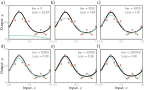

`图 9.6 早停。a) 随机初始化的简化浅层网络模型（含有 14 个线性区域，见图 8.4），采用批量为五、学习率为 0.05 的 SGD 进行训练。b-d) 训练过程中，模型首先抓住真实函数（黑色曲线）的大致结构，随后 e-f) 对噪声训练数据（橙色点）过拟合。尽管训练损失在此过程中持续下降，但 (c) 和 (d) 面板中的模型与真实底层函数最为接近，平均而言，这些模型在测试数据上的泛化能力更强，而不是 (e) 或 (f) 面板中的模型。`

早停的设置只涉及一个超参数——学习停止后的步骤数。这个参数通常通过验证集（见 8.5 节）来经验性选择。但是，对于早停而言，可以在不训练多个模型的情况下选择这个超参数。模型只训练一次，每隔 T 次迭代便监控一次在验证集上的表现，并保存相应的模型。最终选取在验证集上表现最佳的模型。
#### 9.3.2 集成学习
缩小训练数据与测试数据之间的泛化差距的另一策略是构建并平均多个模型的预测结果。这样的模型群称为集成。这种技术可靠地提升了测试性能，但需要付出训练和存储多个模型、多次推理的代价。

模型的输出可以通过计算输出的平均值（对于回归问题）或预 softmax 激活的平均值（对于分类问题）来整合。这种做法基于一个假设：模型的误差是独立的，因此可以相互抵消。另一种方法是，对于回归问题，可以取输出的中值；对于分类问题，则选择最频繁预测的类别，这样可以使预测更稳定。

训练不同模型的一个方法是采用不同的随机初始化。这在训练数据远处的输入空间区域尤其有帮助。在这些区域，由于拟合函数相对自由，不同模型可能给出不同的预测，因此多个模型的平均预测可能比任何单个模型都要泛化得好。

第二种方法是通过对训练数据进行重采样（替换采样）来生成多个不同的数据集，并对每个数据集训练一个不同的模型。这种做法称为自助聚合，或简称为 bagging（见图 9.7）。其效果是使数据更加平滑；如果某个数据点在某个训练集中不存在，模型将从周围的数据点进行插值。因此，如果某个数据点是异常值，那么在该区域拟合的函数将会更加温和。其他方法还包括使用不同超参数训练模型，或训练完全不同的模型家族。

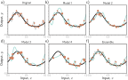

`图 9.7 集成方法。a) 对整个数据集（橙色点）拟合单一模型（灰色曲线）。b-e) 通过有放回地重采样数据四次（bagging），创建了四个模型（橙色点的大小表示该数据点被重采样的次数）。f) 当我们对这个集成的预测结果取平均时，得到的结果（青色曲线）比针对完整数据集的单一模型（灰色曲线）的结果更平滑，可能会有更好的泛化能力。`
### 9.3.3 Dropout
Dropout 通过在每次 SGD（随机梯度下降）迭代时随机将一定比例（通常是 50%）的隐藏单元的输出置为零（见图 9.8），降低了模型对任一特定隐藏单元的依赖。这一策略促进了权重的减小，从而减少了隐藏单元存在与否对函数变化的影响。

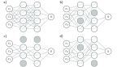

`图 9.8 Dropout 技术。a) 原始网络。b-d) 在每次训练迭代期间，随机选择一部分隐藏单元设置为零（灰色节点）。这样，这些单元的输入和输出权重不产生任何效果，我们实际上在每次迭代时训练的是略有不同的网络。`

这种方法有效地去除了函数在训练数据远处可能形成的、对损失函数无影响的不良变动。举个例子，设想三个隐藏单元随着输入沿某一曲线移动而依次激活（如图 9.9a 所示）。首先，一个隐藏单元引起斜率的大幅上升；随后，第二个单元使斜率下降，函数因此下降；最终，第三个单元抵消了这一下降，使曲线恢复原状。这三个单元一起引起了函数的局部不良变化，虽然这不会改变训练损失，但可能导致泛化能力不佳。

在这种情况下，通过 dropout 移除任一单元会在该单元原本活跃的区域内显著改变输出函数（见图 9.9b）。接下来的梯度下降步骤会试图对这一变化进行调整，最终消除这种依赖。其结果是，即便这些变化对损失没有贡献，训练数据点间不必要的大变化也会逐步被削弱（见图 9.9）。

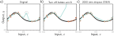

`图 9.9 Dropout 机制。a) 由于斜率的连续增加、减少（在圆圈交点处），然后再次增加，导致曲线出现不希望的折点。此时使用的是全批量梯度下降，模型已经尽可能拟合了数据，因此进一步训练不会消除这个折点。b) 如果我们移除了导致圆圈交点的隐藏单元，如使用 Dropout 时可能发生的情况，由于没有了斜率的减少，函数的右侧呈现向上的轨迹，随后的梯度下降步骤将尝试补偿这一变化。c) 经过 2000 次迭代（i）随机移除一个导致折点的三个隐藏单元，并（ii）执行梯度下降步骤后的曲线。这个折点虽然不影响损失，但通过模拟 Dropout 机制被有效移除。`

在测试阶段，可以照常全量激活隐藏单元运行网络。但由于实际运行时的隐藏单元比训练中的任何迭代时都多，因此我们通过乘以 1 减去 dropout 概率的方式进行权重调整，这是所谓的权重缩放推理规则。另一种推理方法是采用蒙特卡罗 dropout，即多次以训练时相同方式随机选取一部分隐藏单元输出置零，运行网络并汇总结果。这种做法与集成方法类似，因为每个随机版本的网络都相当于一个独立模型，但此处无需训练或保存多个网络。
### 9.3.4 应用噪声
Dropout 的作用可以被看作是在网络的激活输出上施加乘性的 Bernoulli 噪声。这启发了一个思路：通过在训练过程中对网络的其它部分添加噪声，可以增强模型的鲁棒性。

一种做法是在输入数据中加入噪声，这样做能够使得模型学到的函数更加平滑（见图 9.10）。在回归问题中，这等同于加入了一个正则化项，用以惩罚网络输出相对其输入的导数的变化。对抗训练是一种特殊形式，它通过优化算法主动寻找能够引起输出大变化的输入微小扰动，这些扰动可视为一种极端情况下的加性噪声。

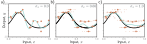

`图 9.10 向输入添加噪声。在 SGD 的每个步骤中，向批数据添加具有方差 σx^2 的随机噪声。a-c) 在不同噪声水平下的拟合模型（小点代表十个样本）。增加更多噪声使得拟合函数（青色线）更加平滑。`

另一种方法是在权重中引入噪声，这样即使权重发生微小变化，网络也能给出合理的预测。这导致模型在训练过程中趋向于收敛于宽阔且平坦的局部最小值区域，此时个别权重的变化对模型影响不大。

最后，我们还可以对标签进行扰动。多类分类的最大似然目标是要尽可能准确地预测出正确的类别（参见方程 5.24）。为此，模型会被推动使得对正确类别的预测值非常大，而对错误类别的预测值非常小。

我们可以通过一种假设来避免模型过度自信：假定有一定比例 ρ 的训练标签是错误的，并等概率地分布于其他类别。这可以通过在每次训练迭代中随机更改标签的方式来实现。然而，通过修改损失函数，使其最小化预测分布与一个真实标签概率为 1 − ρ、其他类别概率均等的分布之间的交叉熵，也能达到同样的目的。这种方法被称为标签平滑，它在多种情况下都能有效提升模型的泛化能力。

### 9.3.5 贝叶斯推理
最大似然估计在训练过程中往往过分自信，它倾向于选取似乎最合适的参数来做预测。但实际上，可能还有很多其他的参数值同样与数据相符，只是概率稍低。贝叶斯方法以一种不同的视角处理这个问题：它将参数视为未知的变量，并通过贝叶斯定理来计算考虑到训练数据 ${x_i, y_i}$ 后参数 $\phi$ 的概率分布  $Pr(\phi | {x_i, y_i})$：

$$
Pr(\phi | \{x_i, y_i\}) = \frac{\prod_{i=1}^{I} Pr(y_i|x_i, \phi)Pr(\phi)}{\int \prod_{i=1}^{I} Pr(y_i|x_i, \phi)Pr(\phi)d\phi}, \tag{9.11}
$$

这里，$Pr(\phi)$ 代表参数的先验概率，分母是用于归一化的项。这意味着，每种参数的选择都对应一个概率值（参见图 9.11）。

对新输入 x 的预测 y 被表达为所有参数集合预测的加权无限和（实际上是一个积分），其中的权重是各自的概率值：

$$
Pr(y|x, \{x_i, y_i\}) = \int Pr(y|x, \phi)Pr(\phi | \{x_i, y_i\})d\phi. \tag{9.12}
$$

本质上，这是一个基于权重的无限集成模型，权重由参数的先验概率和它们与数据的一致性决定。

贝叶斯方法以其优雅性著称，相较于最大似然估计，它能提供更为稳健的预测结果。遗憾的是，对于如神经网络这类复杂模型而言，目前还没有办法实用地表示参数的完整概率分布，或者在推理阶段进行积分计算。因此，目前所有此类方法都不得不采用某种形式的近似，这通常会大幅增加学习和推理的复杂度。

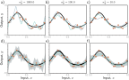

`图 9.11 对于简化的网络模型（参见图 8.4），采用贝叶斯方法处理参数的不确定性。一组参数的后验概率 Pr(φ|{xi,yi}) 取决于它们与数据 {xi,yi} 的匹配程度和先验分布 Pr(φ)。a-c) 基于具有零均值和三个不同方差的正态分布先验，采样得到两组参数（青色和灰色曲线）。当先验方差较小时，参数倾向于较小，得到的函数更加平滑。d-f) 通过对所有可能参数值进行加权平均，其中权重为后验概率，进行推断。这样不仅产生了均值预测（青色曲线），还估计了与之相关的不确定性（灰色区域代表两个标准差范围）。`
### 9.3.6 迁移学习与多任务学习
面对训练数据的限制，可以借助其他更为丰富的数据集来增强模型性能。在迁移学习中（见图 9.12a），先对网络进行预训练，让它在一个与目标任务相关但数据更为充足的辅助任务上学习。预训练完成后，这个模型会被调整应用于原始的目标任务。具体做法包括移除网络的最后一层，然后增加一层或多层，以便产生适合目标任务的输出。可以选择保持预训练模型不变，仅训练新增的层，或者对整个模型进行细微调整。

这种方法的思想基础是，网络通过辅助任务学习到的数据内部表示对于原始任务同样有价值。从另一个角度来看，迁移学习相当于在参数空间的一个合理区域内对网络的大部分参数进行初始化，这个区域很可能导向一个优秀的解决方案。

多任务学习（见图 9.12b）是一种类似的策略，它让网络同时针对多个问题进行学习。例如，一个网络可以同时处理图像，学习进行场景分割、估计每个像素的深度，并生成描述图像内容的文字。所有这些任务都需要对图像内容有所理解，通过并行学习，模型在各个任务上的表现有望得到整体提升。

`图 9.12 转移学习、多任务学习和自监督学习。a) 当主要任务（本例为深度估计）的标签数据有限，而辅助任务（本例为分割）的数据充足时，采用转移学习。我们先针对辅助任务训练模型，然后移除最后的层并用适合主要任务的新层替换，接着仅训练新层或微调整个网络以适应主要任务。这样，网络借助辅助任务学到的优秀内部表示，提升了主要任务的性能。b) 多任务学习中，我们训练模型同时处理多个任务，希望通过这种方式提高各任务的表现。c) 在生成式自监督学习中，我们去除数据的一部分，训练网络预测缺失的信息，如填补图像的遮蔽部分。这种方法允许在缺少标签的情况下进行转移学习。图片来源于 Cordts et al. (2016)。`
### 9.3.7 自监督学习
当我们手头的训练数据不足时，可以通过自监督学习生成大量无需手动标注的数据，进而利用这些数据进行迁移学习。自监督学习分为两大策略：生成式与对比式。

在生成式自监督学习策略中，我们会从每个样本中隐去一部分信息，然后让模型预测这部分缺失的内容（参见图 9.12c）。举个例子，可以从一系列未标注的图像中随机遮盖部分区域，模型的任务就是尝试恢复这些区域的原貌。同样的方法也可以应用于文本，通过遮蔽部分单词，训练模型预测这些单词，随后针对特定的语言处理任务进行模型的微调。

对比式自监督学习则是基于比较的方法，它将有共同特征的样本对与彼此无关的样本对进行对比。对于图像，这个次级任务可能涉及判断一对图像是否是同一图像的不同变体，或者两者无关联。在文本领域，可能需要判断两个句子是否在原文中相邻。有时候，还需要识别出有联系的样本对之间的具体关系，比如判断同一图像中两个片段的相对位置。
### 9.3.8 数据增强
迁移学习通过挖掘不同数据集的潜力来增强模型性能，而多任务学习则是通过引入额外的标签信息来实现性能提升。除此之外，还有一种方法是直接扩充数据集。我们可以对每个输入样本进行变换，同时保证标签的正确性不受影响。比如，在识别图像中是否存在鸟类的任务中（参见图 9.13），我们可以对图像进行旋转、翻转、模糊处理或调整色彩平衡，而“鸟”这一标签依然适用。同样，在处理文本输入的任务中，我们可以通过替换同义词或进行语言的互译来增加数据多样性。而在音频输入的任务中，改变不同频率范围内的音量也是一种有效的数据增强手段。

`图 9.13 数据增强。对某些问题，可以通过变换每个数据示例来扩充数据集。a) 原始图像。b-h) 此图像经过多种几何和光度变换。对图像分类而言，这些图像尽管经过变换，但标签“鸟”保持不变。根据 Wu et al. (2015a) 改编。`

这种方法称为数据增强，目的在于使模型对于这些与任务本质无关的变化保持不敏感，从而提高模型对实际应用场景的适应性和鲁棒性。
## 9.4 总结
通过向损失函数加入额外的项，显式正则化改变了损失函数最小值的定位，这可以被视作对参数的先验概率的引入。而随机梯度下降（SGD）在有限步长的情况下，其下降路径并不会直接指向损失函数的最小点，这种偏差实际上相当于在损失函数中隐式加入了额外的正则化项。

为了增强模型的泛化能力，存在多种启发式策略，诸如早停、dropout、模型集成、贝叶斯方法、添加噪声、迁移学习、多任务学习及数据增强等。这些策略归结为四大核心原则：（i）促使模型函数表现得更平滑，如通过 L2 正则化；（ii）扩大训练数据集，例如采用数据增强技术；（iii）模型的组合使用，例如模型集成；以及（iv）寻找更加宽广的损失函数最小值区域，比如通过在网络权重上添加噪声。

针对特定任务选择或设计合适的模型架构也是提升泛化能力的有效手段。以图像分割为例，通过在模型中共享参数，可以避免在图像的每一个位置重复学习相同特征，如树的形态。书中的第 10 至 13 章详细探讨了针对不同任务设计的架构变种，展示了结构选择对于任务性能的影响。

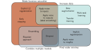
`图 9.14 正则化方法。本章讨论的正则化方法通过以下四种机制之一来提高模型的泛化能力：一些方法通过平滑模型函数来实现；其他方法通过增加有效的数据量来达到；第三种方法是结合多个模型，以此来减少拟合过程中的不确定性；最后一种方法则鼓励训练过程趋向于一个广阔的最小值区域，使得参数估计的微小误差影响降低（也参见图 20.11）。`
## Notes
在 Kukačka 等人（2017）的研究中，提供了深度学习中正则化技术的综述和分类体系。本章讨论中遗漏了 BatchNorm（Szegedy 等人，2016）及其变种，这些内容将在第 11 章详细介绍。

正则化方面，L2 正则化通过惩罚网络权重的平方和来促使输出函数变化更加平滑，是应用最广泛的正则化方法。它有时也被称作 Frobenius 范数正则化，因为它惩罚了权重矩阵的 Frobenius 范数。此外，它经常被误称为“权重衰减”，虽然权重衰减实际上是 Hanson & Pratt（1988）提出的一种不同技术，通过以下方式更新参数 φ：

$$
\phi \leftarrow (1 - \lambda)\phi - \alpha \frac{\partial L}{\partial \phi}, \tag{9.13}
$$

其中，α 代表学习率，L 为损失函数。这与梯度下降的过程相同，不同之处在于在梯度更新前，权重会先乘以一个因子（1−λ'）。对于标准的 SGD，权重衰减与 L2 正则化（方程 9.5）相当，系数 λ 等于 λ′/2α。然而，在 Adam 优化器中，由于每个参数的学习率 α 各不相同，L2 正则化与权重衰减并不等价。Loshchilov & Hutter（2019）提出的 AdamW 对 Adam 进行了改进，以正确实施权重衰减，并证明这一改进提升了性能。

其他类型的向量范数用于鼓励权重的稀疏性。L0 正则化为每个非零权重施加固定的惩罚，其效果是“修剪”网络。L0 正则化还可用于促进组内稀疏性，即如果给定隐藏单元的任何权重非零，则施加固定惩罚。若所有权重均为零，则可以移除该单元，从而减小模型大小并加速推断过程。

遗憾的是，由于 L0 正则化项的导数非平滑，其实现较为困难，需要更先进的拟合方法（参见 Louizos 等人，2018）。L1 正则化（又名 LASSO，最小绝对收缩和选择算子）处于 L2 和 L0 正则化之间，对权重的绝对值施加惩罚。L2 正则化对稀疏性的鼓励作用不如 L1 正则化明显，因为随着权重减小，平方惩罚的导数也随之减小。L1 正则化的优势在于其惩罚的导数为常数，能够产生比 L2 更稀疏的解，同时比 L0 正则化更易于优化。有时，L1 和 L2 正则化项会同时使用，称为弹性网正则化（Zou & Hastie，2005）。

正则化的另一途径是在不显式定义新损失函数的情况下，修改学习算法的梯度（例如，方程 9.13）。这种方法已被用于在反向传播中促进稀疏性（Schwarz 等人，2021）。

关于显式正则化效果的研究结论并不一致。Zhang 等人（2017a）的研究表明，L2 正则化对泛化的贡献有限。网络的 Lipschitz 常数（即函数随输入变化的速度）被证明可以限制泛化误差（Bartlett 等人，2017；Neyshabur 等人，2018）。但是，Lipschitz 常数依赖于权重矩阵谱范数的乘积，这些范数只是间接受到各个权重大小的影响。Bartlett 等人（2017）、Neyshabur 等人（2018）以及 Yoshida & Miyato（2017）均提出了间接促进谱范数减小的方法。Gouk 等人（2021）采取了不同的策略，开发了一种算法，限制网络的 Lipschitz 常数在特定值以下。

**梯度下降中的隐式正则化:** 梯度下降的步骤定义为：

$$
\phi_1 = \phi_0 + \alpha \cdot g[\phi_0], \tag{9.14}
$$

这里 $g[\phi_0]$ 表示损失函数梯度的负值，$\alpha$ 是步长。当 $\alpha \rightarrow 0$ 时，梯度下降过程可以通过下述微分方程描述：

$$
\frac{\partial \phi}{\partial t} = g[\phi]. \tag{9.15}
$$

对于典型步长$\alpha$，离散与连续的梯度下降会收敛至不同解。我们可以利用 *后向误差分析* 对连续版本进行修正，找到修正项 $g_1[\phi]$：

$$
\frac{\partial \phi}{\partial t} \approx g[\phi] + \alpha g_1[\phi] + \ldots, \tag{9.16}
$$

使其与离散版本产生相同的结果。

考虑对初始位置  $\phi_0$ 附近的修正连续解 $\phi$ 进行泰勒展开的前两项：

$$
\begin{align}
\phi[\alpha] &\approx \phi + \alpha \frac{\partial \phi}{\partial t} + \frac{\alpha^2}{2} \frac{\partial^2 \phi}{\partial t^2} \\
&\approx \phi + \alpha (g[\phi] + \alpha g_1[\phi]) + \frac{\alpha^2}{2} \left( \frac{\partial g[\phi]}{\partial \phi} g[\phi] + \alpha \frac{\partial g_1[\phi]}{\partial \phi} g[\phi] \right)_{\phi=\phi_0} \\
&= \phi + \alpha (g[\phi] + \alpha g_1[\phi]) + \frac{\alpha^2}{2} \left( \frac{\partial g[\phi]}{\partial \phi} g[\phi] + \alpha \frac{\partial g_1[\phi]}{\partial \phi} g[\phi] \right)_{\phi=\phi_0} \\
&\approx \phi + \alpha g[\phi] + \alpha^2 \left( g_1[\phi] + \frac{1}{2} \frac{\partial g[\phi]}{\partial \phi} g[\phi] \right)_{\phi=\phi_0} ,
\end{align} \tag{9.17}
$$
在这里，第二行引入了修正项（方程 9.16），并在最终行去除了高于 \(\alpha^2\) 阶的项。

注意，右侧的前两项 $\phi + \alpha g[\phi_0]$ 与离散更新（方程 9.14）相一致。因此，为了让连续与离散版本达成一致，右侧的第三项必须为零，从而解得$g_1[\phi]$：
$$
g_1[\phi] = - \frac{1}{2} \frac{\partial g[\phi]}{\partial \phi} g[\phi]. \tag{9.18}
$$

训练过程中，演化函数 $g[\phi]$ 是损失梯度的负值：

$$
\begin{align}
\frac{\partial \phi}{\partial t} &\approx g[\phi] + \alpha g_1[\phi] \\
&= -\frac{\partial L}{\partial \phi} - \frac{\alpha}{2} \left( \frac{\partial^2 L}{\partial \phi^2} \right) \frac{\partial L}{\partial \phi}.
\end{align} \tag{9.19}
$$

这等同于对损失函数执行连续梯度下降：

$$
L_{GD}[\phi] = L[\phi] + \frac{\alpha}{4} \left| \frac{\partial L}{\partial \phi} \right|^2 , \tag{9.20}
$$

因为方程 9.19 的右侧是方程 9.20 中该式的导数。

Barrett & Dherin (2021)首次提出了隐式正则化（Implicit Regularization）的概念，并由Smith等人 (2021)将其扩展应用到随机梯度下降（Stochastic Gradient Descent, SGD）中。Smith等人 (2020)及其他研究者发现，相较于全批量梯度下降，使用较小或中等批量大小的随机梯度下降在测试集上表现更优，这部分归因于隐式正则化的作用。

在此基础上，Jastrzębski等人 (2021)和Cohen等人 (2021)均发现，采用较大的学习率可以减少优化过程倾向于移动至损失函数的“尖锐”区域（即，至少有一个方向曲率很高的区域）的现象。这种大学习率带来的隐式正则化效果，可以通过惩罚Fisher信息矩阵的迹来近似实现，这与在方程9.20中惩罚梯度范数有着密切的关联（Jastrzębski等人，2021）。

**早停**：Bishop (1995)与Sjöberg & Ljung (1995)指出，早停策略限制了训练过程能探索的有效解空间范围。考虑到权重的初始值较小，这种策略有助于避免权重过大。Goodfellow等人 (2016)通过对损失函数进行二次近似，并将参数初始化为零的情况下证明，早停在梯度下降中相当于L2正则化。其中，有效的正则化权重λ大约为1/(τα)，α代表学习率，τ代表早停的时间。

**集成学习**：通过使用不同的随机种子（Lakshminarayanan等人，2017）、超参数（Wenzel等人，2020b）或甚至完全不同的模型家族，可以训练出多个模型进行集成。这些模型可以通过平均预测、加权预测或堆叠（Wolpert，1992）的方式组合，后者是通过另一个机器学习模型将结果合并。Lakshminarayanan等人（2017）证明，对独立训练的网络输出进行平均可以提升准确度、校准性和鲁棒性。相反，Frankle等人（2020）发现，若将不同模型的权重简单平均形成单一模型，效果并不理想。Fort等人（2019）对比了从不同初始化出发得到的集成方案与基于同一原始模型生成的集成方案，发现两种方法均能带来互补的益处，但从不同随机起点进行真正的集成能够带来更显著的性能提升。

采用中期训练阶段的模型进行集成是一种高效的方法。基于此，Izmailov等人（2018）提出了随机权重平均方法，通过在不同时间点采样模型权重并进行平均。快照集成（Huang等人，2017a）也采用了类似的策略，存储不同时间步骤的模型并平均它们的预测。通过周期性地增加和减少学习率，可以提高这些模型的多样性。Garipov等人（2018）观察到，损失函数的不同最小值通常通过低能量路径相连，即沿途损失较低的路径。受此启发，他们开发了一种方法，在初始解附近探索低能量区域，以获得多样化模型而无需重新训练，称为快速几何集成。关于集成方法的综述可参考Ganaie等人（2022）的工作。

**丢弃（Dropout）**：丢弃技术最初由Hinton等人（2012b）和Srivastava等人（2014）引入。它是在隐藏单元层面上应用的，丢弃一个隐藏单元等同于临时将所有进入和离开的权重及偏置置零。Wan等人（2013）通过随机将单个权重置零来扩展了Dropout的概念。Gal & Ghahramani（2016）和Kendall & Gal（2017）提出了蒙特卡罗丢弃（Monte Carlo Dropout），通过多次应用不同的丢弃模式进行推断，并将结果平均。Gal & Ghahramani（2016）认为，这可以被视为贝叶斯推断的近似。

丢弃等同于对隐藏单元应用乘性伯努利噪声。采用正态分布（Srivastava等人，2014；Shen等人，2017）、均匀分布（Shen等人，2017）和Beta分布（Liu等人，2019b）等其他分布也能带来类似的益处。

**添加噪声**：Bishop (1995)和An (1996)通过向网络输入添加高斯噪声来提升性能，Bishop (1995)展示了这等同于权重衰减。An (1996)还研究了向权重添加噪声的效果。DeVries & Taylor (2017a)尝试向隐藏单元添加高斯噪声。随机ReLU（Xu等人，2015）通过使激活函数随机化，以不同方式应用噪声。

**标签平滑**：标签平滑技术最初由Szegedy等人（2016）在图像分类中引入，后来在语音识别（Chorowski & Jaitly, 2017）、机器翻译（Vaswani等人，2017）和语言建模（Pereyra等人，2017）中被证明有益。尽管Müller等人（2019a）显示它能提高预测输出概率的校准度，但标签平滑改善测试性能的确切机制尚未被充分理解。DisturbLabel（Xie等人，2016）是一个密切相关的技术，它在每次训练迭代中随机改变一定比例的批次标签。

**寻找更宽的极小值**：更宽的极小值被认为具有更好的泛化能力（参见图20.11）。在这里，权重的精确值不那么重要，因此性能应对它们的估计误差具有鲁棒性。训练期间对网络部分应用噪声之所以有效，是因为它鼓励网络对权重的精确值不敏感。

Chaudhari等人（2019）开发了一种SGD的变体，偏向于寻找平坦极小值，称之为熵SGD。其核心思想是在损失函数中加入局部熵作为一个项。在实际应用中，这涉及到在一个SGD式更新内进行另一个更新。Keskar等人（2017）发现，随着批量大小的减小，SGD倾向于寻找更宽的极小值。这可能是由于SGD隐式正则化引入的批量方差项导致的。

Ishida等人（2020）采用了一种称为“淹没”的技术，故意避免训练损失降至零。这促使模型在损失景观中进行随机漫步，漂移到具有更好泛化能力的平坦区域。

**贝叶斯方法**：对于某些模型，包括图9.11中的简化神经网络模型，贝叶斯预测分布可以用封闭形式计算（参见Bishop, 2006；Prince, 2012）。对于神经网络，参数的后验分布不能用封闭形式表示，需要通过近似方法计算。主要的两种方法是变分贝叶斯（Hinton & van Camp, 1993；MacKay, 1995；Barber & Bishop, 1997；Blundell等人，2015），用一个更简单的可处理分布近似后验，以及马尔可夫链蒙特卡罗（MCMC）方法，通过抽取一组样本来近似分布（Neal, 1995；Welling & Teh, 2011；Chen等人，2014；Ma等人，2015；Li等人，2016a）。样本生成可以集成到SGD中，称为随机梯度MCMC（参见Ma等人，2015）。最近发现，通过“冷却”参数的后验分布（使其更尖锐）可以改善这些模型的预测（Wenzel等人，2020a），但这一发现目前尚未完全理解（参见Noci等人，2021）。

**迁移学习**：迁移学习在视觉任务中的应用非常成功（Sharif Razavian等人，2014），推动了计算机视觉领域的快速发展，包括最初的AlexNet成果（Krizhevsky等人，2012）。迁移学习也对自然语言处理（NLP）产生了影响，许多模型基于BERT模型的预训练特征（Devlin等人，2019）。更多信息可以参考Zhuang等人（2020）和Yang等人（2020b）的工作。

**自监督学习**：图像的自监督学习技术包括填补遮蔽的图像区域（Pathak等人，2016）、预测图像块的相对位置（Doersch等人，2015）、重排乱序的图像瓦片（Noroozi & Favaro, 2016）、为灰度图像着色（Zhang等人，2016b）以及将旋转图像恢复到原始方向（Gidaris等人，2018）。SimCLR（Chen等人，2020c）中学习了一个网络，将同一图像经过光度和几何变换的版本映射到相同的表示，同时排斥不同图像的版本，以对不相关的图像变换保持不敏感。Jing & Tian（2020）提供了图像自监督学习的综述。

NLP的自监督学习可以基于预测遮蔽词（Devlin等人，2019）、预测句子中的下一个词（Radford等人，2019；Brown等人，2020）或预测两个句子是否相继而来（Devlin等人，2019）。在自动语音识别中，Wav2Vec模型（Schneider等人，2019）旨在区分原始音频样本与从剪辑中其他地方换出10ms音频的样本。自监督学习也被应用到图神经网络中，任务包括恢复遮蔽特征（You等人，2020）和恢复图的邻接结构（Kipf & Welling, 2016）。Liu等人（2023a）回顾了图模型的自监督学习。

**数据增强**：图像的数据增强技术至少可追溯到LeCun等人（1998），并对AlexNet的成功做出了贡献（Krizhevsky等人，2012），其中数据集通过2048倍增加。图像增强方法包括几何变换、改变或操纵色彩空间、注入噪声和应用空间滤波器等。更复杂的技术包括随机混合图像（Inoue, 2018；Summers & Dinneen, 2019）、随机擦除图像部分（Zhong等人，2020）、风格转移（Jackson等人，2019）以及随机交换图像块（Kang等人，2017）。此外，许多研究利用生成对抗网络（GANs，见第15章）产生新但可信的数据示例（例如，Calimeri等人，2017）。在其他情况下，数据被增强了对抗性示例（Goodfellow等人，2015a），这是对训练数据的微小扰动，导致示例被错误分类。图像数据增强的综述可以参考Shorten & Khoshgoftaar（2019）的工作。

声学数据的增强方法包括音高变化、时间拉伸、动态范围压缩和添加随机噪声（例如，Abeßer等人，2017；Salamon & Bello, 2017；Xu等人，2015；Lasseck, 2018），以及混合数据对（Zhang等人，2017c；Yun等人，2019）、遮蔽特征（Park等人，2019）和使用GANs生成新数据（Mun等人，2017）。语音数据的增强包括声道长度扰动（Jaitly & Hinton, 2013；Kanda等人，2013）、风格转移（Gales, 1998；Ye & Young, 2004）、添加噪声（Hannun等人，2014）以及合成语音（Gales等人，2009）。

文本的增强方法包括在字符级别通过交换、删除和插入字母添加噪声（Belinkov & Bisk, 2018；Feng等人，2020），或通过生成对抗性示例（Ebrahimi等人，2018）、使用常见的拼写错误（Coulombe, 2018）、随机交换或删除词（Wei & Zou, 2019）、使用同义词（Kolomiyets等人，2011）、改变形容词（Li等人，2017c）、被动化（Min等人，2020）、使用生成模型创建新数据（Qiu等人，2020）以及往返翻译到另一种语言再翻译回来（Aiken & Park, 2010）。文本增强方法的综述由Bayer等人（2022）提供。

## Problems
**问题 9.1** 考虑一个模型，其参数的先验分布是均值为零、方差为 $\sigma_{\phi}^2$ 的正态分布，表达式为：

$$
Pr(\phi) = \prod_{j=1}^{J} \text{Norm}_{\phi_j} [0, \sigma_{\phi}^2], \tag{9.21}
$$

其中 \( j \) 表示模型参数的索引。现在，我们需要最大化 $\prod_{i=1}^{I} Pr(y_i|x_i, \phi)Pr(\phi)$。证明该模型的相关损失函数等价于 L2 正则化。

**问题 9.2** 当加入 L2 正则化（方程 9.5）后，损失函数的梯度将如何改变？

**问题 9.3** 设想一个线性回归模型 $y = \phi_0 + \phi_1 x$，其中 x 是输入，y  是输出，$\phi_0$ 和 $\phi_1$ 是模型参数。假设有 I 个训练样例 ${x_i, y_i}$，采用最小二乘法作为损失函数。考虑在每次训练迭代时，给输入 $x_i$ 加入均值为零、方差为 $\sigma_{x}^2$ 的高斯噪声。求期望的梯度更新值是什么？

**问题 9.4** 当我们采用标签平滑技术，使目标概率分布在正确类别上为 0.9，而剩余的概率质量 0.1 在剩余的 $D_o - 1$ 个类别之间均匀分配时，推导出的多类分类损失函数是什么？

**问题 9.5** 展示权重衰减参数更新，衰减率为 $\lambda$：

$$
\phi \leftarrow (1 - \lambda) \phi - \alpha \frac{\partial L}{\partial \phi}, \tag{9.22}
$$

对于原始损失函数 $L[\phi]$，这等价于采用 L2 正则化的标准梯度更新，从而得到修改后的损失函数 $\tilde{L}[\phi]$：

$$
\tilde{L}[\phi] = L[\phi] + \frac{\lambda}{2\alpha} \sum_{k} \phi_k^2, \tag{9.23}
$$

其中 $\phi$ 是模型参数，$\alpha$ 是学习率。

**问题 9.6** 考虑一个参数为 $\phi = [\phi_0, \phi_1]^T$ 的模型。请绘制 L0、L1、$L\frac{1}{2}$ 和 L2 正则化项，形式与图 9.1b 类似。 LP 正则化项定义为 $\sum_{d=1}^{D} |\phi_d|^P$。
